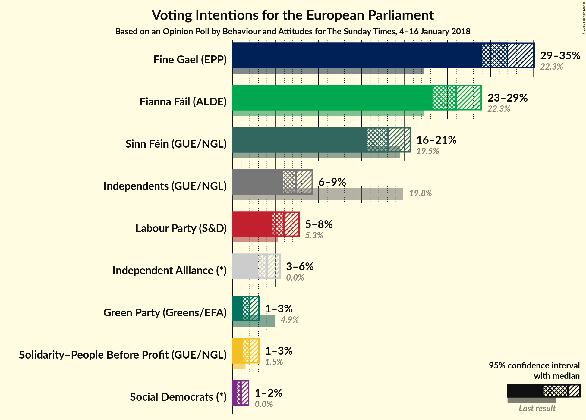
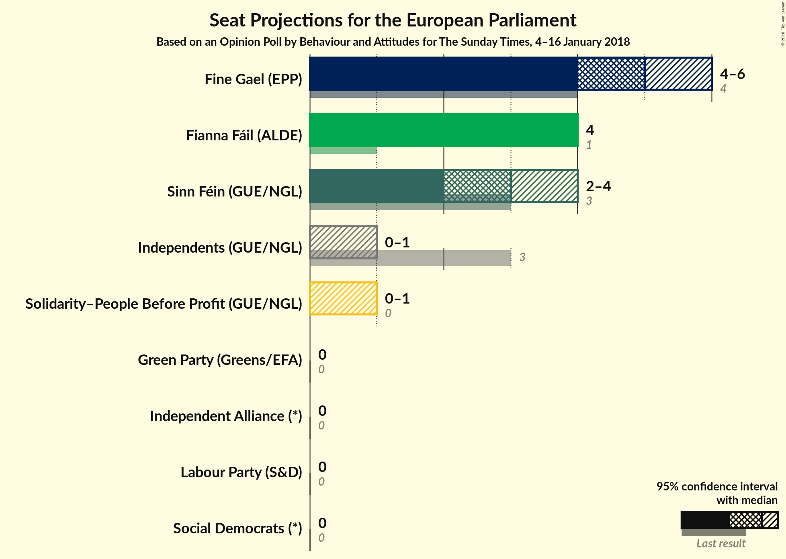
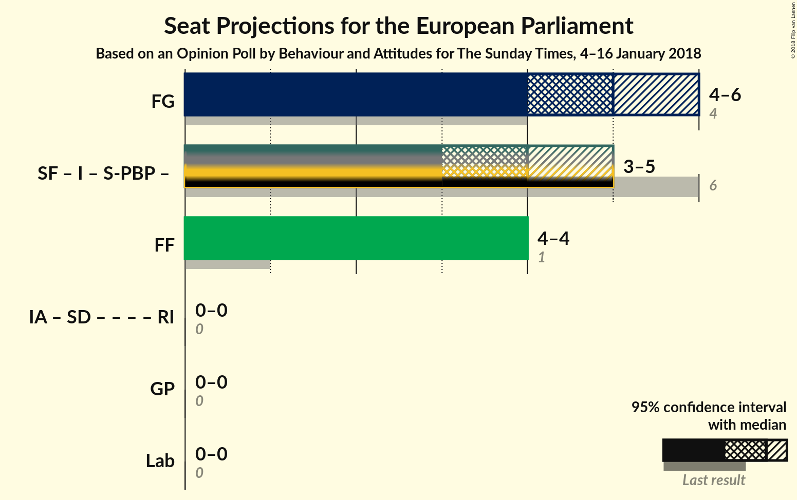

# Opinion Poll by Behaviour and Attitudes for The Sunday Times, 4–16 January 2018

<a href="#voting-intentions">Voting Intentions</a> | <a href="#seats">Seats</a> | <a href="#coalitions">Coalitions</a> | <a href="#technical-information">Technical Information</a>

## Voting Intentions

### Confidence Intervals

| Party | Last Result | Poll Result | 80% Confidence Interval | 90% Confidence Interval | 95% Confidence Interval | 99% Confidence Interval |
|:-----:|:-----------:|:-----------:|:-----------------------:|:-----------------------:|:-----------------------:|:-----------------------:|
| Fine Gael (EPP) | 22.3% | 32.0% | N/A |N/A |N/A |N/A |
| Fianna Fáil (ALDE) | 22.3% | 26.0% | N/A |N/A |N/A |N/A |
| Sinn Féin (GUE/NGL) | 19.5% | 18.0% | N/A |N/A |N/A |N/A |
| Independents (GUE/NGL) | 19.8% | 7.4% | N/A |N/A |N/A |N/A |
| Labour Party (S&D) | 5.3% | 6.0% | N/A |N/A |N/A |N/A |
| Independent Alliance (*) | 0.0% | 4.0% | N/A |N/A |N/A |N/A |
| Solidarity–People Before Profit (GUE/NGL) | 1.5% | 2.0% | N/A |N/A |N/A |N/A |
| Green Party (Greens/EFA) | 4.9% | 2.0% | N/A |N/A |N/A |N/A |
| Social Democrats (*) | 0.0% | 1.0% | N/A |N/A |N/A |N/A |

*Note:* The poll result column reflects the actual value used in the calculations. Published results may vary slightly, and in addition be rounded to fewer digits.

## Seats

### Confidence Intervals

| Party | Last Result | Median | 80% Confidence Interval | 90% Confidence Interval | 95% Confidence Interval | 99% Confidence Interval |
|:-----:|:-----------:|:------:|:-----------------------:|:-----------------------:|:-----------------------:|:-----------------------:|
| <a href="#fine-gael-(epp)">Fine Gael (EPP)</a> | 4 | N/A | N/A |N/A |N/A |N/A |
| <a href="#fianna-fáil-(alde)">Fianna Fáil (ALDE)</a> | 1 | N/A | N/A |N/A |N/A |N/A |
| <a href="#sinn-féin-(gue/ngl)">Sinn Féin (GUE/NGL)</a> | 3 | N/A | N/A |N/A |N/A |N/A |
| <a href="#independents-(gue/ngl)">Independents (GUE/NGL)</a> | 3 | N/A | N/A |N/A |N/A |N/A |
| <a href="#labour-party-(s&d)">Labour Party (S&D)</a> | 0 | N/A | N/A |N/A |N/A |N/A |
| <a href="#independent-alliance-(*)">Independent Alliance (*)</a> | 0 | N/A | N/A |N/A |N/A |N/A |
| <a href="#solidarity–people-before-profit-(gue/ngl)">Solidarity–People Before Profit (GUE/NGL)</a> | 0 | N/A | N/A |N/A |N/A |N/A |
| <a href="#green-party-(greens/efa)">Green Party (Greens/EFA)</a> | 0 | N/A | N/A |N/A |N/A |N/A |
| <a href="#social-democrats-(*)">Social Democrats (*)</a> | 0 | N/A | N/A |N/A |N/A |N/A |

## Coalitions

## Technical Information

### Opinion Poll

+ **Polling firm:** Behaviour and Attitudes
+ **Commissioner(s):** The Sunday Times
+ **Fieldwork period:** 4–16 January 2018

### Calculations

+ **Sample size:** 920
+ **Simulations done:** 0
+ **Error estimate:** 100.00%

