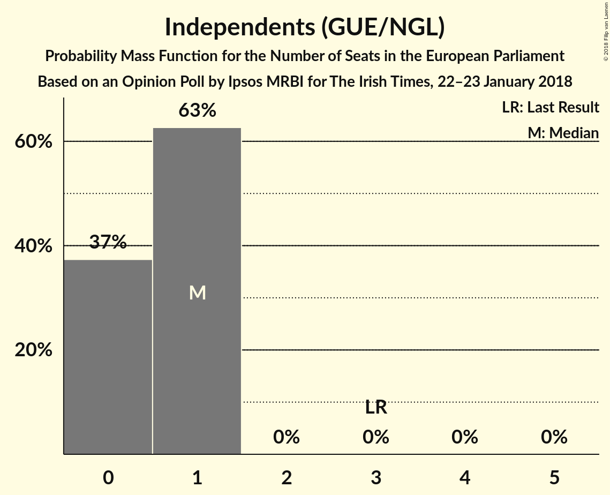

# Opinion Poll by Ipsos MRBI for The Irish Times, 22–23 January 2018

<a href="#voting-intentions">Voting Intentions</a> | <a href="#seats">Seats</a> | <a href="#coalitions">Coalitions</a> | <a href="#technical-information">Technical Information</a>

## Voting Intentions

### Confidence Intervals

| Party | Last Result | Poll Result | 80% Confidence Interval | 90% Confidence Interval | 95% Confidence Interval | 99% Confidence Interval |
|:-----:|:-----------:|:-----------:|:-----------------------:|:-----------------------:|:-----------------------:|:-----------------------:|
| Fine Gael (EPP) | 22.3% | 34.0% | 32.3–35.8% |31.8–36.3% |31.4–36.7% |30.6–37.6% |
| Fianna Fáil (ALDE) | 22.3% | 25.0% | 23.4–26.7% |23.0–27.1% |22.6–27.5% |21.9–28.3% |
| Sinn Féin (GUE/NGL) | 19.5% | 19.0% | 17.6–20.5% |17.2–21.0% |16.9–21.3% |16.2–22.1% |
| Independents (GUE/NGL) | 19.8% | 9.0% | 8.0–10.2% |7.7–10.5% |7.5–10.8% |7.1–11.3% |
| Labour Party (S&D) | 5.3% | 4.0% | 3.4–4.8% |3.2–5.1% |3.0–5.3% |2.7–5.7% |
| Green Party (Greens/EFA) | 4.9% | 3.0% | 2.5–3.7% |2.3–3.9% |2.2–4.1% |1.9–4.5% |
| Solidarity–People Before Profit (GUE/NGL) | 1.5% | 2.0% | 1.6–2.6% |1.4–2.8% |1.3–3.0% |1.2–3.3% |
| Social Democrats (*) | 0.0% | 1.0% | 0.7–1.5% |0.6–1.6% |0.6–1.8% |0.5–2.0% |
| Independent Alliance (*) | 0.0% | 1.0% | 0.7–1.5% |0.6–1.6% |0.6–1.8% |0.5–2.0% |

*Note:* The poll result column reflects the actual value used in the calculations. Published results may vary slightly, and in addition be rounded to fewer digits.

## Seats

### Confidence Intervals

| Party | Last Result | Median | 80% Confidence Interval | 90% Confidence Interval | 95% Confidence Interval | 99% Confidence Interval |
|:-----:|:-----------:|:------:|:-----------------------:|:-----------------------:|:-----------------------:|:-----------------------:|
| <a href="#fine-gael-(epp)">Fine Gael (EPP)</a> | 4 | 5 | 4–6 |4–6 |4–6 |4–6 |
| <a href="#fianna-fáil-(alde)">Fianna Fáil (ALDE)</a> | 1 | 4 | 4 |4 |4 |3–4 |
| <a href="#sinn-féin-(gue/ngl)">Sinn Féin (GUE/NGL)</a> | 3 | 3 | 3–4 |3–4 |2–4 |2–4 |
| <a href="#independents-(gue/ngl)">Independents (GUE/NGL)</a> | 3 | 1 | 0–1 |0–1 |0–1 |0–1 |
| <a href="#labour-party-(s&d)">Labour Party (S&D)</a> | 0 | 0 | 0 |0 |0 |0 |
| <a href="#green-party-(greens/efa)">Green Party (Greens/EFA)</a> | 0 | 0 | 0 |0 |0 |0 |
| <a href="#solidarity–people-before-profit-(gue/ngl)">Solidarity–People Before Profit (GUE/NGL)</a> | 0 | 0 | 0 |0–1 |0–1 |0–1 |
| <a href="#social-democrats-(*)">Social Democrats (*)</a> | 0 | 0 | 0 |0 |0 |0 |
| <a href="#independent-alliance-(*)">Independent Alliance (*)</a> | 0 | 0 | 0 |0 |0 |0 |

### Fine Gael (EPP)

*For a full overview of the results for this party, see the [Fine Gael (EPP)](party-finegaelepp.html) page.*

| Number of Seats | Probability | Accumulated | Special Marks |
|:---------------:|:-----------:|:-----------:|:-------------:|
| 4 | 14% | 100% | Last Result |
| 5 | 69% | 86% | Median |
| 6 | 17% | 17% |  |
| 7 | 0.1% | 0.1% | Majority |
| 8 | 0% | 0% |  |

### Fianna Fáil (ALDE)

*For a full overview of the results for this party, see the [Fianna Fáil (ALDE)](party-fiannafáilalde.html) page.*

| Number of Seats | Probability | Accumulated | Special Marks |
|:---------------:|:-----------:|:-----------:|:-------------:|
| 1 | 0% | 100% | Last Result |
| 2 | 0% | 100% |  |
| 3 | 0.5% | 100% |  |
| 4 | 99.5% | 99.5% | Median |
| 5 | 0% | 0% |  |

### Sinn Féin (GUE/NGL)

*For a full overview of the results for this party, see the [Sinn Féin (GUE/NGL)](party-sinnféinguengl.html) page.*

| Number of Seats | Probability | Accumulated | Special Marks |
|:---------------:|:-----------:|:-----------:|:-------------:|
| 2 | 5% | 100% |  |
| 3 | 80% | 95% | Last Result, Median |
| 4 | 15% | 15% |  |
| 5 | 0% | 0% |  |

### Independents (GUE/NGL)

*For a full overview of the results for this party, see the [Independents (GUE/NGL)](party-independentsguengl.html) page.*

| Number of Seats | Probability | Accumulated | Special Marks |
|:---------------:|:-----------:|:-----------:|:-------------:|
| 0 | 19% | 100% |  |
| 1 | 81% | 81% | Median |
| 2 | 0% | 0% |  |
| 3 | 0% | 0% | Last Result |

### Labour Party (S&D)

*For a full overview of the results for this party, see the [Labour Party (S&D)](party-labourpartysd.html) page.*

| Number of Seats | Probability | Accumulated | Special Marks |
|:---------------:|:-----------:|:-----------:|:-------------:|
| 0 | 100% | 100% | Last Result, Median |

### Green Party (Greens/EFA)

*For a full overview of the results for this party, see the [Green Party (Greens/EFA)](party-greenpartygreensefa.html) page.*

| Number of Seats | Probability | Accumulated | Special Marks |
|:---------------:|:-----------:|:-----------:|:-------------:|
| 0 | 99.7% | 100% | Last Result, Median |
| 1 | 0.3% | 0.3% |  |
| 2 | 0% | 0% |  |

### Solidarity–People Before Profit (GUE/NGL)

*For a full overview of the results for this party, see the [Solidarity–People Before Profit (GUE/NGL)](party-solidarity–peoplebeforeprofitguengl.html) page.*

| Number of Seats | Probability | Accumulated | Special Marks |
|:---------------:|:-----------:|:-----------:|:-------------:|
| 0 | 94% | 100% | Last Result, Median |
| 1 | 6% | 6% |  |
| 2 | 0% | 0% |  |

### Social Democrats (*)

*For a full overview of the results for this party, see the [Social Democrats (*)](party-socialdemocrats.html) page.*

| Number of Seats | Probability | Accumulated | Special Marks |
|:---------------:|:-----------:|:-----------:|:-------------:|
| 0 | 100% | 100% | Last Result, Median |

### Independent Alliance (*)

*For a full overview of the results for this party, see the [Independent Alliance (*)](party-independentalliance.html) page.*

| Number of Seats | Probability | Accumulated | Special Marks |
|:---------------:|:-----------:|:-----------:|:-------------:|
| 0 | 100% | 100% | Last Result, Median |

## Coalitions

### Confidence Intervals

| Coalition | Last Result | Median | Majority? | 80% Confidence Interval | 90% Confidence Interval | 95% Confidence Interval | 99% Confidence Interval |
|:---------:|:-----------:|:------:|:---------:|:-----------------------:|:-----------------------:|:-----------------------:|:-----------------------:|
| Fine Gael (EPP) | 4 | 5 | 0.1% | 4–6 | 4–6 | 4–6 | 4–6 |
| Fianna Fáil (ALDE) | 1 | 4 | 0% | 4 | 4 | 4 | 3–4 |
| Green Party (Greens/EFA) | 0 | 0 | 0% | 0 | 0 | 0 | 0 |
| Labour Party (S&D) | 0 | 0 | 0% | 0 | 0 | 0 | 0 |

### Fine Gael (EPP)

| Number of Seats | Probability | Accumulated | Special Marks |
|:---------------:|:-----------:|:-----------:|:-------------:|
| 4 | 14% | 100% | Last Result |
| 5 | 69% | 86% | Median |
| 6 | 17% | 17% |  |
| 7 | 0.1% | 0.1% | Majority |
| 8 | 0% | 0% |  |

### Fianna Fáil (ALDE)

| Number of Seats | Probability | Accumulated | Special Marks |
|:---------------:|:-----------:|:-----------:|:-------------:|
| 1 | 0% | 100% | Last Result |
| 2 | 0% | 100% |  |
| 3 | 0.5% | 100% |  |
| 4 | 99.5% | 99.5% | Median |
| 5 | 0% | 0% |  |

### Green Party (Greens/EFA)

| Number of Seats | Probability | Accumulated | Special Marks |
|:---------------:|:-----------:|:-----------:|:-------------:|
| 0 | 99.7% | 100% | Last Result, Median |
| 1 | 0.3% | 0.3% |  |
| 2 | 0% | 0% |  |

### Labour Party (S&D)

| Number of Seats | Probability | Accumulated | Special Marks |
|:---------------:|:-----------:|:-----------:|:-------------:|
| 0 | 100% | 100% | Last Result, Median |

## Technical Information

### Opinion Poll

+ **Polling firm:** Ipsos MRBI
+ **Commissioner(s):** The Irish Times
+ **Fieldwork period:** 22–23 January 2018

### Calculations

+ **Sample size:** 1200
+ **Simulations done:** 262,144
+ **Error estimate:** 1.20%

