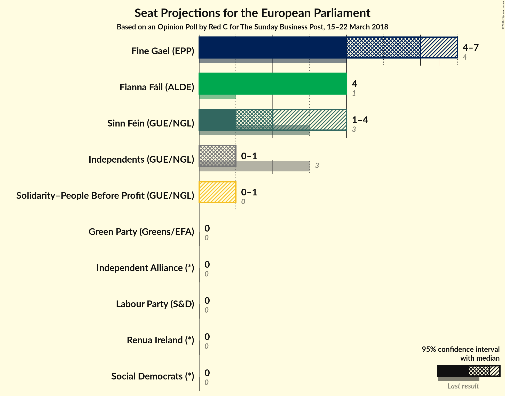
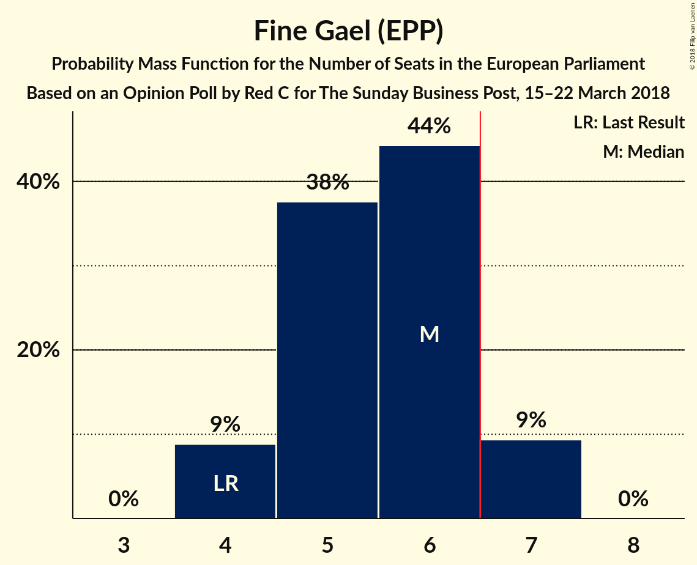
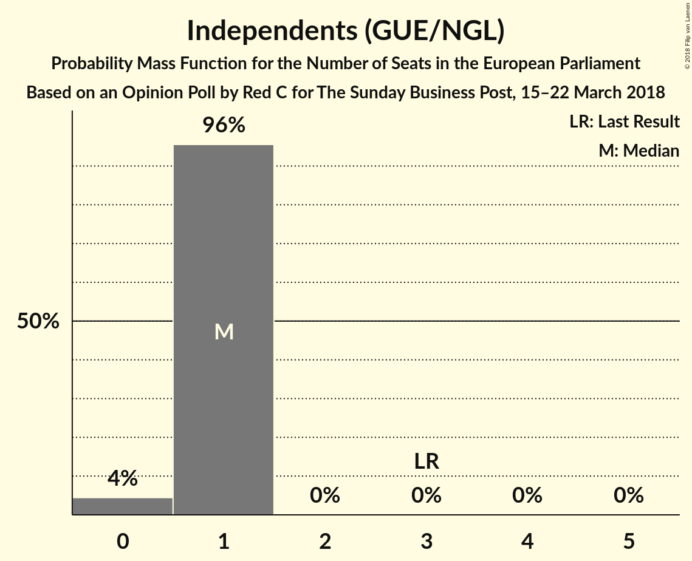
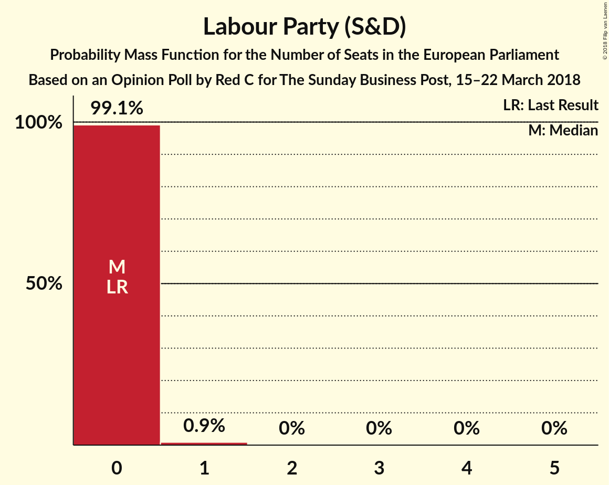
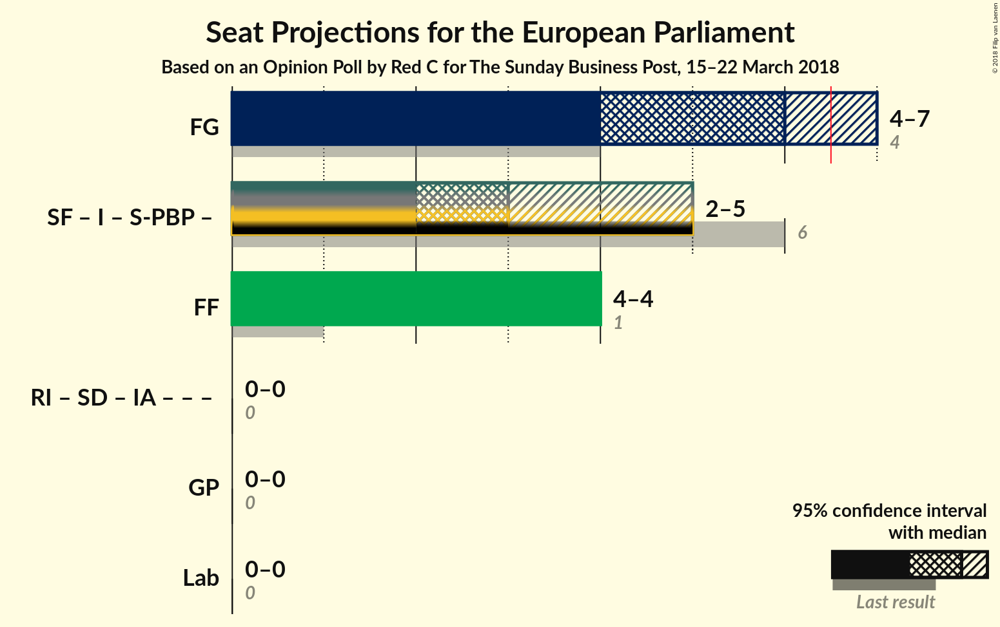

# Opinion Poll by Red C for The Sunday Business Post, 15–22 March 2018

<a href="#voting-intentions">Voting Intentions</a> | <a href="#seats">Seats</a> | <a href="#coalitions">Coalitions</a> | <a href="#technical-information">Technical Information</a>

## Voting Intentions

### Confidence Intervals

| Party | Last Result | Poll Result | 80% Confidence Interval | 90% Confidence Interval | 95% Confidence Interval | 99% Confidence Interval |
|:-----:|:-----------:|:-----------:|:-----------------------:|:-----------------------:|:-----------------------:|:-----------------------:|
| Fine Gael (EPP) | 22.3% | 33.0% | 31.1–34.9% |30.6–35.5% |30.1–36.0% |29.3–36.9% |
| Fianna Fáil (ALDE) | 22.3% | 24.0% | 22.3–25.8% |21.9–26.3% |21.4–26.7% |20.7–27.6% |
| Sinn Féin (GUE/NGL) | 19.5% | 16.0% | 14.6–17.6% |14.2–18.0% |13.9–18.4% |13.2–19.2% |
| Independents (GUE/NGL) | 19.8% | 9.8% | 8.7–11.1% |8.4–11.5% |8.1–11.8% |7.6–12.5% |
| Labour Party (S&D) | 5.3% | 6.0% | 5.1–7.1% |4.9–7.4% |4.7–7.7% |4.3–8.2% |
| Solidarity–People Before Profit (GUE/NGL) | 1.5% | 2.0% | 1.5–2.7% |1.4–2.9% |1.3–3.1% |1.1–3.4% |
| Social Democrats (*) | 0.0% | 2.0% | 1.5–2.7% |1.4–2.9% |1.3–3.1% |1.1–3.4% |
| Green Party (Greens/EFA) | 4.9% | 2.0% | 1.5–2.7% |1.4–2.9% |1.3–3.1% |1.1–3.4% |
| Renua Ireland (*) | 0.0% | 2.0% | 1.5–2.7% |1.4–2.9% |1.3–3.1% |1.1–3.4% |
| Independent Alliance (*) | 0.0% | 1.0% | 0.7–1.5% |0.6–1.7% |0.5–1.8% |0.4–2.1% |

*Note:* The poll result column reflects the actual value used in the calculations. Published results may vary slightly, and in addition be rounded to fewer digits.

## Seats

### Confidence Intervals

| Party | Last Result | Median | 80% Confidence Interval | 90% Confidence Interval | 95% Confidence Interval | 99% Confidence Interval |
|:-----:|:-----------:|:------:|:-----------------------:|:-----------------------:|:-----------------------:|:-----------------------:|
| <a href="#fine-gael-(epp)">Fine Gael (EPP)</a> | 4 | 5 | 5–7 |5–7 |4–7 |4–7 |
| <a href="#fianna-fáil-(alde)">Fianna Fáil (ALDE)</a> | 1 | 4 | 4 |4 |4 |4 |
| <a href="#sinn-féin-(gue/ngl)">Sinn Féin (GUE/NGL)</a> | 3 | 2 | 1–3 |1–3 |1–3 |1–4 |
| <a href="#independents-(gue/ngl)">Independents (GUE/NGL)</a> | 3 | 1 | 1 |1 |1 |0–1 |
| <a href="#labour-party-(s&d)">Labour Party (S&D)</a> | 0 | 0 | 0 |0 |0 |0 |
| <a href="#solidarity–people-before-profit-(gue/ngl)">Solidarity–People Before Profit (GUE/NGL)</a> | 0 | 0 | 0–1 |0–1 |0–1 |0–1 |
| <a href="#social-democrats-(*)">Social Democrats (*)</a> | 0 | 0 | 0 |0 |0 |0 |
| <a href="#green-party-(greens/efa)">Green Party (Greens/EFA)</a> | 0 | 0 | 0 |0 |0 |0 |
| <a href="#renua-ireland-(*)">Renua Ireland (*)</a> | 0 | 0 | 0 |0 |0 |0 |
| <a href="#independent-alliance-(*)">Independent Alliance (*)</a> | 0 | 0 | 0 |0 |0 |0 |

### Fine Gael (EPP)

*For a full overview of the results for this party, see the [Fine Gael (EPP)](party-finegaelepp.html) page.*

| Number of Seats | Probability | Accumulated | Special Marks |
|:---------------:|:-----------:|:-----------:|:-------------:|
| 4 | 3% | 100% | Last Result |
| 5 | 53% | 97% | Median |
| 6 | 16% | 44% |  |
| 7 | 29% | 29% | Majority |
| 8 | 0% | 0% |  |

### Fianna Fáil (ALDE)

*For a full overview of the results for this party, see the [Fianna Fáil (ALDE)](party-fiannafáilalde.html) page.*

| Number of Seats | Probability | Accumulated | Special Marks |
|:---------------:|:-----------:|:-----------:|:-------------:|
| 1 | 0% | 100% | Last Result |
| 2 | 0.1% | 100% |  |
| 3 | 0.1% | 99.9% |  |
| 4 | 99.8% | 99.8% | Median |
| 5 | 0% | 0% |  |

### Sinn Féin (GUE/NGL)

*For a full overview of the results for this party, see the [Sinn Féin (GUE/NGL)](party-sinnféinguengl.html) page.*

| Number of Seats | Probability | Accumulated | Special Marks |
|:---------------:|:-----------:|:-----------:|:-------------:|
| 1 | 29% | 100% |  |
| 2 | 22% | 71% | Median |
| 3 | 47% | 48% | Last Result |
| 4 | 1.5% | 1.5% |  |
| 5 | 0% | 0% |  |

### Independents (GUE/NGL)

*For a full overview of the results for this party, see the [Independents (GUE/NGL)](party-independentsguengl.html) page.*

| Number of Seats | Probability | Accumulated | Special Marks |
|:---------------:|:-----------:|:-----------:|:-------------:|
| 0 | 1.2% | 100% |  |
| 1 | 98.8% | 98.8% | Median |
| 2 | 0% | 0% |  |
| 3 | 0% | 0% | Last Result |

### Labour Party (S&D)

*For a full overview of the results for this party, see the [Labour Party (S&D)](party-labourpartysd.html) page.*

| Number of Seats | Probability | Accumulated | Special Marks |
|:---------------:|:-----------:|:-----------:|:-------------:|
| 0 | 99.5% | 100% | Last Result, Median |
| 1 | 0.5% | 0.5% |  |
| 2 | 0% | 0% |  |

### Solidarity–People Before Profit (GUE/NGL)

*For a full overview of the results for this party, see the [Solidarity–People Before Profit (GUE/NGL)](party-solidarity–peoplebeforeprofitguengl.html) page.*

| Number of Seats | Probability | Accumulated | Special Marks |
|:---------------:|:-----------:|:-----------:|:-------------:|
| 0 | 90% | 100% | Last Result, Median |
| 1 | 10% | 10% |  |
| 2 | 0% | 0% |  |

### Social Democrats (*)

*For a full overview of the results for this party, see the [Social Democrats (*)](party-socialdemocrats.html) page.*

| Number of Seats | Probability | Accumulated | Special Marks |
|:---------------:|:-----------:|:-----------:|:-------------:|
| 0 | 100% | 100% | Last Result, Median |

### Green Party (Greens/EFA)

*For a full overview of the results for this party, see the [Green Party (Greens/EFA)](party-greenpartygreensefa.html) page.*

| Number of Seats | Probability | Accumulated | Special Marks |
|:---------------:|:-----------:|:-----------:|:-------------:|
| 0 | 100% | 100% | Last Result, Median |

### Renua Ireland (*)

*For a full overview of the results for this party, see the [Renua Ireland (*)](party-renuaireland.html) page.*

| Number of Seats | Probability | Accumulated | Special Marks |
|:---------------:|:-----------:|:-----------:|:-------------:|
| 0 | 100% | 100% | Last Result, Median |

### Independent Alliance (*)

*For a full overview of the results for this party, see the [Independent Alliance (*)](party-independentalliance.html) page.*

| Number of Seats | Probability | Accumulated | Special Marks |
|:---------------:|:-----------:|:-----------:|:-------------:|
| 0 | 100% | 100% | Last Result, Median |

## Coalitions

### Confidence Intervals

| Coalition | Last Result | Median | Majority? | 80% Confidence Interval | 90% Confidence Interval | 95% Confidence Interval | 99% Confidence Interval |
|:---------:|:-----------:|:------:|:---------:|:-----------------------:|:-----------------------:|:-----------------------:|:-----------------------:|
| Fine Gael (EPP) | 4 | 5 | 29% | 5–7 | 5–7 | 4–7 | 4–7 |
| Fianna Fáil (ALDE) | 1 | 4 | 0% | 4 | 4 | 4 | 4 |
| Green Party (Greens/EFA) | 0 | 0 | 0% | 0 | 0 | 0 | 0 |
| Labour Party (S&D) | 0 | 0 | 0% | 0 | 0 | 0 | 0 |

### Fine Gael (EPP)

| Number of Seats | Probability | Accumulated | Special Marks |
|:---------------:|:-----------:|:-----------:|:-------------:|
| 4 | 3% | 100% | Last Result |
| 5 | 53% | 97% | Median |
| 6 | 16% | 44% |  |
| 7 | 29% | 29% | Majority |
| 8 | 0% | 0% |  |

### Fianna Fáil (ALDE)

| Number of Seats | Probability | Accumulated | Special Marks |
|:---------------:|:-----------:|:-----------:|:-------------:|
| 1 | 0% | 100% | Last Result |
| 2 | 0.1% | 100% |  |
| 3 | 0.1% | 99.9% |  |
| 4 | 99.8% | 99.8% | Median |
| 5 | 0% | 0% |  |

### Green Party (Greens/EFA)

| Number of Seats | Probability | Accumulated | Special Marks |
|:---------------:|:-----------:|:-----------:|:-------------:|
| 0 | 100% | 100% | Last Result, Median |

### Labour Party (S&D)

| Number of Seats | Probability | Accumulated | Special Marks |
|:---------------:|:-----------:|:-----------:|:-------------:|
| 0 | 99.5% | 100% | Last Result, Median |
| 1 | 0.5% | 0.5% |  |
| 2 | 0% | 0% |  |

## Technical Information

### Opinion Poll

+ **Polling firm:** Red C
+ **Commissioner(s):** The Sunday Business Post
+ **Fieldwork period:** 15–22 March 2018

### Calculations

+ **Sample size:** 1000
+ **Simulations done:** 131,072
+ **Error estimate:** 2.56%

