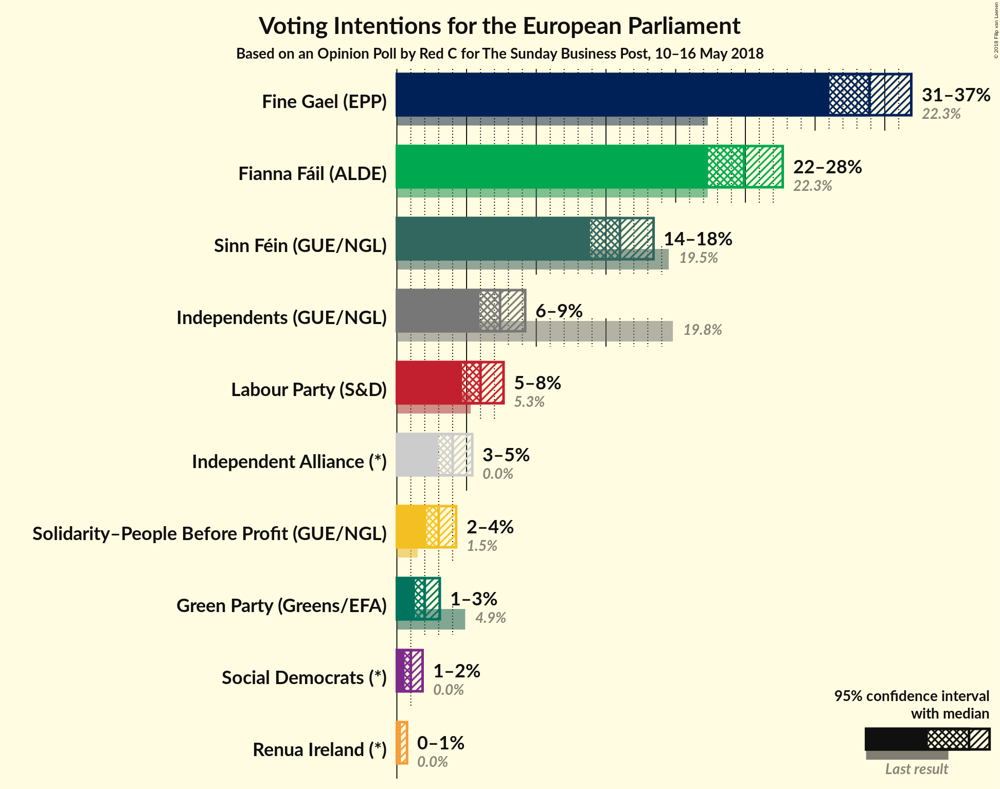
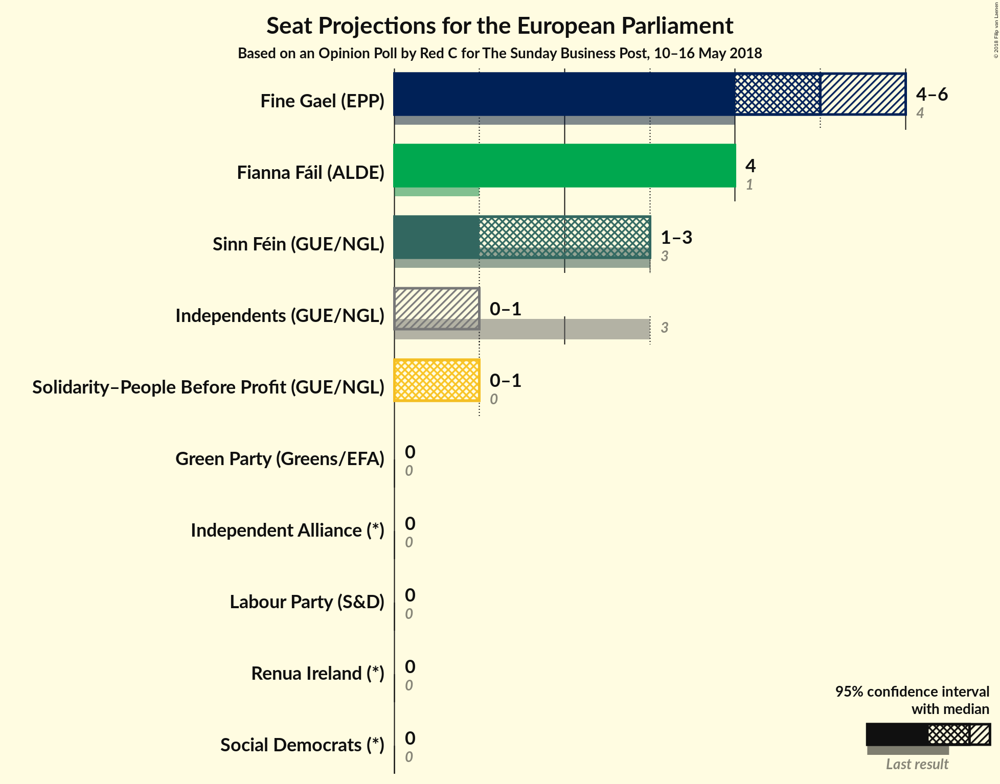
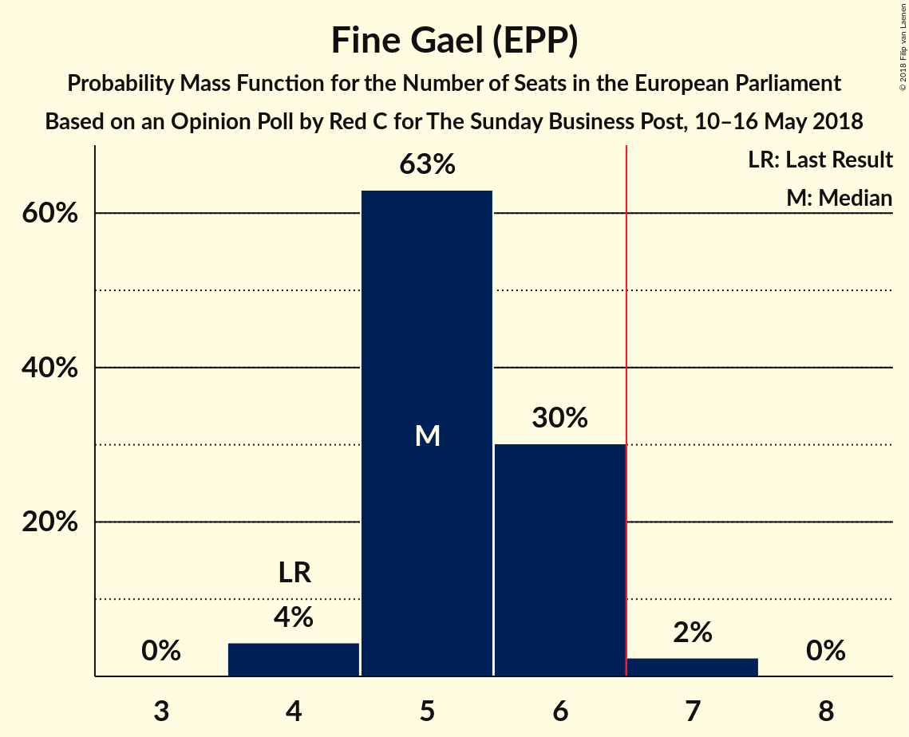
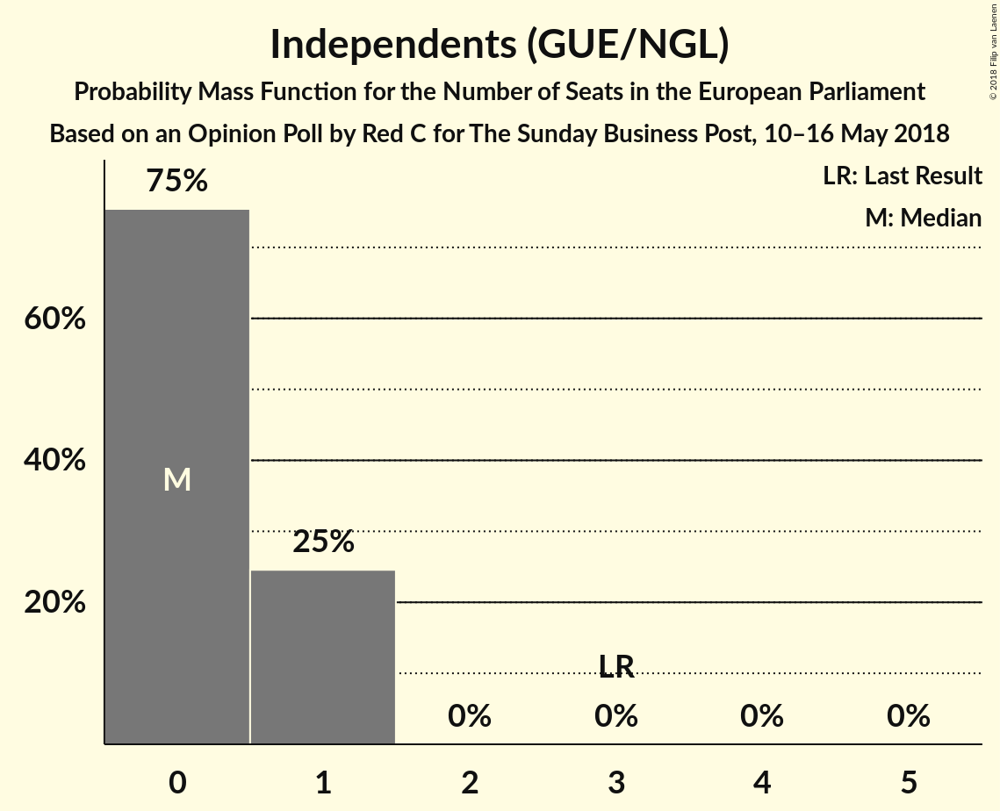
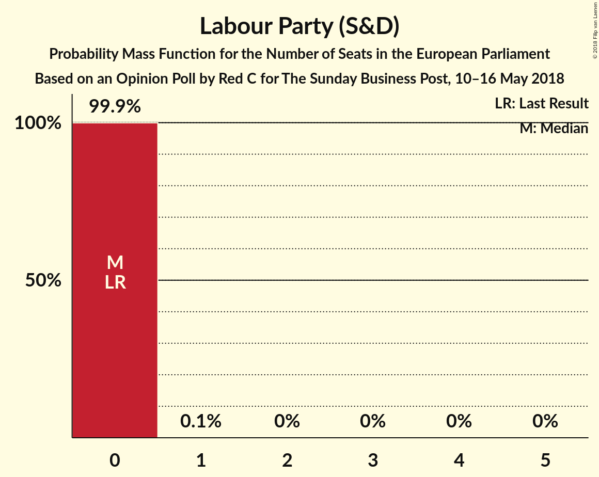
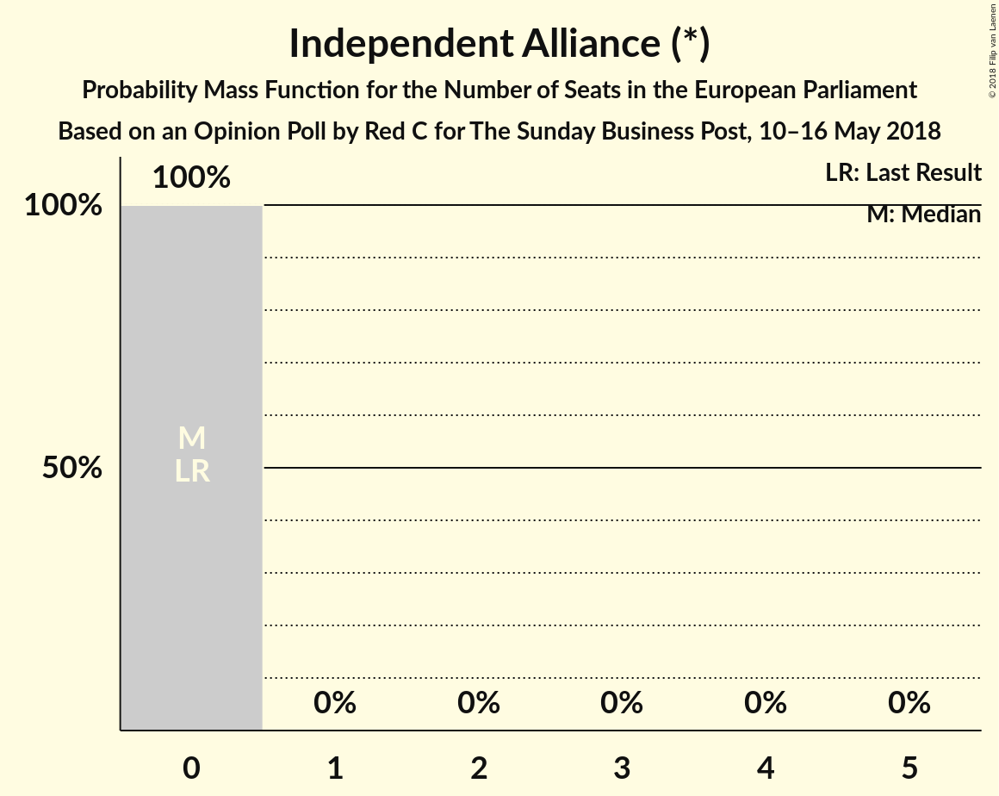
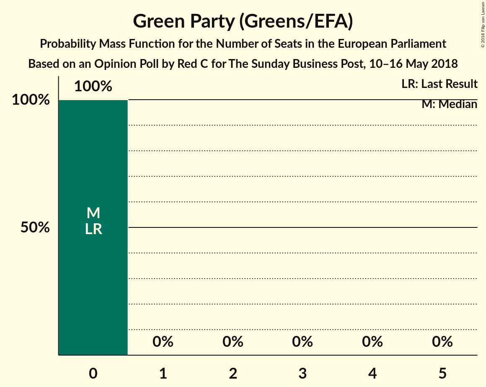
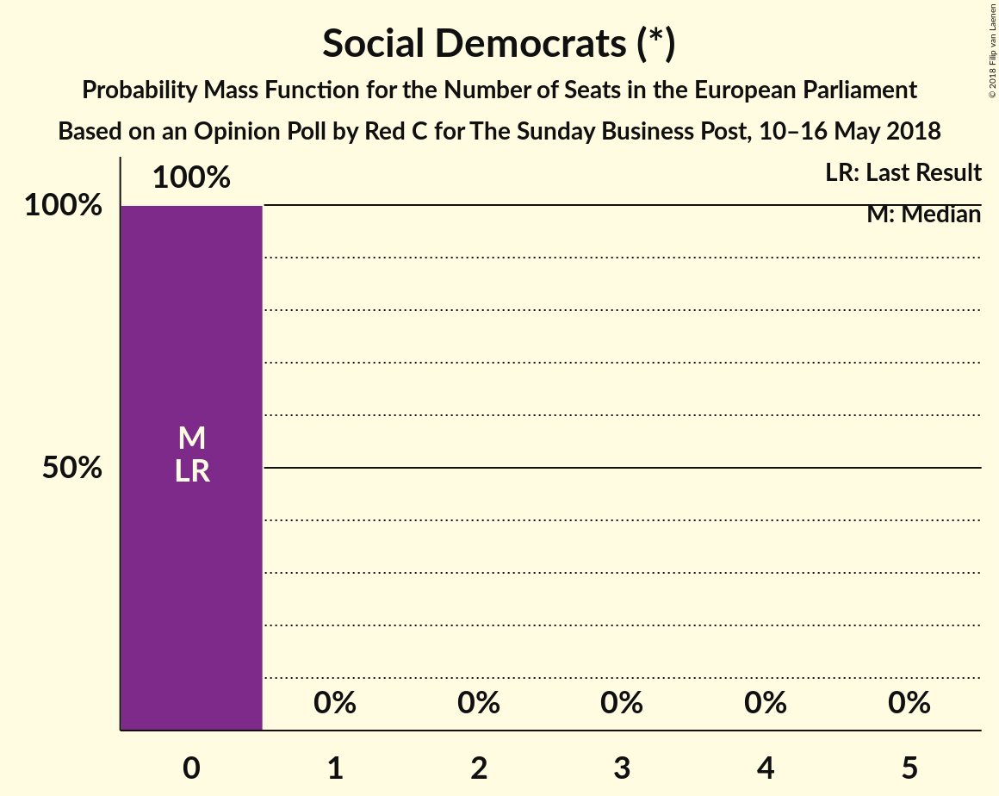
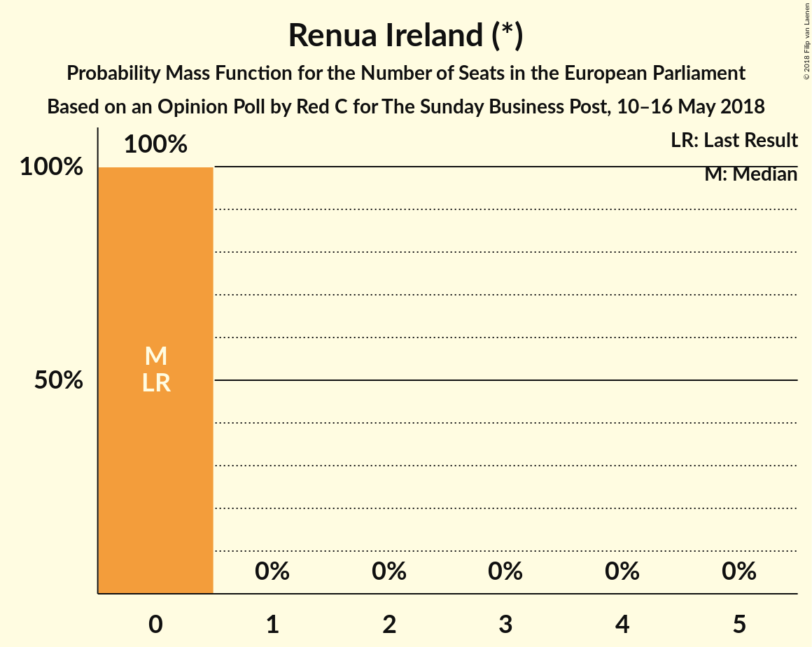
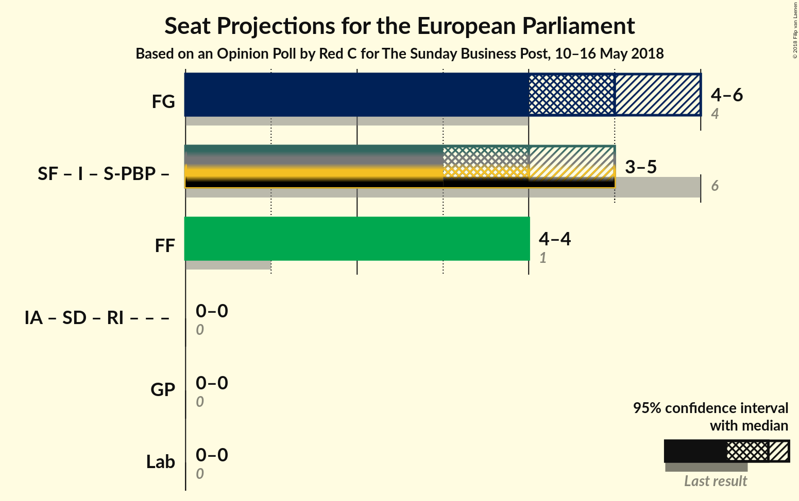

# Opinion Poll by Red C for The Sunday Business Post, 16 May 2018

<a href="#voting-intentions">Voting Intentions</a> | <a href="#seats">Seats</a> | <a href="#coalitions">Coalitions</a> | <a href="#technical-information">Technical Information</a>

## Voting Intentions

### Confidence Intervals

| Party | Last Result | Poll Result | 80% Confidence Interval | 90% Confidence Interval | 95% Confidence Interval | 99% Confidence Interval |
|:-----:|:-----------:|:-----------:|:-----------------------:|:-----------------------:|:-----------------------:|:-----------------------:|
| Fine Gael (EPP) | 22.3% | 33.9% | 32.0–35.9% |31.5–36.4% |31.0–36.9% |30.1–37.8% |
| Fianna Fáil (ALDE) | 22.3% | 24.9% | 23.2–26.7% |22.7–27.2% |22.3–27.7% |21.5–28.6% |
| Sinn Féin (GUE/NGL) | 19.5% | 16.0% | 14.6–17.6% |14.2–18.0% |13.9–18.4% |13.2–19.2% |
| Independents (GUE/NGL) | 19.8% | 7.4% | 6.4–8.6% |6.2–8.9% |5.9–9.2% |5.5–9.8% |
| Labour Party (S&D) | 5.3% | 6.0% | 5.1–7.1% |4.9–7.4% |4.7–7.7% |4.3–8.2% |
| Independent Alliance (*) | 0.0% | 4.0% | 3.3–4.9% |3.1–5.2% |2.9–5.4% |2.7–5.9% |
| Solidarity–People Before Profit (GUE/NGL) | 1.5% | 3.0% | 2.4–3.8% |2.2–4.1% |2.1–4.3% |1.9–4.7% |
| Green Party (Greens/EFA) | 4.9% | 2.0% | 1.5–2.7% |1.4–2.9% |1.3–3.1% |1.1–3.4% |
| Social Democrats (*) | 0.0% | 1.0% | 0.7–1.5% |0.6–1.7% |0.5–1.8% |0.4–2.1% |
| Renua Ireland (*) | 0.0% | 0.2% | 0.1–0.5% |0.1–0.6% |0.1–0.7% |0.0–0.9% |

*Note:* The poll result column reflects the actual value used in the calculations. Published results may vary slightly, and in addition be rounded to fewer digits.

## Seats

### Confidence Intervals

| Party | Last Result | Median | 80% Confidence Interval | 90% Confidence Interval | 95% Confidence Interval | 99% Confidence Interval |
|:-----:|:-----------:|:------:|:-----------------------:|:-----------------------:|:-----------------------:|:-----------------------:|
| <a href="#fine-gael-(epp)">Fine Gael (EPP)</a> | 4 | 5 | 5–6 |4–6 |4–6 |4–7 |
| <a href="#fianna-fáil-(alde)">Fianna Fáil (ALDE)</a> | 1 | 4 | 4 |4 |4 |4 |
| <a href="#sinn-féin-(gue/ngl)">Sinn Féin (GUE/NGL)</a> | 3 | 3 | 2–3 |1–3 |1–3 |1–3 |
| <a href="#independents-(gue/ngl)">Independents (GUE/NGL)</a> | 3 | 0 | 0–1 |0–1 |0–1 |0–1 |
| <a href="#labour-party-(s&d)">Labour Party (S&D)</a> | 0 | 0 | 0 |0 |0 |0 |
| <a href="#independent-alliance-(*)">Independent Alliance (*)</a> | 0 | 0 | 0 |0 |0 |0 |
| <a href="#solidarity–people-before-profit-(gue/ngl)">Solidarity–People Before Profit (GUE/NGL)</a> | 0 | 1 | 1 |0–1 |0–1 |0–1 |
| <a href="#green-party-(greens/efa)">Green Party (Greens/EFA)</a> | 0 | 0 | 0 |0 |0 |0 |
| <a href="#social-democrats-(*)">Social Democrats (*)</a> | 0 | 0 | 0 |0 |0 |0 |
| <a href="#renua-ireland-(*)">Renua Ireland (*)</a> | 0 | 0 | 0 |0 |0 |0 |

### Fine Gael (EPP)

*For a full overview of the results for this party, see the [Fine Gael (EPP)](party-finegaelepp.html) page.*

| Number of Seats | Probability | Accumulated | Special Marks |
|:---------------:|:-----------:|:-----------:|:-------------:|
| 4 | 6% | 100% | Last Result |
| 5 | 80% | 94% | Median |
| 6 | 14% | 15% |  |
| 7 | 0.5% | 0.5% | Majority |
| 8 | 0% | 0% |  |

### Fianna Fáil (ALDE)

*For a full overview of the results for this party, see the [Fianna Fáil (ALDE)](party-fiannafáilalde.html) page.*

| Number of Seats | Probability | Accumulated | Special Marks |
|:---------------:|:-----------:|:-----------:|:-------------:|
| 1 | 0% | 100% | Last Result |
| 2 | 0% | 100% |  |
| 3 | 0.3% | 100% |  |
| 4 | 99.7% | 99.7% | Median |
| 5 | 0% | 0% |  |

### Sinn Féin (GUE/NGL)

*For a full overview of the results for this party, see the [Sinn Féin (GUE/NGL)](party-sinnféinguengl.html) page.*

| Number of Seats | Probability | Accumulated | Special Marks |
|:---------------:|:-----------:|:-----------:|:-------------:|
| 1 | 9% | 100% |  |
| 2 | 2% | 91% |  |
| 3 | 89% | 89% | Last Result, Median |
| 4 | 0% | 0% |  |

### Independents (GUE/NGL)

*For a full overview of the results for this party, see the [Independents (GUE/NGL)](party-independentsguengl.html) page.*

| Number of Seats | Probability | Accumulated | Special Marks |
|:---------------:|:-----------:|:-----------:|:-------------:|
| 0 | 84% | 100% | Median |
| 1 | 16% | 16% |  |
| 2 | 0% | 0% |  |
| 3 | 0% | 0% | Last Result |

### Labour Party (S&D)

*For a full overview of the results for this party, see the [Labour Party (S&D)](party-labourpartysd.html) page.*

| Number of Seats | Probability | Accumulated | Special Marks |
|:---------------:|:-----------:|:-----------:|:-------------:|
| 0 | 100% | 100% | Last Result, Median |

### Independent Alliance (*)

*For a full overview of the results for this party, see the [Independent Alliance (*)](party-independentalliance.html) page.*

| Number of Seats | Probability | Accumulated | Special Marks |
|:---------------:|:-----------:|:-----------:|:-------------:|
| 0 | 100% | 100% | Last Result, Median |

### Solidarity–People Before Profit (GUE/NGL)

*For a full overview of the results for this party, see the [Solidarity–People Before Profit (GUE/NGL)](party-solidarity–peoplebeforeprofitguengl.html) page.*

| Number of Seats | Probability | Accumulated | Special Marks |
|:---------------:|:-----------:|:-----------:|:-------------:|
| 0 | 5% | 100% | Last Result |
| 1 | 95% | 95% | Median |
| 2 | 0% | 0% |  |

### Green Party (Greens/EFA)

*For a full overview of the results for this party, see the [Green Party (Greens/EFA)](party-greenpartygreensefa.html) page.*

| Number of Seats | Probability | Accumulated | Special Marks |
|:---------------:|:-----------:|:-----------:|:-------------:|
| 0 | 100% | 100% | Last Result, Median |

### Social Democrats (*)

*For a full overview of the results for this party, see the [Social Democrats (*)](party-socialdemocrats.html) page.*

| Number of Seats | Probability | Accumulated | Special Marks |
|:---------------:|:-----------:|:-----------:|:-------------:|
| 0 | 100% | 100% | Last Result, Median |

### Renua Ireland (*)

*For a full overview of the results for this party, see the [Renua Ireland (*)](party-renuaireland.html) page.*

| Number of Seats | Probability | Accumulated | Special Marks |
|:---------------:|:-----------:|:-----------:|:-------------:|
| 0 | 100% | 100% | Last Result, Median |

## Coalitions

### Confidence Intervals

| Coalition | Last Result | Median | Majority? | 80% Confidence Interval | 90% Confidence Interval | 95% Confidence Interval | 99% Confidence Interval |
|:---------:|:-----------:|:------:|:---------:|:-----------------------:|:-----------------------:|:-----------------------:|:-----------------------:|
| Fine Gael (EPP) | 4 | 5 | 0.5% | 5–6 | 4–6 | 4–6 | 4–7 |
| Fianna Fáil (ALDE) | 1 | 4 | 0% | 4 | 4 | 4 | 4 |
| Green Party (Greens/EFA) | 0 | 0 | 0% | 0 | 0 | 0 | 0 |
| Labour Party (S&D) | 0 | 0 | 0% | 0 | 0 | 0 | 0 |

### Fine Gael (EPP)

| Number of Seats | Probability | Accumulated | Special Marks |
|:---------------:|:-----------:|:-----------:|:-------------:|
| 4 | 6% | 100% | Last Result |
| 5 | 80% | 94% | Median |
| 6 | 14% | 15% |  |
| 7 | 0.5% | 0.5% | Majority |
| 8 | 0% | 0% |  |

### Fianna Fáil (ALDE)

| Number of Seats | Probability | Accumulated | Special Marks |
|:---------------:|:-----------:|:-----------:|:-------------:|
| 1 | 0% | 100% | Last Result |
| 2 | 0% | 100% |  |
| 3 | 0.3% | 100% |  |
| 4 | 99.7% | 99.7% | Median |
| 5 | 0% | 0% |  |

### Green Party (Greens/EFA)

| Number of Seats | Probability | Accumulated | Special Marks |
|:---------------:|:-----------:|:-----------:|:-------------:|
| 0 | 100% | 100% | Last Result, Median |

### Labour Party (S&D)

| Number of Seats | Probability | Accumulated | Special Marks |
|:---------------:|:-----------:|:-----------:|:-------------:|
| 0 | 100% | 100% | Last Result, Median |

## Technical Information

### Opinion Poll

+ **Polling firm:** Red C
+ **Commissioner(s):** The Sunday Business Post
+ **Fieldwork period:** 16 May 2018

### Calculations

+ **Sample size:** 1000
+ **Simulations done:** 131,072
+ **Error estimate:** 1.16%

