# Poll Average

<a href="#voting-intentions">Voting Intentions</a> | <a href="#seats">Seats</a> | <a href="#coalitions">Coalitions</a> | <a href="#technical-information">Technical Information</a>

## Summary

The table below lists the polls on which the average is based. They are the most recent polls (less than 90 days old) registered and analyzed so far.

| Period     | Polling firm/Commissioner(s) | FG | FF | I | SF | Lab | S-PBP | GP | IA | RI | SD | I4C |
|:----------:|:----------------------------:|:--:|:--:|:--:|:--:|:--:|:--:|:--:|:--:|:--:|:--:|:--:|
| 24 May 2019 | General Election | 22.3%   4 | 22.3%   1 | 19.8%   3 | 19.5%   3 | 5.3%   0 | 1.5%   0 | 4.9%   0 | 0.0%   0 | 0.0%   0 | 0.0%   0 | 0.0%   0 |
| N/A | Poll Average | 19–26%   2–5 | 23–38%   4–7 | 0–10%   0–1 | 19–26%   3–5 | 4–8%   0 | 1–6%   0 | 6–13%   0–2 | 1–4%   0 | 1–2%   0 | 1–6%   0–1 | 0–5%   0 |
| [25–30 January 2020](2020-01-30-RedC.html) | Red C   The Sunday Business Post | 19–24%   3–4 | 22–27%   4–5 | 7–11%   0–1 | 22–27%   3–6 | 4–7%   0 | 1–2%   0 | 6–9%   0–1 | N/A   N/A | N/A   N/A | 2–4%   0–1 | 3–6%   0 |
| [24–30 January 2020](2020-01-30-Panelbase.html) | Panelbase   The Times | 19–24%   2–5 | 23–29%   4–5 | 0–1%   0 | 21–26%   3–5 | 4–7%   0 | 4–7%   0 | 9–13%   0–2 | N/A   N/A | N/A   N/A | 4–7%   1–2 | 0–1%   0 |
| [1–25 January 2020](2020-01-25-IrelandThinks.html) | Ireland Thinks   The Irish Daily Mail | 22–27%   2–5 | 27–33%   4–5 | 0–1%   0 | 20–25%   3–4 | 5–8%   0 | 1–2%   0 | 9–13%   0–1 | N/A   N/A | N/A   N/A | 2–5%   0–1 | 0–1%   0 |
| [16–18 January 2020](2020-01-18-IpsosMRBI.html) | Ipsos MRBI   The Irish Times | 21–25%   3–5 | 23–28%   4–5 | 7–10%   0–1 | 19–23%   3–4 | 4–6%   0 | 1–3%   0 | 7–10%   0–1 | 1–2%   0 | N/A   N/A | 1–3%   0–1 | 3–5%   0 |
| [4–14 January 2020](2020-01-14-BehaviourandAttitudes.html) | Behaviour and Attitudes   The Sunday Times | 20–25%   3–4 | 33–39%   5–7 | 0–1%   0 | 19–24%   3–4 | 3–6%   0 | 1–3%   0 | 6–10%   0–1 | 2–5%   0 | 1–2%   0 | 1–2%   0 | 0–1%   0 |
| 24 May 2019 | General Election | 22.3%   4 | 22.3%   1 | 19.8%   3 | 19.5%   3 | 5.3%   0 | 1.5%   0 | 4.9%   0 | 0.0%   0 | 0.0%   0 | 0.0%   0 | 0.0%   0 |

Only polls for which at least the sample size has been published are included in the table above.

**Legend:**
+ **Top half of each row:** Voting intentions (95% confidence interval)
+ **Bottom half of each row:** Seat projections for the European Parliament (95% confidence interval)
+ **FG:** Fine Gael (EPP)
+ **FF:** Fianna Fáil (RE)
+ **I:** Independents (*)
+ **SF:** Sinn Féin (GUE/NGL)
+ **Lab:** Labour Party (S&D)
+ **S-PBP:** Solidarity–People Before Profit (GUE/NGL)
+ **GP:** Green Party (Greens/EFA)
+ **IA:** Independent Alliance (*)
+ **RI:** Renua Ireland (*)
+ **SD:** Social Democrats (S&D)
+ **I4C:** Independents 4 Change (GUE/NGL)
+ **N/A (single party):** Party not included the published results
+ **N/A (entire row):** Calculation for this opinion poll not started yet

## Voting Intentions

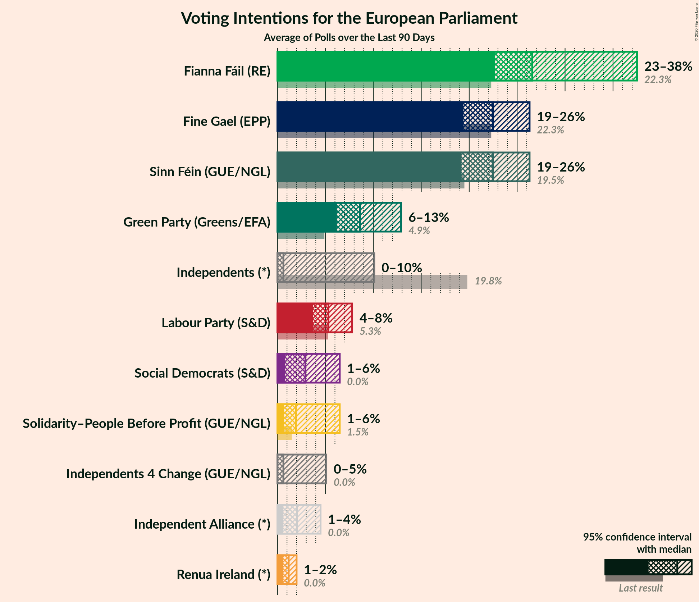

### Confidence Intervals

| Party | Last Result | Median | 80% Confidence Interval | 90% Confidence Interval | 95% Confidence Interval | 99% Confidence Interval |
|:-----:|:-----------:|:------:|:-----------------------:|:-----------------------:|:-----------------------:|:-----------------------:|
| <a href="#fine-gael-(epp)">Fine Gael (EPP)</a> | 22.3% | 22.5% | 20.4–24.9% |19.9–25.6% | 19.4–26.3% | 18.6–27.4% |
| <a href="#fianna-fáil-(re)">Fianna Fáil (RE)</a> | 22.3% | 26.6% | 23.8–35.7% |23.2–36.8% | 22.7–37.5% | 21.8–38.8% |
| <a href="#independents-(*)">Independents (*)</a> | 19.8% | 0.6% | 0.2–9.3% |0.2–9.8% | 0.1–10.1% | 0.1–10.8% |
| <a href="#sinn-féin-(gue/ngl)">Sinn Féin (GUE/NGL)</a> | 19.5% | 22.5% | 20.2–25.2% |19.6–25.8% | 19.2–26.3% | 18.4–27.4% |
| <a href="#labour-party-(s&d)">Labour Party (S&D)</a> | 5.3% | 5.3% | 4.2–6.9% |3.9–7.4% | 3.7–7.8% | 3.3–8.5% |
| <a href="#green-party-(greens/efa)">Green Party (Greens/EFA)</a> | 4.9% | 8.6% | 6.8–12.0% |6.5–12.5% | 6.2–12.9% | 5.6–13.7% |
| <a href="#solidarity–people-before-profit-(gue/ngl)">Solidarity–People Before Profit (GUE/NGL)</a> | 1.5% | 1.9% | 0.9–5.7% |0.8–6.2% | 0.7–6.5% | 0.5–7.2% |
| <a href="#independent-alliance-(*)">Independent Alliance (*)</a> | 0.0% | 2.0% | 0.8–3.9% |0.7–4.2% | 0.6–4.5% | 0.5–5.0% |
| <a href="#renua-ireland-(*)">Renua Ireland (*)</a> | 0.0% | 1.2% | 0.8–1.7% |0.7–1.8% | 0.6–2.0% | 0.5–2.3% |
| <a href="#social-democrats-(s&d)">Social Democrats (S&D)</a> | 0.0% | 2.9% | 1.1–5.7% |0.9–6.2% | 0.8–6.5% | 0.6–7.2% |
| <a href="#independents-4-change-(gue/ngl)">Independents 4 Change (GUE/NGL)</a> | 0.0% | 0.6% | 0.2–4.6% |0.2–4.9% | 0.1–5.1% | 0.1–5.6% |

### Fine Gael (EPP)

*For a full overview of the results for this party, see the [Fine Gael (EPP)](party-finegaelepp.html) page.*

| Voting Intentions | Probability | Accumulated | Special Marks |
|:-----------------:|:-----------:|:-----------:|:-------------:|
| 16.5–17.5% | 0% | 100% |  |
| 17.5–18.5% | 0.4% | 100% |  |
| 18.5–19.5% | 3% | 99.5% |  |
| 19.5–20.5% | 9% | 97% |  |
| 20.5–21.5% | 18% | 88% |  |
| 21.5–22.5% | 22% | 70% | Last Result, Median |
| 22.5–23.5% | 20% | 48% |  |
| 23.5–24.5% | 14% | 28% |  |
| 24.5–25.5% | 8% | 14% |  |
| 25.5–26.5% | 4% | 6% |  |
| 26.5–27.5% | 1.3% | 2% |  |
| 27.5–28.5% | 0.3% | 0.4% |  |
| 28.5–29.5% | 0.1% | 0.1% |  |
| 29.5–30.5% | 0% | 0% |  |

### Fianna Fáil (RE)

*For a full overview of the results for this party, see the [Fianna Fáil (RE)](party-fiannafáilre.html) page.*

| Voting Intentions | Probability | Accumulated | Special Marks |
|:-----------------:|:-----------:|:-----------:|:-------------:|
| 19.5–20.5% | 0% | 100% |  |
| 20.5–21.5% | 0.3% | 100% |  |
| 21.5–22.5% | 2% | 99.7% | Last Result |
| 22.5–23.5% | 6% | 98% |  |
| 23.5–24.5% | 13% | 92% |  |
| 24.5–25.5% | 16% | 80% |  |
| 25.5–26.5% | 13% | 64% |  |
| 26.5–27.5% | 8% | 50% | Median |
| 27.5–28.5% | 5% | 42% |  |
| 28.5–29.5% | 5% | 38% |  |
| 29.5–30.5% | 5% | 33% |  |
| 30.5–31.5% | 4% | 28% |  |
| 31.5–32.5% | 3% | 23% |  |
| 32.5–33.5% | 2% | 21% |  |
| 33.5–34.5% | 3% | 19% |  |
| 34.5–35.5% | 5% | 15% |  |
| 35.5–36.5% | 5% | 11% |  |
| 36.5–37.5% | 4% | 6% |  |
| 37.5–38.5% | 2% | 2% |  |
| 38.5–39.5% | 0.6% | 0.7% |  |
| 39.5–40.5% | 0.1% | 0.2% |  |
| 40.5–41.5% | 0% | 0% |  |

### Independents (*)

*For a full overview of the results for this party, see the [Independents (*)](party-independents.html) page.*

| Voting Intentions | Probability | Accumulated | Special Marks |
|:-----------------:|:-----------:|:-----------:|:-------------:|
| 0.0–0.5% | 46% | 100% |  |
| 0.5–1.5% | 14% | 54% | Median |
| 1.5–2.5% | 0% | 40% |  |
| 2.5–3.5% | 0% | 40% |  |
| 3.5–4.5% | 0% | 40% |  |
| 4.5–5.5% | 0% | 40% |  |
| 5.5–6.5% | 0.1% | 40% |  |
| 6.5–7.5% | 3% | 40% |  |
| 7.5–8.5% | 14% | 37% |  |
| 8.5–9.5% | 16% | 23% |  |
| 9.5–10.5% | 6% | 7% |  |
| 10.5–11.5% | 0.9% | 1.0% |  |
| 11.5–12.5% | 0.1% | 0.1% |  |
| 12.5–13.5% | 0% | 0% |  |
| 13.5–14.5% | 0% | 0% |  |
| 14.5–15.5% | 0% | 0% |  |
| 15.5–16.5% | 0% | 0% |  |
| 16.5–17.5% | 0% | 0% |  |
| 17.5–18.5% | 0% | 0% |  |
| 18.5–19.5% | 0% | 0% |  |
| 19.5–20.5% | 0% | 0% | Last Result |

### Sinn Féin (GUE/NGL)

*For a full overview of the results for this party, see the [Sinn Féin (GUE/NGL)](party-sinnféinguengl.html) page.*

| Voting Intentions | Probability | Accumulated | Special Marks |
|:-----------------:|:-----------:|:-----------:|:-------------:|
| 16.5–17.5% | 0.1% | 100% |  |
| 17.5–18.5% | 0.7% | 99.9% |  |
| 18.5–19.5% | 4% | 99.3% |  |
| 19.5–20.5% | 10% | 96% | Last Result |
| 20.5–21.5% | 17% | 85% |  |
| 21.5–22.5% | 19% | 68% | Median |
| 22.5–23.5% | 17% | 49% |  |
| 23.5–24.5% | 15% | 31% |  |
| 24.5–25.5% | 10% | 17% |  |
| 25.5–26.5% | 5% | 7% |  |
| 26.5–27.5% | 2% | 2% |  |
| 27.5–28.5% | 0.3% | 0.4% |  |
| 28.5–29.5% | 0% | 0% |  |
| 29.5–30.5% | 0% | 0% |  |

### Labour Party (S&D)

*For a full overview of the results for this party, see the [Labour Party (S&D)](party-labourpartysd.html) page.*

| Voting Intentions | Probability | Accumulated | Special Marks |
|:-----------------:|:-----------:|:-----------:|:-------------:|
| 1.5–2.5% | 0% | 100% |  |
| 2.5–3.5% | 2% | 100% |  |
| 3.5–4.5% | 18% | 98% |  |
| 4.5–5.5% | 38% | 80% | Last Result, Median |
| 5.5–6.5% | 26% | 42% |  |
| 6.5–7.5% | 12% | 15% |  |
| 7.5–8.5% | 3% | 4% |  |
| 8.5–9.5% | 0.4% | 0.4% |  |
| 9.5–10.5% | 0% | 0% |  |

### Green Party (Greens/EFA)

*For a full overview of the results for this party, see the [Green Party (Greens/EFA)](party-greenpartygreensefa.html) page.*

| Voting Intentions | Probability | Accumulated | Special Marks |
|:-----------------:|:-----------:|:-----------:|:-------------:|
| 3.5–4.5% | 0% | 100% |  |
| 4.5–5.5% | 0.4% | 100% | Last Result |
| 5.5–6.5% | 6% | 99.6% |  |
| 6.5–7.5% | 20% | 94% |  |
| 7.5–8.5% | 23% | 75% |  |
| 8.5–9.5% | 11% | 51% | Median |
| 9.5–10.5% | 9% | 40% |  |
| 10.5–11.5% | 15% | 31% |  |
| 11.5–12.5% | 11% | 16% |  |
| 12.5–13.5% | 4% | 5% |  |
| 13.5–14.5% | 0.6% | 0.7% |  |
| 14.5–15.5% | 0.1% | 0.1% |  |
| 15.5–16.5% | 0% | 0% |  |

### Solidarity–People Before Profit (GUE/NGL)

*For a full overview of the results for this party, see the [Solidarity–People Before Profit (GUE/NGL)](party-solidarity–peoplebeforeprofitguengl.html) page.*

| Voting Intentions | Probability | Accumulated | Special Marks |
|:-----------------:|:-----------:|:-----------:|:-------------:|
| 0.0–0.5% | 0.8% | 100% |  |
| 0.5–1.5% | 37% | 99.2% |  |
| 1.5–2.5% | 33% | 62% | Last Result, Median |
| 2.5–3.5% | 9% | 29% |  |
| 3.5–4.5% | 1.4% | 20% |  |
| 4.5–5.5% | 8% | 19% |  |
| 5.5–6.5% | 9% | 11% |  |
| 6.5–7.5% | 2% | 2% |  |
| 7.5–8.5% | 0.2% | 0.2% |  |
| 8.5–9.5% | 0% | 0% |  |

### Social Democrats (S&D)

*For a full overview of the results for this party, see the [Social Democrats (S&D)](party-socialdemocratssd.html) page.*

| Voting Intentions | Probability | Accumulated | Special Marks |
|:-----------------:|:-----------:|:-----------:|:-------------:|
| 0.0–0.5% | 0.3% | 100% | Last Result |
| 0.5–1.5% | 19% | 99.7% |  |
| 1.5–2.5% | 22% | 81% |  |
| 2.5–3.5% | 27% | 59% | Median |
| 3.5–4.5% | 13% | 32% |  |
| 4.5–5.5% | 9% | 20% |  |
| 5.5–6.5% | 9% | 11% |  |
| 6.5–7.5% | 2% | 2% |  |
| 7.5–8.5% | 0.2% | 0.2% |  |
| 8.5–9.5% | 0% | 0% |  |

### Independents 4 Change (GUE/NGL)

*For a full overview of the results for this party, see the [Independents 4 Change (GUE/NGL)](party-independents4changeguengl.html) page.*

| Voting Intentions | Probability | Accumulated | Special Marks |
|:-----------------:|:-----------:|:-----------:|:-------------:|
| 0.0–0.5% | 46% | 100% | Last Result |
| 0.5–1.5% | 14% | 54% | Median |
| 1.5–2.5% | 0.1% | 40% |  |
| 2.5–3.5% | 6% | 40% |  |
| 3.5–4.5% | 24% | 34% |  |
| 4.5–5.5% | 9% | 10% |  |
| 5.5–6.5% | 0.7% | 0.7% |  |
| 6.5–7.5% | 0% | 0% |  |

### Independent Alliance (*)

*For a full overview of the results for this party, see the [Independent Alliance (*)](party-independentalliance.html) page.*

| Voting Intentions | Probability | Accumulated | Special Marks |
|:-----------------:|:-----------:|:-----------:|:-------------:|
| 0.0–0.5% | 0.9% | 100% | Last Result |
| 0.5–1.5% | 46% | 99.1% |  |
| 1.5–2.5% | 6% | 53% | Median |
| 2.5–3.5% | 27% | 47% |  |
| 3.5–4.5% | 18% | 20% |  |
| 4.5–5.5% | 2% | 2% |  |
| 5.5–6.5% | 0.1% | 0.1% |  |
| 6.5–7.5% | 0% | 0% |  |

### Renua Ireland (*)

*For a full overview of the results for this party, see the [Renua Ireland (*)](party-renuaireland.html) page.*

| Voting Intentions | Probability | Accumulated | Special Marks |
|:-----------------:|:-----------:|:-----------:|:-------------:|
| 0.0–0.5% | 2% | 100% | Last Result |
| 0.5–1.5% | 84% | 98% | Median |
| 1.5–2.5% | 14% | 14% |  |
| 2.5–3.5% | 0.1% | 0.1% |  |
| 3.5–4.5% | 0% | 0% |  |

## Seats

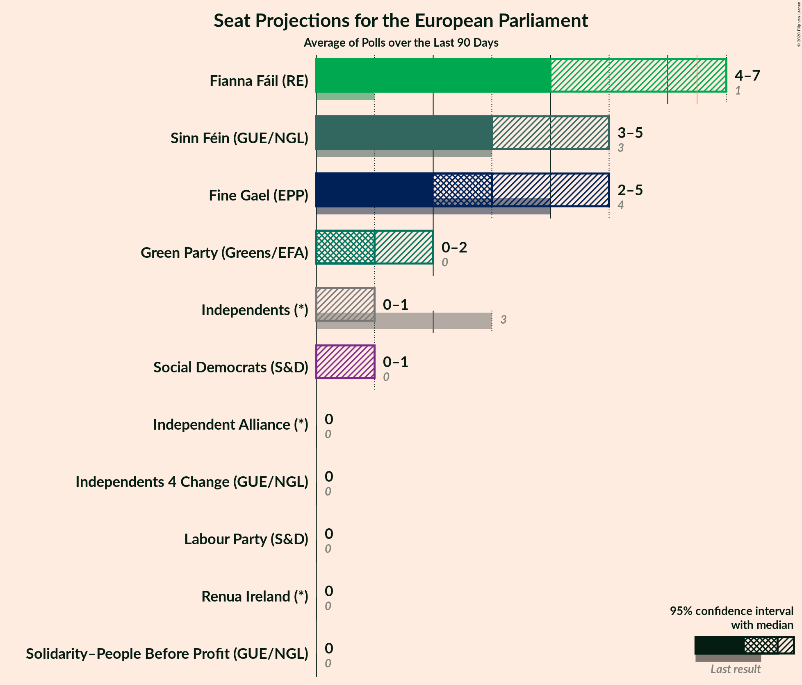

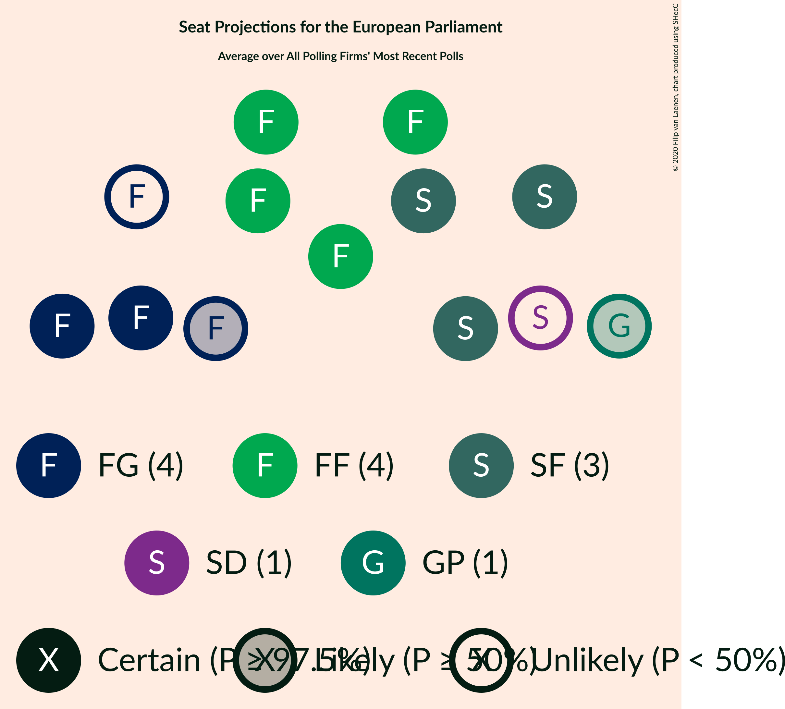

### Confidence Intervals

| Party | Last Result | Median | 80% Confidence Interval | 90% Confidence Interval | 95% Confidence Interval | 99% Confidence Interval |
|:-----:|:-----------:|:------:|:-----------------------:|:-----------------------:|:-----------------------:|:-----------------------:|
| <a href="#fine-gael-(epp)">Fine Gael (EPP)</a> | 4 | 3 | 2–5 |2–5 | 2–5 | 2–5 |
| <a href="#fianna-fáil-(re)">Fianna Fáil (RE)</a> | 1 | 4 | 4–7 |4–7 | 4–7 | 4–7 |
| <a href="#independents-(*)">Independents (*)</a> | 3 | 0 | 0–1 |0–1 | 0–1 | 0–1 |
| <a href="#sinn-féin-(gue/ngl)">Sinn Féin (GUE/NGL)</a> | 3 | 3 | 3–4 |3–5 | 3–5 | 3–6 |
| <a href="#labour-party-(s&d)">Labour Party (S&D)</a> | 0 | 0 | 0 |0 | 0 | 0 |
| <a href="#green-party-(greens/efa)">Green Party (Greens/EFA)</a> | 0 | 1 | 0–1 |0–1 | 0–2 | 0–2 |
| <a href="#solidarity–people-before-profit-(gue/ngl)">Solidarity–People Before Profit (GUE/NGL)</a> | 0 | 0 | 0 |0 | 0 | 0 |
| <a href="#independent-alliance-(*)">Independent Alliance (*)</a> | 0 | 0 | 0 |0 | 0 | 0 |
| <a href="#renua-ireland-(*)">Renua Ireland (*)</a> | 0 | 0 | 0 |0 | 0 | 0 |
| <a href="#social-democrats-(s&d)">Social Democrats (S&D)</a> | 0 | 0 | 0–1 |0–1 | 0–1 | 0–2 |
| <a href="#independents-4-change-(gue/ngl)">Independents 4 Change (GUE/NGL)</a> | 0 | 0 | 0 |0 | 0 | 0 |

### Fine Gael (EPP)

*For a full overview of the results for this party, see the [Fine Gael (EPP)](party-finegaelepp.html) page.*

| Number of Seats | Probability | Accumulated | Special Marks |
|:---------------:|:-----------:|:-----------:|:-------------:|
| 2 | 17% | 100% |  |
| 3 | 35% | 83% | Median |
| 4 | 35% | 48% | Last Result |
| 5 | 13% | 13% |  |
| 6 | 0% | 0% |  |

### Fianna Fáil (RE)

*For a full overview of the results for this party, see the [Fianna Fáil (RE)](party-fiannafáilre.html) page.*

| Number of Seats | Probability | Accumulated | Special Marks |
|:---------------:|:-----------:|:-----------:|:-------------:|
| 1 | 0% | 100% | Last Result |
| 2 | 0% | 100% |  |
| 3 | 0% | 100% |  |
| 4 | 58% | 100% | Median |
| 5 | 22% | 42% |  |
| 6 | 5% | 20% |  |
| 7 | 15% | 15% | Majority |
| 8 | 0% | 0% |  |

### Independents (*)

*For a full overview of the results for this party, see the [Independents (*)](party-independents.html) page.*

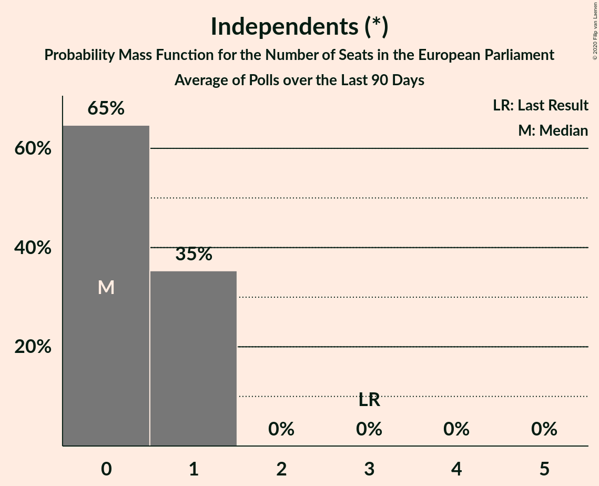

| Number of Seats | Probability | Accumulated | Special Marks |
|:---------------:|:-----------:|:-----------:|:-------------:|
| 0 | 65% | 100% | Median |
| 1 | 35% | 35% |  |
| 2 | 0% | 0% |  |
| 3 | 0% | 0% | Last Result |

### Sinn Féin (GUE/NGL)

*For a full overview of the results for this party, see the [Sinn Féin (GUE/NGL)](party-sinnféinguengl.html) page.*

| Number of Seats | Probability | Accumulated | Special Marks |
|:---------------:|:-----------:|:-----------:|:-------------:|
| 3 | 67% | 100% | Last Result, Median |
| 4 | 26% | 33% |  |
| 5 | 7% | 8% |  |
| 6 | 0.6% | 0.6% |  |
| 7 | 0% | 0% | Majority |

### Labour Party (S&D)

*For a full overview of the results for this party, see the [Labour Party (S&D)](party-labourpartysd.html) page.*

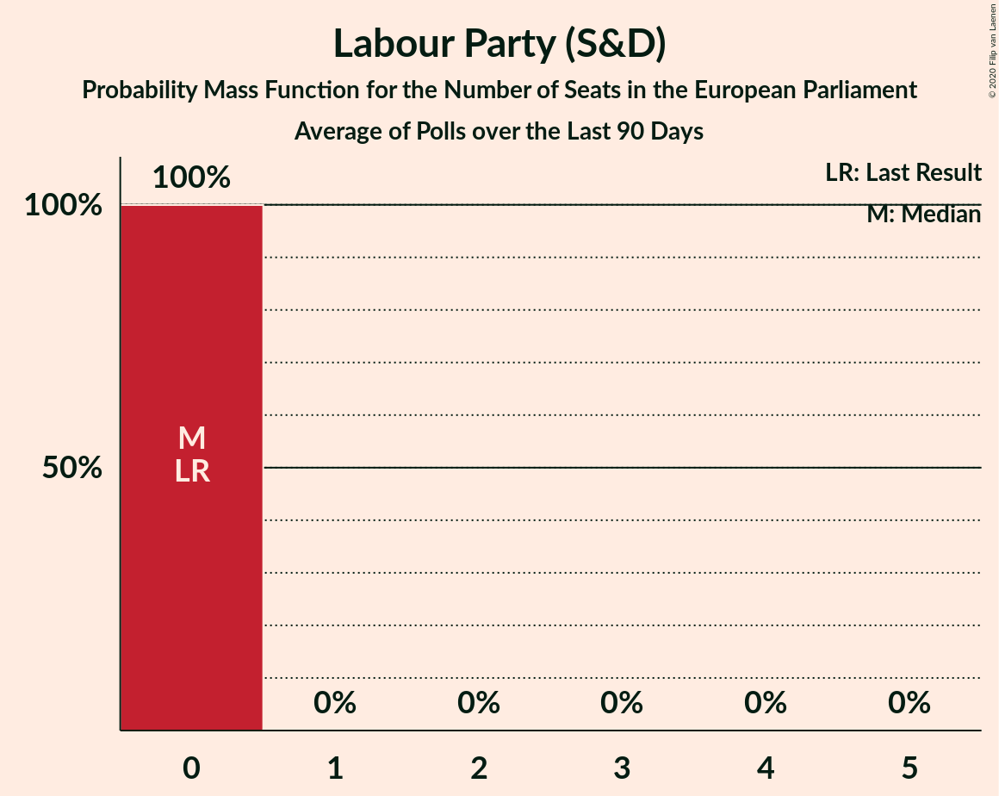

| Number of Seats | Probability | Accumulated | Special Marks |
|:---------------:|:-----------:|:-----------:|:-------------:|
| 0 | 100% | 100% | Last Result, Median |

### Green Party (Greens/EFA)

*For a full overview of the results for this party, see the [Green Party (Greens/EFA)](party-greenpartygreensefa.html) page.*

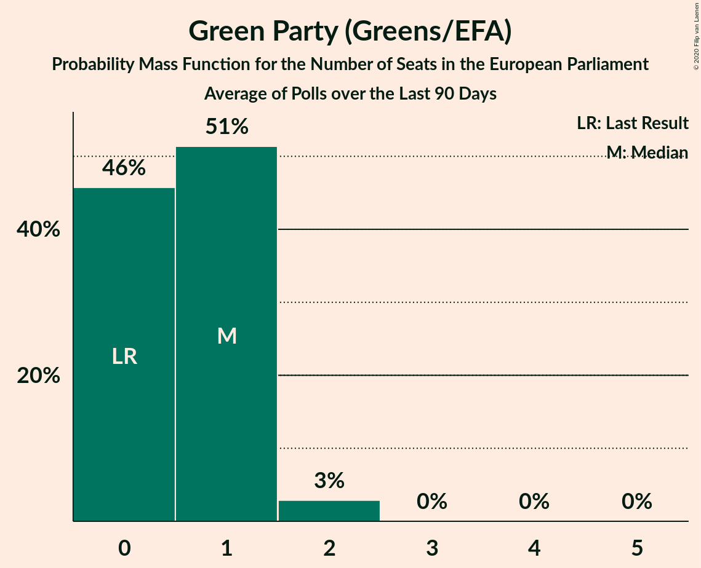

| Number of Seats | Probability | Accumulated | Special Marks |
|:---------------:|:-----------:|:-----------:|:-------------:|
| 0 | 46% | 100% | Last Result |
| 1 | 51% | 54% | Median |
| 2 | 3% | 3% |  |
| 3 | 0% | 0% |  |

### Solidarity–People Before Profit (GUE/NGL)

*For a full overview of the results for this party, see the [Solidarity–People Before Profit (GUE/NGL)](party-solidarity–peoplebeforeprofitguengl.html) page.*

| Number of Seats | Probability | Accumulated | Special Marks |
|:---------------:|:-----------:|:-----------:|:-------------:|
| 0 | 100% | 100% | Last Result, Median |

### Social Democrats (S&D)

*For a full overview of the results for this party, see the [Social Democrats (S&D)](party-socialdemocratssd.html) page.*

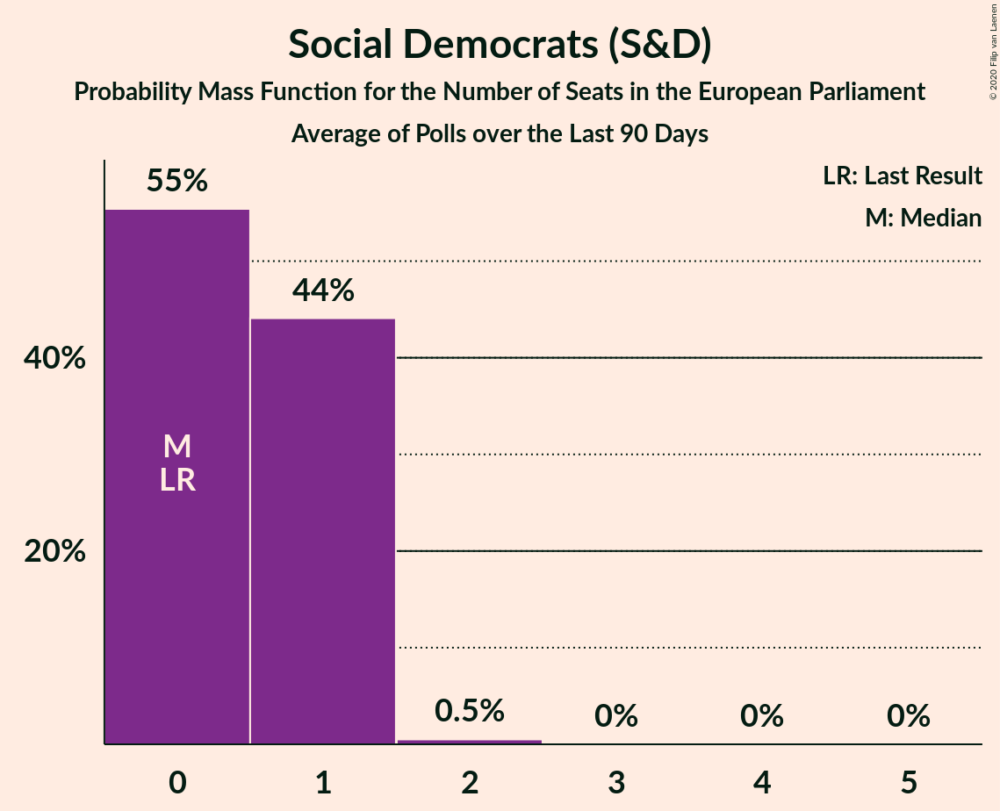

| Number of Seats | Probability | Accumulated | Special Marks |
|:---------------:|:-----------:|:-----------:|:-------------:|
| 0 | 55% | 100% | Last Result, Median |
| 1 | 44% | 45% |  |
| 2 | 0.5% | 0.5% |  |
| 3 | 0% | 0% |  |

### Independents 4 Change (GUE/NGL)

*For a full overview of the results for this party, see the [Independents 4 Change (GUE/NGL)](party-independents4changeguengl.html) page.*

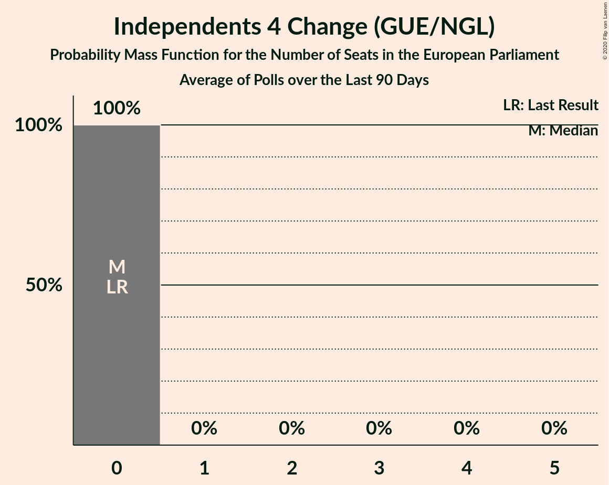

| Number of Seats | Probability | Accumulated | Special Marks |
|:---------------:|:-----------:|:-----------:|:-------------:|
| 0 | 100% | 100% | Last Result, Median |

### Independent Alliance (*)

*For a full overview of the results for this party, see the [Independent Alliance (*)](party-independentalliance.html) page.*

| Number of Seats | Probability | Accumulated | Special Marks |
|:---------------:|:-----------:|:-----------:|:-------------:|
| 0 | 100% | 100% | Last Result, Median |

### Renua Ireland (*)

*For a full overview of the results for this party, see the [Renua Ireland (*)](party-renuaireland.html) page.*

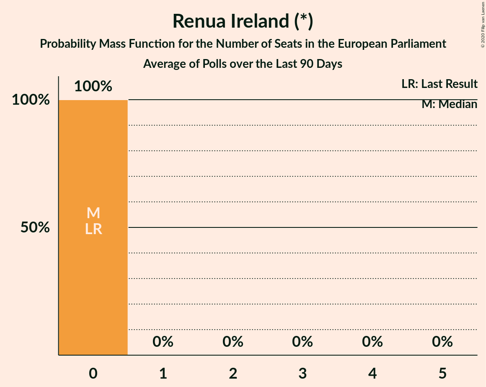

| Number of Seats | Probability | Accumulated | Special Marks |
|:---------------:|:-----------:|:-----------:|:-------------:|
| 0 | 100% | 100% | Last Result, Median |

## Coalitions

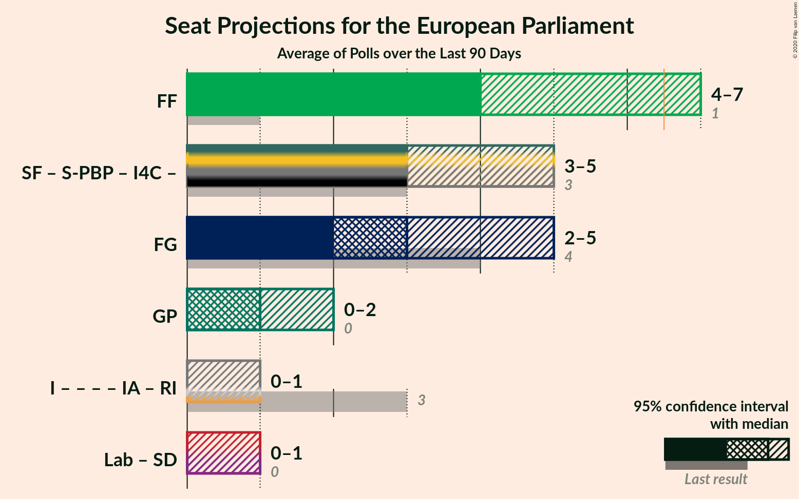

### Confidence Intervals

| Coalition | Last Result | Median | Majority? | 80% Confidence Interval | 90% Confidence Interval | 95% Confidence Interval | 99% Confidence Interval |
|:---------:|:-----------:|:------:|:---------:|:-----------------------:|:-----------------------:|:-----------------------:|:-----------------------:|
| Fianna Fáil (RE) | 1 | 4 | 15% | 4–7 | 4–7 | 4–7 | 4–7 |
| Fine Gael (EPP) | 4 | 3 | 0% | 2–5 | 2–5 | 2–5 | 2–5 |
| Green Party (Greens/EFA) | 0 | 1 | 0% | 0–1 | 0–1 | 0–2 | 0–2 |
| Labour Party (S&D) – Social Democrats (S&D) | 0 | 0 | 0% | 0–1 | 0–1 | 0–1 | 0–2 |

### Fianna Fáil (RE)

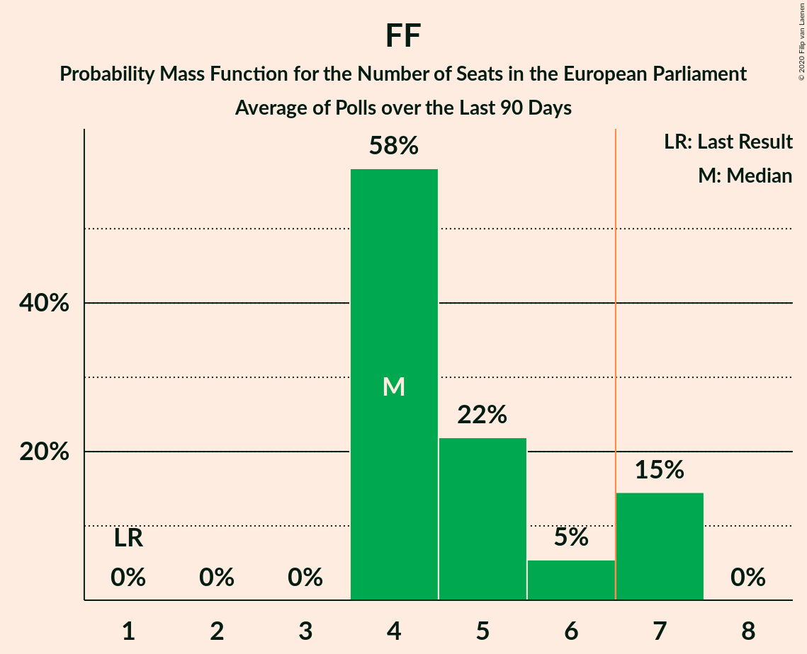

| Number of Seats | Probability | Accumulated | Special Marks |
|:---------------:|:-----------:|:-----------:|:-------------:|
| 1 | 0% | 100% | Last Result |
| 2 | 0% | 100% |  |
| 3 | 0% | 100% |  |
| 4 | 58% | 100% | Median |
| 5 | 22% | 42% |  |
| 6 | 5% | 20% |  |
| 7 | 15% | 15% | Majority |
| 8 | 0% | 0% |  |

### Fine Gael (EPP)

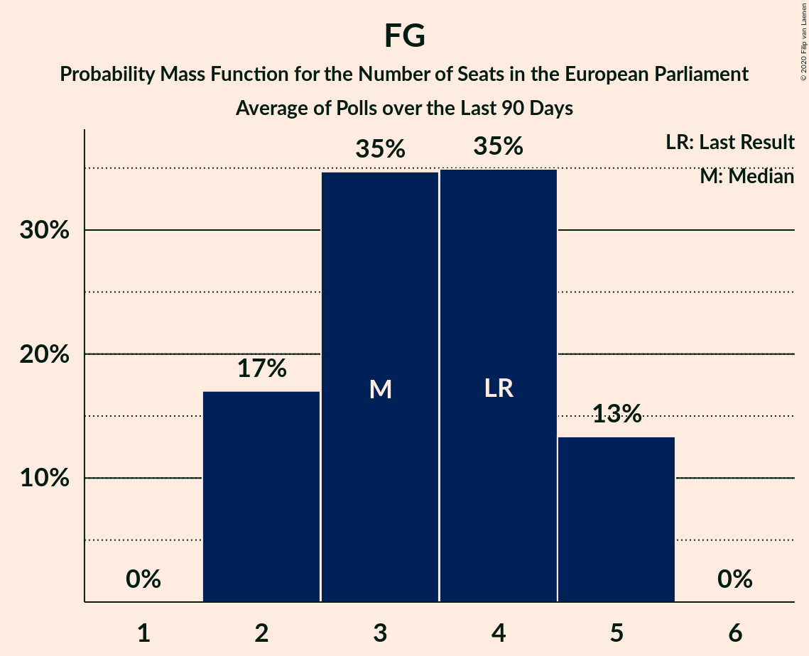

| Number of Seats | Probability | Accumulated | Special Marks |
|:---------------:|:-----------:|:-----------:|:-------------:|
| 2 | 17% | 100% |  |
| 3 | 35% | 83% | Median |
| 4 | 35% | 48% | Last Result |
| 5 | 13% | 13% |  |
| 6 | 0% | 0% |  |

### Green Party (Greens/EFA)

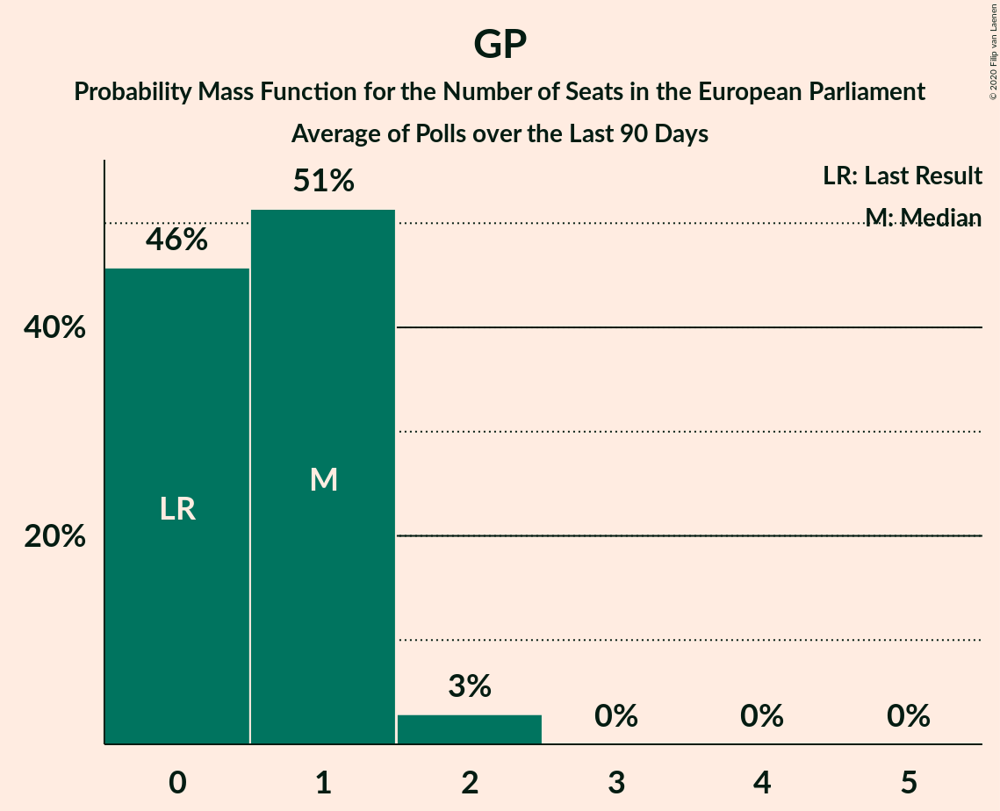

| Number of Seats | Probability | Accumulated | Special Marks |
|:---------------:|:-----------:|:-----------:|:-------------:|
| 0 | 46% | 100% | Last Result |
| 1 | 51% | 54% | Median |
| 2 | 3% | 3% |  |
| 3 | 0% | 0% |  |

### Labour Party (S&D) – Social Democrats (S&D)

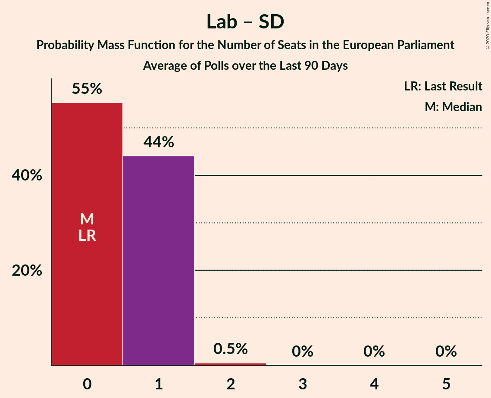

| Number of Seats | Probability | Accumulated | Special Marks |
|:---------------:|:-----------:|:-----------:|:-------------:|
| 0 | 55% | 100% | Last Result, Median |
| 1 | 44% | 45% |  |
| 2 | 0.5% | 0.5% |  |
| 3 | 0% | 0% |  |

## Technical Information

+ **Number of polls included in this average:** 5
+ **Lowest number of simulations done in a poll included in this average:** 1,048,576
+ **Total number of simulations done in the polls included in this average:** 5,242,880
+ **Error estimate:** 2.87%
