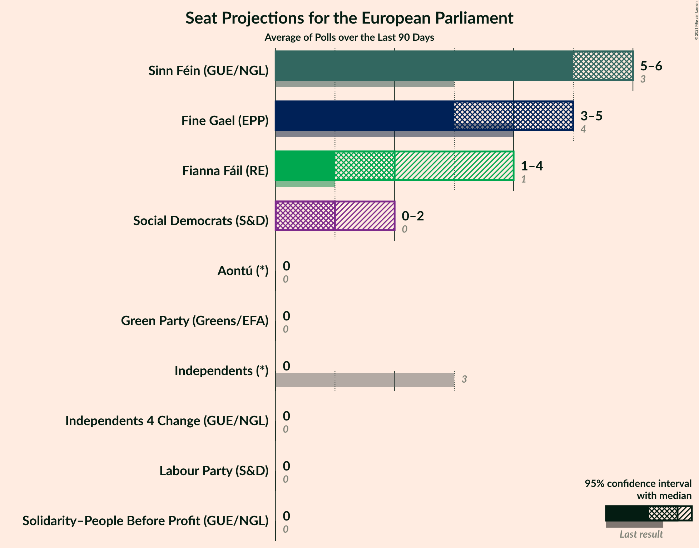
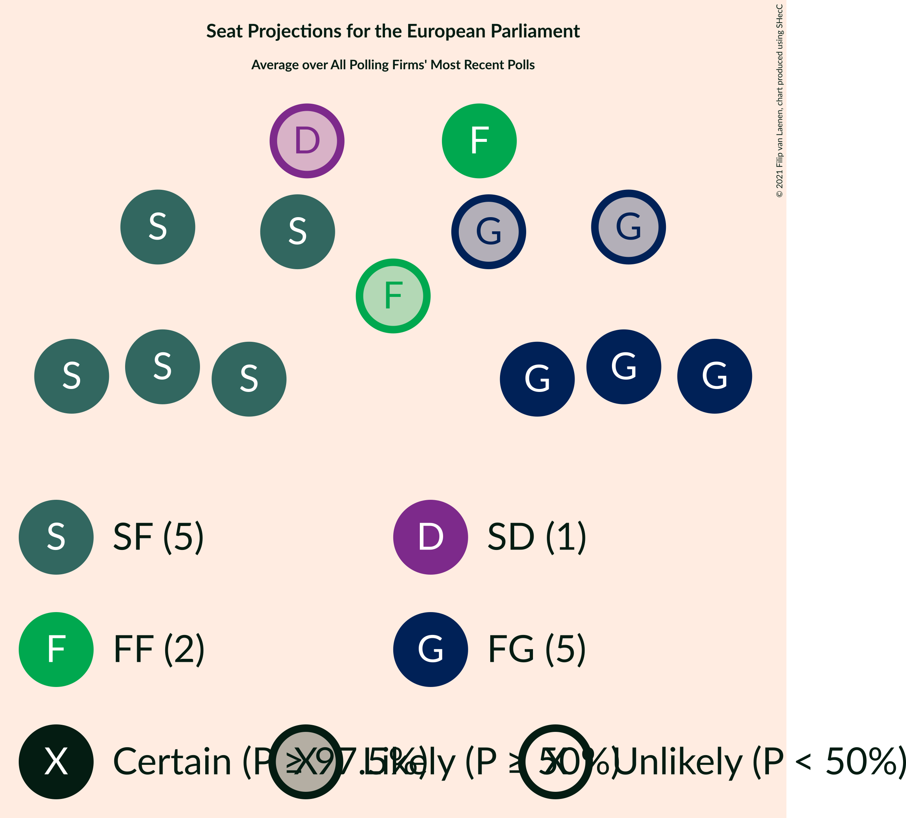
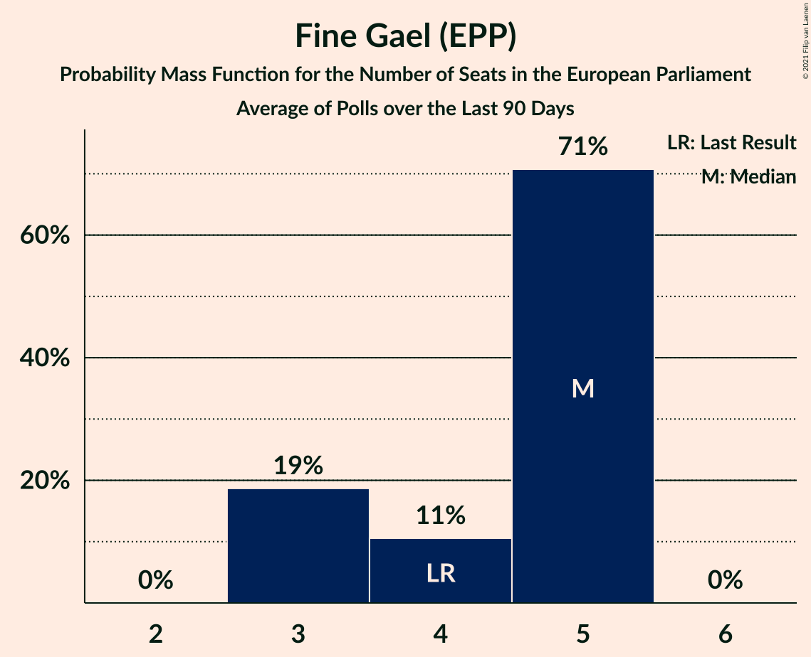
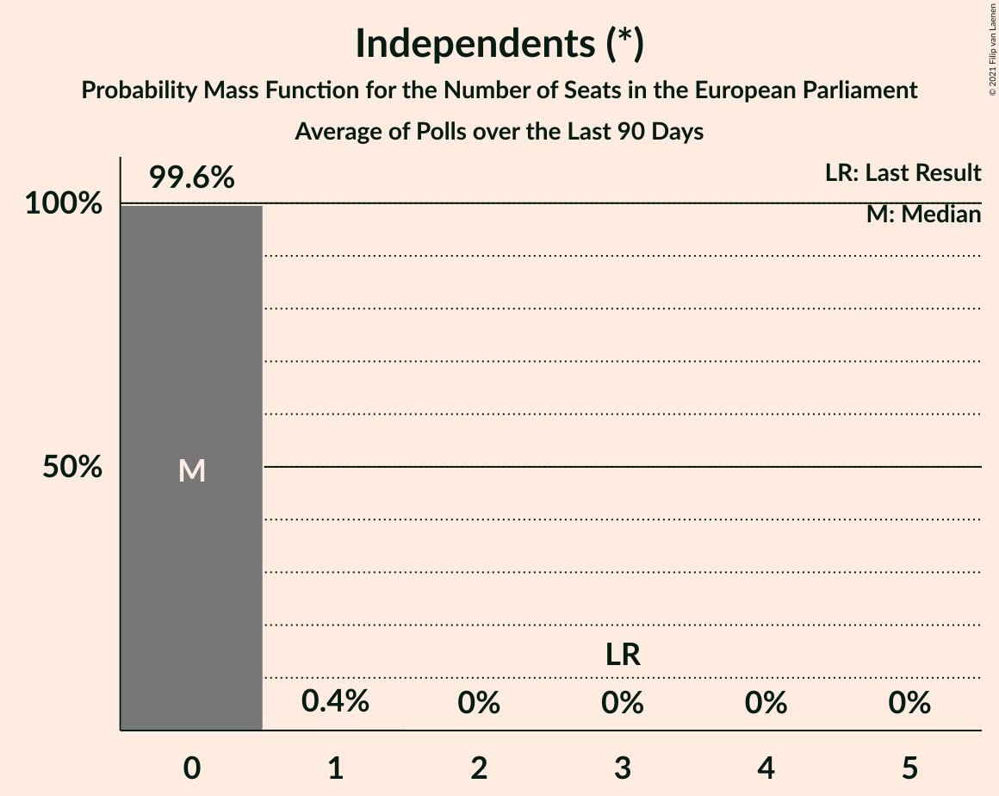
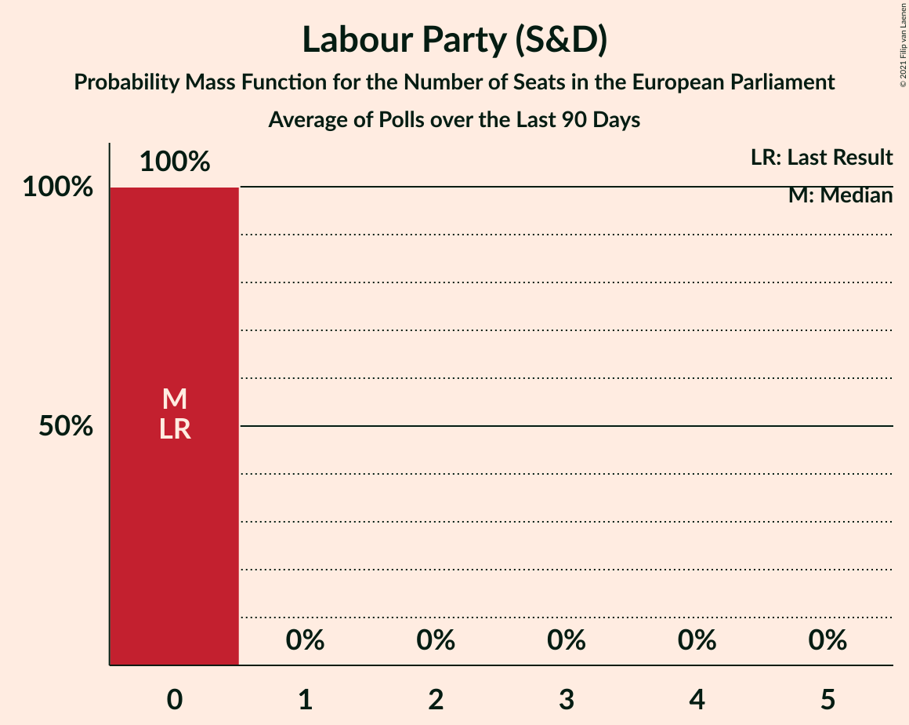
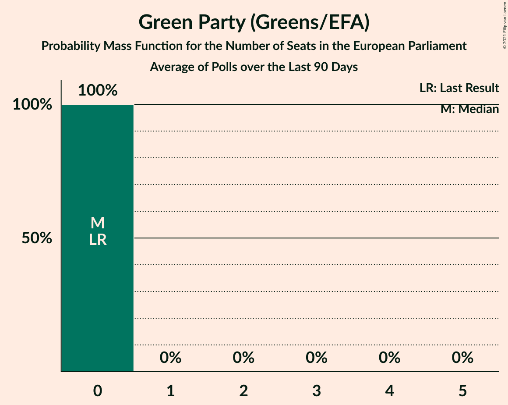
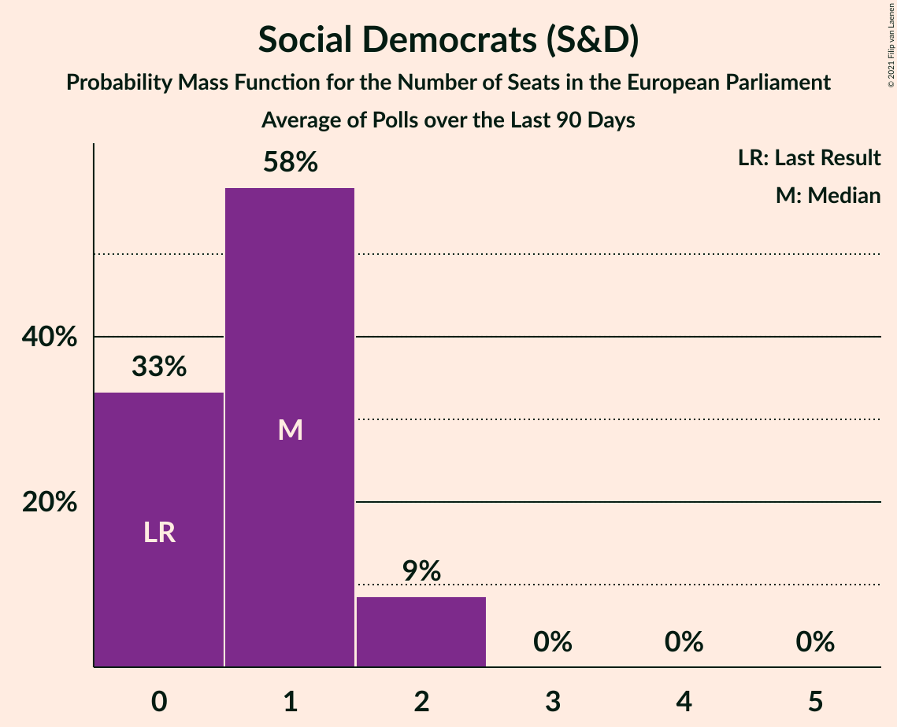
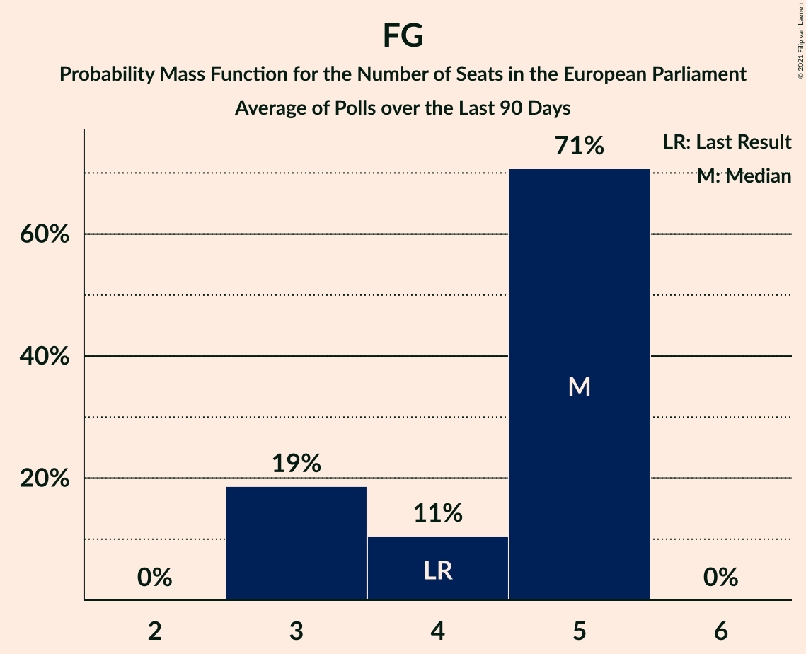
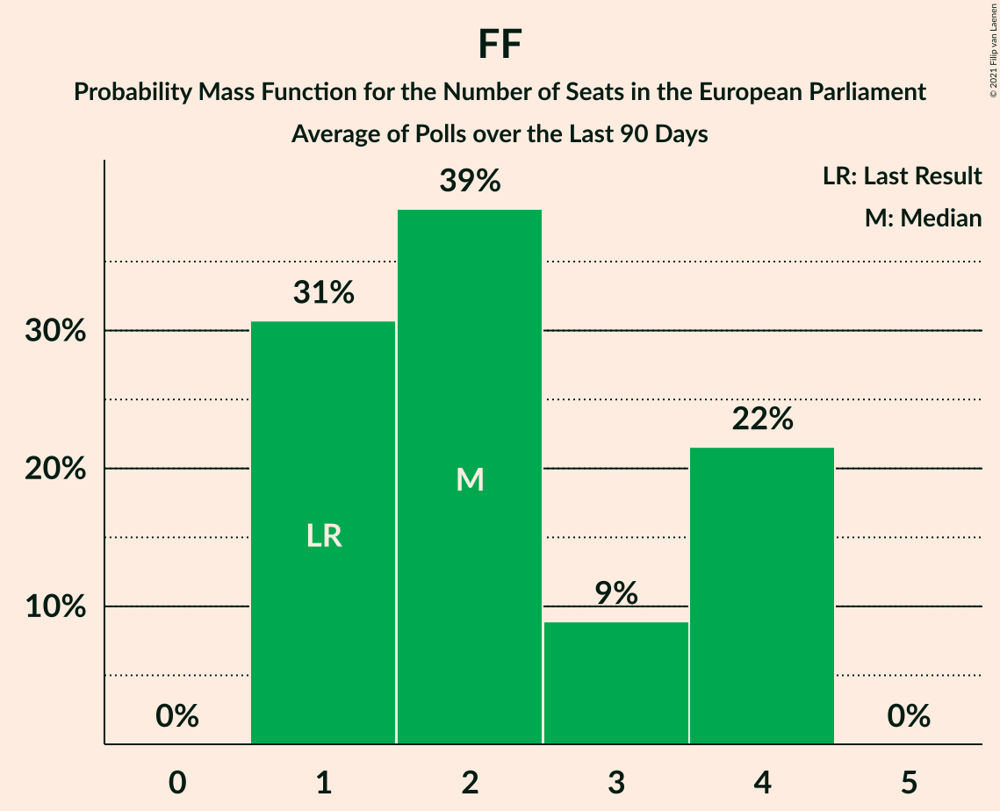
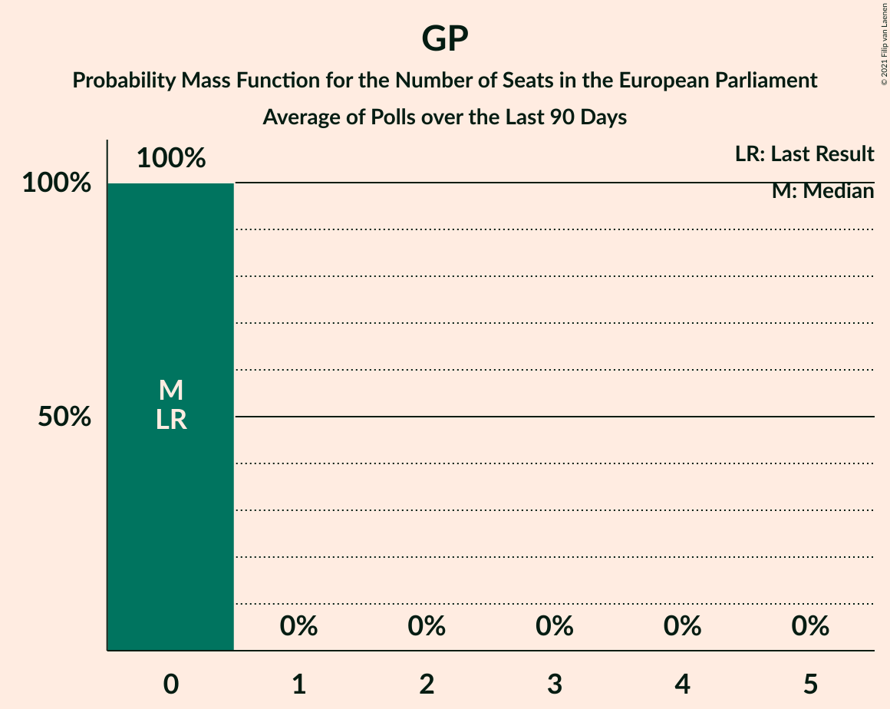

# Poll Average

<a href="#voting-intentions">Voting Intentions</a> | <a href="#seats">Seats</a> | <a href="#coalitions">Coalitions</a> | <a href="#technical-information">Technical Information</a>

## Summary

The table below lists the polls on which the average is based. They are the most recent polls (less than 90 days old) registered and analyzed so far.

| Period     | Polling firm/Commissioner(s) | FG | FF | I | SF | Lab | S-PBP | GP | IA | RI | SD | I4C | Aon |
|:----------:|:----------------------------:|:--:|:--:|:--:|:--:|:--:|:--:|:--:|:--:|:--:|:--:|:--:|:--:|
| 24 May 2019 | General Election | 22.3%   4 | 22.3%   1 | 19.8%   3 | 19.5%   3 | 5.3%   0 | 1.5%   0 | 4.9%   0 | 0.0%   0 | 0.0%   0 | 0.0%   0 | 0.0%   0 | 0.0%   0 |
| N/A | Poll Average | 25–31%   3–5 | 14–24%   1–4 | 4–8%   0 | 25–34%   5–6 | 2–6%   0 | 1–4%   0 | 2–6%   0 | N/A   N/A | N/A   N/A | 1–6%   0–2 | 2–4%   0 | 0–5%   0 |
| [21–28 January 2021](2021-01-28-RedC.html) | Red C   Business Post | 26–32%   5 | 14–18%   1–2 | 5–8%   0 | 24–30%   4–6 | 2–4%   0 | 2–4%   0 | 4–7%   0 | N/A   N/A | N/A   N/A | 4–7%   1–2 | 2–4%   0 | 1–3%   0 |
| [17 January 2021](2021-01-17-IrelandThinks.html) | Ireland Thinks   Irish Mail on Sunday | 26–31%   5 | 13–17%   1–2 | 4–6%   0 | 27–32%   5–6 | 4–6%   0 | 2–4%   0 | 2–4%   0 | N/A   N/A | N/A   N/A | 4–6%   1–2 | 1–3%   0 | 3–5%   0 |
| [3–15 December 2020](2020-12-15-BehaviourandAttitudes.html) | Behaviour and Attitudes   The Sunday Times | 24–30%   3–5 | 20–25%   2–4 | 4–6%   0 | 29–35%   5–6 | 4–7%   0 | 1–3%   0 | 2–4%   0 | N/A   N/A | N/A   N/A | 1–2%   0 | 1–3%   0 | 0–1%   0 |
| 24 May 2019 | General Election | 22.3%   4 | 22.3%   1 | 19.8%   3 | 19.5%   3 | 5.3%   0 | 1.5%   0 | 4.9%   0 | 0.0%   0 | 0.0%   0 | 0.0%   0 | 0.0%   0 | 0.0%   0 |

Only polls for which at least the sample size has been published are included in the table above.

**Legend:**
+ **Top half of each row:** Voting intentions (95% confidence interval)
+ **Bottom half of each row:** Seat projections for the European Parliament (95% confidence interval)
+ **FG:** Fine Gael (EPP)
+ **FF:** Fianna Fáil (RE)
+ **I:** Independents (*)
+ **SF:** Sinn Féin (GUE/NGL)
+ **Lab:** Labour Party (S&D)
+ **S-PBP:** Solidarity–People Before Profit (GUE/NGL)
+ **GP:** Green Party (Greens/EFA)
+ **IA:** Independent Alliance (*)
+ **RI:** Renua Ireland (*)
+ **SD:** Social Democrats (S&D)
+ **I4C:** Independents 4 Change (GUE/NGL)
+ **Aon:** Aontú (*)
+ **N/A (single party):** Party not included the published results
+ **N/A (entire row):** Calculation for this opinion poll not started yet

## Voting Intentions

### Confidence Intervals

| Party | Last Result | Median | 80% Confidence Interval | 90% Confidence Interval | 95% Confidence Interval | 99% Confidence Interval |
|:-----:|:-----------:|:------:|:-----------------------:|:-----------------------:|:-----------------------:|:-----------------------:|
| <a href="#fine-gael-(epp)">Fine Gael (EPP)</a> | 22.3% | 28.2% | 26.2–30.2% |25.6–30.8% | 25.1–31.3% | 24.1–32.3% |
| <a href="#fianna-fáil-(re)">Fianna Fáil (RE)</a> | 22.3% | 16.4% | 14.4–22.9% |14.0–23.6% | 13.6–24.2% | 13.0–25.3% |
| <a href="#independents-(*)">Independents (*)</a> | 19.8% | 5.2% | 4.1–7.1% |3.8–7.5% | 3.7–7.9% | 3.3–8.5% |
| <a href="#sinn-féin-(gue/ngl)">Sinn Féin (GUE/NGL)</a> | 19.5% | 29.4% | 26.3–33.1% |25.6–33.8% | 25.0–34.5% | 24.1–35.6% |
| <a href="#labour-party-(s&d)">Labour Party (S&D)</a> | 5.3% | 4.7% | 2.8–5.8% |2.5–6.1% | 2.3–6.4% | 2.0–6.9% |
| <a href="#green-party-(greens/efa)">Green Party (Greens/EFA)</a> | 4.9% | 3.5% | 2.6–5.4% |2.4–5.8% | 2.2–6.1% | 2.0–6.7% |
| <a href="#solidarity–people-before-profit-(gue/ngl)">Solidarity–People Before Profit (GUE/NGL)</a> | 1.5% | 2.8% | 1.8–3.7% |1.6–3.9% | 1.4–4.1% | 1.2–4.5% |
| <a href="#independent-alliance-(*)">Independent Alliance (*)</a> | 0.0% | N/A | N/A |N/A | N/A | N/A |
| <a href="#renua-ireland-(*)">Renua Ireland (*)</a> | 0.0% | N/A | N/A |N/A | N/A | N/A |
| <a href="#social-democrats-(s&d)">Social Democrats (S&D)</a> | 0.0% | 4.7% | 0.9–5.8% |0.7–6.1% | 0.6–6.3% | 0.5–6.9% |
| <a href="#independents-4-change-(gue/ngl)">Independents 4 Change (GUE/NGL)</a> | 0.0% | 2.5% | 1.8–3.5% |1.6–3.8% | 1.5–4.0% | 1.3–4.5% |
| <a href="#aontú-(*)">Aontú (*)</a> | 0.0% | 2.1% | 0.2–4.4% |0.1–4.7% | 0.1–4.9% | 0.1–5.4% |

### Fine Gael (EPP)

*For a full overview of the results for this party, see the [Fine Gael (EPP)](party-finegaelepp.html) page.*

| Voting Intentions | Probability | Accumulated | Special Marks |
|:-----------------:|:-----------:|:-----------:|:-------------:|
| 21.5–22.5% | 0% | 100% | Last Result |
| 22.5–23.5% | 0.2% | 100% |  |
| 23.5–24.5% | 1.0% | 99.8% |  |
| 24.5–25.5% | 4% | 98.9% |  |
| 25.5–26.5% | 10% | 95% |  |
| 26.5–27.5% | 19% | 85% |  |
| 27.5–28.5% | 25% | 66% | Median |
| 28.5–29.5% | 22% | 42% |  |
| 29.5–30.5% | 13% | 20% |  |
| 30.5–31.5% | 5% | 7% |  |
| 31.5–32.5% | 1.4% | 2% |  |
| 32.5–33.5% | 0.3% | 0.3% |  |
| 33.5–34.5% | 0% | 0% |  |

### Fianna Fáil (RE)

*For a full overview of the results for this party, see the [Fianna Fáil (RE)](party-fiannafáilre.html) page.*

| Voting Intentions | Probability | Accumulated | Special Marks |
|:-----------------:|:-----------:|:-----------:|:-------------:|
| 10.5–11.5% | 0% | 100% |  |
| 11.5–12.5% | 0.1% | 100% |  |
| 12.5–13.5% | 2% | 99.9% |  |
| 13.5–14.5% | 10% | 98% |  |
| 14.5–15.5% | 20% | 88% |  |
| 15.5–16.5% | 20% | 68% | Median |
| 16.5–17.5% | 10% | 48% |  |
| 17.5–18.5% | 3% | 37% |  |
| 18.5–19.5% | 1.3% | 34% |  |
| 19.5–20.5% | 3% | 33% |  |
| 20.5–21.5% | 7% | 30% |  |
| 21.5–22.5% | 10% | 23% | Last Result |
| 22.5–23.5% | 8% | 13% |  |
| 23.5–24.5% | 4% | 6% |  |
| 24.5–25.5% | 1.3% | 2% |  |
| 25.5–26.5% | 0.3% | 0.3% |  |
| 26.5–27.5% | 0% | 0% |  |

### Independents (*)

*For a full overview of the results for this party, see the [Independents (*)](party-independents.html) page.*

| Voting Intentions | Probability | Accumulated | Special Marks |
|:-----------------:|:-----------:|:-----------:|:-------------:|
| 1.5–2.5% | 0% | 100% |  |
| 2.5–3.5% | 2% | 100% |  |
| 3.5–4.5% | 25% | 98% |  |
| 4.5–5.5% | 35% | 74% | Median |
| 5.5–6.5% | 20% | 39% |  |
| 6.5–7.5% | 14% | 19% |  |
| 7.5–8.5% | 4% | 5% |  |
| 8.5–9.5% | 0.4% | 0.4% |  |
| 9.5–10.5% | 0% | 0% |  |
| 10.5–11.5% | 0% | 0% |  |
| 11.5–12.5% | 0% | 0% |  |
| 12.5–13.5% | 0% | 0% |  |
| 13.5–14.5% | 0% | 0% |  |
| 14.5–15.5% | 0% | 0% |  |
| 15.5–16.5% | 0% | 0% |  |
| 16.5–17.5% | 0% | 0% |  |
| 17.5–18.5% | 0% | 0% |  |
| 18.5–19.5% | 0% | 0% |  |
| 19.5–20.5% | 0% | 0% | Last Result |

### Sinn Féin (GUE/NGL)

*For a full overview of the results for this party, see the [Sinn Féin (GUE/NGL)](party-sinnféinguengl.html) page.*

| Voting Intentions | Probability | Accumulated | Special Marks |
|:-----------------:|:-----------:|:-----------:|:-------------:|
| 19.5–20.5% | 0% | 100% | Last Result |
| 20.5–21.5% | 0% | 100% |  |
| 21.5–22.5% | 0% | 100% |  |
| 22.5–23.5% | 0.2% | 100% |  |
| 23.5–24.5% | 1.0% | 99.8% |  |
| 24.5–25.5% | 4% | 98.8% |  |
| 25.5–26.5% | 8% | 95% |  |
| 26.5–27.5% | 12% | 87% |  |
| 27.5–28.5% | 14% | 76% |  |
| 28.5–29.5% | 15% | 62% | Median |
| 29.5–30.5% | 13% | 47% |  |
| 30.5–31.5% | 11% | 35% |  |
| 31.5–32.5% | 10% | 24% |  |
| 32.5–33.5% | 7% | 14% |  |
| 33.5–34.5% | 4% | 7% |  |
| 34.5–35.5% | 2% | 2% |  |
| 35.5–36.5% | 0.5% | 0.6% |  |
| 36.5–37.5% | 0.1% | 0.1% |  |
| 37.5–38.5% | 0% | 0% |  |

### Labour Party (S&D)

*For a full overview of the results for this party, see the [Labour Party (S&D)](party-labourpartysd.html) page.*

| Voting Intentions | Probability | Accumulated | Special Marks |
|:-----------------:|:-----------:|:-----------:|:-------------:|
| 0.5–1.5% | 0% | 100% |  |
| 1.5–2.5% | 5% | 100% |  |
| 2.5–3.5% | 22% | 95% |  |
| 3.5–4.5% | 19% | 73% |  |
| 4.5–5.5% | 36% | 53% | Last Result, Median |
| 5.5–6.5% | 15% | 17% |  |
| 6.5–7.5% | 1.5% | 2% |  |
| 7.5–8.5% | 0.1% | 0.1% |  |
| 8.5–9.5% | 0% | 0% |  |

### Green Party (Greens/EFA)

*For a full overview of the results for this party, see the [Green Party (Greens/EFA)](party-greenpartygreensefa.html) page.*

| Voting Intentions | Probability | Accumulated | Special Marks |
|:-----------------:|:-----------:|:-----------:|:-------------:|
| 0.5–1.5% | 0% | 100% |  |
| 1.5–2.5% | 9% | 100% |  |
| 2.5–3.5% | 44% | 91% | Median |
| 3.5–4.5% | 21% | 47% |  |
| 4.5–5.5% | 18% | 26% | Last Result |
| 5.5–6.5% | 7% | 8% |  |
| 6.5–7.5% | 0.8% | 0.8% |  |
| 7.5–8.5% | 0% | 0% |  |

### Solidarity–People Before Profit (GUE/NGL)

*For a full overview of the results for this party, see the [Solidarity–People Before Profit (GUE/NGL)](party-solidarity–peoplebeforeprofitguengl.html) page.*

| Voting Intentions | Probability | Accumulated | Special Marks |
|:-----------------:|:-----------:|:-----------:|:-------------:|
| 0.0–0.5% | 0% | 100% |  |
| 0.5–1.5% | 4% | 100% |  |
| 1.5–2.5% | 33% | 96% | Last Result |
| 2.5–3.5% | 50% | 63% | Median |
| 3.5–4.5% | 12% | 13% |  |
| 4.5–5.5% | 0.4% | 0.4% |  |
| 5.5–6.5% | 0% | 0% |  |

### Social Democrats (S&D)

*For a full overview of the results for this party, see the [Social Democrats (S&D)](party-socialdemocratssd.html) page.*

| Voting Intentions | Probability | Accumulated | Special Marks |
|:-----------------:|:-----------:|:-----------:|:-------------:|
| 0.0–0.5% | 1.1% | 100% | Last Result |
| 0.5–1.5% | 29% | 98.9% |  |
| 1.5–2.5% | 3% | 70% |  |
| 2.5–3.5% | 0.4% | 67% |  |
| 3.5–4.5% | 13% | 66% |  |
| 4.5–5.5% | 37% | 53% | Median |
| 5.5–6.5% | 15% | 16% |  |
| 6.5–7.5% | 1.3% | 1.3% |  |
| 7.5–8.5% | 0% | 0% |  |

### Aontú (*)

*For a full overview of the results for this party, see the [Aontú (*)](party-aontú.html) page.*

| Voting Intentions | Probability | Accumulated | Special Marks |
|:-----------------:|:-----------:|:-----------:|:-------------:|
| 0.0–0.5% | 29% | 100% | Last Result |
| 0.5–1.5% | 8% | 71% |  |
| 1.5–2.5% | 25% | 63% | Median |
| 2.5–3.5% | 11% | 39% |  |
| 3.5–4.5% | 21% | 28% |  |
| 4.5–5.5% | 6% | 6% |  |
| 5.5–6.5% | 0.3% | 0.3% |  |
| 6.5–7.5% | 0% | 0% |  |

### Independents 4 Change (GUE/NGL)

*For a full overview of the results for this party, see the [Independents 4 Change (GUE/NGL)](party-independents4changeguengl.html) page.*

| Voting Intentions | Probability | Accumulated | Special Marks |
|:-----------------:|:-----------:|:-----------:|:-------------:|
| 0.0–0.5% | 0% | 100% | Last Result |
| 0.5–1.5% | 3% | 100% |  |
| 1.5–2.5% | 51% | 97% | Median |
| 2.5–3.5% | 38% | 46% |  |
| 3.5–4.5% | 8% | 9% |  |
| 4.5–5.5% | 0.4% | 0.4% |  |
| 5.5–6.5% | 0% | 0% |  |

## Seats

### Confidence Intervals

| Party | Last Result | Median | 80% Confidence Interval | 90% Confidence Interval | 95% Confidence Interval | 99% Confidence Interval |
|:-----:|:-----------:|:------:|:-----------------------:|:-----------------------:|:-----------------------:|:-----------------------:|
| <a href="#fine-gael-(epp)">Fine Gael (EPP)</a> | 4 | 5 | 3–5 |3–5 | 3–5 | 3–5 |
| <a href="#fianna-fáil-(re)">Fianna Fáil (RE)</a> | 1 | 2 | 1–4 |1–4 | 1–4 | 1–4 |
| <a href="#independents-(*)">Independents (*)</a> | 3 | 0 | 0 |0 | 0 | 0 |
| <a href="#sinn-féin-(gue/ngl)">Sinn Féin (GUE/NGL)</a> | 3 | 6 | 5–6 |5–6 | 5–6 | 4–6 |
| <a href="#labour-party-(s&d)">Labour Party (S&D)</a> | 0 | 0 | 0 |0 | 0 | 0 |
| <a href="#green-party-(greens/efa)">Green Party (Greens/EFA)</a> | 0 | 0 | 0 |0 | 0 | 0 |
| <a href="#solidarity–people-before-profit-(gue/ngl)">Solidarity–People Before Profit (GUE/NGL)</a> | 0 | 0 | 0 |0 | 0 | 0 |
| <a href="#independent-alliance-(*)">Independent Alliance (*)</a> | 0 | N/A | N/A |N/A | N/A | N/A |
| <a href="#renua-ireland-(*)">Renua Ireland (*)</a> | 0 | N/A | N/A |N/A | N/A | N/A |
| <a href="#social-democrats-(s&d)">Social Democrats (S&D)</a> | 0 | 1 | 0–1 |0–2 | 0–2 | 0–2 |
| <a href="#independents-4-change-(gue/ngl)">Independents 4 Change (GUE/NGL)</a> | 0 | 0 | 0 |0 | 0 | 0 |
| <a href="#aontú-(*)">Aontú (*)</a> | 0 | 0 | 0 |0 | 0 | 0 |

### Fine Gael (EPP)

*For a full overview of the results for this party, see the [Fine Gael (EPP)](party-finegaelepp.html) page.*

| Number of Seats | Probability | Accumulated | Special Marks |
|:---------------:|:-----------:|:-----------:|:-------------:|
| 3 | 19% | 100% |  |
| 4 | 11% | 81% | Last Result |
| 5 | 71% | 71% | Median |
| 6 | 0% | 0% |  |

### Fianna Fáil (RE)

*For a full overview of the results for this party, see the [Fianna Fáil (RE)](party-fiannafáilre.html) page.*

| Number of Seats | Probability | Accumulated | Special Marks |
|:---------------:|:-----------:|:-----------:|:-------------:|
| 1 | 31% | 100% | Last Result |
| 2 | 39% | 69% | Median |
| 3 | 9% | 30% |  |
| 4 | 22% | 22% |  |
| 5 | 0% | 0% |  |

### Independents (*)

*For a full overview of the results for this party, see the [Independents (*)](party-independents.html) page.*

| Number of Seats | Probability | Accumulated | Special Marks |
|:---------------:|:-----------:|:-----------:|:-------------:|
| 0 | 99.6% | 100% | Median |
| 1 | 0.4% | 0.4% |  |
| 2 | 0% | 0% |  |
| 3 | 0% | 0% | Last Result |

### Sinn Féin (GUE/NGL)

*For a full overview of the results for this party, see the [Sinn Féin (GUE/NGL)](party-sinnféinguengl.html) page.*

| Number of Seats | Probability | Accumulated | Special Marks |
|:---------------:|:-----------:|:-----------:|:-------------:|
| 3 | 0.3% | 100% | Last Result |
| 4 | 1.2% | 99.7% |  |
| 5 | 46% | 98.5% |  |
| 6 | 53% | 53% | Median |
| 7 | 0% | 0% | Majority |

### Labour Party (S&D)

*For a full overview of the results for this party, see the [Labour Party (S&D)](party-labourpartysd.html) page.*

| Number of Seats | Probability | Accumulated | Special Marks |
|:---------------:|:-----------:|:-----------:|:-------------:|
| 0 | 100% | 100% | Last Result, Median |

### Green Party (Greens/EFA)

*For a full overview of the results for this party, see the [Green Party (Greens/EFA)](party-greenpartygreensefa.html) page.*

| Number of Seats | Probability | Accumulated | Special Marks |
|:---------------:|:-----------:|:-----------:|:-------------:|
| 0 | 100% | 100% | Last Result, Median |

### Solidarity–People Before Profit (GUE/NGL)

*For a full overview of the results for this party, see the [Solidarity–People Before Profit (GUE/NGL)](party-solidarity–peoplebeforeprofitguengl.html) page.*

| Number of Seats | Probability | Accumulated | Special Marks |
|:---------------:|:-----------:|:-----------:|:-------------:|
| 0 | 100% | 100% | Last Result, Median |

### Independent Alliance (*)

*For a full overview of the results for this party, see the [Independent Alliance (*)](party-independentalliance.html) page.*

### Renua Ireland (*)

*For a full overview of the results for this party, see the [Renua Ireland (*)](party-renuaireland.html) page.*

### Social Democrats (S&D)

*For a full overview of the results for this party, see the [Social Democrats (S&D)](party-socialdemocratssd.html) page.*

| Number of Seats | Probability | Accumulated | Special Marks |
|:---------------:|:-----------:|:-----------:|:-------------:|
| 0 | 33% | 100% | Last Result |
| 1 | 58% | 67% | Median |
| 2 | 9% | 9% |  |
| 3 | 0% | 0% |  |

### Independents 4 Change (GUE/NGL)

*For a full overview of the results for this party, see the [Independents 4 Change (GUE/NGL)](party-independents4changeguengl.html) page.*

| Number of Seats | Probability | Accumulated | Special Marks |
|:---------------:|:-----------:|:-----------:|:-------------:|
| 0 | 100% | 100% | Last Result, Median |

### Aontú (*)

*For a full overview of the results for this party, see the [Aontú (*)](party-aontú.html) page.*

| Number of Seats | Probability | Accumulated | Special Marks |
|:---------------:|:-----------:|:-----------:|:-------------:|
| 0 | 100% | 100% | Last Result, Median |

## Coalitions

### Confidence Intervals

| Coalition | Last Result | Median | Majority? | 80% Confidence Interval | 90% Confidence Interval | 95% Confidence Interval | 99% Confidence Interval |
|:---------:|:-----------:|:------:|:---------:|:-----------------------:|:-----------------------:|:-----------------------:|:-----------------------:|
| Fine Gael (EPP) | 4 | 5 | 0% | 3–5 | 3–5 | 3–5 | 3–5 |
| Fianna Fáil (RE) | 1 | 2 | 0% | 1–4 | 1–4 | 1–4 | 1–4 |
| Labour Party (S&D) – Social Democrats (S&D) | 0 | 1 | 0% | 0–1 | 0–2 | 0–2 | 0–2 |
| Green Party (Greens/EFA) | 0 | 0 | 0% | 0 | 0 | 0 | 0 |

### Fine Gael (EPP)

| Number of Seats | Probability | Accumulated | Special Marks |
|:---------------:|:-----------:|:-----------:|:-------------:|
| 3 | 19% | 100% |  |
| 4 | 11% | 81% | Last Result |
| 5 | 71% | 71% | Median |
| 6 | 0% | 0% |  |

### Fianna Fáil (RE)

| Number of Seats | Probability | Accumulated | Special Marks |
|:---------------:|:-----------:|:-----------:|:-------------:|
| 1 | 31% | 100% | Last Result |
| 2 | 39% | 69% | Median |
| 3 | 9% | 30% |  |
| 4 | 22% | 22% |  |
| 5 | 0% | 0% |  |

### Labour Party (S&D) – Social Democrats (S&D)

| Number of Seats | Probability | Accumulated | Special Marks |
|:---------------:|:-----------:|:-----------:|:-------------:|
| 0 | 33% | 100% | Last Result |
| 1 | 58% | 67% | Median |
| 2 | 9% | 9% |  |
| 3 | 0% | 0% |  |

### Green Party (Greens/EFA)

| Number of Seats | Probability | Accumulated | Special Marks |
|:---------------:|:-----------:|:-----------:|:-------------:|
| 0 | 100% | 100% | Last Result, Median |

## Technical Information

+ **Number of polls included in this average:** 3
+ **Lowest number of simulations done in a poll included in this average:** 1,048,576
+ **Total number of simulations done in the polls included in this average:** 3,145,728
+ **Error estimate:** 2.97%
