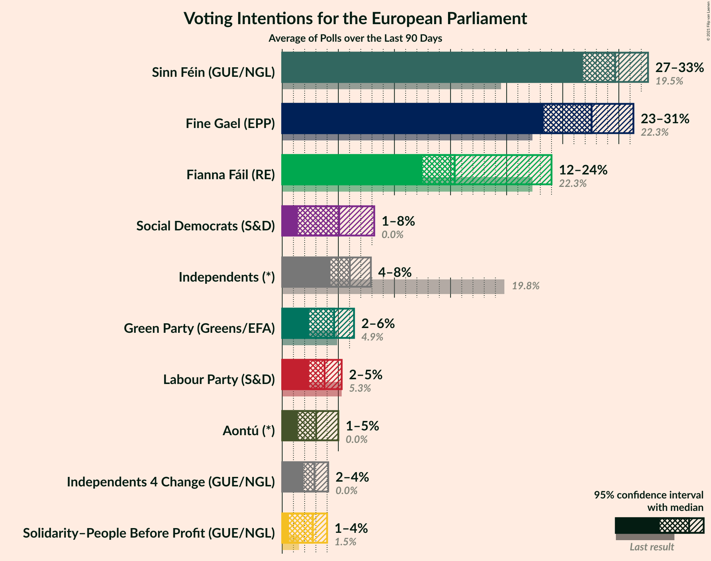
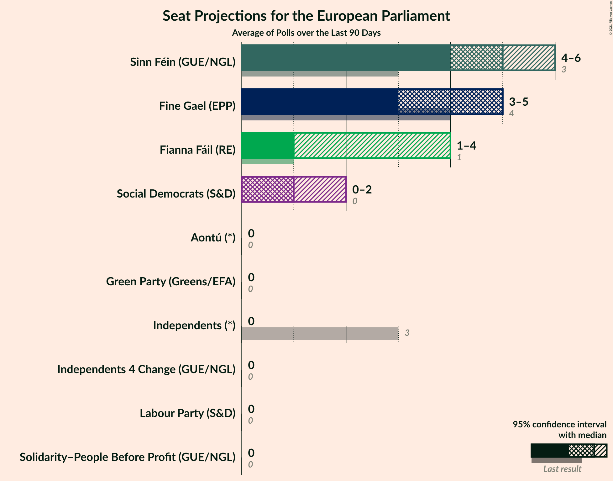
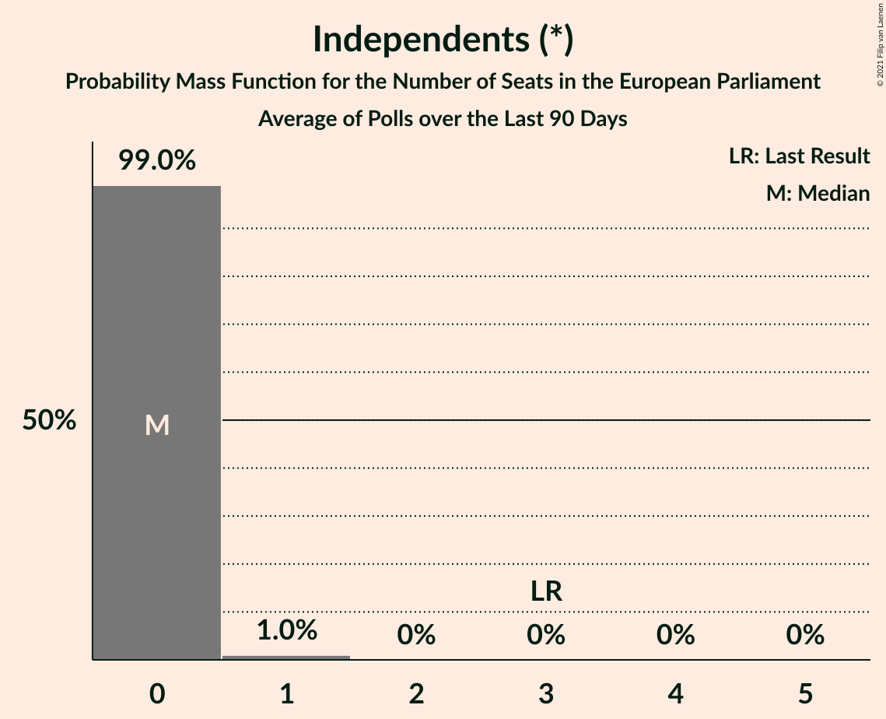
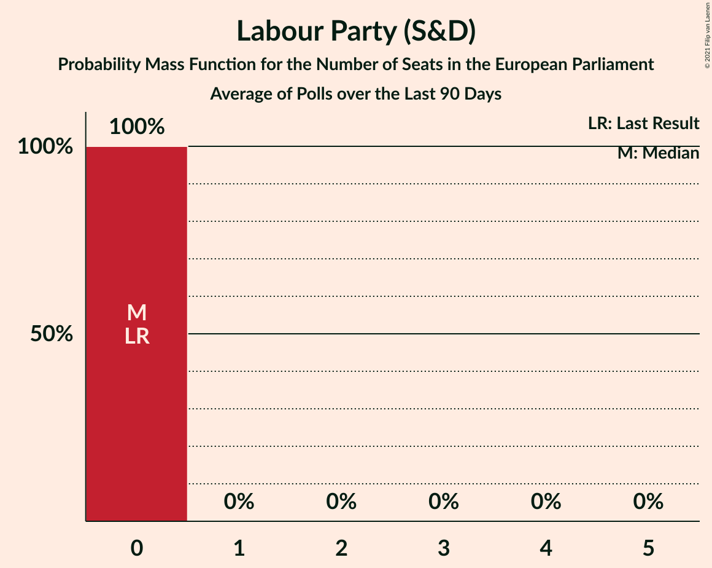
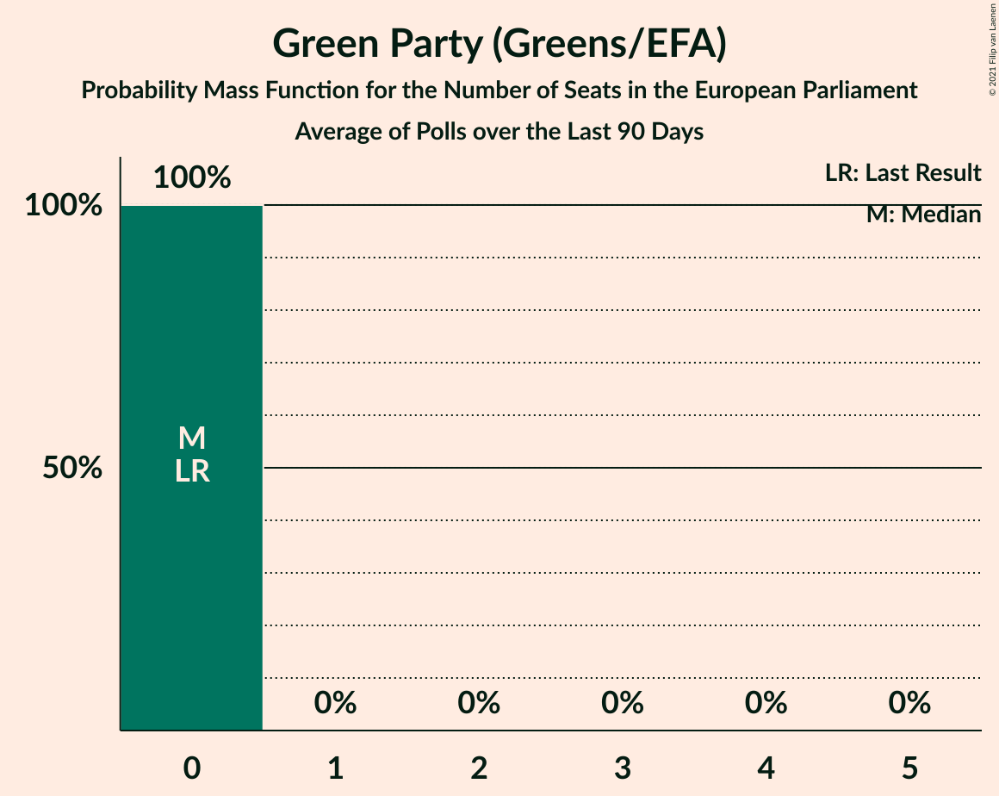
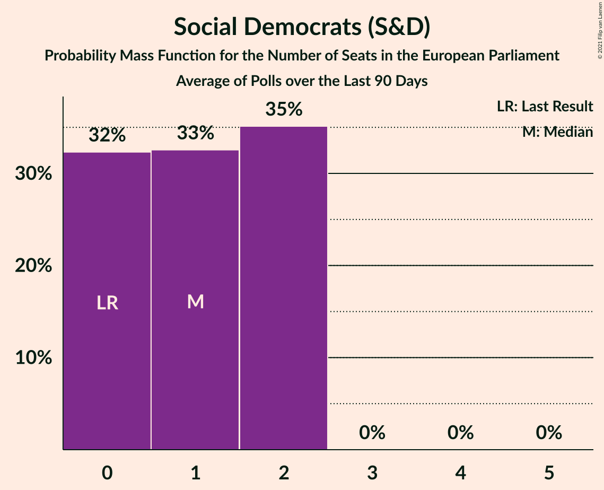
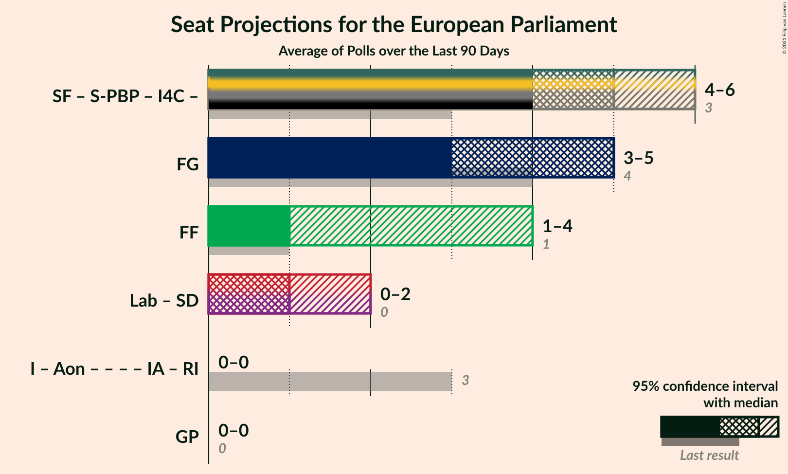
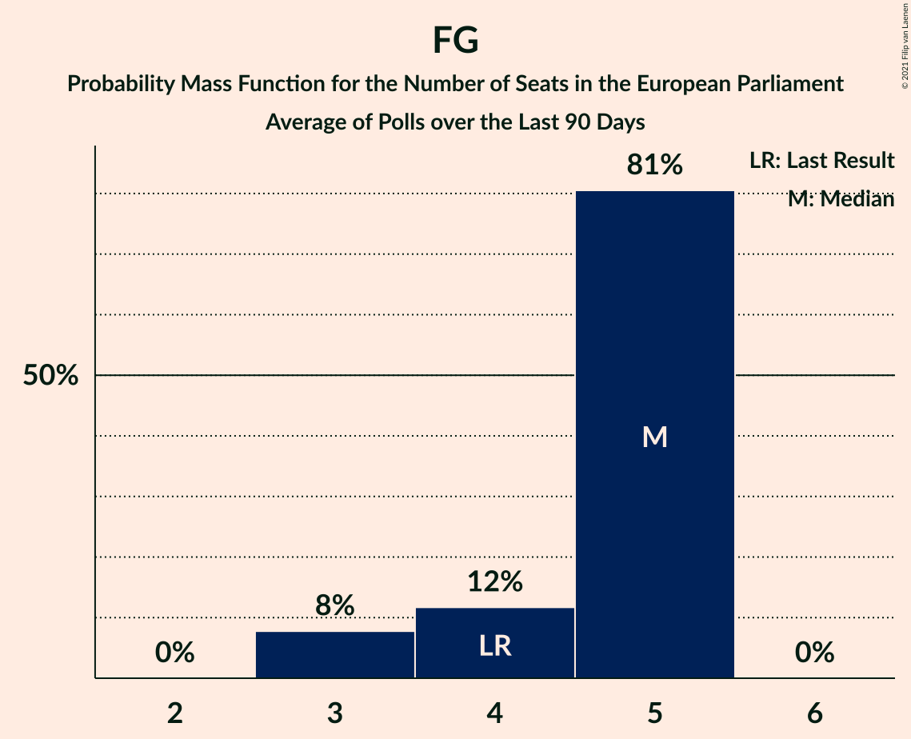
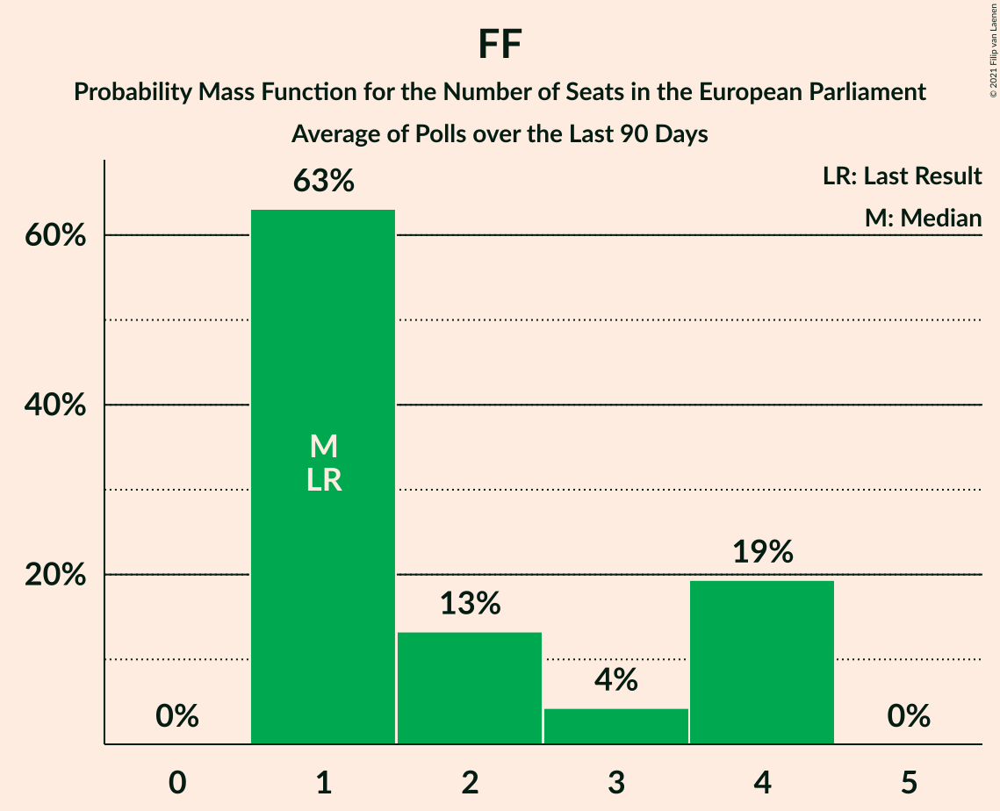
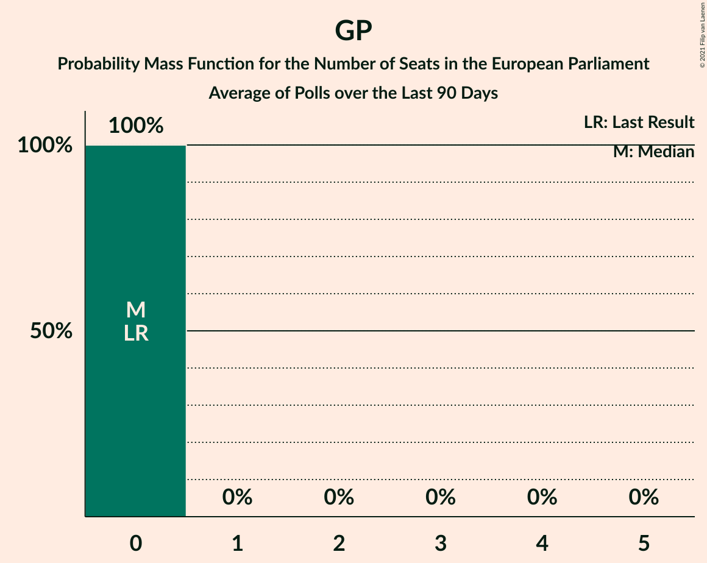

# Poll Average

<a href="#voting-intentions">Voting Intentions</a> | <a href="#seats">Seats</a> | <a href="#coalitions">Coalitions</a> | <a href="#technical-information">Technical Information</a>

## Summary

The table below lists the polls on which the average is based. They are the most recent polls (less than 90 days old) registered and analyzed so far.

| Period     | Polling firm/Commissioner(s) | FG | FF | I | SF | Lab | S-PBP | GP | IA | RI | SD | I4C | Aon |
|:----------:|:----------------------------:|:--:|:--:|:--:|:--:|:--:|:--:|:--:|:--:|:--:|:--:|:--:|:--:|
| 24 May 2019 | General Election | 22.3%   4 | 22.3%   1 | 19.8%   3 | 19.5%   3 | 5.3%   0 | 1.5%   0 | 4.9%   0 | 0.0%   0 | 0.0%   0 | 0.0%   0 | 0.0%   0 | 0.0%   0 |
| N/A | Poll Average | 23–31%   3–5 | 12–24%   1–4 | 4–8%   0 | 27–33%   4–6 | 2–5%   0 | 1–4%   0 | 2–6%   0 | N/A   N/A | N/A   N/A | 1–8%   0–2 | 2–4%   0 | 1–5%   0 |
| [21–27 May 2021](2021-05-27-RedC.html) | Red C   Business Post | 26–32%   5 | 12–16%   1–2 | 5–8%   0 | 26–32%   5–6 | 2–4%   0 | 2–4%   0 | 4–7%   0 | N/A   N/A | N/A   N/A | 4–7%   1–2 | 2–4%   0 | 1–3%   0 |
| [4–18 May 2021](2021-05-18-BehaviourandAttitudes.html) | Behaviour and Attitudes   The Sunday Times | 25–31%   3–5 | 19–25%   2–4 | 4–7%   0 | 27–33%   4–6 | 3–6%   0 | 1–2%   0 | 4–7%   0 | N/A   N/A | N/A   N/A | 1–3%   0–1 | 2–4%   0 | N/A   N/A |
| [15 May 2021](2021-05-15-IrelandThinks.html) | Ireland Thinks   Irish Mail on Sunday | 23–27%   5 | 13–17%   1 | 5–7%   0 | 27–33%   5–6 | 3–5%   0 | 2–4%   0 | 2–4%   0 | N/A   N/A | N/A   N/A | 6–9%   1–2 | 2–4%   0 | 3–5%   0 |
| 24 May 2019 | General Election | 22.3%   4 | 22.3%   1 | 19.8%   3 | 19.5%   3 | 5.3%   0 | 1.5%   0 | 4.9%   0 | 0.0%   0 | 0.0%   0 | 0.0%   0 | 0.0%   0 | 0.0%   0 |

Only polls for which at least the sample size has been published are included in the table above.

**Legend:**
+ **Top half of each row:** Voting intentions (95% confidence interval)
+ **Bottom half of each row:** Seat projections for the European Parliament (95% confidence interval)
+ **FG:** Fine Gael (EPP)
+ **FF:** Fianna Fáil (RE)
+ **I:** Independents (*)
+ **SF:** Sinn Féin (GUE/NGL)
+ **Lab:** Labour Party (S&D)
+ **S-PBP:** Solidarity–People Before Profit (GUE/NGL)
+ **GP:** Green Party (Greens/EFA)
+ **IA:** Independent Alliance (*)
+ **RI:** Renua Ireland (*)
+ **SD:** Social Democrats (S&D)
+ **I4C:** Independents 4 Change (GUE/NGL)
+ **Aon:** Aontú (*)
+ **N/A (single party):** Party not included the published results
+ **N/A (entire row):** Calculation for this opinion poll not started yet

## Voting Intentions

### Confidence Intervals

| Party | Last Result | Median | 80% Confidence Interval | 90% Confidence Interval | 95% Confidence Interval | 99% Confidence Interval |
|:-----:|:-----------:|:------:|:-----------------------:|:-----------------------:|:-----------------------:|:-----------------------:|
| <a href="#fine-gael-(epp)">Fine Gael (EPP)</a> | 22.3% | 27.6% | 24.3–30.1% |23.7–30.8% | 23.3–31.3% | 22.4–32.3% |
| <a href="#fianna-fáil-(re)">Fianna Fáil (RE)</a> | 22.3% | 15.4% | 13.4–22.7% |12.9–23.5% | 12.5–24.0% | 11.8–25.1% |
| <a href="#independents-(*)">Independents (*)</a> | 19.8% | 6.0% | 4.9–7.3% |4.5–7.6% | 4.3–7.9% | 3.9–8.6% |
| <a href="#sinn-féin-(gue/ngl)">Sinn Féin (GUE/NGL)</a> | 19.5% | 29.7% | 27.8–31.6% |27.3–32.2% | 26.8–32.6% | 25.9–33.6% |
| <a href="#labour-party-(s&d)">Labour Party (S&D)</a> | 5.3% | 3.8% | 2.8–4.7% |2.5–5.0% | 2.4–5.3% | 2.0–5.8% |
| <a href="#green-party-(greens/efa)">Green Party (Greens/EFA)</a> | 4.9% | 4.6% | 2.8–5.9% |2.6–6.2% | 2.4–6.4% | 2.1–7.0% |
| <a href="#solidarity–people-before-profit-(gue/ngl)">Solidarity–People Before Profit (GUE/NGL)</a> | 1.5% | 2.7% | 0.9–3.6% |0.7–3.8% | 0.6–4.0% | 0.5–4.5% |
| <a href="#independent-alliance-(*)">Independent Alliance (*)</a> | 0.0% | N/A | N/A |N/A | N/A | N/A |
| <a href="#renua-ireland-(*)">Renua Ireland (*)</a> | 0.0% | N/A | N/A |N/A | N/A | N/A |
| <a href="#social-democrats-(s&d)">Social Democrats (S&D)</a> | 0.0% | 5.1% | 1.8–7.5% |1.6–7.9% | 1.4–8.2% | 1.2–8.8% |
| <a href="#independents-4-change-(gue/ngl)">Independents 4 Change (GUE/NGL)</a> | 0.0% | 2.9% | 2.2–3.7% |2.0–3.9% | 1.9–4.1% | 1.6–4.5% |
| <a href="#aontú-(*)">Aontú (*)</a> | 0.0% | 3.0% | 1.7–4.5% |1.6–4.8% | 1.4–5.0% | 1.2–5.4% |

### Fine Gael (EPP)

*For a full overview of the results for this party, see the [Fine Gael (EPP)](party-finegaelepp.html) page.*

| Voting Intentions | Probability | Accumulated | Special Marks |
|:-----------------:|:-----------:|:-----------:|:-------------:|
| 20.5–21.5% | 0.1% | 100% |  |
| 21.5–22.5% | 0.6% | 99.9% | Last Result |
| 22.5–23.5% | 3% | 99.3% |  |
| 23.5–24.5% | 8% | 96% |  |
| 24.5–25.5% | 12% | 88% |  |
| 25.5–26.5% | 12% | 76% |  |
| 26.5–27.5% | 14% | 64% |  |
| 27.5–28.5% | 17% | 50% | Median |
| 28.5–29.5% | 16% | 34% |  |
| 29.5–30.5% | 11% | 17% |  |
| 30.5–31.5% | 5% | 6% |  |
| 31.5–32.5% | 1.4% | 2% |  |
| 32.5–33.5% | 0.3% | 0.3% |  |
| 33.5–34.5% | 0% | 0% |  |

### Fianna Fáil (RE)

*For a full overview of the results for this party, see the [Fianna Fáil (RE)](party-fiannafáilre.html) page.*

| Voting Intentions | Probability | Accumulated | Special Marks |
|:-----------------:|:-----------:|:-----------:|:-------------:|
| 9.5–10.5% | 0% | 100% |  |
| 10.5–11.5% | 0.2% | 100% |  |
| 11.5–12.5% | 2% | 99.8% |  |
| 12.5–13.5% | 10% | 97% |  |
| 13.5–14.5% | 20% | 88% |  |
| 14.5–15.5% | 20% | 67% | Median |
| 15.5–16.5% | 11% | 47% |  |
| 16.5–17.5% | 3% | 36% |  |
| 17.5–18.5% | 0.5% | 34% |  |
| 18.5–19.5% | 0.9% | 33% |  |
| 19.5–20.5% | 3% | 32% |  |
| 20.5–21.5% | 8% | 29% |  |
| 21.5–22.5% | 10% | 21% | Last Result |
| 22.5–23.5% | 7% | 12% |  |
| 23.5–24.5% | 3% | 5% |  |
| 24.5–25.5% | 1.0% | 1.2% |  |
| 25.5–26.5% | 0.2% | 0.2% |  |
| 26.5–27.5% | 0% | 0% |  |

### Independents (*)

*For a full overview of the results for this party, see the [Independents (*)](party-independents.html) page.*

| Voting Intentions | Probability | Accumulated | Special Marks |
|:-----------------:|:-----------:|:-----------:|:-------------:|
| 1.5–2.5% | 0% | 100% |  |
| 2.5–3.5% | 0.1% | 100% |  |
| 3.5–4.5% | 5% | 99.9% |  |
| 4.5–5.5% | 25% | 95% |  |
| 5.5–6.5% | 41% | 70% | Median |
| 6.5–7.5% | 23% | 29% |  |
| 7.5–8.5% | 5% | 6% |  |
| 8.5–9.5% | 0.5% | 0.5% |  |
| 9.5–10.5% | 0% | 0% |  |
| 10.5–11.5% | 0% | 0% |  |
| 11.5–12.5% | 0% | 0% |  |
| 12.5–13.5% | 0% | 0% |  |
| 13.5–14.5% | 0% | 0% |  |
| 14.5–15.5% | 0% | 0% |  |
| 15.5–16.5% | 0% | 0% |  |
| 16.5–17.5% | 0% | 0% |  |
| 17.5–18.5% | 0% | 0% |  |
| 18.5–19.5% | 0% | 0% |  |
| 19.5–20.5% | 0% | 0% | Last Result |

### Sinn Féin (GUE/NGL)

*For a full overview of the results for this party, see the [Sinn Féin (GUE/NGL)](party-sinnféinguengl.html) page.*

| Voting Intentions | Probability | Accumulated | Special Marks |
|:-----------------:|:-----------:|:-----------:|:-------------:|
| 19.5–20.5% | 0% | 100% | Last Result |
| 20.5–21.5% | 0% | 100% |  |
| 21.5–22.5% | 0% | 100% |  |
| 22.5–23.5% | 0% | 100% |  |
| 23.5–24.5% | 0% | 100% |  |
| 24.5–25.5% | 0.2% | 100% |  |
| 25.5–26.5% | 1.4% | 99.8% |  |
| 26.5–27.5% | 6% | 98% |  |
| 27.5–28.5% | 14% | 93% |  |
| 28.5–29.5% | 24% | 78% |  |
| 29.5–30.5% | 26% | 54% | Median |
| 30.5–31.5% | 18% | 28% |  |
| 31.5–32.5% | 8% | 11% |  |
| 32.5–33.5% | 2% | 3% |  |
| 33.5–34.5% | 0.5% | 0.5% |  |
| 34.5–35.5% | 0.1% | 0.1% |  |
| 35.5–36.5% | 0% | 0% |  |

### Labour Party (S&D)

*For a full overview of the results for this party, see the [Labour Party (S&D)](party-labourpartysd.html) page.*

| Voting Intentions | Probability | Accumulated | Special Marks |
|:-----------------:|:-----------:|:-----------:|:-------------:|
| 0.5–1.5% | 0% | 100% |  |
| 1.5–2.5% | 5% | 100% |  |
| 2.5–3.5% | 34% | 95% |  |
| 3.5–4.5% | 46% | 60% | Median |
| 4.5–5.5% | 14% | 15% | Last Result |
| 5.5–6.5% | 1.0% | 1.0% |  |
| 6.5–7.5% | 0% | 0% |  |

### Green Party (Greens/EFA)

*For a full overview of the results for this party, see the [Green Party (Greens/EFA)](party-greenpartygreensefa.html) page.*

| Voting Intentions | Probability | Accumulated | Special Marks |
|:-----------------:|:-----------:|:-----------:|:-------------:|
| 0.5–1.5% | 0% | 100% |  |
| 1.5–2.5% | 5% | 100% |  |
| 2.5–3.5% | 24% | 95% |  |
| 3.5–4.5% | 19% | 72% |  |
| 4.5–5.5% | 35% | 52% | Last Result, Median |
| 5.5–6.5% | 16% | 18% |  |
| 6.5–7.5% | 2% | 2% |  |
| 7.5–8.5% | 0.1% | 0.1% |  |
| 8.5–9.5% | 0% | 0% |  |

### Solidarity–People Before Profit (GUE/NGL)

*For a full overview of the results for this party, see the [Solidarity–People Before Profit (GUE/NGL)](party-solidarity–peoplebeforeprofitguengl.html) page.*

| Voting Intentions | Probability | Accumulated | Special Marks |
|:-----------------:|:-----------:|:-----------:|:-------------:|
| 0.0–0.5% | 1.1% | 100% |  |
| 0.5–1.5% | 29% | 98.9% |  |
| 1.5–2.5% | 13% | 70% | Last Result |
| 2.5–3.5% | 45% | 57% | Median |
| 3.5–4.5% | 11% | 12% |  |
| 4.5–5.5% | 0.3% | 0.3% |  |
| 5.5–6.5% | 0% | 0% |  |

### Social Democrats (S&D)

*For a full overview of the results for this party, see the [Social Democrats (S&D)](party-socialdemocratssd.html) page.*

| Voting Intentions | Probability | Accumulated | Special Marks |
|:-----------------:|:-----------:|:-----------:|:-------------:|
| 0.0–0.5% | 0% | 100% | Last Result |
| 0.5–1.5% | 4% | 100% |  |
| 1.5–2.5% | 24% | 96% |  |
| 2.5–3.5% | 5% | 72% |  |
| 3.5–4.5% | 7% | 67% |  |
| 4.5–5.5% | 18% | 60% | Median |
| 5.5–6.5% | 15% | 41% |  |
| 6.5–7.5% | 18% | 26% |  |
| 7.5–8.5% | 8% | 9% |  |
| 8.5–9.5% | 0.9% | 0.9% |  |
| 9.5–10.5% | 0% | 0% |  |

### Aontú (*)

*For a full overview of the results for this party, see the [Aontú (*)](party-aontú.html) page.*

| Voting Intentions | Probability | Accumulated | Special Marks |
|:-----------------:|:-----------:|:-----------:|:-------------:|
| 0.0–0.5% | 0% | 100% | Last Result |
| 0.5–1.5% | 5% | 100% |  |
| 1.5–2.5% | 37% | 95% |  |
| 2.5–3.5% | 18% | 58% | Median |
| 3.5–4.5% | 32% | 40% |  |
| 4.5–5.5% | 8% | 9% |  |
| 5.5–6.5% | 0.3% | 0.3% |  |
| 6.5–7.5% | 0% | 0% |  |

### Independents 4 Change (GUE/NGL)

*For a full overview of the results for this party, see the [Independents 4 Change (GUE/NGL)](party-independents4changeguengl.html) page.*

| Voting Intentions | Probability | Accumulated | Special Marks |
|:-----------------:|:-----------:|:-----------:|:-------------:|
| 0.0–0.5% | 0% | 100% | Last Result |
| 0.5–1.5% | 0.4% | 100% |  |
| 1.5–2.5% | 27% | 99.6% |  |
| 2.5–3.5% | 60% | 73% | Median |
| 3.5–4.5% | 12% | 13% |  |
| 4.5–5.5% | 0.4% | 0.4% |  |
| 5.5–6.5% | 0% | 0% |  |

## Seats

### Confidence Intervals

| Party | Last Result | Median | 80% Confidence Interval | 90% Confidence Interval | 95% Confidence Interval | 99% Confidence Interval |
|:-----:|:-----------:|:------:|:-----------------------:|:-----------------------:|:-----------------------:|:-----------------------:|
| <a href="#fine-gael-(epp)">Fine Gael (EPP)</a> | 4 | 5 | 4–5 |3–5 | 3–5 | 3–5 |
| <a href="#fianna-fáil-(re)">Fianna Fáil (RE)</a> | 1 | 1 | 1–4 |1–4 | 1–4 | 1–4 |
| <a href="#independents-(*)">Independents (*)</a> | 3 | 0 | 0 |0 | 0 | 0–1 |
| <a href="#sinn-féin-(gue/ngl)">Sinn Féin (GUE/NGL)</a> | 3 | 5 | 5–6 |5–6 | 4–6 | 4–6 |
| <a href="#labour-party-(s&d)">Labour Party (S&D)</a> | 0 | 0 | 0 |0 | 0 | 0 |
| <a href="#green-party-(greens/efa)">Green Party (Greens/EFA)</a> | 0 | 0 | 0 |0 | 0 | 0 |
| <a href="#solidarity–people-before-profit-(gue/ngl)">Solidarity–People Before Profit (GUE/NGL)</a> | 0 | 0 | 0 |0 | 0 | 0 |
| <a href="#independent-alliance-(*)">Independent Alliance (*)</a> | 0 | N/A | N/A |N/A | N/A | N/A |
| <a href="#renua-ireland-(*)">Renua Ireland (*)</a> | 0 | N/A | N/A |N/A | N/A | N/A |
| <a href="#social-democrats-(s&d)">Social Democrats (S&D)</a> | 0 | 1 | 0–2 |0–2 | 0–2 | 0–2 |
| <a href="#independents-4-change-(gue/ngl)">Independents 4 Change (GUE/NGL)</a> | 0 | 0 | 0 |0 | 0 | 0 |
| <a href="#aontú-(*)">Aontú (*)</a> | 0 | 0 | 0 |0 | 0 | 0 |

### Fine Gael (EPP)

*For a full overview of the results for this party, see the [Fine Gael (EPP)](party-finegaelepp.html) page.*

| Number of Seats | Probability | Accumulated | Special Marks |
|:---------------:|:-----------:|:-----------:|:-------------:|
| 3 | 8% | 100% |  |
| 4 | 12% | 92% | Last Result |
| 5 | 81% | 81% | Median |
| 6 | 0% | 0% |  |

### Fianna Fáil (RE)

*For a full overview of the results for this party, see the [Fianna Fáil (RE)](party-fiannafáilre.html) page.*

| Number of Seats | Probability | Accumulated | Special Marks |
|:---------------:|:-----------:|:-----------:|:-------------:|
| 1 | 63% | 100% | Last Result, Median |
| 2 | 13% | 37% |  |
| 3 | 4% | 24% |  |
| 4 | 19% | 19% |  |
| 5 | 0% | 0% |  |

### Independents (*)

*For a full overview of the results for this party, see the [Independents (*)](party-independents.html) page.*

| Number of Seats | Probability | Accumulated | Special Marks |
|:---------------:|:-----------:|:-----------:|:-------------:|
| 0 | 99.0% | 100% | Median |
| 1 | 1.0% | 1.0% |  |
| 2 | 0% | 0% |  |
| 3 | 0% | 0% | Last Result |

### Sinn Féin (GUE/NGL)

*For a full overview of the results for this party, see the [Sinn Féin (GUE/NGL)](party-sinnféinguengl.html) page.*

| Number of Seats | Probability | Accumulated | Special Marks |
|:---------------:|:-----------:|:-----------:|:-------------:|
| 3 | 0.4% | 100% | Last Result |
| 4 | 4% | 99.6% |  |
| 5 | 47% | 95% | Median |
| 6 | 49% | 49% |  |
| 7 | 0% | 0% | Majority |

### Labour Party (S&D)

*For a full overview of the results for this party, see the [Labour Party (S&D)](party-labourpartysd.html) page.*

| Number of Seats | Probability | Accumulated | Special Marks |
|:---------------:|:-----------:|:-----------:|:-------------:|
| 0 | 100% | 100% | Last Result, Median |

### Green Party (Greens/EFA)

*For a full overview of the results for this party, see the [Green Party (Greens/EFA)](party-greenpartygreensefa.html) page.*

| Number of Seats | Probability | Accumulated | Special Marks |
|:---------------:|:-----------:|:-----------:|:-------------:|
| 0 | 100% | 100% | Last Result, Median |

### Solidarity–People Before Profit (GUE/NGL)

*For a full overview of the results for this party, see the [Solidarity–People Before Profit (GUE/NGL)](party-solidarity–peoplebeforeprofitguengl.html) page.*

| Number of Seats | Probability | Accumulated | Special Marks |
|:---------------:|:-----------:|:-----------:|:-------------:|
| 0 | 100% | 100% | Last Result, Median |

### Independent Alliance (*)

*For a full overview of the results for this party, see the [Independent Alliance (*)](party-independentalliance.html) page.*

### Renua Ireland (*)

*For a full overview of the results for this party, see the [Renua Ireland (*)](party-renuaireland.html) page.*

### Social Democrats (S&D)

*For a full overview of the results for this party, see the [Social Democrats (S&D)](party-socialdemocratssd.html) page.*

| Number of Seats | Probability | Accumulated | Special Marks |
|:---------------:|:-----------:|:-----------:|:-------------:|
| 0 | 32% | 100% | Last Result |
| 1 | 33% | 68% | Median |
| 2 | 35% | 35% |  |
| 3 | 0% | 0% |  |

### Independents 4 Change (GUE/NGL)

*For a full overview of the results for this party, see the [Independents 4 Change (GUE/NGL)](party-independents4changeguengl.html) page.*

| Number of Seats | Probability | Accumulated | Special Marks |
|:---------------:|:-----------:|:-----------:|:-------------:|
| 0 | 100% | 100% | Last Result, Median |

### Aontú (*)

*For a full overview of the results for this party, see the [Aontú (*)](party-aontú.html) page.*

| Number of Seats | Probability | Accumulated | Special Marks |
|:---------------:|:-----------:|:-----------:|:-------------:|
| 0 | 100% | 100% | Last Result, Median |

## Coalitions

### Confidence Intervals

| Coalition | Last Result | Median | Majority? | 80% Confidence Interval | 90% Confidence Interval | 95% Confidence Interval | 99% Confidence Interval |
|:---------:|:-----------:|:------:|:---------:|:-----------------------:|:-----------------------:|:-----------------------:|:-----------------------:|
| Fine Gael (EPP) | 4 | 5 | 0% | 4–5 | 3–5 | 3–5 | 3–5 |
| Fianna Fáil (RE) | 1 | 1 | 0% | 1–4 | 1–4 | 1–4 | 1–4 |
| Labour Party (S&D) – Social Democrats (S&D) | 0 | 1 | 0% | 0–2 | 0–2 | 0–2 | 0–2 |
| Green Party (Greens/EFA) | 0 | 0 | 0% | 0 | 0 | 0 | 0 |

### Fine Gael (EPP)

| Number of Seats | Probability | Accumulated | Special Marks |
|:---------------:|:-----------:|:-----------:|:-------------:|
| 3 | 8% | 100% |  |
| 4 | 12% | 92% | Last Result |
| 5 | 81% | 81% | Median |
| 6 | 0% | 0% |  |

### Fianna Fáil (RE)

| Number of Seats | Probability | Accumulated | Special Marks |
|:---------------:|:-----------:|:-----------:|:-------------:|
| 1 | 63% | 100% | Last Result, Median |
| 2 | 13% | 37% |  |
| 3 | 4% | 24% |  |
| 4 | 19% | 19% |  |
| 5 | 0% | 0% |  |

### Labour Party (S&D) – Social Democrats (S&D)

| Number of Seats | Probability | Accumulated | Special Marks |
|:---------------:|:-----------:|:-----------:|:-------------:|
| 0 | 32% | 100% | Last Result |
| 1 | 33% | 68% | Median |
| 2 | 35% | 35% |  |
| 3 | 0% | 0% |  |

### Green Party (Greens/EFA)

| Number of Seats | Probability | Accumulated | Special Marks |
|:---------------:|:-----------:|:-----------:|:-------------:|
| 0 | 100% | 100% | Last Result, Median |

## Technical Information

+ **Number of polls included in this average:** 3
+ **Lowest number of simulations done in a poll included in this average:** 1,048,576
+ **Total number of simulations done in the polls included in this average:** 3,145,728
+ **Error estimate:** 2.73%
