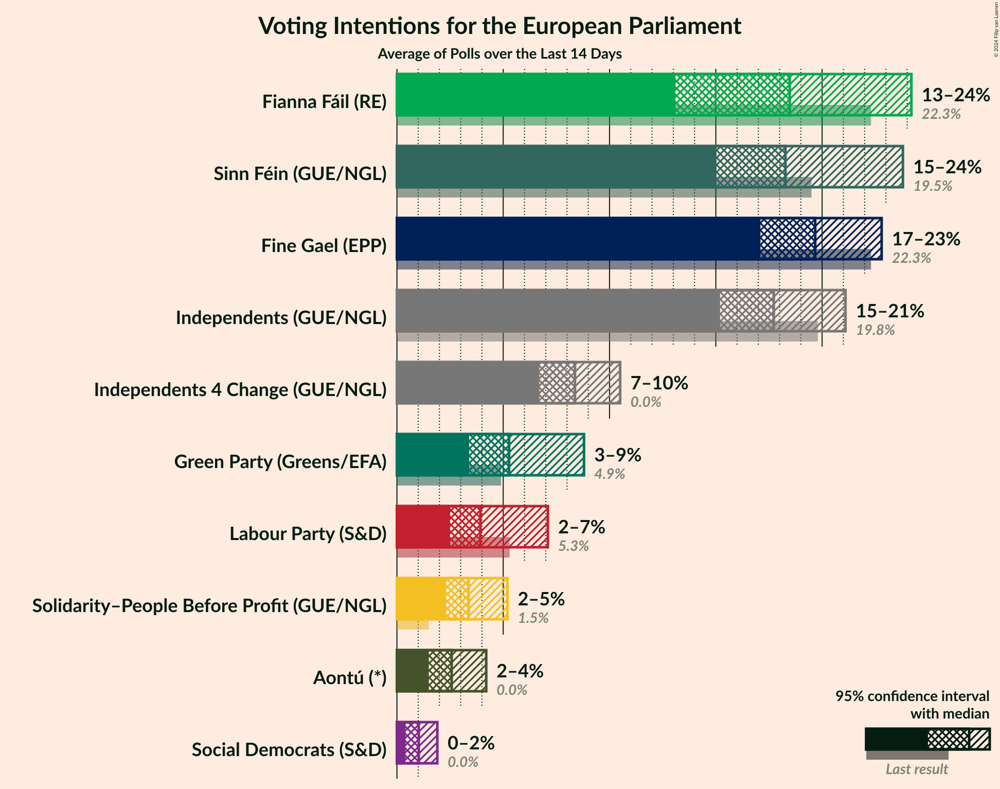
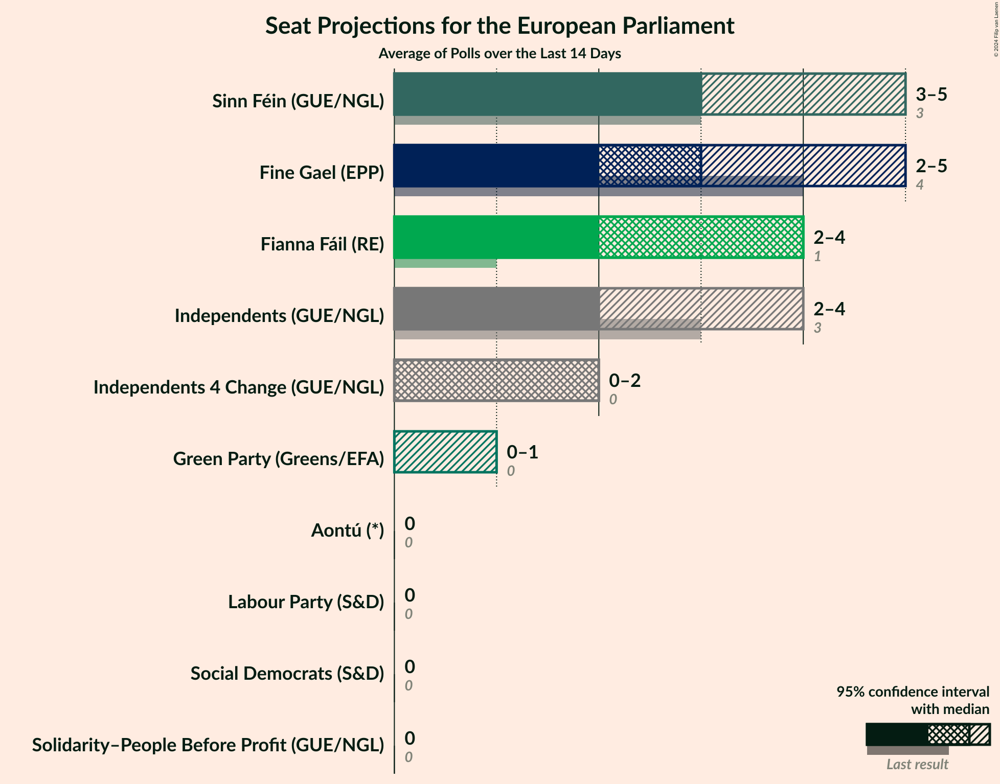
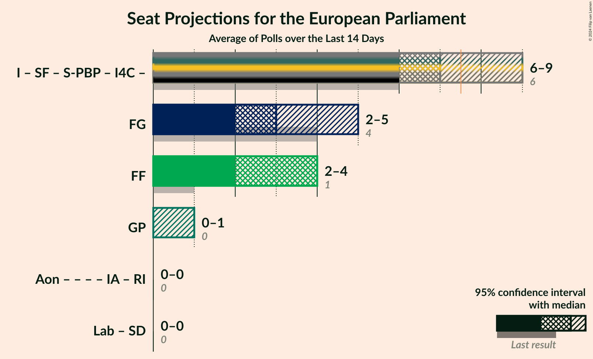

# Overview

The table below lists the most recent polls (less than 14 days old) registered and analyzed so far.

| Period     | Polling firm/Commissioner(s) | FG | FF | I | SF | Lab | S-PBP | GP | IA | RI | SD | I4C | Aon |
|:----------:|:----------------------------:|:--:|:--:|:--:|:--:|:--:|:--:|:--:|:--:|:--:|:--:|:--:|:--:|
| 24 May 2019 | General Election | 22.3%   4 | 22.3%   1 | 19.8%   3 | 19.5%   3 | 5.3%   0 | 1.5%   0 | 4.9%   0 | 0.0%   0 | 0.0%   0 | 0.0%   0 | 0.0%   0 | 0.0%   0 |
| N/A | [Poll Average](average.html) | 17–23%   2–5 | 13–24%   2–4 | 15–21%   2–4 | 15–24%   3–5 | 2–7%   0 | 2–5%   0 | 3–9%   0–1 | N/A   N/A | N/A   N/A | 0–2%   0 | 7–10%   0–2 | 2–4%   0 |
| [27 May 2024](2024-05-27-IrelandThinks.html) | Ireland Thinks   The Journal | 17–21%   2–3 | 16–21%   2–4 | 17–22%   2–4 | 16–21%   3 | 3–5%   0 | 2–4%   0 | 6–9%   0–1 | N/A   N/A | N/A   N/A | 1–2%   0 | 8–11%   1–2 | N/A   N/A |
| [17–22 May 2024](2024-05-22-RedC.html) | Red C   Business Post | 18–23%   3–5 | 12–17%   1–4 | 15–20%   2–4 | 19–25%   3–6 | 2–4%   0 | 3–6%   0 | 4–7%   0 | N/A   N/A | N/A   N/A | 1–2%   0 | 7–10%   0–2 | 2–4%   0 |
| [11–15 May 2024](2024-05-15-IpsosBA.html) | Ipsos B&A   Irish Times | 17–22%   3–4 | 20–25%   4 | 15–19%   2 | 15–18%   3 | 5–7%   0–1 | 2–4%   0 | 3–5%   0 | N/A   N/A | N/A   N/A | 0–1%   0 | 7–9%   0–2 | 1–3%   0 |
| 24 May 2019 | General Election | 22.3%   4 | 22.3%   1 | 19.8%   3 | 19.5%   3 | 5.3%   0 | 1.5%   0 | 4.9%   0 | 0.0%   0 | 0.0%   0 | 0.0%   0 | 0.0%   0 | 0.0%   0 |

Only polls for which at least the sample size has been published are included in the table above.

**Legend:**
+ **Top half of each row:** Voting intentions (95% confidence interval)
+ **Bottom half of each row:** Seat projections for the European Parliament (95% confidence interval)
+ **FG:** Fine Gael (EPP)
+ **FF:** Fianna Fáil (RE)
+ **I:** Independents (GUE/NGL)
+ **SF:** Sinn Féin (GUE/NGL)
+ **Lab:** Labour Party (S&D)
+ **S-PBP:** Solidarity–People Before Profit (GUE/NGL)
+ **GP:** Green Party (Greens/EFA)
+ **IA:** Independent Alliance (*)
+ **RI:** Renua Ireland (*)
+ **SD:** Social Democrats (S&D)
+ **I4C:** Independents 4 Change (GUE/NGL)
+ **Aon:** Aontú (*)
+ **N/A (single party):** Party not included the published results
+ **N/A (entire row):** Calculation for this opinion poll not started yet

