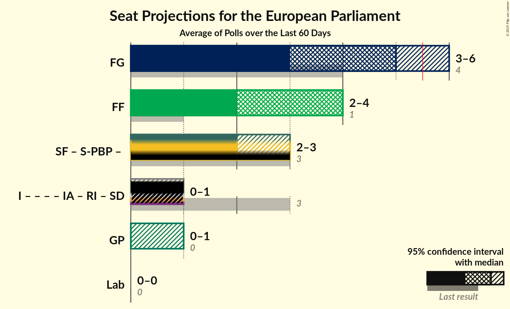
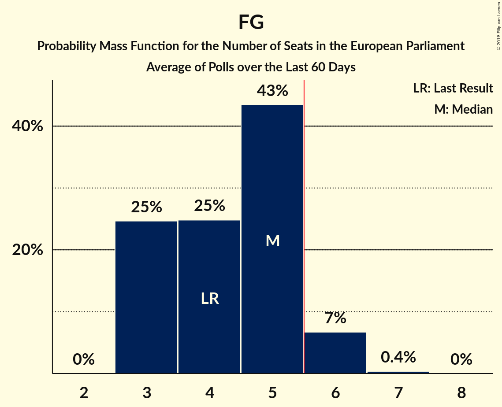

# Poll Average

<a href="#voting-intentions">Voting Intentions</a> | <a href="#seats">Seats</a> | <a href="#coalitions">Coalitions</a> | <a href="#technical-information">Technical Information</a>

## Summary

The table below lists the polls on which the average is based. They are the most recent polls (less than 60 days old) registered and analyzed so far.

| Period     | Polling firm/Commissioner(s) | FG | FF | I | SF | Lab | S-PBP | GP | IA | RI | SD |
|:----------:|:----------------------------:|:--:|:--:|:--:|:--:|:--:|:--:|:--:|:--:|:--:|:--:|
| 23 May 2014 | General Election | 22.3%   4 | 22.3%   1 | 19.8%   3 | 19.5%   3 | 5.3%   0 | 1.5%   0 | 4.9%   0 | 0.0%   0 | 0.0%   0 | 0.0%   0 |
| N/A | Poll Average | 26–42%   3–6 | 23–33%   2–4 | 0–10%   0–1 | 15–23%   2–3 | 3–9%   0 | 0–2%   0 | 1–8%   0–1 | 0–15%   0–1 | 0–1%   0 | 0–4%   0 |
| [1–22 May 2019](2019-05-22-IrelandThinks.html) | Ireland Thinks   The Irish Daily Mail | 25–30%   3–4 | 23–27%   2–3 | 0–1%   0 | 14–18%   1–3 | 5–7%   0 | 1–3%   0 | 6–8%   1 | 12–16%   1–2 | N/A   N/A | 2–4%   0 |
| [6–8 May 2019](2019-05-08-IpsosMRBI.html) | Ipsos MRBI   The Irish Times | 32–37%   5 | 29–34%   4 | 0–1%   0 | 17–21%   2 | 7–10%   0 | 0–1%   0 | 4–6%   0 | 0–1%   0 | 0–1%   0 | 0–1%   0 |
| [11–17 April 2019](2019-04-17-RedC.html) | Red C   The Sunday Business Post | 37–43%   5–6 | 23–28%   2–4 | 0–1%   0 | 17–22%   2–3 | 4–6%   0 | 0–1%   0 | 4–6%   0–1 | 2–4%   0 | 0–1%   0 | 1–2%   0 |
| [4–16 April 2019](2019-04-16-BehaviourandAttitudes.html) | Behaviour and Attitudes   The Sunday Times | 25–31%   3–4 | 26–32%   4 | 7–10%   0–1 | 19–24%   2–3 | 3–6%   0 | 1–2%   0 | 1–2%   0 | 3–6%   0 | 0–1%   0 | 1–2%   0 |
| 23 May 2014 | General Election | 22.3%   4 | 22.3%   1 | 19.8%   3 | 19.5%   3 | 5.3%   0 | 1.5%   0 | 4.9%   0 | 0.0%   0 | 0.0%   0 | 0.0%   0 |

Only polls for which at least the sample size has been published are included in the table above.

**Legend:**
+ **Top half of each row:** Voting intentions (95% confidence interval)
+ **Bottom half of each row:** Seat projections for the European Parliament (95% confidence interval)
+ **FG:** Fine Gael (EPP)
+ **FF:** Fianna Fáil (ALDE)
+ **I:** Independents (*)
+ **SF:** Sinn Féin (GUE/NGL)
+ **Lab:** Labour Party (S&D)
+ **S-PBP:** Solidarity–People Before Profit (GUE/NGL)
+ **GP:** Green Party (Greens/EFA)
+ **IA:** Independent Alliance (*)
+ **RI:** Renua Ireland (*)
+ **SD:** Social Democrats (*)
+ **N/A (single party):** Party not included the published results
+ **N/A (entire row):** Calculation for this opinion poll not started yet

## Voting Intentions

### Confidence Intervals

| Party | Last Result | Median | 80% Confidence Interval | 90% Confidence Interval | 95% Confidence Interval | 99% Confidence Interval |
|:-----:|:-----------:|:------:|:-----------------------:|:-----------------------:|:-----------------------:|:-----------------------:|
| <a href="#fine-gael-(epp)">Fine Gael (EPP)</a> | 22.3% | 31.8% | 26.8–40.6% |26.2–41.5% | 25.8–42.2% | 25.0–43.4% |
| <a href="#fianna-fáil-(alde)">Fianna Fáil (ALDE)</a> | 22.3% | 27.4% | 24.0–31.6% |23.5–32.3% | 23.1–32.8% | 22.3–33.7% |
| <a href="#independents-(*)">Independents (*)</a> | 19.8% | 0.4% | 0.2–8.5% |0.1–9.1% | 0.1–9.5% | 0.1–10.3% |
| <a href="#sinn-féin-(gue/ngl)">Sinn Féin (GUE/NGL)</a> | 19.5% | 19.2% | 15.5–21.7% |15.0–22.4% | 14.6–22.9% | 14.0–24.0% |
| <a href="#labour-party-(s&d)">Labour Party (S&D)</a> | 5.3% | 5.5% | 3.9–8.6% |3.6–9.0% | 3.3–9.4% | 2.9–10.0% |
| <a href="#green-party-(greens/efa)">Green Party (Greens/EFA)</a> | 4.9% | 4.9% | 1.0–7.1% |0.8–7.5% | 0.7–7.8% | 0.5–8.3% |
| <a href="#solidarity–people-before-profit-(gue/ngl)">Solidarity–People Before Profit (GUE/NGL)</a> | 1.5% | 0.7% | 0.2–2.1% |0.2–2.3% | 0.1–2.5% | 0.1–2.8% |
| <a href="#independent-alliance-(*)">Independent Alliance (*)</a> | 0.0% | 3.3% | 0.3–14.0% |0.2–14.5% | 0.2–14.9% | 0.1–15.6% |
| <a href="#renua-ireland-(*)">Renua Ireland (*)</a> | 0.0% | 0.3% | 0.1–0.6% |0.1–0.7% | 0.1–0.8% | 0.1–1.0% |
| <a href="#social-democrats-(*)">Social Democrats (*)</a> | 0.0% | 1.2% | 0.3–3.1% |0.2–3.4% | 0.2–3.6% | 0.1–4.0% |

### Fine Gael (EPP)

*For a full overview of the results for this party, see the [Fine Gael (EPP)](party-finegaelepp.html) page.*

| Voting Intentions | Probability | Accumulated | Special Marks |
|:-----------------:|:-----------:|:-----------:|:-------------:|
| 21.5–22.5% | 0% | 100% | Last Result |
| 22.5–23.5% | 0% | 100% |  |
| 23.5–24.5% | 0.2% | 100% |  |
| 24.5–25.5% | 1.4% | 99.8% |  |
| 25.5–26.5% | 6% | 98% |  |
| 26.5–27.5% | 13% | 92% |  |
| 27.5–28.5% | 14% | 80% |  |
| 28.5–29.5% | 10% | 65% |  |
| 29.5–30.5% | 4% | 56% |  |
| 30.5–31.5% | 1.4% | 52% |  |
| 31.5–32.5% | 1.1% | 50% | Median |
| 32.5–33.5% | 3% | 49% |  |
| 33.5–34.5% | 7% | 46% |  |
| 34.5–35.5% | 8% | 39% |  |
| 35.5–36.5% | 5% | 31% |  |
| 36.5–37.5% | 2% | 27% |  |
| 37.5–38.5% | 3% | 24% |  |
| 38.5–39.5% | 5% | 22% |  |
| 39.5–40.5% | 6% | 17% |  |
| 40.5–41.5% | 6% | 10% |  |
| 41.5–42.5% | 3% | 5% |  |
| 42.5–43.5% | 1.3% | 2% |  |
| 43.5–44.5% | 0.3% | 0.4% |  |
| 44.5–45.5% | 0.1% | 0.1% |  |
| 45.5–46.5% | 0% | 0% |  |

### Fianna Fáil (ALDE)

*For a full overview of the results for this party, see the [Fianna Fáil (ALDE)](party-fiannafáilalde.html) page.*

| Voting Intentions | Probability | Accumulated | Special Marks |
|:-----------------:|:-----------:|:-----------:|:-------------:|
| 20.5–21.5% | 0.1% | 100% |  |
| 21.5–22.5% | 0.8% | 99.9% | Last Result |
| 22.5–23.5% | 5% | 99.1% |  |
| 23.5–24.5% | 12% | 95% |  |
| 24.5–25.5% | 15% | 83% |  |
| 25.5–26.5% | 11% | 68% |  |
| 26.5–27.5% | 7% | 57% | Median |
| 27.5–28.5% | 7% | 49% |  |
| 28.5–29.5% | 9% | 42% |  |
| 29.5–30.5% | 11% | 34% |  |
| 30.5–31.5% | 12% | 22% |  |
| 31.5–32.5% | 7% | 11% |  |
| 32.5–33.5% | 3% | 3% |  |
| 33.5–34.5% | 0.6% | 0.7% |  |
| 34.5–35.5% | 0.1% | 0.1% |  |
| 35.5–36.5% | 0% | 0% |  |

### Independents (*)

*For a full overview of the results for this party, see the [Independents (*)](party-independents.html) page.*

| Voting Intentions | Probability | Accumulated | Special Marks |
|:-----------------:|:-----------:|:-----------:|:-------------:|
| 0.0–0.5% | 66% | 100% | Median |
| 0.5–1.5% | 9% | 34% |  |
| 1.5–2.5% | 0% | 25% |  |
| 2.5–3.5% | 0% | 25% |  |
| 3.5–4.5% | 0% | 25% |  |
| 4.5–5.5% | 0% | 25% |  |
| 5.5–6.5% | 0.4% | 25% |  |
| 6.5–7.5% | 4% | 25% |  |
| 7.5–8.5% | 10% | 20% |  |
| 8.5–9.5% | 8% | 10% |  |
| 9.5–10.5% | 2% | 2% |  |
| 10.5–11.5% | 0.3% | 0.3% |  |
| 11.5–12.5% | 0% | 0% |  |
| 12.5–13.5% | 0% | 0% |  |
| 13.5–14.5% | 0% | 0% |  |
| 14.5–15.5% | 0% | 0% |  |
| 15.5–16.5% | 0% | 0% |  |
| 16.5–17.5% | 0% | 0% |  |
| 17.5–18.5% | 0% | 0% |  |
| 18.5–19.5% | 0% | 0% |  |
| 19.5–20.5% | 0% | 0% | Last Result |

### Sinn Féin (GUE/NGL)

*For a full overview of the results for this party, see the [Sinn Féin (GUE/NGL)](party-sinnféinguengl.html) page.*

| Voting Intentions | Probability | Accumulated | Special Marks |
|:-----------------:|:-----------:|:-----------:|:-------------:|
| 11.5–12.5% | 0% | 100% |  |
| 12.5–13.5% | 0.1% | 100% |  |
| 13.5–14.5% | 2% | 99.9% |  |
| 14.5–15.5% | 8% | 98% |  |
| 15.5–16.5% | 10% | 90% |  |
| 16.5–17.5% | 7% | 80% |  |
| 17.5–18.5% | 11% | 73% |  |
| 18.5–19.5% | 19% | 62% | Median |
| 19.5–20.5% | 19% | 43% | Last Result |
| 20.5–21.5% | 13% | 25% |  |
| 21.5–22.5% | 7% | 11% |  |
| 22.5–23.5% | 3% | 4% |  |
| 23.5–24.5% | 0.9% | 1.0% |  |
| 24.5–25.5% | 0.2% | 0.2% |  |
| 25.5–26.5% | 0% | 0% |  |

### Labour Party (S&D)

*For a full overview of the results for this party, see the [Labour Party (S&D)](party-labourpartysd.html) page.*

| Voting Intentions | Probability | Accumulated | Special Marks |
|:-----------------:|:-----------:|:-----------:|:-------------:|
| 1.5–2.5% | 0.1% | 100% |  |
| 2.5–3.5% | 5% | 99.9% |  |
| 3.5–4.5% | 21% | 95% |  |
| 4.5–5.5% | 25% | 75% | Last Result |
| 5.5–6.5% | 20% | 50% | Median |
| 6.5–7.5% | 7% | 29% |  |
| 7.5–8.5% | 12% | 23% |  |
| 8.5–9.5% | 9% | 11% |  |
| 9.5–10.5% | 2% | 2% |  |
| 10.5–11.5% | 0.1% | 0.1% |  |
| 11.5–12.5% | 0% | 0% |  |

### Green Party (Greens/EFA)

*For a full overview of the results for this party, see the [Green Party (Greens/EFA)](party-greenpartygreensefa.html) page.*

| Voting Intentions | Probability | Accumulated | Special Marks |
|:-----------------:|:-----------:|:-----------:|:-------------:|
| 0.0–0.5% | 0.9% | 100% |  |
| 0.5–1.5% | 22% | 99.1% |  |
| 1.5–2.5% | 2% | 77% |  |
| 2.5–3.5% | 0.4% | 75% |  |
| 3.5–4.5% | 14% | 75% |  |
| 4.5–5.5% | 28% | 61% | Last Result, Median |
| 5.5–6.5% | 14% | 33% |  |
| 6.5–7.5% | 14% | 19% |  |
| 7.5–8.5% | 4% | 5% |  |
| 8.5–9.5% | 0.2% | 0.2% |  |
| 9.5–10.5% | 0% | 0% |  |

### Solidarity–People Before Profit (GUE/NGL)

*For a full overview of the results for this party, see the [Solidarity–People Before Profit (GUE/NGL)](party-solidarity–peoplebeforeprofitguengl.html) page.*

| Voting Intentions | Probability | Accumulated | Special Marks |
|:-----------------:|:-----------:|:-----------:|:-------------:|
| 0.0–0.5% | 44% | 100% |  |
| 0.5–1.5% | 31% | 56% | Median |
| 1.5–2.5% | 23% | 25% | Last Result |
| 2.5–3.5% | 2% | 2% |  |
| 3.5–4.5% | 0% | 0% |  |

### Social Democrats (*)

*For a full overview of the results for this party, see the [Social Democrats (*)](party-socialdemocrats.html) page.*

| Voting Intentions | Probability | Accumulated | Special Marks |
|:-----------------:|:-----------:|:-----------:|:-------------:|
| 0.0–0.5% | 24% | 100% | Last Result |
| 0.5–1.5% | 43% | 76% | Median |
| 1.5–2.5% | 11% | 33% |  |
| 2.5–3.5% | 19% | 22% |  |
| 3.5–4.5% | 3% | 3% |  |
| 4.5–5.5% | 0% | 0% |  |

### Independent Alliance (*)

*For a full overview of the results for this party, see the [Independent Alliance (*)](party-independentalliance.html) page.*

| Voting Intentions | Probability | Accumulated | Special Marks |
|:-----------------:|:-----------:|:-----------:|:-------------:|
| 0.0–0.5% | 23% | 100% | Last Result |
| 0.5–1.5% | 3% | 77% |  |
| 1.5–2.5% | 14% | 75% |  |
| 2.5–3.5% | 14% | 61% | Median |
| 3.5–4.5% | 15% | 46% |  |
| 4.5–5.5% | 6% | 32% |  |
| 5.5–6.5% | 0.6% | 26% |  |
| 6.5–7.5% | 0% | 25% |  |
| 7.5–8.5% | 0% | 25% |  |
| 8.5–9.5% | 0% | 25% |  |
| 9.5–10.5% | 0% | 25% |  |
| 10.5–11.5% | 0.1% | 25% |  |
| 11.5–12.5% | 2% | 25% |  |
| 12.5–13.5% | 8% | 23% |  |
| 13.5–14.5% | 11% | 16% |  |
| 14.5–15.5% | 4% | 5% |  |
| 15.5–16.5% | 0.6% | 0.7% |  |
| 16.5–17.5% | 0% | 0% |  |

### Renua Ireland (*)

*For a full overview of the results for this party, see the [Renua Ireland (*)](party-renuaireland.html) page.*

| Voting Intentions | Probability | Accumulated | Special Marks |
|:-----------------:|:-----------:|:-----------:|:-------------:|
| 0.0–0.5% | 87% | 100% | Last Result, Median |
| 0.5–1.5% | 13% | 13% |  |
| 1.5–2.5% | 0% | 0% |  |

## Seats

### Confidence Intervals

| Party | Last Result | Median | 80% Confidence Interval | 90% Confidence Interval | 95% Confidence Interval | 99% Confidence Interval |
|:-----:|:-----------:|:------:|:-----------------------:|:-----------------------:|:-----------------------:|:-----------------------:|
| <a href="#fine-gael-(epp)">Fine Gael (EPP)</a> | 4 | 5 | 3–5 |3–6 | 3–6 | 3–6 |
| <a href="#fianna-fáil-(alde)">Fianna Fáil (ALDE)</a> | 1 | 4 | 2–4 |2–4 | 2–4 | 2–4 |
| <a href="#independents-(*)">Independents (*)</a> | 3 | 0 | 0–1 |0–1 | 0–1 | 0–1 |
| <a href="#sinn-féin-(gue/ngl)">Sinn Féin (GUE/NGL)</a> | 3 | 2 | 2–3 |2–3 | 2–3 | 1–3 |
| <a href="#labour-party-(s&d)">Labour Party (S&D)</a> | 0 | 0 | 0 |0 | 0 | 0 |
| <a href="#green-party-(greens/efa)">Green Party (Greens/EFA)</a> | 0 | 0 | 0–1 |0–1 | 0–1 | 0–1 |
| <a href="#solidarity–people-before-profit-(gue/ngl)">Solidarity–People Before Profit (GUE/NGL)</a> | 0 | 0 | 0 |0 | 0 | 0 |
| <a href="#independent-alliance-(*)">Independent Alliance (*)</a> | 0 | 0 | 0–1 |0–1 | 0–1 | 0–2 |
| <a href="#renua-ireland-(*)">Renua Ireland (*)</a> | 0 | 0 | 0 |0 | 0 | 0 |
| <a href="#social-democrats-(*)">Social Democrats (*)</a> | 0 | 0 | 0 |0 | 0 | 0 |

### Fine Gael (EPP)

*For a full overview of the results for this party, see the [Fine Gael (EPP)](party-finegaelepp.html) page.*

| Number of Seats | Probability | Accumulated | Special Marks |
|:---------------:|:-----------:|:-----------:|:-------------:|
| 3 | 25% | 100% |  |
| 4 | 25% | 75% | Last Result |
| 5 | 43% | 51% | Median |
| 6 | 7% | 7% | Majority |
| 7 | 0.4% | 0.4% |  |
| 8 | 0% | 0% |  |

### Fianna Fáil (ALDE)

*For a full overview of the results for this party, see the [Fianna Fáil (ALDE)](party-fiannafáilalde.html) page.*

| Number of Seats | Probability | Accumulated | Special Marks |
|:---------------:|:-----------:|:-----------:|:-------------:|
| 1 | 0% | 100% | Last Result |
| 2 | 10% | 100% |  |
| 3 | 32% | 90% |  |
| 4 | 58% | 58% | Median |
| 5 | 0.2% | 0.2% |  |
| 6 | 0% | 0% | Majority |

### Independents (*)

*For a full overview of the results for this party, see the [Independents (*)](party-independents.html) page.*

| Number of Seats | Probability | Accumulated | Special Marks |
|:---------------:|:-----------:|:-----------:|:-------------:|
| 0 | 77% | 100% | Median |
| 1 | 23% | 23% |  |
| 2 | 0% | 0% |  |
| 3 | 0% | 0% | Last Result |

### Sinn Féin (GUE/NGL)

*For a full overview of the results for this party, see the [Sinn Féin (GUE/NGL)](party-sinnféinguengl.html) page.*

| Number of Seats | Probability | Accumulated | Special Marks |
|:---------------:|:-----------:|:-----------:|:-------------:|
| 1 | 2% | 100% |  |
| 2 | 54% | 98% | Median |
| 3 | 43% | 43% | Last Result |
| 4 | 0.2% | 0.2% |  |
| 5 | 0% | 0% |  |

### Labour Party (S&D)

*For a full overview of the results for this party, see the [Labour Party (S&D)](party-labourpartysd.html) page.*

| Number of Seats | Probability | Accumulated | Special Marks |
|:---------------:|:-----------:|:-----------:|:-------------:|
| 0 | 100% | 100% | Last Result, Median |

### Green Party (Greens/EFA)

*For a full overview of the results for this party, see the [Green Party (Greens/EFA)](party-greenpartygreensefa.html) page.*

| Number of Seats | Probability | Accumulated | Special Marks |
|:---------------:|:-----------:|:-----------:|:-------------:|
| 0 | 72% | 100% | Last Result, Median |
| 1 | 28% | 28% |  |
| 2 | 0% | 0% |  |

### Solidarity–People Before Profit (GUE/NGL)

*For a full overview of the results for this party, see the [Solidarity–People Before Profit (GUE/NGL)](party-solidarity–peoplebeforeprofitguengl.html) page.*

| Number of Seats | Probability | Accumulated | Special Marks |
|:---------------:|:-----------:|:-----------:|:-------------:|
| 0 | 100% | 100% | Last Result, Median |

### Social Democrats (*)

*For a full overview of the results for this party, see the [Social Democrats (*)](party-socialdemocrats.html) page.*

| Number of Seats | Probability | Accumulated | Special Marks |
|:---------------:|:-----------:|:-----------:|:-------------:|
| 0 | 100% | 100% | Last Result, Median |

### Independent Alliance (*)

*For a full overview of the results for this party, see the [Independent Alliance (*)](party-independentalliance.html) page.*

| Number of Seats | Probability | Accumulated | Special Marks |
|:---------------:|:-----------:|:-----------:|:-------------:|
| 0 | 75% | 100% | Last Result, Median |
| 1 | 23% | 25% |  |
| 2 | 2% | 2% |  |
| 3 | 0% | 0% |  |

### Renua Ireland (*)

*For a full overview of the results for this party, see the [Renua Ireland (*)](party-renuaireland.html) page.*

| Number of Seats | Probability | Accumulated | Special Marks |
|:---------------:|:-----------:|:-----------:|:-------------:|
| 0 | 100% | 100% | Last Result, Median |

## Coalitions

### Confidence Intervals

| Coalition | Last Result | Median | Majority? | 80% Confidence Interval | 90% Confidence Interval | 95% Confidence Interval | 99% Confidence Interval |
|:---------:|:-----------:|:------:|:---------:|:-----------------------:|:-----------------------:|:-----------------------:|:-----------------------:|
| Fine Gael (EPP) | 4 | 5 | 7% | 3–5 | 3–6 | 3–6 | 3–6 |
| Fianna Fáil (ALDE) | 1 | 4 | 0% | 2–4 | 2–4 | 2–4 | 2–4 |
| Green Party (Greens/EFA) | 0 | 0 | 0% | 0–1 | 0–1 | 0–1 | 0–1 |
| Labour Party (S&D) | 0 | 0 | 0% | 0 | 0 | 0 | 0 |

### Fine Gael (EPP)

| Number of Seats | Probability | Accumulated | Special Marks |
|:---------------:|:-----------:|:-----------:|:-------------:|
| 3 | 25% | 100% |  |
| 4 | 25% | 75% | Last Result |
| 5 | 43% | 51% | Median |
| 6 | 7% | 7% | Majority |
| 7 | 0.4% | 0.4% |  |
| 8 | 0% | 0% |  |

### Fianna Fáil (ALDE)

| Number of Seats | Probability | Accumulated | Special Marks |
|:---------------:|:-----------:|:-----------:|:-------------:|
| 1 | 0% | 100% | Last Result |
| 2 | 10% | 100% |  |
| 3 | 32% | 90% |  |
| 4 | 58% | 58% | Median |
| 5 | 0.2% | 0.2% |  |
| 6 | 0% | 0% | Majority |

### Green Party (Greens/EFA)

| Number of Seats | Probability | Accumulated | Special Marks |
|:---------------:|:-----------:|:-----------:|:-------------:|
| 0 | 72% | 100% | Last Result, Median |
| 1 | 28% | 28% |  |
| 2 | 0% | 0% |  |

### Labour Party (S&D)

| Number of Seats | Probability | Accumulated | Special Marks |
|:---------------:|:-----------:|:-----------:|:-------------:|
| 0 | 100% | 100% | Last Result, Median |

## Technical Information

+ **Number of polls included in this average:** 4
+ **Lowest number of simulations done in a poll included in this average:** 1,048,576
+ **Total number of simulations done in the polls included in this average:** 4,194,304
+ **Error estimate:** 3.17%
