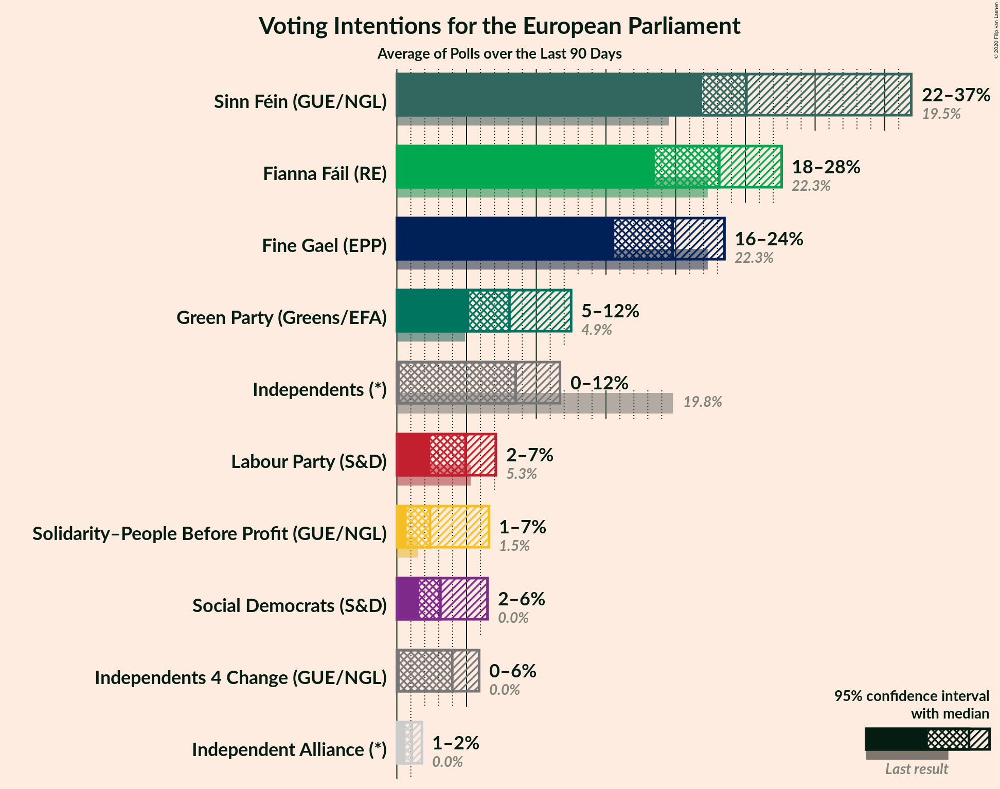
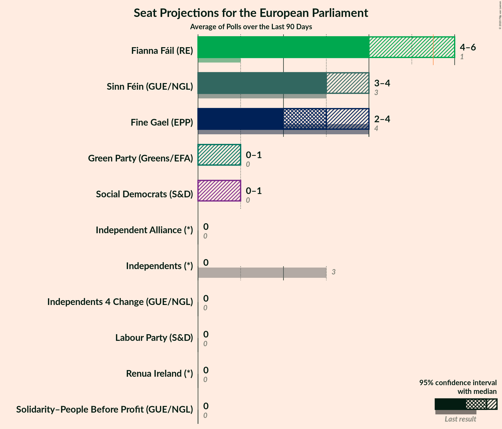
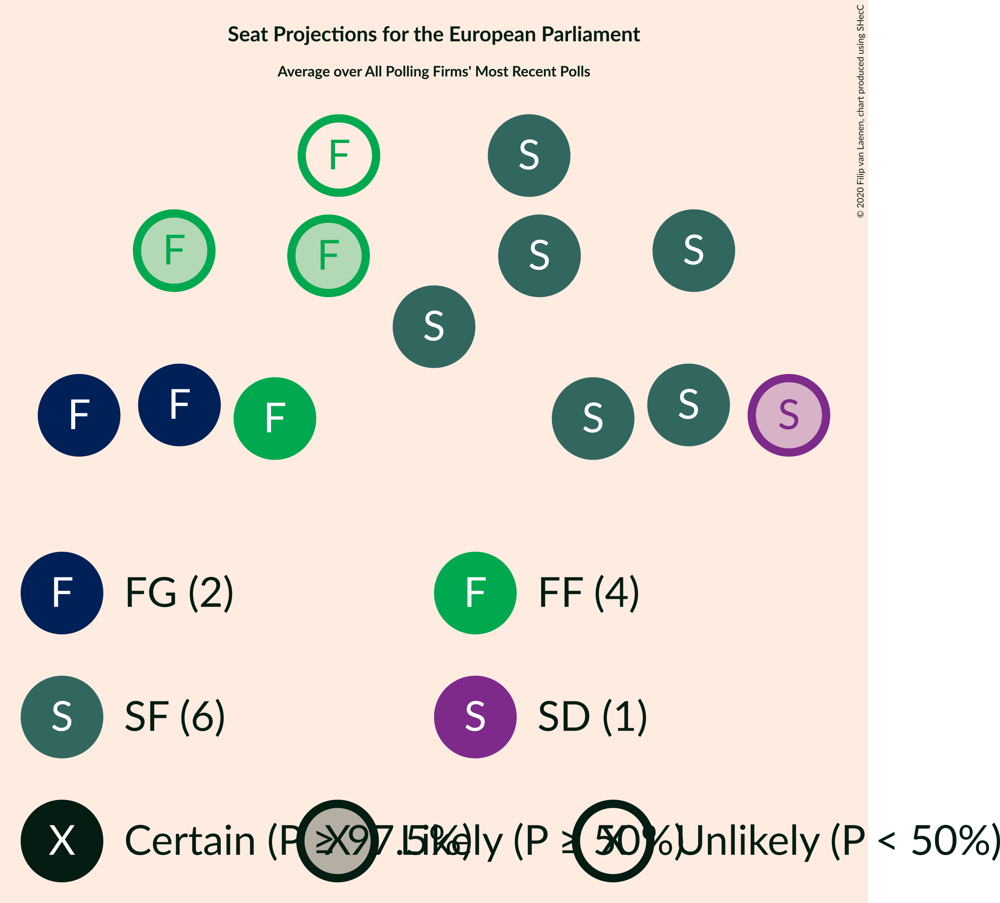

# Poll Average

<a href="#voting-intentions">Voting Intentions</a> | <a href="#seats">Seats</a> | <a href="#coalitions">Coalitions</a> | <a href="#technical-information">Technical Information</a>

## Summary

The table below lists the polls on which the average is based. They are the most recent polls (less than 90 days old) registered and analyzed so far.

| Period     | Polling firm/Commissioner(s) | FG | FF | I | SF | Lab | S-PBP | GP | IA | RI | SD | I4C |
|:----------:|:----------------------------:|:--:|:--:|:--:|:--:|:--:|:--:|:--:|:--:|:--:|:--:|:--:|
| 24 May 2019 | General Election | 22.3%   4 | 22.3%   1 | 19.8%   3 | 19.5%   3 | 5.3%   0 | 1.5%   0 | 4.9%   0 | 0.0%   0 | 0.0%   0 | 0.0%   0 | 0.0%   0 |
| N/A | Poll Average | 16–24%   2–4 | 20–28%   4–5 | 0–12%   0–1 | 22–27%   3–6 | 3–7%   0 | 1–7%   0 | 6–13%   0–2 | 1–2%   0 | N/A   N/A | 2–7%   0–1 | 0–6%   0 |
| [25 February 2020](2020-02-25-BehaviourandAttitudes.html) | Behaviour and Attitudes   The Sunday Times | N/A   N/A | N/A   N/A | N/A   N/A | N/A   N/A | N/A   N/A | N/A   N/A | N/A   N/A | N/A   N/A | N/A   N/A | N/A   N/A | N/A   N/A |
| [27 January–2 February 2020](2020-02-02-Survation.html) | Survation   Sinn Féin | 15–19%   2–3 | 20–25%   3–4 | 6–10%   0–1 | 23–28%   4–6 | 5–8%   0 | 4–7%   0 | 7–11%   0–1 | 1–2%   0 | N/A   N/A | 2–4%   0–1 | 3–5%   0 |
| [30 January–1 February 2020](2020-02-01-IpsosMRBI.html) | Ipsos MRBI   The Irish Times | 18–22%   3–4 | 21–25%   4 | 9–12%   1 | 23–28%   3–5 | 3–5%   0 | 1–3%   0 | 7–10%   0–1 | N/A   N/A | N/A   N/A | 1–3%   0–1 | 4–6%   0 |
| [25–30 January 2020](2020-01-30-RedC.html) | Red C   The Sunday Business Post | 19–24%   3–4 | 22–27%   4–5 | 7–11%   0–1 | 22–27%   3–6 | 4–7%   0 | 1–2%   0 | 6–9%   0–1 | N/A   N/A | N/A   N/A | 2–4%   0–1 | 3–6%   0 |
| [24–30 January 2020](2020-01-30-Panelbase.html) | Panelbase   The Times | 19–24%   2–5 | 23–29%   4–5 | 0–1%   0 | 21–26%   3–5 | 4–7%   0 | 4–7%   0 | 9–13%   0–2 | N/A   N/A | N/A   N/A | 4–7%   1–2 | 0–1%   0 |
| 24 May 2019 | General Election | 22.3%   4 | 22.3%   1 | 19.8%   3 | 19.5%   3 | 5.3%   0 | 1.5%   0 | 4.9%   0 | 0.0%   0 | 0.0%   0 | 0.0%   0 | 0.0%   0 |

Only polls for which at least the sample size has been published are included in the table above.

**Legend:**
+ **Top half of each row:** Voting intentions (95% confidence interval)
+ **Bottom half of each row:** Seat projections for the European Parliament (95% confidence interval)
+ **FG:** Fine Gael (EPP)
+ **FF:** Fianna Fáil (RE)
+ **I:** Independents (*)
+ **SF:** Sinn Féin (GUE/NGL)
+ **Lab:** Labour Party (S&D)
+ **S-PBP:** Solidarity–People Before Profit (GUE/NGL)
+ **GP:** Green Party (Greens/EFA)
+ **IA:** Independent Alliance (*)
+ **RI:** Renua Ireland (*)
+ **SD:** Social Democrats (S&D)
+ **I4C:** Independents 4 Change (GUE/NGL)
+ **N/A (single party):** Party not included the published results
+ **N/A (entire row):** Calculation for this opinion poll not started yet

## Voting Intentions

### Confidence Intervals

| Party | Last Result | Median | 80% Confidence Interval | 90% Confidence Interval | 95% Confidence Interval | 99% Confidence Interval |
|:-----:|:-----------:|:------:|:-----------------------:|:-----------------------:|:-----------------------:|:-----------------------:|
| <a href="#fine-gael-(epp)">Fine Gael (EPP)</a> | 22.3% | 20.4% | 16.8–22.6% |16.1–23.1% | 15.6–23.6% | 14.8–24.6% |
| <a href="#fianna-fáil-(re)">Fianna Fáil (RE)</a> | 22.3% | 23.8% | 21.4–26.6% |20.8–27.2% | 20.3–27.8% | 19.5–28.9% |
| <a href="#independents-(*)">Independents (*)</a> | 19.8% | 8.4% | 0.3–10.9% |0.2–11.4% | 0.2–11.8% | 0.1–12.6% |
| <a href="#sinn-féin-(gue/ngl)">Sinn Féin (GUE/NGL)</a> | 19.5% | 24.6% | 22.8–26.4% |22.3–26.9% | 21.8–27.4% | 20.9–28.3% |
| <a href="#labour-party-(s&d)">Labour Party (S&D)</a> | 5.3% | 5.3% | 3.9–6.5% |3.6–6.9% | 3.4–7.2% | 3.0–7.7% |
| <a href="#green-party-(greens/efa)">Green Party (Greens/EFA)</a> | 4.9% | 8.6% | 6.8–11.6% |6.5–12.2% | 6.1–12.7% | 5.6–13.5% |
| <a href="#solidarity–people-before-profit-(gue/ngl)">Solidarity–People Before Profit (GUE/NGL)</a> | 1.5% | 3.4% | 1.0–6.0% |0.8–6.4% | 0.7–6.7% | 0.5–7.3% |
| <a href="#independent-alliance-(*)">Independent Alliance (*)</a> | 0.0% | 1.1% | 0.7–1.5% |0.6–1.7% | 0.6–1.8% | 0.5–2.1% |
| <a href="#renua-ireland-(*)">Renua Ireland (*)</a> | 0.0% | N/A | N/A |N/A | N/A | N/A |
| <a href="#social-democrats-(s&d)">Social Democrats (S&D)</a> | 0.0% | 3.1% | 1.9–5.8% |1.7–6.3% | 1.6–6.6% | 1.3–7.3% |
| <a href="#independents-4-change-(gue/ngl)">Independents 4 Change (GUE/NGL)</a> | 0.0% | 3.9% | 0.3–5.3% |0.2–5.6% | 0.2–5.9% | 0.1–6.5% |

### Fine Gael (EPP)

*For a full overview of the results for this party, see the [Fine Gael (EPP)](party-finegaelepp.html) page.*

| Voting Intentions | Probability | Accumulated | Special Marks |
|:-----------------:|:-----------:|:-----------:|:-------------:|
| 12.5–13.5% | 0% | 100% |  |
| 13.5–14.5% | 0.3% | 100% |  |
| 14.5–15.5% | 2% | 99.7% |  |
| 15.5–16.5% | 6% | 98% |  |
| 16.5–17.5% | 9% | 92% |  |
| 17.5–18.5% | 9% | 83% |  |
| 18.5–19.5% | 11% | 75% |  |
| 19.5–20.5% | 17% | 64% | Median |
| 20.5–21.5% | 20% | 46% |  |
| 21.5–22.5% | 15% | 26% | Last Result |
| 22.5–23.5% | 7% | 10% |  |
| 23.5–24.5% | 2% | 3% |  |
| 24.5–25.5% | 0.4% | 0.5% |  |
| 25.5–26.5% | 0.1% | 0.1% |  |
| 26.5–27.5% | 0% | 0% |  |

### Fianna Fáil (RE)

*For a full overview of the results for this party, see the [Fianna Fáil (RE)](party-fiannafáilre.html) page.*

| Voting Intentions | Probability | Accumulated | Special Marks |
|:-----------------:|:-----------:|:-----------:|:-------------:|
| 17.5–18.5% | 0.1% | 100% |  |
| 18.5–19.5% | 0.6% | 99.9% |  |
| 19.5–20.5% | 3% | 99.4% |  |
| 20.5–21.5% | 9% | 97% |  |
| 21.5–22.5% | 15% | 88% | Last Result |
| 22.5–23.5% | 18% | 73% |  |
| 23.5–24.5% | 18% | 54% | Median |
| 24.5–25.5% | 15% | 37% |  |
| 25.5–26.5% | 12% | 22% |  |
| 26.5–27.5% | 7% | 10% |  |
| 27.5–28.5% | 3% | 3% |  |
| 28.5–29.5% | 0.7% | 0.9% |  |
| 29.5–30.5% | 0.1% | 0.1% |  |
| 30.5–31.5% | 0% | 0% |  |

### Independents (*)

*For a full overview of the results for this party, see the [Independents (*)](party-independents.html) page.*

| Voting Intentions | Probability | Accumulated | Special Marks |
|:-----------------:|:-----------:|:-----------:|:-------------:|
| 0.0–0.5% | 20% | 100% |  |
| 0.5–1.5% | 5% | 80% |  |
| 1.5–2.5% | 0% | 75% |  |
| 2.5–3.5% | 0% | 75% |  |
| 3.5–4.5% | 0% | 75% |  |
| 4.5–5.5% | 0% | 75% |  |
| 5.5–6.5% | 0.9% | 75% |  |
| 6.5–7.5% | 8% | 74% |  |
| 7.5–8.5% | 19% | 66% | Median |
| 8.5–9.5% | 18% | 47% |  |
| 9.5–10.5% | 14% | 29% |  |
| 10.5–11.5% | 10% | 14% |  |
| 11.5–12.5% | 3% | 4% |  |
| 12.5–13.5% | 0.5% | 0.5% |  |
| 13.5–14.5% | 0% | 0% |  |
| 14.5–15.5% | 0% | 0% |  |
| 15.5–16.5% | 0% | 0% |  |
| 16.5–17.5% | 0% | 0% |  |
| 17.5–18.5% | 0% | 0% |  |
| 18.5–19.5% | 0% | 0% |  |
| 19.5–20.5% | 0% | 0% | Last Result |

### Sinn Féin (GUE/NGL)

*For a full overview of the results for this party, see the [Sinn Féin (GUE/NGL)](party-sinnféinguengl.html) page.*

| Voting Intentions | Probability | Accumulated | Special Marks |
|:-----------------:|:-----------:|:-----------:|:-------------:|
| 18.5–19.5% | 0% | 100% |  |
| 19.5–20.5% | 0.2% | 100% | Last Result |
| 20.5–21.5% | 1.4% | 99.8% |  |
| 21.5–22.5% | 6% | 98% |  |
| 22.5–23.5% | 15% | 92% |  |
| 23.5–24.5% | 25% | 77% |  |
| 24.5–25.5% | 26% | 52% | Median |
| 25.5–26.5% | 17% | 26% |  |
| 26.5–27.5% | 7% | 9% |  |
| 27.5–28.5% | 2% | 2% |  |
| 28.5–29.5% | 0.2% | 0.3% |  |
| 29.5–30.5% | 0% | 0% |  |

### Labour Party (S&D)

*For a full overview of the results for this party, see the [Labour Party (S&D)](party-labourpartysd.html) page.*

| Voting Intentions | Probability | Accumulated | Special Marks |
|:-----------------:|:-----------:|:-----------:|:-------------:|
| 1.5–2.5% | 0% | 100% |  |
| 2.5–3.5% | 5% | 100% |  |
| 3.5–4.5% | 22% | 95% |  |
| 4.5–5.5% | 33% | 74% | Last Result, Median |
| 5.5–6.5% | 31% | 40% |  |
| 6.5–7.5% | 9% | 10% |  |
| 7.5–8.5% | 0.8% | 0.9% |  |
| 8.5–9.5% | 0% | 0% |  |

### Green Party (Greens/EFA)

*For a full overview of the results for this party, see the [Green Party (Greens/EFA)](party-greenpartygreensefa.html) page.*

| Voting Intentions | Probability | Accumulated | Special Marks |
|:-----------------:|:-----------:|:-----------:|:-------------:|
| 3.5–4.5% | 0% | 100% |  |
| 4.5–5.5% | 0.4% | 100% | Last Result |
| 5.5–6.5% | 6% | 99.6% |  |
| 6.5–7.5% | 18% | 94% |  |
| 7.5–8.5% | 25% | 76% |  |
| 8.5–9.5% | 19% | 51% | Median |
| 9.5–10.5% | 11% | 33% |  |
| 10.5–11.5% | 11% | 21% |  |
| 11.5–12.5% | 8% | 11% |  |
| 12.5–13.5% | 3% | 3% |  |
| 13.5–14.5% | 0.4% | 0.5% |  |
| 14.5–15.5% | 0% | 0% |  |

### Solidarity–People Before Profit (GUE/NGL)

*For a full overview of the results for this party, see the [Solidarity–People Before Profit (GUE/NGL)](party-solidarity–peoplebeforeprofitguengl.html) page.*

| Voting Intentions | Probability | Accumulated | Special Marks |
|:-----------------:|:-----------:|:-----------:|:-------------:|
| 0.0–0.5% | 0.6% | 100% |  |
| 0.5–1.5% | 24% | 99.4% |  |
| 1.5–2.5% | 22% | 75% | Last Result |
| 2.5–3.5% | 3% | 53% | Median |
| 3.5–4.5% | 6% | 50% |  |
| 4.5–5.5% | 23% | 43% |  |
| 5.5–6.5% | 17% | 20% |  |
| 6.5–7.5% | 3% | 4% |  |
| 7.5–8.5% | 0.2% | 0.2% |  |
| 8.5–9.5% | 0% | 0% |  |

### Social Democrats (S&D)

*For a full overview of the results for this party, see the [Social Democrats (S&D)](party-socialdemocratssd.html) page.*

| Voting Intentions | Probability | Accumulated | Special Marks |
|:-----------------:|:-----------:|:-----------:|:-------------:|
| 0.0–0.5% | 0% | 100% | Last Result |
| 0.5–1.5% | 2% | 100% |  |
| 1.5–2.5% | 26% | 98% |  |
| 2.5–3.5% | 36% | 71% | Median |
| 3.5–4.5% | 11% | 36% |  |
| 4.5–5.5% | 10% | 24% |  |
| 5.5–6.5% | 11% | 14% |  |
| 6.5–7.5% | 3% | 3% |  |
| 7.5–8.5% | 0.2% | 0.2% |  |
| 8.5–9.5% | 0% | 0% |  |

### Independent Alliance (*)

*For a full overview of the results for this party, see the [Independent Alliance (*)](party-independentalliance.html) page.*

| Voting Intentions | Probability | Accumulated | Special Marks |
|:-----------------:|:-----------:|:-----------:|:-------------:|
| 0.0–0.5% | 2% | 100% | Last Result |
| 0.5–1.5% | 89% | 98% | Median |
| 1.5–2.5% | 9% | 9% |  |
| 2.5–3.5% | 0% | 0% |  |

### Independents 4 Change (GUE/NGL)

*For a full overview of the results for this party, see the [Independents 4 Change (GUE/NGL)](party-independents4changeguengl.html) page.*

| Voting Intentions | Probability | Accumulated | Special Marks |
|:-----------------:|:-----------:|:-----------:|:-------------:|
| 0.0–0.5% | 20% | 100% | Last Result |
| 0.5–1.5% | 5% | 80% |  |
| 1.5–2.5% | 0.2% | 75% |  |
| 2.5–3.5% | 12% | 75% |  |
| 3.5–4.5% | 33% | 62% | Median |
| 4.5–5.5% | 23% | 29% |  |
| 5.5–6.5% | 6% | 6% |  |
| 6.5–7.5% | 0.4% | 0.4% |  |
| 7.5–8.5% | 0% | 0% |  |

## Seats

### Confidence Intervals

| Party | Last Result | Median | 80% Confidence Interval | 90% Confidence Interval | 95% Confidence Interval | 99% Confidence Interval |
|:-----:|:-----------:|:------:|:-----------------------:|:-----------------------:|:-----------------------:|:-----------------------:|
| <a href="#fine-gael-(epp)">Fine Gael (EPP)</a> | 4 | 3 | 2–4 |2–4 | 2–4 | 2–5 |
| <a href="#fianna-fáil-(re)">Fianna Fáil (RE)</a> | 1 | 4 | 4–5 |4–5 | 4–5 | 3–5 |
| <a href="#independents-(*)">Independents (*)</a> | 3 | 1 | 0–1 |0–1 | 0–1 | 0–1 |
| <a href="#sinn-féin-(gue/ngl)">Sinn Féin (GUE/NGL)</a> | 3 | 4 | 3–5 |3–5 | 3–6 | 3–6 |
| <a href="#labour-party-(s&d)">Labour Party (S&D)</a> | 0 | 0 | 0 |0 | 0 | 0 |
| <a href="#green-party-(greens/efa)">Green Party (Greens/EFA)</a> | 0 | 1 | 0–1 |0–1 | 0–2 | 0–2 |
| <a href="#solidarity–people-before-profit-(gue/ngl)">Solidarity–People Before Profit (GUE/NGL)</a> | 0 | 0 | 0 |0 | 0 | 0–1 |
| <a href="#independent-alliance-(*)">Independent Alliance (*)</a> | 0 | 0 | 0 |0 | 0 | 0 |
| <a href="#renua-ireland-(*)">Renua Ireland (*)</a> | 0 | N/A | N/A |N/A | N/A | N/A |
| <a href="#social-democrats-(s&d)">Social Democrats (S&D)</a> | 0 | 1 | 0–1 |0–1 | 0–1 | 0–2 |
| <a href="#independents-4-change-(gue/ngl)">Independents 4 Change (GUE/NGL)</a> | 0 | 0 | 0 |0 | 0 | 0 |

