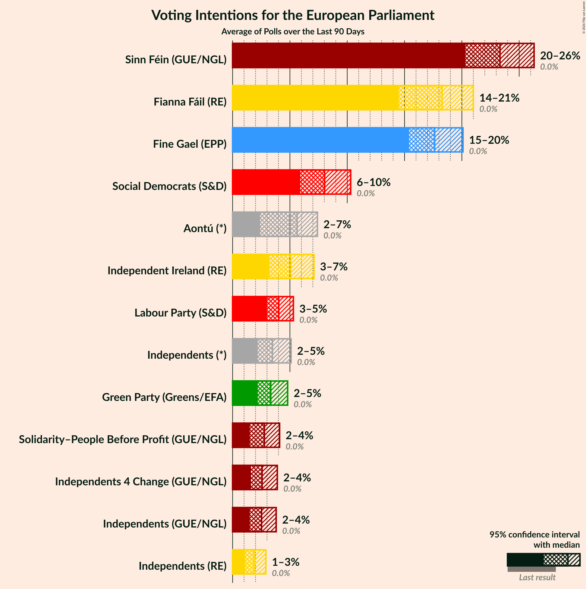
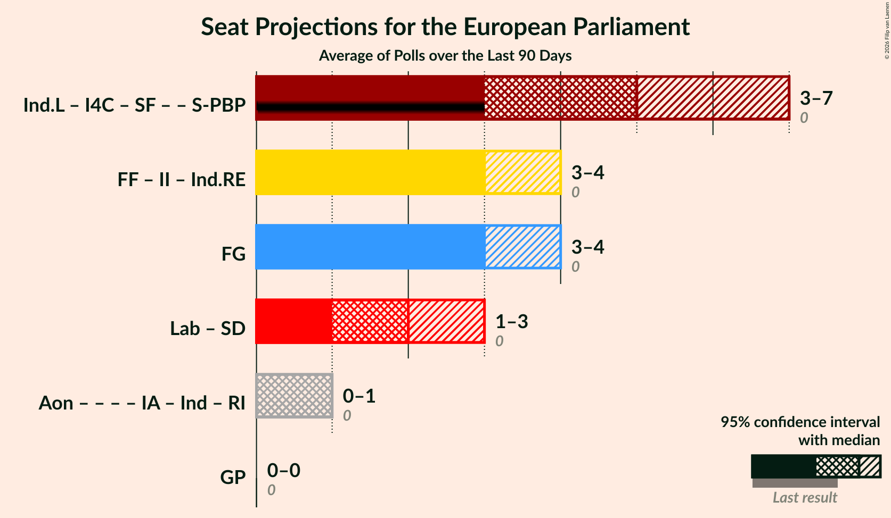

# Overview

The table below lists the most recent polls (less than 90 days old) registered and analyzed so far.

| Period     | Polling firm/Commissioner(s) | FG | FF | I | SF | Lab | S-PBP | GP | IA | RI | SD | I4C | Aon |
|:----------:|:----------------------------:|:--:|:--:|:--:|:--:|:--:|:--:|:--:|:--:|:--:|:--:|:--:|:--:|
| 24 May 2019 | General Election | 22.3%   4 | 22.3%   1 | 19.8%   3 | 19.5%   3 | 5.3%   0 | 1.5%   0 | 4.9%   0 | 0.0%   0 | 0.0%   0 | 0.0%   0 | 0.0%   0 | 0.0%   0 |
| N/A | [Poll Average](average.html) | 28–33%   4–5 | 10–16%   1–2 | 6–11%   0–1 | 26–32%   4–6 | 2–5%   0 | 1–3%   0 | 4–7%   0 | N/A   N/A | N/A   N/A | 2–6%   0–2 | 3–5%   0 | 1–3%   0 |
| [14–15 April 2021](2021-04-15-IrelandThinks.html) | Ireland Thinks   Irish Mail on Sunday | N/A   N/A | N/A   N/A | N/A   N/A | N/A   N/A | N/A   N/A | N/A   N/A | N/A   N/A | N/A   N/A | N/A   N/A | N/A   N/A | N/A   N/A | N/A   N/A |
| [19–25 March 2021](2021-03-25-RedC.html) | Red C   Business Post | 28–33%   5 | 9–13%   1 | 6–9%   0–1 | 27–32%   5–6 | 3–5%   0 | 1–3%   0 | 4–7%   0 | N/A   N/A | N/A   N/A | 4–7%   1–2 | 3–5%   0 | 1–3%   0 |
| [22–23 February 2021](2021-02-23-IpsosMRBI.html) | Ipsos MRBI   Irish Times | 27–33%   4–5 | 12–16%   1–2 | 8–11%   0–1 | 26–31%   4–6 | 2–4%   0 | 1–2%   0 | 5–7%   0 | N/A   N/A | N/A   N/A | 2–4%   0–1 | 3–6%   0 | 1–2%   0 |
| 24 May 2019 | General Election | 22.3%   4 | 22.3%   1 | 19.8%   3 | 19.5%   3 | 5.3%   0 | 1.5%   0 | 4.9%   0 | 0.0%   0 | 0.0%   0 | 0.0%   0 | 0.0%   0 | 0.0%   0 |

Only polls for which at least the sample size has been published are included in the table above.

**Legend:**
+ **Top half of each row:** Voting intentions (95% confidence interval)
+ **Bottom half of each row:** Seat projections for the European Parliament (95% confidence interval)
+ **FG:** Fine Gael (EPP)
+ **FF:** Fianna Fáil (RE)
+ **I:** Independents (*)
+ **SF:** Sinn Féin (GUE/NGL)
+ **Lab:** Labour Party (S&D)
+ **S-PBP:** Solidarity–People Before Profit (GUE/NGL)
+ **GP:** Green Party (Greens/EFA)
+ **IA:** Independent Alliance (*)
+ **RI:** Renua Ireland (*)
+ **SD:** Social Democrats (S&D)
+ **I4C:** Independents 4 Change (GUE/NGL)
+ **Aon:** Aontú (*)
+ **N/A (single party):** Party not included the published results
+ **N/A (entire row):** Calculation for this opinion poll not started yet

