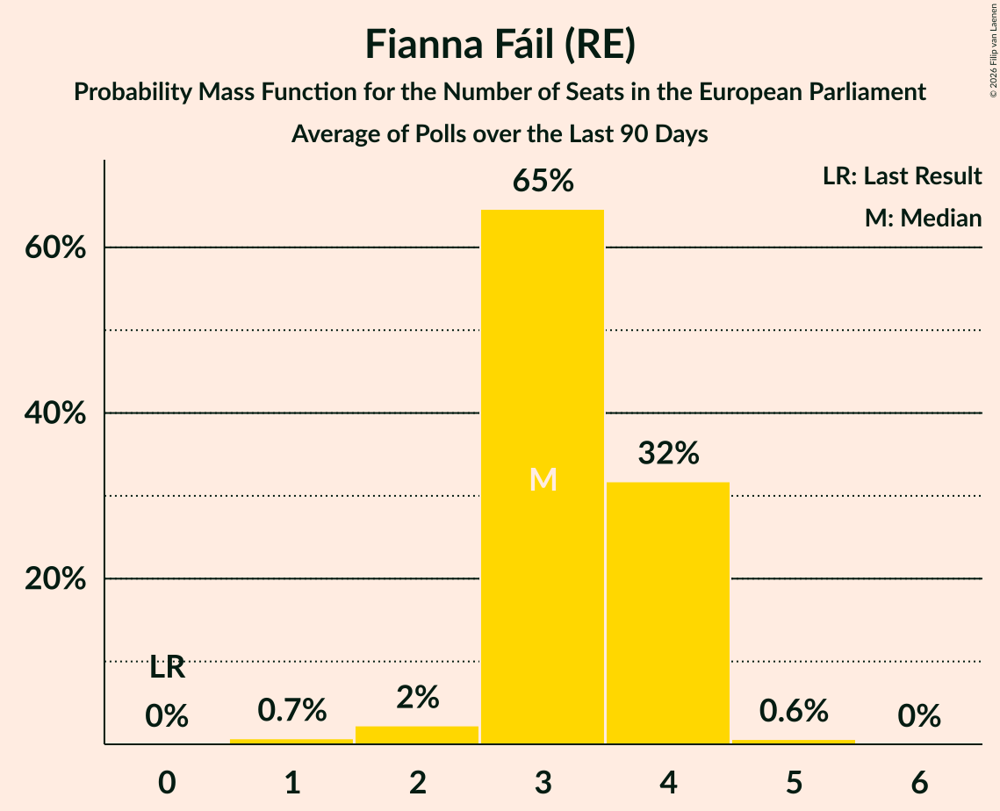

# Fianna Fáil (RE)

<a href="#voting-intentions">Voting Intentions</a> | <a href="#seats">Seats</a>

## Voting Intentions

Last result: **22.3%** (General Election of 24 May 2019)

### Confidence Intervals

| Period     | Polling firm/Commissioner(s) | Median | 80% Confidence Interval | 90% Confidence Interval | 95% Confidence Interval | 99% Confidence Interval |
|:----------:|:----------------:|:-----------:|:-----------------------:|:-----------------------:|:-----------------------:|:-----------------------:|
| N/A | [Poll Average](average.html) | 32.9% | 28.8–37.0% | 28.2–37.7% | 27.7–38.3% | 26.7–39.4% |
| [2 February 2020](2020-02-02-Survation.html) | Survation   Sinn Féin | 22.0% | N/A | N/A | N/A | N/A |
| [30 January–1 February 2020](2020-02-01-IpsosMRBI.html) | Ipsos MRBI   The Irish Times | 23.0% | N/A | N/A | N/A | N/A |
| [25–30 January 2020](2020-01-30-RedC.html) | Red C   The Sunday Business Post | 24.5% | N/A | N/A | N/A | N/A |
| [24–30 January 2020](2020-01-30-Panelbase.html) | Panelbase   The Times | 25.9% | N/A | N/A | N/A | N/A |
| [1–25 January 2020](2020-01-25-IrelandThinks.html) | Ireland Thinks   The Irish Daily Mail | 30.0% | 28.2–32.0% | 27.6–32.6% | 27.2–33.1% | 26.3–34.0% |
| [16–23 January 2020](2020-01-23-RedC.html) | Red C   The Sunday Business Post | 26.0% | 24.3–27.8% | 23.8–28.4% | 23.4–28.8% | 22.6–29.7% |
| [16–18 January 2020](2020-01-18-IpsosMRBI.html) | Ipsos MRBI   The Irish Times | 25.0% | 23.4–26.7% | 23.0–27.1% | 22.6–27.5% | 21.9–28.3% |
| [4–14 January 2020](2020-01-14-BehaviourandAttitudes.html) | Behaviour and Attitudes   The Sunday Times | 35.7% | 33.7–37.8% | 33.2–38.3% | 32.7–38.8% | 31.7–39.8% |
| [24 December 2019](2019-12-24-IrelandThinks.html) | Ireland Thinks   The Irish Daily Mail | 28.8% | 27.4–30.3% | 27.0–30.8% | 26.7–31.1% | 26.0–31.8% |
| [5–17 December 2019](2019-12-17-BehaviourandAttitudes.html) | Behaviour and Attitudes   The Sunday Times | 29.1% | 27.2–31.0% | 26.7–31.6% | 26.2–32.1% | 25.4–33.0% |
| [14–21 November 2019](2019-11-21-RedC.html) | Red C   The Sunday Business Post | 24.0% | 22.3–25.8% | 21.9–26.3% | 21.4–26.7% | 20.7–27.6% |
| [1–12 November 2019](2019-11-12-BehaviourandAttitudes.html) | Behaviour and Attitudes   The Sunday Times | 27.7% | 25.9–29.7% | 25.4–30.2% | 24.9–30.7% | 24.1–31.7% |
| [17–24 October 2019](2019-10-24-RedC.html) | Red C   The Sunday Business Post | 24.0% | 22.3–25.8% | 21.9–26.3% | 21.4–26.7% | 20.7–27.6% |
| [3–15 October 2019](2019-10-15-BehaviourandAttitudes.html) | Behaviour and Attitudes   The Sunday Times | 30.9% | 29.0–32.9% | 28.4–33.5% | 28.0–34.0% | 27.0–35.0% |
| [11–13 October 2019](2019-10-13-IpsosMRBI.html) | Ipsos MRBI   The Irish Times | 25.2% | 23.7–26.9% | 23.2–27.4% | 22.9–27.8% | 22.1–28.6% |
| [5–17 September 2019](2019-09-17-BehaviourandAttitudes.html) | Behaviour and Attitudes   The Sunday Times | 32.0% | 30.1–34.0% | 29.5–34.6% | 29.0–35.1% | 28.1–36.1% |
| [5–12 September 2019](2019-09-12-RedC.html) | Red C   The Sunday Business Post | 31.8% | 29.9–33.7% | 29.4–34.3% | 29.0–34.8% | 28.1–35.7% |
| [4–16 July 2019](2019-07-16-BehaviourandAttitudes.html) | Behaviour and Attitudes   The Sunday Times | 30.6% | 28.7–32.7% | 28.2–33.2% | 27.7–33.7% | 26.8–34.7% |
| [31 May–11 June 2019](2019-06-11-BehaviourandAttitudes.html) | Behaviour and Attitudes   The Sunday Times | 28.3% | 26.5–30.3% | 25.9–30.9% | 25.5–31.4% | 24.6–32.3% |

### Probability Mass Function

The following table shows the probability mass function per percentage block of voting intentions for the [poll average](average.html) for Fianna Fáil (RE).

| Voting Intentions | Probability | Accumulated | Special Marks |
|:-----------------:|:-----------:|:-----------:|:-------------:|
| 21.5–22.5% | 0% | 100% | Last Result |
| 22.5–23.5% | 0% | 100% |  |
| 23.5–24.5% | 0% | 100% |  |
| 24.5–25.5% | 0% | 100% |  |
| 25.5–26.5% | 0.3% | 100% |  |
| 26.5–27.5% | 2% | 99.6% |  |
| 27.5–28.5% | 5% | 98% |  |
| 28.5–29.5% | 11% | 92% |  |
| 29.5–30.5% | 13% | 82% |  |
| 30.5–31.5% | 11% | 69% |  |
| 31.5–32.5% | 6% | 58% |  |
| 32.5–33.5% | 5% | 51% | Median |
| 33.5–34.5% | 8% | 47% |  |
| 34.5–35.5% | 11% | 39% |  |
| 35.5–36.5% | 12% | 27% |  |
| 36.5–37.5% | 9% | 15% |  |
| 37.5–38.5% | 4% | 6% |  |
| 38.5–39.5% | 1.5% | 2% |  |
| 39.5–40.5% | 0.3% | 0.4% |  |
| 40.5–41.5% | 0.1% | 0.1% |  |
| 41.5–42.5% | 0% | 0% |  |

## Seats

Last result: **1** seats (General Election of 24 May 2019)

### Confidence Intervals

| Period     | Polling firm/Commissioner(s) | Median | 80% Confidence Interval | 90% Confidence Interval | 95% Confidence Interval | 99% Confidence Interval |
|:----------:|:----------------:|:------:|:-----------------------:|:-----------------------:|:-----------------------:|:-----------------------:|
| N/A | [Poll Average](average.html) | 4 | 4–6 | 4–6 | 4–6 | 4–6 |
| [2 February 2020](2020-02-02-Survation.html) | Survation   Sinn Féin |  |  |  |  |  |
| [30 January–1 February 2020](2020-02-01-IpsosMRBI.html) | Ipsos MRBI   The Irish Times |  |  |  |  |  |
| [25–30 January 2020](2020-01-30-RedC.html) | Red C   The Sunday Business Post |  |  |  |  |  |
| [24–30 January 2020](2020-01-30-Panelbase.html) | Panelbase   The Times |  |  |  |  |  |
| [1–25 January 2020](2020-01-25-IrelandThinks.html) | Ireland Thinks   The Irish Daily Mail | 4 | 4 | 4 | 4 | 4 |
| [16–23 January 2020](2020-01-23-RedC.html) | Red C   The Sunday Business Post | 4 | 4 | 4 | 4 | 4 |
| [16–18 January 2020](2020-01-18-IpsosMRBI.html) | Ipsos MRBI   The Irish Times | 4 | 4 | 4 | 4 | 4 |
| [4–14 January 2020](2020-01-14-BehaviourandAttitudes.html) | Behaviour and Attitudes   The Sunday Times | 6 | 4–6 | 4–6 | 4–6 | 4–6 |
| [24 December 2019](2019-12-24-IrelandThinks.html) | Ireland Thinks   The Irish Daily Mail | 4 | 4 | 4 | 4 | 3–4 |
| [5–17 December 2019](2019-12-17-BehaviourandAttitudes.html) | Behaviour and Attitudes   The Sunday Times | 4 | 4 | 4 | 4 | 3–4 |
| [14–21 November 2019](2019-11-21-RedC.html) | Red C   The Sunday Business Post | 4 | 4 | 4–5 | 4–5 | 4–5 |
| [1–12 November 2019](2019-11-12-BehaviourandAttitudes.html) | Behaviour and Attitudes   The Sunday Times | 4 | 4 | 4 | 4 | 3–4 |
| [17–24 October 2019](2019-10-24-RedC.html) | Red C   The Sunday Business Post | 4 | 4 | 4 | 4 | 4 |
| [3–15 October 2019](2019-10-15-BehaviourandAttitudes.html) | Behaviour and Attitudes   The Sunday Times | 4 | 4 | 4 | 4–5 | 4–5 |
| [11–13 October 2019](2019-10-13-IpsosMRBI.html) | Ipsos MRBI   The Irish Times | 4 | 4 | 4 | 4 | 3–4 |
| [5–17 September 2019](2019-09-17-BehaviourandAttitudes.html) | Behaviour and Attitudes   The Sunday Times | 4 | 4 | 4 | 4 | 4 |
| [5–12 September 2019](2019-09-12-RedC.html) | Red C   The Sunday Business Post | 5 | 4–5 | 4–5 | 4–5 | 4–6 |
| [4–16 July 2019](2019-07-16-BehaviourandAttitudes.html) | Behaviour and Attitudes   The Sunday Times | 4 | 4–6 | 4–6 | 4–6 | 4–6 |
| [31 May–11 June 2019](2019-06-11-BehaviourandAttitudes.html) | Behaviour and Attitudes   The Sunday Times | 4 | 4–5 | 4–5 | 4–5 | 4–5 |

### Probability Mass Function

The following table shows the probability mass function per seat for the [poll average](average.html) for Fianna Fáil (RE).

| Number of Seats | Probability | Accumulated | Special Marks |
|:---------------:|:-----------:|:-----------:|:-------------:|
| 1 | 0% | 100% | Last Result |
| 2 | 0% | 100% |  |
| 3 | 0% | 100% |  |
| 4 | 63% | 100% | Median |
| 5 | 9% | 37% |  |
| 6 | 28% | 28% | Majority |
| 7 | 0.1% | 0.1% |  |
| 8 | 0% | 0% |  |

