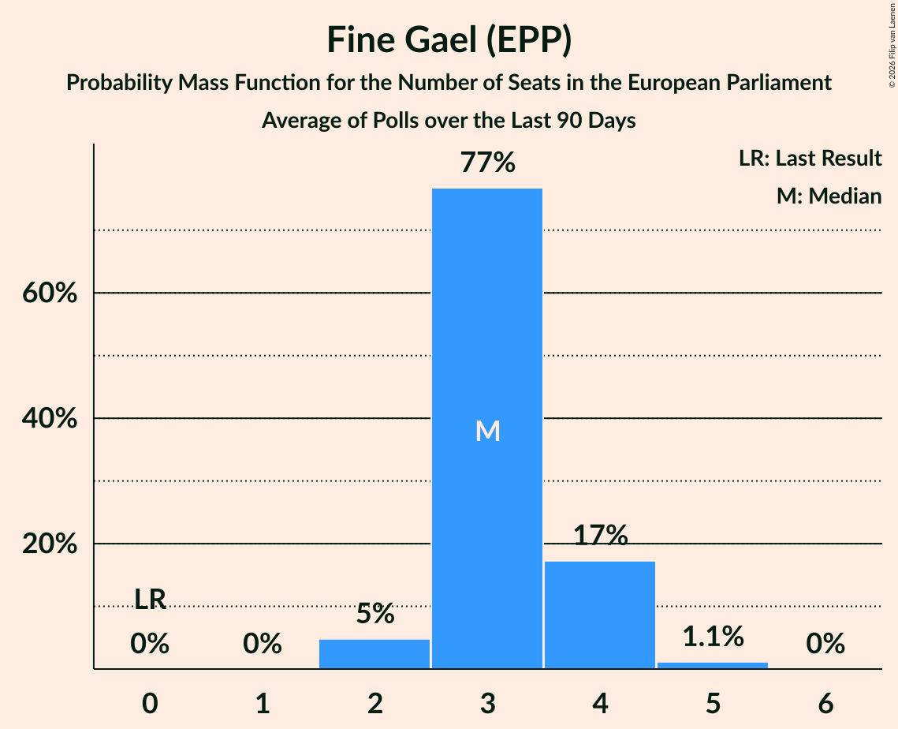

# Fine Gael (EPP)

<a href="#voting-intentions">Voting Intentions</a> | <a href="#seats">Seats</a>

## Voting Intentions

Last result: **22.3%** (General Election of 24 May 2019)

### Confidence Intervals

| Period     | Polling firm/Commissioner(s) | Median | 80% Confidence Interval | 90% Confidence Interval | 95% Confidence Interval | 99% Confidence Interval |
|:----------:|:----------------:|:-----------:|:-----------------------:|:-----------------------:|:-----------------------:|:-----------------------:|
| N/A | [Poll Average](average.html) | 19.9% | 16.4–22.8% | 15.8–23.5% | 15.3–24.0% | 14.5–25.0% |
| [27 April–9 May 2023](2023-05-09-BehaviourandAttitudes.html) | Behaviour and Attitudes   The Sunday Times | 17.0% | 15.5–18.7% | 15.1–19.2% | 14.7–19.6% | 14.0–20.4% |
| [5–6 May 2023](2023-05-06-IrelandThinks.html) | Ireland Thinks   Sunday Independent | 20.0% | 18.6–21.6% | 18.2–22.0% | 17.8–22.4% | 17.1–23.2% |
| [21–26 April 2023](2023-04-26-RedC.html) | Red C   Business Post | 22.0% | 20.4–23.8% | 20.0–24.3% | 19.6–24.7% | 18.9–25.6% |
| [28 March–4 April 2023](2023-04-04-BehaviourandAttitudes.html) | Behaviour and Attitudes   The Sunday Times | 15.2% | 13.7–16.8% | 13.3–17.3% | 13.0–17.7% | 12.3–18.5% |
| [31 March–1 April 2023](2023-04-01-IrelandThinks.html) | Ireland Thinks   Sunday Independent | 22.2% | 20.7–23.9% | 20.2–24.4% | 19.9–24.8% | 19.1–25.6% |
| [17–22 March 2023](2023-03-22-RedC.html) | Red C   Business Post | 22.0% | 20.4–23.7% | 19.9–24.2% | 19.5–24.7% | 18.8–25.5% |
| [4–14 March 2023](2023-03-14-BehaviourandAttitudes.html) | Behaviour and Attitudes   The Sunday Times | 23.0% | 21.3–24.8% | 20.8–25.4% | 20.4–25.8% | 19.6–26.7% |
| [3 March 2023](2023-03-03-IrelandThinks.html) | Ireland Thinks   Sunday Independent | 21.0% | 19.5–22.6% | 19.1–23.0% | 18.7–23.4% | 18.1–24.2% |
| [17–22 February 2023](2023-02-22-RedC.html) | Red C   Business Post | 21.0% | 19.4–22.8% | 19.0–23.3% | 18.6–23.7% | 17.9–24.5% |
| [19–21 February 2023](2023-02-21-IpsosMRBI.html) | Ipsos MRBI   Irish Times | 21.8% | 20.3–23.3% | 19.9–23.8% | 19.5–24.2% | 18.8–25.0% |
| [2–14 February 2023](2023-02-14-BehaviourandAttitudes.html) | Behaviour and Attitudes   The Sunday Times | 23.0% | 21.3–24.9% | 20.8–25.4% | 20.4–25.8% | 19.6–26.8% |
| [2–3 February 2023](2023-02-03-IrelandThinks.html) | Ireland Thinks   Sunday Independent | 22.0% | 20.6–23.6% | 20.1–24.1% | 19.8–24.5% | 19.1–25.2% |
| [20–25 January 2023](2023-01-25-RedC.html) | Red C   Business Post | 21.0% | 19.4–22.7% | 19.0–23.2% | 18.6–23.7% | 17.9–24.5% |
| [5–17 January 2023](2023-01-17-BehaviourandAttitudes.html) | Behaviour and Attitudes   The Sunday Times | 19.0% | 17.5–20.7% | 17.0–21.2% | 16.6–21.7% | 15.9–22.5% |
| [5–6 January 2023](2023-01-06-IrelandThinks.html) | Ireland Thinks   Sunday Independent | 25.0% | 23.4–26.7% | 22.9–27.2% | 22.5–27.6% | 21.8–28.5% |
| [24 November–6 December 2022](2022-12-06-BehaviourandAttitudes.html) | Behaviour and Attitudes   The Sunday Times | 23.0% | 21.3–24.8% | 20.8–25.3% | 20.4–25.8% | 19.6–26.7% |
| [1–2 December 2022](2022-12-02-IrelandThinks.html) | Ireland Thinks   Sunday Independent | 22.8% | 21.4–24.3% | 21.0–24.7% | 20.6–25.1% | 20.0–25.8% |
| [18–23 November 2022](2022-11-23-RedC.html) | Red C   Business Post | 24.2% | 22.5–26.0% | 22.1–26.5% | 21.6–27.0% | 20.9–27.8% |
| [27 October–8 November 2022](2022-11-08-BehaviourandAttitudes.html) | Behaviour and Attitudes   The Sunday Times | 21.0% | 19.4–22.8% | 18.9–23.3% | 18.5–23.8% | 17.7–24.7% |
| [4 November 2022](2022-11-04-IrelandThinks.html) | Ireland Thinks   Sunday Independent | 20.8% | 19.2–22.5% | 18.7–23.0% | 18.4–23.4% | 17.6–24.2% |
| [23–25 October 2022](2022-10-25-IpsosMRBI.html) | Ipsos MRBI   Irish Times | 21.8% | 20.3–23.3% | 19.9–23.8% | 19.5–24.2% | 18.8–25.0% |
| [3–15 October 2022](2022-10-15-BehaviourandAttitudes.html) | Behaviour and Attitudes   Sunday Times | 20.9% | 19.3–22.7% | 18.8–23.2% | 18.4–23.7% | 17.7–24.6% |
| [1 October 2022](2022-10-01-IrelandThinks.html) | Ireland Thinks   Sunday Independent | 21.0% | 19.6–22.5% | 19.1–22.9% | 18.8–23.3% | 18.1–24.1% |
| [1–6 September 2022](2022-09-06-RedC.html) | Red C   Business Post | 18.0% | 16.5–19.7% | 16.1–20.1% | 15.8–20.5% | 15.1–21.3% |
| [25 August–6 September 2022](2022-09-06-BehaviourandAttitudes.html) | Behaviour and Attitudes   Sunday Times | 19.8% | N/A | N/A | N/A | N/A |
| [2 September 2022](2022-09-02-IrelandThinks.html) | Ireland Thinks   Sunday Independent | 20.8% | 19.2–22.6% | 18.7–23.1% | 18.3–23.5% | 17.6–24.4% |
| [6 August 2022](2022-08-06-IrelandThinks.html) | Ireland Thinks   Sunday Independent | 21.5% | 19.9–23.4% | 19.4–23.9% | 19.0–24.3% | 18.3–25.2% |
| [10–12 July 2022](2022-07-12-IpsosMRBI.html) | Ipsos MRBI   Irish Times | 17.8% | 16.5–19.3% | 16.1–19.7% | 15.8–20.1% | 15.1–20.8% |
| [1 July 2022](2022-07-01-IrelandThinks.html) | Ireland Thinks   Sunday Independent | 22.0% | 20.5–23.6% | 20.0–24.1% | 19.7–24.5% | 18.9–25.3% |
| [17–22 June 2022](2022-06-22-RedC.html) | Red C   Business Post | 19.2% | 17.7–20.9% | 17.3–21.4% | 16.9–21.8% | 16.2–22.6% |
| [25 May–7 June 2022](2022-06-07-BehaviourandAttitudes.html) | Behaviour and Attitudes   The Sunday Times | 22.7% | 20.9–24.5% | 20.5–25.1% | 20.0–25.5% | 19.3–26.4% |
| [4 June 2022](2022-06-04-IrelandThinks.html) | Ireland Thinks   Sunday Independent | 20.4% | 19.0–21.9% | 18.6–22.4% | 18.2–22.8% | 17.6–23.5% |
| [20–25 May 2022](2022-05-25-RedC.html) | Red C   Business Post | 20.2% | 18.6–21.9% | 18.2–22.3% | 17.8–22.8% | 17.1–23.6% |
| [28 April–10 May 2022](2022-05-10-BehaviourandAttitudes.html) | Behaviour and Attitudes   The Sunday Times | 19.1% | 17.5–20.8% | 17.0–21.3% | 16.6–21.7% | 15.9–22.6% |
| [7 May 2022](2022-05-07-IrelandThinks.html) | Ireland Thinks   Sunday Independent | 23.3% | 21.6–25.0% | 21.1–25.5% | 20.7–26.0% | 20.0–26.8% |
| [22–27 April 2022](2022-04-27-RedC.html) | Red C   Business Post | 21.0% | 19.4–22.7% | 19.0–23.2% | 18.6–23.6% | 17.9–24.5% |
| [1 April 2022](2022-04-01-IrelandThinks.html) | Ireland Thinks   Sunday Independent | 21.8% | 20.2–23.4% | 19.8–23.9% | 19.4–24.3% | 18.7–25.1% |
| [18–23 March 2022](2022-03-23-RedC.html) | Red C   Business Post | 19.0% | 17.5–20.7% | 17.0–21.1% | 16.7–21.5% | 16.0–22.4% |
| [24 February–8 March 2022](2022-03-08-BehaviourandAttitudes.html) | Behaviour and Attitudes   The Sunday Times | 24.0% | 22.3–25.9% | 21.8–26.4% | 21.4–26.9% | 20.6–27.8% |
| [4 March 2022](2022-03-04-IrelandThinks.html) | Ireland Thinks   Sunday Independent | 20.6% | 19.0–22.3% | 18.6–22.8% | 18.2–23.2% | 17.5–24.0% |
| [18–23 February 2022](2022-02-23-RedC.html) | Red C   Business Post | 20.2% | 18.6–21.9% | 18.2–22.4% | 17.8–22.8% | 17.1–23.6% |
| [27 January–8 February 2022](2022-02-08-BehaviourandAttitudes.html) | Behaviour and Attitudes   The Sunday Times | 20.0% | 18.3–21.7% | 17.9–22.2% | 17.5–22.7% | 16.8–23.5% |
| [5 February 2022](2022-02-05-IrelandThinks.html) | Ireland Thinks   Sunday Independent | 23.0% | 21.4–24.7% | 21.0–25.2% | 20.6–25.6% | 19.9–26.5% |
| [21–26 January 2022](2022-01-26-RedC.html) | Red C   Business Post | 21.0% | 19.4–22.7% | 18.9–23.2% | 18.6–23.6% | 17.8–24.5% |
| [6–18 January 2022](2022-01-18-BehaviourandAttitudes.html) | Behaviour and Attitudes   The Sunday Times | 21.9% | 20.2–23.7% | 19.8–24.3% | 19.4–24.7% | 18.6–25.6% |
| [8 January 2022](2022-01-08-IrelandThinks.html) | Ireland Thinks   Sunday Independent | 23.0% | 21.6–24.5% | 21.2–25.0% | 20.9–25.3% | 20.2–26.1% |
| [12 December 2021](2021-12-12-IrelandThinks.html) | Ireland Thinks   Irish Mail on Sunday | 25.1% | 23.3–26.9% | 22.8–27.5% | 22.4–27.9% | 21.6–28.8% |
| [5–8 December 2021](2021-12-08-IpsosMRBI.html) | Ipsos MRBI   Irish Times | 20.2% | 18.7–21.7% | 18.3–22.2% | 18.0–22.5% | 17.3–23.3% |
| [25 November–8 December 2021](2021-12-08-BehaviourandAttitudes.html) | Behaviour and Attitudes   The Sunday Times | 20.2% | 18.5–21.9% | 18.1–22.4% | 17.7–22.8% | 16.9–23.7% |
| [19–25 November 2021](2021-11-25-RedC.html) | Red C   Business Post | 22.5% | 20.9–24.2% | 20.4–24.7% | 20.0–25.2% | 19.2–26.0% |
| [14 November 2021](2021-11-14-IrelandThinks.html) | Ireland Thinks   Irish Mail on Sunday | 24.0% | 22.3–25.8% | 21.8–26.4% | 21.4–26.8% | 20.6–27.7% |
| [28 October–9 November 2021](2021-11-09-BehaviourandAttitudes.html) | Behaviour and Attitudes   The Sunday Times | 21.2% | 19.5–23.0% | 19.0–23.5% | 18.6–23.9% | 17.9–24.8% |
| [22 October 2021](2021-10-22-RedC.html) | Red C   Business Post | 25.0% | 23.3–26.8% | 22.8–27.3% | 22.4–27.8% | 21.6–28.7% |
| [16 October 2021](2021-10-16-IrelandThinks.html) | Ireland Thinks   Irish Mail on Sunday | 27.8% | N/A | N/A | N/A | N/A |
| [30 September–12 October 2021](2021-10-12-BehaviourandAttitudes.html) | Behaviour and Attitudes   The Sunday Times | 21.2% | N/A | N/A | N/A | N/A |
| [2–5 October 2021](2021-10-05-IpsosMRBI.html) | Ipsos MRBI   Irish Times | 21.8% | 20.3–23.3% | 19.9–23.8% | 19.5–24.2% | 18.8–25.0% |
| [18 September 2021](2021-09-18-IrelandThinks.html) | Ireland Thinks   Irish Mail on Sunday | 24.5% | N/A | N/A | N/A | N/A |
| [3–9 September 2021](2021-09-09-RedC.html) | Red C   Business Post | 28.3% | N/A | N/A | N/A | N/A |
| [26 August–8 September 2021](2021-09-08-BehaviourandAttitudes.html) | Behaviour and Attitudes   The Sunday Times | 23.2% | N/A | N/A | N/A | N/A |
| [21 August 2021](2021-08-21-IrelandThinks.html) | Ireland Thinks   Irish Mail on Sunday | 24.0% | N/A | N/A | N/A | N/A |
| [17 July 2021](2021-07-17-IrelandThinks.html) | Ireland Thinks   Irish Mail on Sunday | 25.0% | 23.3–26.8% | 22.8–27.3% | 22.4–27.8% | 21.6–28.6% |
| [1–13 July 2021](2021-07-13-BehaviourandAttitudes.html) | Behaviour and Attitudes   The Sunday Times | 25.0% | 23.3–26.8% | 22.8–27.3% | 22.4–27.8% | 21.6–28.6% |
| [26 June 2021](2021-06-26-RedC.html) | Red C   Business Post | 30.0% | 28.2–31.9% | 27.7–32.4% | 27.3–32.9% | 26.4–33.8% |
| [19 June 2021](2021-06-19-IrelandThinks.html) | Ireland Thinks   Irish Mail on Sunday | 23.8% | 22.3–25.4% | 21.9–25.8% | 21.5–26.2% | 20.8–27.0% |
| [14–15 June 2021](2021-06-15-IpsosMRBI.html) | Ipsos MRBI   Irish Times | 27.0% | 25.4–28.7% | 25.0–29.2% | 24.6–29.6% | 23.8–30.4% |
| [28 May–8 June 2021](2021-06-08-BehaviourandAttitudes.html) | Behaviour and Attitudes   The Sunday Times | 24.0% | 22.2–25.9% | 21.7–26.4% | 21.3–26.9% | 20.5–27.8% |
| [21–27 May 2021](2021-05-27-RedC.html) | Red C   Business Post | 29.0% | 27.3–30.9% | 26.7–31.4% | 26.3–31.9% | 25.5–32.8% |
| [4–18 May 2021](2021-05-18-BehaviourandAttitudes.html) | Behaviour and Attitudes   The Sunday Times | 28.0% | 26.2–30.0% | 25.6–30.5% | 25.2–31.0% | 24.3–32.0% |
| [15 May 2021](2021-05-15-IrelandThinks.html) | Ireland Thinks   Irish Mail on Sunday | 25.0% | 23.4–26.6% | 23.0–27.1% | 22.6–27.5% | 21.9–28.3% |
| [16–22 April 2021](2021-04-22-RedC.html) | Red C   Business Post | 30.3% | 28.5–32.2% | 28.0–32.8% | 27.6–33.2% | 26.7–34.2% |
| [14–15 April 2021](2021-04-15-IrelandThinks.html) | Ireland Thinks   Irish Mail on Sunday | 26.0% | 24.4–27.8% | 23.9–28.3% | 23.5–28.7% | 22.7–29.6% |
| [19–25 March 2021](2021-03-25-RedC.html) | Red C   Business Post | 30.3% | 28.5–32.2% | 28.0–32.8% | 27.5–33.2% | 26.7–34.2% |
| [20 March 2021](2021-03-20-IrelandThinks.html) | Ireland Thinks   Irish Mail on Sunday | 27.0% | 25.3–28.8% | 24.8–29.4% | 24.4–29.8% | 23.6–30.7% |
| [18–25 February 2021](2021-02-25-RedC.html) | Red C   Business Post | 29.0% | 27.2–30.9% | 26.7–31.4% | 26.3–31.9% | 25.4–32.8% |
| [22–23 February 2021](2021-02-23-IpsosMRBI.html) | Ipsos MRBI   Irish Times | 30.0% | 28.3–31.7% | 27.9–32.2% | 27.5–32.7% | 26.7–33.5% |
| [12 February 2021](2021-02-12-IrelandThinks.html) | Ireland Thinks   Irish Mail on Sunday | 26.8% | 25.1–28.6% | 24.6–29.1% | 24.2–29.5% | 23.4–30.4% |
| [21–28 January 2021](2021-01-28-RedC.html) | Red C   Business Post | 29.0% | 27.2–30.9% | 26.7–31.4% | 26.3–31.9% | 25.4–32.8% |
| [17 January 2021](2021-01-17-IrelandThinks.html) | Ireland Thinks   Irish Mail on Sunday | 28.3% | 26.7–30.0% | 26.3–30.5% | 25.9–30.9% | 25.1–31.7% |
| [3–15 December 2020](2020-12-15-BehaviourandAttitudes.html) | Behaviour and Attitudes   The Sunday Times | 27.2% | 25.3–29.1% | 24.8–29.7% | 24.4–30.2% | 23.5–31.1% |
| [29 November 2020](2020-11-29-IrelandThinks.html) | Ireland Thinks   Irish Mail on Sunday | 27.7% | 26.0–29.5% | 25.5–30.0% | 25.0–30.5% | 24.2–31.4% |
| [19–25 November 2020](2020-11-25-RedC.html) | Red C   Business Post | 33.0% | 31.1–34.9% | 30.6–35.5% | 30.1–36.0% | 29.3–36.9% |
| [24 October 2020](2020-10-24-RedC.html) | Red C   Business Post | 37.0% | 35.1–39.0% | 34.5–39.6% | 34.0–40.0% | 33.2–41.0% |
| [17 October 2020](2020-10-17-BehaviourandAttitudes.html) | Behaviour and Attitudes   The Sunday Times | 31.4% | 29.5–33.4% | 28.9–33.9% | 28.5–34.4% | 27.6–35.4% |
| [3–6 October 2020](2020-10-06-IpsosMRBI.html) | Ipsos MRBI   Irish Times | 35.0% | 33.3–36.8% | 32.8–37.3% | 32.3–37.8% | 31.5–38.6% |
| [26 September 2020](2020-09-26-IrelandThinks.html) | Ireland Thinks   Mail on Sunday | 32.0% | 30.3–33.7% | 29.9–34.2% | 29.5–34.6% | 28.7–35.5% |
| [4–15 September 2020](2020-09-15-BehaviourandAttitudes.html) | Behaviour and Attitudes   The Sunday Times | 29.9% | 28.0–31.9% | 27.5–32.5% | 27.0–33.0% | 26.1–33.9% |
| [9 September 2020](2020-09-09-RedC.html) | Red C   Business Post | 35.4% | 33.5–37.4% | 33.0–37.9% | 32.5–38.4% | 31.6–39.4% |
| [21–22 August 2020](2020-08-22-IrelandThinks.html) | Ireland Thinks   Mail on Sunday | 35.0% | 33.1–37.0% | 32.6–37.5% | 32.1–38.0% | 31.2–39.0% |
| [17–28 July 2020](2020-07-28-BehaviourandAttitudes.html) | Behaviour and Attitudes   The Sunday Times | 28.1% | 26.3–30.1% | 25.8–30.6% | 25.3–31.1% | 24.4–32.1% |
| [17–18 July 2020](2020-07-18-IrelandThinks.html) | Ireland Thinks   Mail on Sunday | 38.0% | 36.1–40.0% | 35.5–40.6% | 35.0–41.1% | 34.1–42.0% |
| [19–20 June 2020](2020-06-20-IrelandThinks.html) | Ireland Thinks   Mail on Sunday | 33.7% | 31.8–35.7% | 31.3–36.2% | 30.8–36.7% | 29.9–37.6% |
| [14 June 2020](2020-06-14-IpsosMRBI.html) | Ipsos MRBI   Irish Times | 37.3% | 35.6–39.2% | 35.1–39.7% | 34.6–40.1% | 33.8–41.0% |
| [21–27 May 2020](2020-05-27-RedC.html) | Red C   Business Post | 35.0% | 33.1–37.0% | 32.6–37.5% | 32.1–38.0% | 31.2–39.0% |
| [19–23 May 2020](2020-05-23-IrelandThinks.html) | Ireland Thinks   Mail on Sunday | 36.0% | 34.1–37.9% | 33.5–38.5% | 33.1–39.0% | 32.2–39.9% |
| [23–29 April 2020](2020-04-29-RedC.html) | Red C   Business Post | 35.0% | 33.2–37.0% | 32.6–37.5% | 32.2–38.0% | 31.3–39.0% |
| [20–25 March 2020](2020-03-25-RedC.html) | Red C   The Sunday Business Post | 34.0% | 32.2–35.9% | 31.6–36.4% | 31.2–36.9% | 30.3–37.8% |
| [27 February–10 March 2020](2020-03-10-BehaviourandAttitudes.html) | Behaviour and Attitudes   The Sunday Times | 21.2% | 19.5–23.0% | 19.0–23.5% | 18.6–23.9% | 17.9–24.8% |
| [17–25 February 2020](2020-02-25-BehaviourandAttitudes.html) | Behaviour and Attitudes   The Sunday Times | 18.0% | 16.4–19.7% | 16.0–20.2% | 15.6–20.6% | 14.9–21.5% |
| [16 February 2020](2020-02-16-AmárachResearch.html) | Amárach Research   Extra.ie | 18.0% | 16.5–19.6% | 16.1–20.0% | 15.8–20.4% | 15.1–21.2% |
| [27 January–2 February 2020](2020-02-02-Survation.html) | Survation   Sinn Féin | 17.0% | 15.6–18.6% | 15.2–19.0% | 14.9–19.4% | 14.3–20.2% |
| [30 January–1 February 2020](2020-02-01-IpsosMRBI.html) | Ipsos MRBI   The Irish Times | 20.0% | 18.6–21.6% | 18.2–22.0% | 17.8–22.4% | 17.2–23.1% |
| [25–30 January 2020](2020-01-30-RedC.html) | Red C   The Sunday Business Post | 21.4% | 19.8–23.1% | 19.4–23.6% | 19.0–24.1% | 18.2–24.9% |
| [24–30 January 2020](2020-01-30-Panelbase.html) | Panelbase   The Times | 21.4% | 19.8–23.1% | 19.4–23.6% | 19.0–24.1% | 18.2–24.9% |
| [1–25 January 2020](2020-01-25-IrelandThinks.html) | Ireland Thinks   The Irish Daily Mail | 24.5% | 22.8–26.4% | 22.3–26.9% | 21.9–27.4% | 21.1–28.3% |
| [16–23 January 2020](2020-01-23-RedC.html) | Red C   The Sunday Business Post | 23.0% | 21.4–24.8% | 20.9–25.3% | 20.5–25.7% | 19.7–26.6% |
| [16–18 January 2020](2020-01-18-IpsosMRBI.html) | Ipsos MRBI   The Irish Times | 23.0% | 21.5–24.6% | 21.1–25.1% | 20.7–25.5% | 20.0–26.3% |
| [4–14 January 2020](2020-01-14-BehaviourandAttitudes.html) | Behaviour and Attitudes   The Sunday Times | 22.3% | 20.6–24.1% | 20.1–24.6% | 19.7–25.1% | 18.9–25.9% |
| [24 December 2019](2019-12-24-IrelandThinks.html) | Ireland Thinks   The Irish Daily Mail | 32.3% | 30.8–33.8% | 30.4–34.3% | 30.0–34.7% | 29.3–35.4% |
| [5–17 December 2019](2019-12-17-BehaviourandAttitudes.html) | Behaviour and Attitudes   The Sunday Times | 29.1% | 27.2–31.0% | 26.7–31.6% | 26.2–32.1% | 25.4–33.0% |
| [14–21 November 2019](2019-11-21-RedC.html) | Red C   The Sunday Business Post | 30.0% | 28.2–31.9% | 27.7–32.4% | 27.2–32.9% | 26.4–33.9% |
| [1–12 November 2019](2019-11-12-BehaviourandAttitudes.html) | Behaviour and Attitudes   The Sunday Times | 30.0% | 28.1–32.0% | 27.6–32.6% | 27.1–33.1% | 26.2–34.0% |
| [17–24 October 2019](2019-10-24-RedC.html) | Red C   The Sunday Business Post | 32.0% | 30.1–33.9% | 29.6–34.5% | 29.2–35.0% | 28.3–35.9% |
| [3–15 October 2019](2019-10-15-BehaviourandAttitudes.html) | Behaviour and Attitudes   The Sunday Times | 32.0% | 30.1–34.0% | 29.5–34.6% | 29.0–35.1% | 28.1–36.1% |
| [11–13 October 2019](2019-10-13-IpsosMRBI.html) | Ipsos MRBI   The Irish Times | 29.3% | 27.7–31.1% | 27.2–31.6% | 26.8–32.0% | 26.0–32.8% |
| [5–17 September 2019](2019-09-17-BehaviourandAttitudes.html) | Behaviour and Attitudes   The Sunday Times | 28.7% | 26.8–30.7% | 26.3–31.2% | 25.8–31.7% | 24.9–32.7% |
| [5–12 September 2019](2019-09-12-RedC.html) | Red C   The Sunday Business Post | 33.0% | 31.1–34.9% | 30.6–35.5% | 30.1–36.0% | 29.3–36.9% |
| [4–16 July 2019](2019-07-16-BehaviourandAttitudes.html) | Behaviour and Attitudes   The Sunday Times | 26.5% | 24.7–28.5% | 24.2–29.1% | 23.8–29.5% | 22.9–30.5% |
| [31 May–11 June 2019](2019-06-11-BehaviourandAttitudes.html) | Behaviour and Attitudes   The Sunday Times | 23.2% | 21.5–25.1% | 21.0–25.6% | 20.6–26.1% | 19.8–27.0% |

### Probability Mass Function

The following table shows the probability mass function per percentage block of voting intentions for the [poll average](average.html) for Fine Gael (EPP).

| Voting Intentions | Probability | Accumulated | Special Marks |
|:-----------------:|:-----------:|:-----------:|:-------------:|
| 12.5–13.5% | 0% | 100% |  |
| 13.5–14.5% | 0.6% | 100% |  |
| 14.5–15.5% | 3% | 99.4% |  |
| 15.5–16.5% | 8% | 96% |  |
| 16.5–17.5% | 11% | 88% |  |
| 17.5–18.5% | 10% | 78% |  |
| 18.5–19.5% | 12% | 67% |  |
| 19.5–20.5% | 15% | 55% | Median |
| 20.5–21.5% | 15% | 41% |  |
| 21.5–22.5% | 13% | 25% | Last Result |
| 22.5–23.5% | 8% | 13% |  |
| 23.5–24.5% | 3% | 5% |  |
| 24.5–25.5% | 0.9% | 1.1% |  |
| 25.5–26.5% | 0.2% | 0.2% |  |
| 26.5–27.5% | 0% | 0% |  |

## Seats

Last result: **4** seats (General Election of 24 May 2019)

### Confidence Intervals

| Period     | Polling firm/Commissioner(s) | Median | 80% Confidence Interval | 90% Confidence Interval | 95% Confidence Interval | 99% Confidence Interval |
|:----------:|:----------------:|:------:|:-----------------------:|:-----------------------:|:-----------------------:|:-----------------------:|
| N/A | [Poll Average](average.html) | 2 | 2–4 | 2–4 | 2–4 | 2–4 |
| [27 April–9 May 2023](2023-05-09-BehaviourandAttitudes.html) | Behaviour and Attitudes   The Sunday Times | 2 | 2–3 | 2–3 | 2–3 | 2–3 |
| [5–6 May 2023](2023-05-06-IrelandThinks.html) | Ireland Thinks   Sunday Independent | 2 | 2–3 | 2–3 | 2–3 | 2–4 |
| [21–26 April 2023](2023-04-26-RedC.html) | Red C   Business Post | 4 | 3–4 | 2–4 | 2–4 | 2–5 |
| [28 March–4 April 2023](2023-04-04-BehaviourandAttitudes.html) | Behaviour and Attitudes   The Sunday Times | 2 | 2 | 2 | 2 | 2 |
| [31 March–1 April 2023](2023-04-01-IrelandThinks.html) | Ireland Thinks   Sunday Independent | 5 | 3–5 | 2–5 | 2–5 | 2–5 |
| [17–22 March 2023](2023-03-22-RedC.html) | Red C   Business Post | 4 | 2–4 | 2–4 | 2–4 | 2–5 |
| [4–14 March 2023](2023-03-14-BehaviourandAttitudes.html) | Behaviour and Attitudes   The Sunday Times | 3 | 2–4 | 2–5 | 2–5 | 2–5 |
| [3 March 2023](2023-03-03-IrelandThinks.html) | Ireland Thinks   Sunday Independent | 2 | 2–4 | 2–5 | 2–5 | 2–5 |
| [17–22 February 2023](2023-02-22-RedC.html) | Red C   Business Post | 3 | 2–4 | 2–4 | 2–4 | 2–4 |
| [19–21 February 2023](2023-02-21-IpsosMRBI.html) | Ipsos MRBI   Irish Times | 3 | 3–4 | 3–4 | 3–4 | 2–4 |
| [2–14 February 2023](2023-02-14-BehaviourandAttitudes.html) | Behaviour and Attitudes   The Sunday Times | 3 | 3 | 3 | 3 | 3–4 |
| [2–3 February 2023](2023-02-03-IrelandThinks.html) | Ireland Thinks   Sunday Independent | 3 | 2–5 | 2–5 | 2–5 | 2–5 |
| [20–25 January 2023](2023-01-25-RedC.html) | Red C   Business Post | 4 | 2–4 | 2–5 | 2–5 | 2–5 |
| [5–17 January 2023](2023-01-17-BehaviourandAttitudes.html) | Behaviour and Attitudes   The Sunday Times | 3 | 3 | 2–3 | 2–3 | 2–3 |
| [5–6 January 2023](2023-01-06-IrelandThinks.html) | Ireland Thinks   Sunday Independent | 5 | 4–5 | 4–5 | 4–5 | 3–5 |
| [24 November–6 December 2022](2022-12-06-BehaviourandAttitudes.html) | Behaviour and Attitudes   The Sunday Times | 3 | 3–4 | 3–4 | 3–4 | 3–5 |
| [1–2 December 2022](2022-12-02-IrelandThinks.html) | Ireland Thinks   Sunday Independent | 4 | 2–5 | 2–5 | 2–5 | 2–5 |
| [18–23 November 2022](2022-11-23-RedC.html) | Red C   Business Post | 4 | 4–5 | 4–5 | 4–5 | 3–5 |
| [27 October–8 November 2022](2022-11-08-BehaviourandAttitudes.html) | Behaviour and Attitudes   The Sunday Times | 3 | 3 | 3 | 2–3 | 2–3 |
| [4 November 2022](2022-11-04-IrelandThinks.html) | Ireland Thinks   Sunday Independent | 2 | 2–4 | 2–4 | 2–4 | 2–5 |
| [23–25 October 2022](2022-10-25-IpsosMRBI.html) | Ipsos MRBI   Irish Times | 3 | 2–3 | 2–3 | 2–3 | 2–5 |
| [3–15 October 2022](2022-10-15-BehaviourandAttitudes.html) | Behaviour and Attitudes   Sunday Times | 3 | 3 | 3 | 3 | 2–3 |
| [1 October 2022](2022-10-01-IrelandThinks.html) | Ireland Thinks   Sunday Independent | 3 | 2–4 | 2–4 | 2–4 | 2–5 |
| [1–6 September 2022](2022-09-06-RedC.html) | Red C   Business Post | 2 | 2 | 2–3 | 2–3 | 2–4 |
| [25 August–6 September 2022](2022-09-06-BehaviourandAttitudes.html) | Behaviour and Attitudes   Sunday Times |  |  |  |  |  |
| [2 September 2022](2022-09-02-IrelandThinks.html) | Ireland Thinks   Sunday Independent | 3 | 2–5 | 2–5 | 2–5 | 2–5 |
| [6 August 2022](2022-08-06-IrelandThinks.html) | Ireland Thinks   Sunday Independent | 3 | 2–5 | 2–5 | 2–5 | 2–5 |
| [10–12 July 2022](2022-07-12-IpsosMRBI.html) | Ipsos MRBI   Irish Times | 3 | 2–3 | 2–3 | 2–3 | 2–3 |
| [1 July 2022](2022-07-01-IrelandThinks.html) | Ireland Thinks   Sunday Independent | 4 | 3–5 | 3–5 | 3–5 | 2–5 |
| [17–22 June 2022](2022-06-22-RedC.html) | Red C   Business Post | 3 | 2–4 | 2–4 | 2–4 | 2–4 |
| [25 May–7 June 2022](2022-06-07-BehaviourandAttitudes.html) | Behaviour and Attitudes   The Sunday Times | 3 | 3 | 3 | 3–4 | 3–4 |
| [4 June 2022](2022-06-04-IrelandThinks.html) | Ireland Thinks   Sunday Independent | 2 | 2–3 | 2–4 | 2–4 | 2–5 |
| [20–25 May 2022](2022-05-25-RedC.html) | Red C   Business Post | 3 | 2–4 | 2–4 | 2–4 | 2–5 |
| [28 April–10 May 2022](2022-05-10-BehaviourandAttitudes.html) | Behaviour and Attitudes   The Sunday Times | 3 | 2–3 | 2–3 | 2–3 | 2–3 |
| [7 May 2022](2022-05-07-IrelandThinks.html) | Ireland Thinks   Sunday Independent | 5 | 3–5 | 2–5 | 2–5 | 2–5 |
| [22–27 April 2022](2022-04-27-RedC.html) | Red C   Business Post | 4 | 2–4 | 2–5 | 2–5 | 2–5 |
| [1 April 2022](2022-04-01-IrelandThinks.html) | Ireland Thinks   Sunday Independent | 3 | 2–5 | 2–5 | 2–5 | 2–5 |
| [18–23 March 2022](2022-03-23-RedC.html) | Red C   Business Post | 2 | 2–3 | 2–4 | 2–4 | 2–4 |
| [24 February–8 March 2022](2022-03-08-BehaviourandAttitudes.html) | Behaviour and Attitudes   The Sunday Times | 3 | 3 | 3 | 3–4 | 3–5 |
| [4 March 2022](2022-03-04-IrelandThinks.html) | Ireland Thinks   Sunday Independent | 2 | 2–3 | 2–3 | 2–4 | 2–5 |
| [18–23 February 2022](2022-02-23-RedC.html) | Red C   Business Post | 2 | 2–4 | 2–4 | 2–4 | 2–5 |
| [27 January–8 February 2022](2022-02-08-BehaviourandAttitudes.html) | Behaviour and Attitudes   The Sunday Times | 3 | 3 | 3 | 2–3 | 2–3 |
| [5 February 2022](2022-02-05-IrelandThinks.html) | Ireland Thinks   Sunday Independent | 4 | 3–5 | 2–5 | 2–5 | 2–5 |
| [21–26 January 2022](2022-01-26-RedC.html) | Red C   Business Post | 4 | 2–4 | 2–4 | 2–5 | 2–5 |
| [6–18 January 2022](2022-01-18-BehaviourandAttitudes.html) | Behaviour and Attitudes   The Sunday Times | 3 | 3 | 3 | 3 | 3 |
| [8 January 2022](2022-01-08-IrelandThinks.html) | Ireland Thinks   Sunday Independent | 3 | 3–5 | 2–5 | 2–5 | 2–5 |
| [12 December 2021](2021-12-12-IrelandThinks.html) | Ireland Thinks   Irish Mail on Sunday | 5 | 4–5 | 3–5 | 3–5 | 3–5 |
| [5–8 December 2021](2021-12-08-IpsosMRBI.html) | Ipsos MRBI   Irish Times | 3 | 3 | 3 | 2–3 | 2–4 |
| [25 November–8 December 2021](2021-12-08-BehaviourandAttitudes.html) | Behaviour and Attitudes   The Sunday Times | 3 | 3 | 2–3 | 2–3 | 2–3 |
| [19–25 November 2021](2021-11-25-RedC.html) | Red C   Business Post | 4 | 3–5 | 2–5 | 2–5 | 2–5 |
| [14 November 2021](2021-11-14-IrelandThinks.html) | Ireland Thinks   Irish Mail on Sunday | 5 | 3–5 | 3–5 | 2–5 | 2–5 |
| [28 October–9 November 2021](2021-11-09-BehaviourandAttitudes.html) | Behaviour and Attitudes   The Sunday Times | 3 | 2–3 | 2–4 | 2–4 | 2–4 |
| [22 October 2021](2021-10-22-RedC.html) | Red C   Business Post | 5 | 4–5 | 4–5 | 4–5 | 3–5 |
| [16 October 2021](2021-10-16-IrelandThinks.html) | Ireland Thinks   Irish Mail on Sunday |  |  |  |  |  |
| [30 September–12 October 2021](2021-10-12-BehaviourandAttitudes.html) | Behaviour and Attitudes   The Sunday Times |  |  |  |  |  |
| [2–5 October 2021](2021-10-05-IpsosMRBI.html) | Ipsos MRBI   Irish Times | 3 | 3–4 | 2–4 | 2–5 | 2–5 |
| [18 September 2021](2021-09-18-IrelandThinks.html) | Ireland Thinks   Irish Mail on Sunday |  |  |  |  |  |
| [3–9 September 2021](2021-09-09-RedC.html) | Red C   Business Post |  |  |  |  |  |
| [26 August–8 September 2021](2021-09-08-BehaviourandAttitudes.html) | Behaviour and Attitudes   The Sunday Times |  |  |  |  |  |
| [21 August 2021](2021-08-21-IrelandThinks.html) | Ireland Thinks   Irish Mail on Sunday |  |  |  |  |  |
| [17 July 2021](2021-07-17-IrelandThinks.html) | Ireland Thinks   Irish Mail on Sunday | 5 | 5 | 5 | 5 | 5 |
| [1–13 July 2021](2021-07-13-BehaviourandAttitudes.html) | Behaviour and Attitudes   The Sunday Times | 4 | 3–5 | 3–5 | 3–5 | 3–5 |
| [26 June 2021](2021-06-26-RedC.html) | Red C   Business Post | 5 | 5 | 5 | 4–5 | 4–5 |
| [19 June 2021](2021-06-19-IrelandThinks.html) | Ireland Thinks   Irish Mail on Sunday | 5 | 4–5 | 4–5 | 4–5 | 4–5 |
| [14–15 June 2021](2021-06-15-IpsosMRBI.html) | Ipsos MRBI   Irish Times | 5 | 3–5 | 3–5 | 3–5 | 3–5 |
| [28 May–8 June 2021](2021-06-08-BehaviourandAttitudes.html) | Behaviour and Attitudes   The Sunday Times | 3 | 3–5 | 2–5 | 2–5 | 2–5 |
| [21–27 May 2021](2021-05-27-RedC.html) | Red C   Business Post | 5 | 5 | 5 | 5 | 5 |
| [4–18 May 2021](2021-05-18-BehaviourandAttitudes.html) | Behaviour and Attitudes   The Sunday Times | 4 | 3–5 | 3–5 | 3–5 | 3–5 |
| [15 May 2021](2021-05-15-IrelandThinks.html) | Ireland Thinks   Irish Mail on Sunday | 5 | 5 | 5 | 5 | 4–5 |
| [16–22 April 2021](2021-04-22-RedC.html) | Red C   Business Post | 5 | 5 | 5 | 5–6 | 5–6 |
| [14–15 April 2021](2021-04-15-IrelandThinks.html) | Ireland Thinks   Irish Mail on Sunday | 5 | 5 | 4–5 | 4–5 | 4–5 |
| [19–25 March 2021](2021-03-25-RedC.html) | Red C   Business Post | 5 | 5 | 5 | 5 | 4–5 |
| [20 March 2021](2021-03-20-IrelandThinks.html) | Ireland Thinks   Irish Mail on Sunday | 5 | 5 | 5 | 5 | 5 |
| [18–25 February 2021](2021-02-25-RedC.html) | Red C   Business Post | 5 | 4–5 | 4–5 | 4–5 | 4–5 |
| [22–23 February 2021](2021-02-23-IpsosMRBI.html) | Ipsos MRBI   Irish Times | 5 | 4–5 | 4–5 | 4–5 | 4–6 |
| [12 February 2021](2021-02-12-IrelandThinks.html) | Ireland Thinks   Irish Mail on Sunday | 5 | 5 | 5 | 5 | 4–5 |
| [21–28 January 2021](2021-01-28-RedC.html) | Red C   Business Post | 5 | 5 | 5 | 5 | 5 |
| [17 January 2021](2021-01-17-IrelandThinks.html) | Ireland Thinks   Irish Mail on Sunday | 5 | 5 | 5 | 5 | 5 |
| [3–15 December 2020](2020-12-15-BehaviourandAttitudes.html) | Behaviour and Attitudes   The Sunday Times | 3 | 3–5 | 3–5 | 3–5 | 3–5 |
| [29 November 2020](2020-11-29-IrelandThinks.html) | Ireland Thinks   Irish Mail on Sunday | 5 | 5 | 5 | 5 | 4–5 |
| [19–25 November 2020](2020-11-25-RedC.html) | Red C   Business Post | 5 | 5 | 5 | 5 | 5–7 |
| [24 October 2020](2020-10-24-RedC.html) | Red C   Business Post | 7 | 5–8 | 5–8 | 5–8 | 5–8 |
| [17 October 2020](2020-10-17-BehaviourandAttitudes.html) | Behaviour and Attitudes   The Sunday Times | 5 | 5 | 5 | 5 | 5 |
| [3–6 October 2020](2020-10-06-IpsosMRBI.html) | Ipsos MRBI   Irish Times | 5 | 5 | 5–6 | 5–6 | 5–7 |
| [26 September 2020](2020-09-26-IrelandThinks.html) | Ireland Thinks   Mail on Sunday | 5 | 5 | 5 | 5 | 5–6 |
| [4–15 September 2020](2020-09-15-BehaviourandAttitudes.html) | Behaviour and Attitudes   The Sunday Times | 5 | 5 | 5 | 4–5 | 3–5 |
| [9 September 2020](2020-09-09-RedC.html) | Red C   Business Post | 6 | 5–7 | 5–8 | 5–8 | 5–8 |
| [21–22 August 2020](2020-08-22-IrelandThinks.html) | Ireland Thinks   Mail on Sunday | 5 | 5 | 5–6 | 5–6 | 5–7 |
| [17–28 July 2020](2020-07-28-BehaviourandAttitudes.html) | Behaviour and Attitudes   The Sunday Times | 5 | 5 | 4–5 | 3–5 | 3–5 |
| [17–18 July 2020](2020-07-18-IrelandThinks.html) | Ireland Thinks   Mail on Sunday | 7 | 6–8 | 5–8 | 5–8 | 5–8 |
| [19–20 June 2020](2020-06-20-IrelandThinks.html) | Ireland Thinks   Mail on Sunday | 5 | 5–7 | 5–7 | 5–7 | 5–8 |
| [14 June 2020](2020-06-14-IpsosMRBI.html) | Ipsos MRBI   Irish Times | 7 | 6–8 | 5–8 | 5–8 | 5–8 |
| [21–27 May 2020](2020-05-27-RedC.html) | Red C   Business Post | 5 | 5–7 | 5–7 | 5–7 | 5–8 |
| [19–23 May 2020](2020-05-23-IrelandThinks.html) | Ireland Thinks   Mail on Sunday | 6 | 5–7 | 5–8 | 5–8 | 5–8 |
| [23–29 April 2020](2020-04-29-RedC.html) | Red C   Business Post | 6 | 5–7 | 5–8 | 5–8 | 5–8 |
| [20–25 March 2020](2020-03-25-RedC.html) | Red C   The Sunday Business Post | 5 | 5–6 | 5–6 | 5–6 | 5–6 |
| [27 February–10 March 2020](2020-03-10-BehaviourandAttitudes.html) | Behaviour and Attitudes   The Sunday Times | 3 | 3 | 3 | 3–4 | 3–5 |
| [17–25 February 2020](2020-02-25-BehaviourandAttitudes.html) | Behaviour and Attitudes   The Sunday Times | 3 | 2–3 | 2–3 | 2–3 | 2–3 |
| [16 February 2020](2020-02-16-AmárachResearch.html) | Amárach Research   Extra.ie | 2 | 2 | 2–3 | 2–3 | 2–4 |
| [27 January–2 February 2020](2020-02-02-Survation.html) | Survation   Sinn Féin | 2 | 2–3 | 2–3 | 2–3 | 2–3 |
| [30 January–1 February 2020](2020-02-01-IpsosMRBI.html) | Ipsos MRBI   The Irish Times | 3 | 3 | 3–4 | 3–4 | 2–4 |
| [25–30 January 2020](2020-01-30-RedC.html) | Red C   The Sunday Business Post | 3 | 3–4 | 3–4 | 3–4 | 2–5 |
| [24–30 January 2020](2020-01-30-Panelbase.html) | Panelbase   The Times | 2 | 2–3 | 2–4 | 2–5 | 2–5 |
| [1–25 January 2020](2020-01-25-IrelandThinks.html) | Ireland Thinks   The Irish Daily Mail | 5 | 3–5 | 3–5 | 2–5 | 2–5 |
| [16–23 January 2020](2020-01-23-RedC.html) | Red C   The Sunday Business Post | 4 | 3–4 | 3–4 | 3–4 | 3–5 |
| [16–18 January 2020](2020-01-18-IpsosMRBI.html) | Ipsos MRBI   The Irish Times | 4 | 4 | 3–5 | 3–5 | 3–5 |
| [4–14 January 2020](2020-01-14-BehaviourandAttitudes.html) | Behaviour and Attitudes   The Sunday Times | 3 | 3–4 | 3–4 | 3–4 | 2–4 |
| [24 December 2019](2019-12-24-IrelandThinks.html) | Ireland Thinks   The Irish Daily Mail | 5 | 5 | 5 | 5 | 5 |
| [5–17 December 2019](2019-12-17-BehaviourandAttitudes.html) | Behaviour and Attitudes   The Sunday Times | 5 | 5 | 5 | 5 | 4–6 |
| [14–21 November 2019](2019-11-21-RedC.html) | Red C   The Sunday Business Post | 5 | 5–7 | 5–7 | 5–7 | 5–7 |
| [1–12 November 2019](2019-11-12-BehaviourandAttitudes.html) | Behaviour and Attitudes   The Sunday Times | 5 | 5–6 | 5–6 | 5–6 | 5–6 |
| [17–24 October 2019](2019-10-24-RedC.html) | Red C   The Sunday Business Post | 7 | 5–7 | 5–7 | 5–7 | 5–7 |
| [3–15 October 2019](2019-10-15-BehaviourandAttitudes.html) | Behaviour and Attitudes   The Sunday Times | 5 | 5 | 5 | 5 | 5–6 |
| [11–13 October 2019](2019-10-13-IpsosMRBI.html) | Ipsos MRBI   The Irish Times | 5 | 4–5 | 4–5 | 4–5 | 4–6 |
| [5–17 September 2019](2019-09-17-BehaviourandAttitudes.html) | Behaviour and Attitudes   The Sunday Times | 5 | 4–5 | 4–5 | 4–5 | 4–5 |
| [5–12 September 2019](2019-09-12-RedC.html) | Red C   The Sunday Business Post | 5 | 5 | 5 | 5–6 | 5–6 |
| [4–16 July 2019](2019-07-16-BehaviourandAttitudes.html) | Behaviour and Attitudes   The Sunday Times | 5 | 4–5 | 4–5 | 4–5 | 4–5 |
| [31 May–11 June 2019](2019-06-11-BehaviourandAttitudes.html) | Behaviour and Attitudes   The Sunday Times | 4 | 3–5 | 3–5 | 3–5 | 3–5 |

### Probability Mass Function

The following table shows the probability mass function per seat for the [poll average](average.html) for Fine Gael (EPP).

| Number of Seats | Probability | Accumulated | Special Marks |
|:---------------:|:-----------:|:-----------:|:-------------:|
| 1 | 0.1% | 100% |  |
| 2 | 52% | 99.9% | Median |
| 3 | 20% | 48% |  |
| 4 | 27% | 28% | Last Result |
| 5 | 0.5% | 0.5% |  |
| 6 | 0% | 0% |  |

