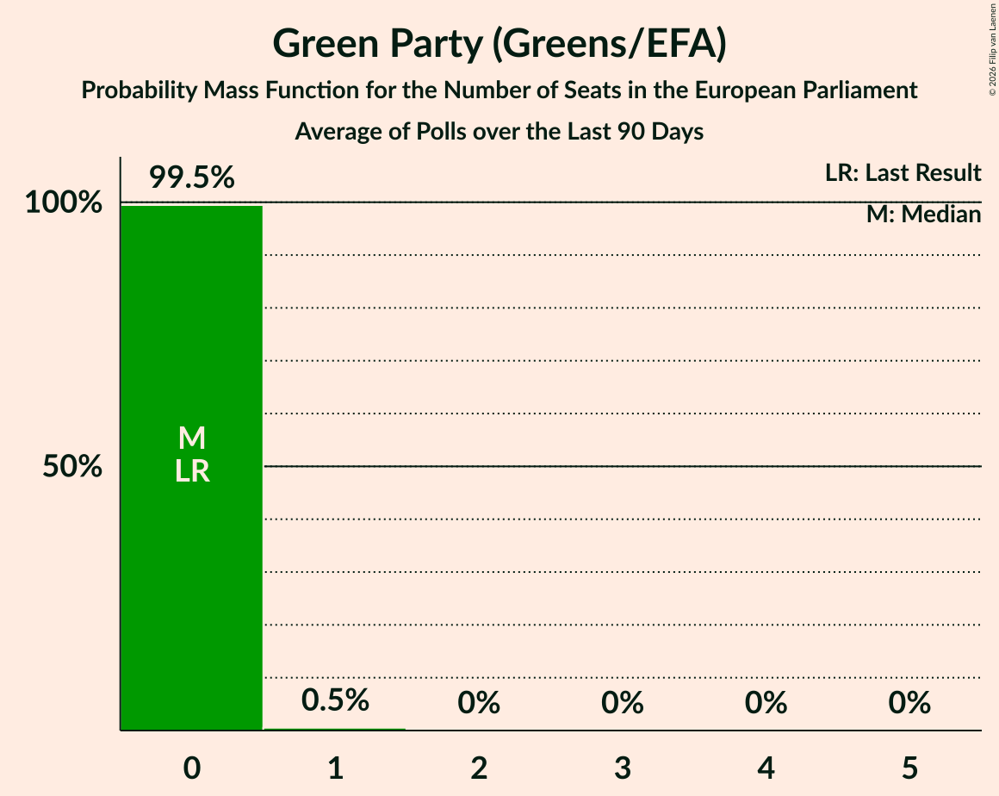

# Green Party (Greens/EFA)

<a href="#voting-intentions">Voting Intentions</a> | <a href="#seats">Seats</a>

## Voting Intentions

Last result: **0.0%** (General Election of 7 June 2024)

### Confidence Intervals

| Period     | Polling firm/Commissioner(s) | Median | 80% Confidence Interval | 90% Confidence Interval | 95% Confidence Interval | 99% Confidence Interval |
|:----------:|:----------------:|:-----------:|:-----------------------:|:-----------------------:|:-----------------------:|:-----------------------:|
| N/A | [Poll Average](average.html) | 2.5% | 1.7–3.5% | 1.6–3.8% | 1.5–4.0% | 1.3–4.5% |
| [28 February 2025](2025-02-28-IrelandThinks.html) | Ireland Thinks   Sunday Independent | 2.0% | 1.6–2.5% | 1.4–2.7% | 1.4–2.9% | 1.2–3.2% |
| [19 February 2025](2025-02-19-RedC.html) | Red C   Business Post | 3.0% | 2.4–3.8% | 2.3–4.1% | 2.1–4.3% | 1.9–4.7% |
| [31 January–1 February 2025](2025-02-01-IrelandThinks.html) | Ireland Thinks   Sunday Independent | 3.0% | 2.5–3.6% | 2.4–3.8% | 2.3–4.0% | 2.1–4.3% |
| [22 January 2025](2025-01-22-RedC.html) | Red C   Business Post | 3.0% | 2.4–3.8% | 2.2–4.0% | 2.1–4.3% | 1.8–4.7% |
| [10–11 January 2025](2025-01-11-IrelandThinks.html) | Ireland Thinks   Sunday Independent | 2.3% | 1.8–3.0% | 1.7–3.2% | 1.6–3.3% | 1.4–3.7% |
| [22–26 November 2024](2024-11-26-RedC.html) | Red C   Business Post | 4.0% | 3.3–4.9% | 3.1–5.2% | 2.9–5.4% | 2.6–5.9% |
| [20–23 November 2024](2024-11-23-IpsosBA.html) | Ipsos B&A   Irish Times | 4.0% | 3.4–4.8% | 3.2–5.1% | 3.0–5.3% | 2.7–5.7% |
| [21–22 November 2024](2024-11-22-IrelandThinks.html) | Ireland Thinks   Sunday Independent | 3.0% | 2.5–3.7% | 2.4–3.9% | 2.3–4.1% | 2.0–4.4% |
| [7–13 November 2024](2024-11-13-Opinions.html) | Opinions   The Sunday Times | 4.0% | 3.3–4.9% | 3.1–5.2% | 2.9–5.4% | 2.7–5.9% |
| [12–13 November 2024](2024-11-13-IpsosBA.html) | Ipsos B&A   Irish Times | 3.0% | 2.5–3.7% | 2.3–3.9% | 2.2–4.1% | 1.9–4.5% |
| [1–7 November 2024](2024-11-07-RedC.html) | Red C   Business Post | 4.0% | 3.3–4.8% | 3.2–5.0% | 3.0–5.2% | 2.7–5.7% |
| [1–2 November 2024](2024-11-02-IrelandThinks.html) | Ireland Thinks   Sunday Independent | 4.0% | 3.4–4.6% | 3.3–4.8% | 3.2–5.0% | 2.9–5.3% |
| [18–23 October 2024](2024-10-23-RedC.html) | Red C   Business Post | 3.0% | 2.4–3.8% | 2.2–4.0% | 2.1–4.3% | 1.8–4.7% |
| [16–22 October 2024](2024-10-22-RedC.html) | Red C   Business Post | 3.0% | 2.4–3.8% | 2.2–4.1% | 2.1–4.3% | 1.9–4.7% |
| [10–16 October 2024](2024-10-16-Opinions.html) | Opinions   The Sunday Times | 4.0% | 3.3–4.9% | 3.1–5.2% | 2.9–5.4% | 2.6–5.9% |
| [4 October 2024](2024-10-04-IrelandThinks.html) | Ireland Thinks   Sunday Independent | 4.0% | 3.4–4.7% | 3.2–4.9% | 3.1–5.1% | 2.8–5.5% |
| [13–19 September 2024](2024-09-19-Opinions.html) | Opinions   The Sunday Times | 4.0% | 3.3–4.9% | 3.1–5.2% | 2.9–5.4% | 2.7–5.9% |
| [14–17 September 2024](2024-09-17-IpsosBA.html) | Ipsos B&A   Irish Times | 5.0% | 4.3–5.9% | 4.1–6.2% | 3.9–6.4% | 3.6–6.8% |
| [5–10 September 2024](2024-09-10-RedC.html) | Red C   Business Post | 4.0% | 3.3–4.9% | 3.1–5.2% | 2.9–5.4% | 2.6–5.9% |
| [31 August 2024](2024-08-31-IrelandThinks.html) | Ireland Thinks   Sunday Independent | 4.0% | 3.4–4.8% | 3.2–5.0% | 3.1–5.2% | 2.8–5.5% |
| [29–30 August 2024](2024-08-30-IrelandThinks.html) | Ireland Thinks   Sunday Independent | 4.0% | 3.3–5.0% | 3.1–5.3% | 3.0–5.5% | 2.6–6.0% |
| [2 August 2024](2024-08-02-IrelandThinks.html) | Ireland Thinks   Sunday Independent | 4.0% | 3.4–4.8% | 3.3–5.0% | 3.1–5.2% | 2.9–5.6% |
| [5 July 2024](2024-07-05-IrelandThinks.html) | Ireland Thinks   Sunday Independent | 4.0% | 3.4–4.8% | 3.3–5.0% | 3.1–5.2% | 2.9–5.5% |
| [26 June 2024](2024-06-26-RedC.html) | Red C   Business Post | 5.0% | 4.2–6.0% | 4.0–6.3% | 3.8–6.5% | 3.5–7.1% |

### Probability Mass Function

The following table shows the probability mass function per percentage block of voting intentions for the [poll average](average.html) for Green Party (Greens/EFA).

| Voting Intentions | Probability | Accumulated | Special Marks |
|:-----------------:|:-----------:|:-----------:|:-------------:|
| 0.0–0.5% | 0% | 100% | Last Result |
| 0.5–1.5% | 5% | 100% |  |
| 1.5–2.5% | 48% | 95% | Median |
| 2.5–3.5% | 37% | 47% |  |
| 3.5–4.5% | 10% | 10% |  |
| 4.5–5.5% | 0.4% | 0.4% |  |
| 5.5–6.5% | 0% | 0% |  |

## Seats

Last result: **0** seats (General Election of 7 June 2024)

### Confidence Intervals

| Period     | Polling firm/Commissioner(s) | Median | 80% Confidence Interval | 90% Confidence Interval | 95% Confidence Interval | 99% Confidence Interval |
|:----------:|:----------------:|:------:|:-----------------------:|:-----------------------:|:-----------------------:|:-----------------------:|
| N/A | [Poll Average](average.html) | 0 | 0 | 0 | 0 | 0 |
| [28 February 2025](2025-02-28-IrelandThinks.html) | Ireland Thinks   Sunday Independent | 0 | 0 | 0 | 0 | 0 |
| [19 February 2025](2025-02-19-RedC.html) | Red C   Business Post | 0 | 0 | 0 | 0 | 0 |
| [31 January–1 February 2025](2025-02-01-IrelandThinks.html) | Ireland Thinks   Sunday Independent | 0 | 0 | 0 | 0 | 0 |
| [22 January 2025](2025-01-22-RedC.html) | Red C   Business Post | 0 | 0 | 0 | 0 | 0 |
| [10–11 January 2025](2025-01-11-IrelandThinks.html) | Ireland Thinks   Sunday Independent | 0 | 0 | 0 | 0 | 0 |
| [22–26 November 2024](2024-11-26-RedC.html) | Red C   Business Post | 0 | 0 | 0 | 0 | 0 |
| [20–23 November 2024](2024-11-23-IpsosBA.html) | Ipsos B&A   Irish Times | 0 | 0 | 0 | 0 | 0–1 |
| [21–22 November 2024](2024-11-22-IrelandThinks.html) | Ireland Thinks   Sunday Independent | 0 | 0 | 0 | 0 | 0 |
| [7–13 November 2024](2024-11-13-Opinions.html) | Opinions   The Sunday Times | 0 | 0 | 0 | 0 | 0–1 |
| [12–13 November 2024](2024-11-13-IpsosBA.html) | Ipsos B&A   Irish Times | 0 | 0 | 0 | 0 | 0 |
| [1–7 November 2024](2024-11-07-RedC.html) | Red C   Business Post | 0 | 0 | 0 | 0–1 | 0–2 |
| [1–2 November 2024](2024-11-02-IrelandThinks.html) | Ireland Thinks   Sunday Independent | 0 | 0 | 0 | 0 | 0 |
| [18–23 October 2024](2024-10-23-RedC.html) | Red C   Business Post | 0 | 0 | 0 | 0 | 0 |
| [16–22 October 2024](2024-10-22-RedC.html) | Red C   Business Post | 0 | 0 | 0 | 0 | 0 |
| [10–16 October 2024](2024-10-16-Opinions.html) | Opinions   The Sunday Times | 0 | 0 | 0 | 0 | 0–1 |
| [4 October 2024](2024-10-04-IrelandThinks.html) | Ireland Thinks   Sunday Independent | 0 | 0 | 0 | 0–1 | 0–1 |
| [13–19 September 2024](2024-09-19-Opinions.html) | Opinions   The Sunday Times | 0 | 0 | 0 | 0 | 0–1 |
| [14–17 September 2024](2024-09-17-IpsosBA.html) | Ipsos B&A   Irish Times | 0 | 0 | 0–1 | 0–1 | 0–1 |
| [5–10 September 2024](2024-09-10-RedC.html) | Red C   Business Post | 0 | 0 | 0 | 0 | 0–1 |
| [31 August 2024](2024-08-31-IrelandThinks.html) | Ireland Thinks   Sunday Independent | 0 | 0 | 0 | 0 | 0–1 |
| [29–30 August 2024](2024-08-30-IrelandThinks.html) | Ireland Thinks   Sunday Independent | 0 | 0 | 0 | 0 | 0–1 |
| [2 August 2024](2024-08-02-IrelandThinks.html) | Ireland Thinks   Sunday Independent | 0 | 0 | 0 | 0–1 | 0–1 |
| [5 July 2024](2024-07-05-IrelandThinks.html) | Ireland Thinks   Sunday Independent | 0 | 0 | 0 | 0 | 0–1 |
| [26 June 2024](2024-06-26-RedC.html) | Red C   Business Post | 0 | 0–2 | 0–2 | 0–2 | 0–2 |

### Probability Mass Function

The following table shows the probability mass function per seat for the [poll average](average.html) for Green Party (Greens/EFA).

| Number of Seats | Probability | Accumulated | Special Marks |
|:---------------:|:-----------:|:-----------:|:-------------:|
| 0 | 100% | 100% | Last Result, Median |

