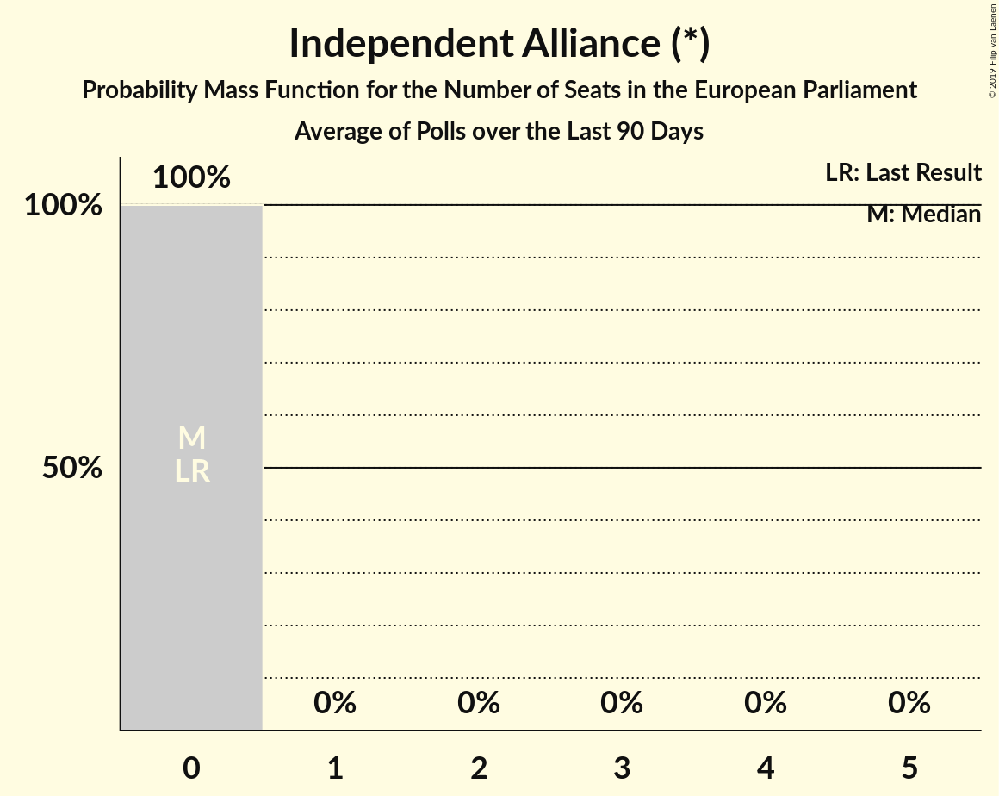

# Independent Alliance (*)

<a href="#voting-intentions">Voting Intentions</a> | <a href="#seats">Seats</a>

## Voting Intentions

Last result: **0.0%** (General Election of 24 May 2019)

### Confidence Intervals

| Period     | Polling firm/Commissioner(s) | Median | 80% Confidence Interval | 90% Confidence Interval | 95% Confidence Interval | 99% Confidence Interval |
|:----------:|:----------------:|:-----------:|:-----------------------:|:-----------------------:|:-----------------------:|:-----------------------:|
| N/A | [Poll Average](average.html) | 3.4% | 2.7–4.2% | 2.5–4.5% | 2.4–4.7% | 2.1–5.2% |
| [27 January–2 February 2020](2020-02-02-Survation.html) | Survation   Sinn Féin | 1.0% | N/A | N/A | N/A | N/A |
| [30 January–1 February 2020](2020-02-01-IpsosMRBI.html) | Ipsos MRBI   The Irish Times | 0.0% | N/A | N/A | N/A | N/A |
| [25–30 January 2020](2020-01-30-RedC.html) | Red C   The Sunday Business Post | 0.0% | N/A | N/A | N/A | N/A |
| [24–30 January 2020](2020-01-30-Panelbase.html) | Panelbase   The Times | 0.0% | N/A | N/A | N/A | N/A |
| [1–25 January 2020](2020-01-25-IrelandThinks.html) | Ireland Thinks   The Irish Daily Mail | 0.0% | N/A | N/A | N/A | N/A |
| [16–23 January 2020](2020-01-23-RedC.html) | Red C   The Sunday Business Post | 0.0% | N/A | N/A | N/A | N/A |
| [16–18 January 2020](2020-01-18-IpsosMRBI.html) | Ipsos MRBI   The Irish Times | 1.0% | 0.7–1.5% | 0.6–1.6% | 0.6–1.8% | 0.5–2.0% |
| [4–14 January 2020](2020-01-14-BehaviourandAttitudes.html) | Behaviour and Attitudes   The Sunday Times | 3.3% | 2.7–4.2% | 2.5–4.5% | 2.4–4.7% | 2.1–5.2% |
| [24 December 2019](2019-12-24-IrelandThinks.html) | Ireland Thinks   The Irish Daily Mail | 0.0% | N/A | N/A | N/A | N/A |
| [5–17 December 2019](2019-12-17-BehaviourandAttitudes.html) | Behaviour and Attitudes   The Sunday Times | 2.1% | 1.6–2.9% | 1.5–3.1% | 1.4–3.3% | 1.2–3.7% |
| [14–21 November 2019](2019-11-21-RedC.html) | Red C   The Sunday Business Post | 4.0% | 3.3–4.9% | 3.1–5.2% | 2.9–5.4% | 2.7–5.9% |
| [1–12 November 2019](2019-11-12-BehaviourandAttitudes.html) | Behaviour and Attitudes   The Sunday Times | 4.4% | 3.7–5.4% | 3.5–5.7% | 3.3–6.0% | 3.0–6.5% |
| [17–24 October 2019](2019-10-24-RedC.html) | Red C   The Sunday Business Post | 4.0% | 3.3–4.9% | 3.1–5.2% | 2.9–5.4% | 2.7–5.9% |
| [3–15 October 2019](2019-10-15-BehaviourandAttitudes.html) | Behaviour and Attitudes   The Sunday Times | 2.2% | 1.7–3.0% | 1.6–3.2% | 1.4–3.4% | 1.2–3.8% |
| [11–13 October 2019](2019-10-13-IpsosMRBI.html) | Ipsos MRBI   The Irish Times | 1.0% | 0.7–1.5% | 0.6–1.6% | 0.6–1.8% | 0.5–2.0% |
| [5–17 September 2019](2019-09-17-BehaviourandAttitudes.html) | Behaviour and Attitudes   The Sunday Times | 4.4% | 3.7–5.5% | 3.5–5.7% | 3.3–6.0% | 2.9–6.5% |
| [5–12 September 2019](2019-09-12-RedC.html) | Red C   The Sunday Business Post | 3.4% | 2.8–4.3% | 2.6–4.5% | 2.4–4.7% | 2.2–5.2% |
| [4–16 July 2019](2019-07-16-BehaviourandAttitudes.html) | Behaviour and Attitudes   The Sunday Times | 4.1% | 3.4–5.1% | 3.2–5.3% | 3.0–5.6% | 2.7–6.1% |
| [31 May–11 June 2019](2019-06-11-BehaviourandAttitudes.html) | Behaviour and Attitudes   The Sunday Times | 3.0% | 2.4–3.9% | 2.2–4.1% | 2.1–4.3% | 1.8–4.8% |

### Probability Mass Function

The following table shows the probability mass function per percentage block of voting intentions for the [poll average](average.html) for Independent Alliance (*).

| Voting Intentions | Probability | Accumulated | Special Marks |
|:-----------------:|:-----------:|:-----------:|:-------------:|
| 0.0–0.5% | 0% | 100% | Last Result |
| 0.5–1.5% | 0% | 100% |  |
| 1.5–2.5% | 6% | 100% |  |
| 2.5–3.5% | 54% | 94% | Median |
| 3.5–4.5% | 36% | 40% |  |
| 4.5–5.5% | 4% | 4% |  |
| 5.5–6.5% | 0.1% | 0.1% |  |
| 6.5–7.5% | 0% | 0% |  |

## Seats

Last result: **0** seats (General Election of 24 May 2019)

### Confidence Intervals

| Period     | Polling firm/Commissioner(s) | Median | 80% Confidence Interval | 90% Confidence Interval | 95% Confidence Interval | 99% Confidence Interval |
|:----------:|:----------------:|:------:|:-----------------------:|:-----------------------:|:-----------------------:|:-----------------------:|
| N/A | [Poll Average](average.html) | 0 | 0 | 0 | 0 | 0 |
| [27 January–2 February 2020](2020-02-02-Survation.html) | Survation   Sinn Féin |  |  |  |  |  |
| [30 January–1 February 2020](2020-02-01-IpsosMRBI.html) | Ipsos MRBI   The Irish Times |  |  |  |  |  |
| [25–30 January 2020](2020-01-30-RedC.html) | Red C   The Sunday Business Post |  |  |  |  |  |
| [24–30 January 2020](2020-01-30-Panelbase.html) | Panelbase   The Times |  |  |  |  |  |
| [1–25 January 2020](2020-01-25-IrelandThinks.html) | Ireland Thinks   The Irish Daily Mail |  |  |  |  |  |
| [16–23 January 2020](2020-01-23-RedC.html) | Red C   The Sunday Business Post |  |  |  |  |  |
| [16–18 January 2020](2020-01-18-IpsosMRBI.html) | Ipsos MRBI   The Irish Times | 0 | 0 | 0 | 0 | 0 |
| [4–14 January 2020](2020-01-14-BehaviourandAttitudes.html) | Behaviour and Attitudes   The Sunday Times | 0 | 0 | 0 | 0 | 0 |
| [24 December 2019](2019-12-24-IrelandThinks.html) | Ireland Thinks   The Irish Daily Mail |  |  |  |  |  |
| [5–17 December 2019](2019-12-17-BehaviourandAttitudes.html) | Behaviour and Attitudes   The Sunday Times | 0 | 0 | 0 | 0 | 0 |
| [14–21 November 2019](2019-11-21-RedC.html) | Red C   The Sunday Business Post | 0 | 0 | 0 | 0 | 0 |
| [1–12 November 2019](2019-11-12-BehaviourandAttitudes.html) | Behaviour and Attitudes   The Sunday Times | 0 | 0 | 0 | 0 | 0 |
| [17–24 October 2019](2019-10-24-RedC.html) | Red C   The Sunday Business Post | 0 | 0 | 0 | 0 | 0 |
| [3–15 October 2019](2019-10-15-BehaviourandAttitudes.html) | Behaviour and Attitudes   The Sunday Times | 0 | 0 | 0 | 0 | 0 |
| [11–13 October 2019](2019-10-13-IpsosMRBI.html) | Ipsos MRBI   The Irish Times | 0 | 0 | 0 | 0 | 0 |
| [5–17 September 2019](2019-09-17-BehaviourandAttitudes.html) | Behaviour and Attitudes   The Sunday Times | 0 | 0 | 0 | 0 | 0 |
| [5–12 September 2019](2019-09-12-RedC.html) | Red C   The Sunday Business Post | 0 | 0 | 0 | 0 | 0 |
| [4–16 July 2019](2019-07-16-BehaviourandAttitudes.html) | Behaviour and Attitudes   The Sunday Times | 0 | 0 | 0 | 0 | 0 |
| [31 May–11 June 2019](2019-06-11-BehaviourandAttitudes.html) | Behaviour and Attitudes   The Sunday Times | 0 | 0 | 0 | 0 | 0 |

### Probability Mass Function

The following table shows the probability mass function per seat for the [poll average](average.html) for Independent Alliance (*).

| Number of Seats | Probability | Accumulated | Special Marks |
|:---------------:|:-----------:|:-----------:|:-------------:|
| 0 | 100% | 100% | Last Result, Median |

