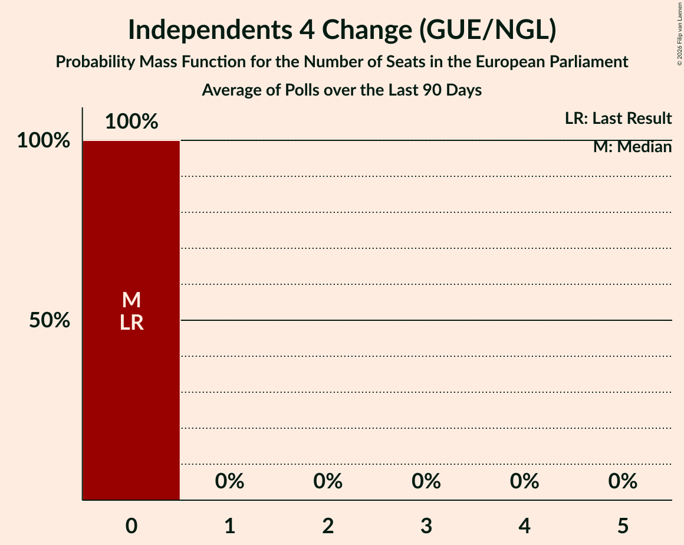

# Independents 4 Change (GUE/NGL)

<a href="#voting-intentions">Voting Intentions</a> | <a href="#seats">Seats</a>

## Voting Intentions

Last result: **0.0%** (General Election of 24 May 2019)

### Confidence Intervals

| Period     | Polling firm/Commissioner(s) | Median | 80% Confidence Interval | 90% Confidence Interval | 95% Confidence Interval | 99% Confidence Interval |
|:----------:|:----------------:|:-----------:|:-----------------------:|:-----------------------:|:-----------------------:|:-----------------------:|
| N/A | [Poll Average](average.html) | 0.3% | 0.1–0.6% | 0.1–0.7% | 0.1–0.8% | 0.1–1.1% |
| [5–17 September 2019](2019-09-17-BehaviourandAttitudes.html) | Behaviour and Attitudes   The Sunday Times | 0.2% | 0.1–0.6% | 0.1–0.7% | 0.1–0.8% | 0.0–1.0% |
| [5–12 September 2019](2019-09-12-RedC.html) | Red C   The Sunday Business Post | 0.3% | 0.2–0.7% | 0.1–0.8% | 0.1–0.9% | 0.1–1.1% |
| [4–16 July 2019](2019-07-16-BehaviourandAttitudes.html) | Behaviour and Attitudes   The Sunday Times | 2.5% | 2.0–3.4% | 1.8–3.6% | 1.7–3.8% | 1.5–4.2% |
| [31 May–11 June 2019](2019-06-11-BehaviourandAttitudes.html) | Behaviour and Attitudes   The Sunday Times | 4.1% | 3.4–5.1% | 3.2–5.4% | 3.0–5.6% | 2.7–6.1% |

### Probability Mass Function

The following table shows the probability mass function per percentage block of voting intentions for the [poll average](average.html) for Independents 4 Change (GUE/NGL).

| Voting Intentions | Probability | Accumulated | Special Marks |
|:-----------------:|:-----------:|:-----------:|:-------------:|
| 0.0–0.5% | 83% | 100% | Last Result, Median |
| 0.5–1.5% | 17% | 17% |  |
| 1.5–2.5% | 0% | 0% |  |

## Seats

Last result: **0** seats (General Election of 24 May 2019)

### Confidence Intervals

| Period     | Polling firm/Commissioner(s) | Median | 80% Confidence Interval | 90% Confidence Interval | 95% Confidence Interval | 99% Confidence Interval |
|:----------:|:----------------:|:------:|:-----------------------:|:-----------------------:|:-----------------------:|:-----------------------:|
| N/A | [Poll Average](average.html) | 0 | 0 | 0 | 0 | 0 |
| [5–17 September 2019](2019-09-17-BehaviourandAttitudes.html) | Behaviour and Attitudes   The Sunday Times | 0 | 0 | 0 | 0 | 0 |
| [5–12 September 2019](2019-09-12-RedC.html) | Red C   The Sunday Business Post | 0 | 0 | 0 | 0 | 0 |
| [4–16 July 2019](2019-07-16-BehaviourandAttitudes.html) | Behaviour and Attitudes   The Sunday Times | 0 | 0 | 0 | 0 | 0 |
| [31 May–11 June 2019](2019-06-11-BehaviourandAttitudes.html) | Behaviour and Attitudes   The Sunday Times | 0 | 0 | 0 | 0 | 0 |

### Probability Mass Function

The following table shows the probability mass function per seat for the [poll average](average.html) for Independents 4 Change (GUE/NGL).

| Number of Seats | Probability | Accumulated | Special Marks |
|:---------------:|:-----------:|:-----------:|:-------------:|
| 0 | 100% | 100% | Last Result, Median |

