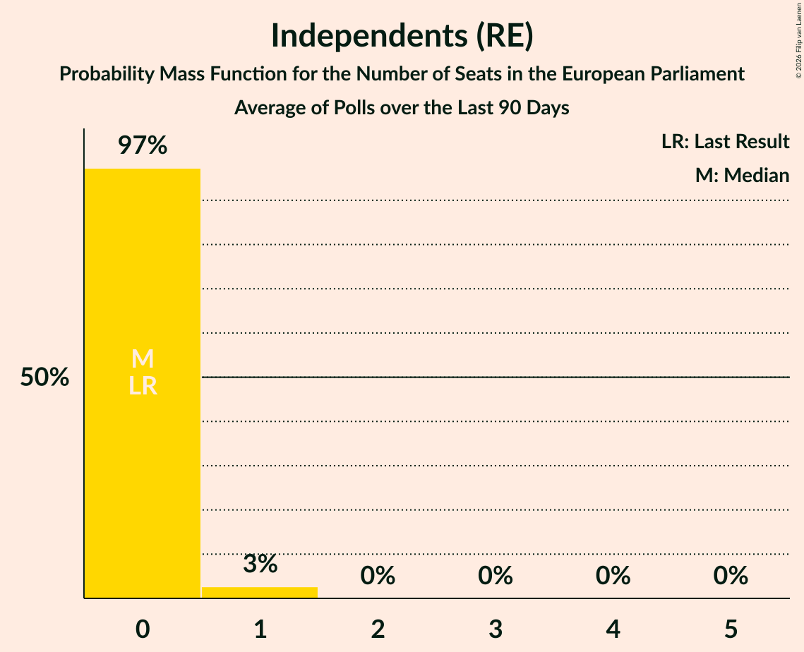

# Independents (RE)

<a href="#voting-intentions">Voting Intentions</a> | <a href="#seats">Seats</a>

## Voting Intentions

Last result: **0.0%** (General Election of 7 June 2024)

### Confidence Intervals

| Period     | Polling firm/Commissioner(s) | Median | 80% Confidence Interval | 90% Confidence Interval | 95% Confidence Interval | 99% Confidence Interval |
|:----------:|:----------------:|:-----------:|:-----------------------:|:-----------------------:|:-----------------------:|:-----------------------:|
| N/A | [Poll Average](average.html) | 1.8% | 1.2–2.6% | 1.1–2.8% | 1.0–3.0% | 0.9–3.4% |
| [31 October 2025](2025-10-31-IrelandThinks.html) | Ireland Thinks   Sunday Independent | 1.4% | 1.1–1.8% | 1.0–2.0% | 0.9–2.1% | 0.8–2.3% |
| [21 October 2025](2025-10-21-REDC.html) | RED C   Business Post | 1.8% | 1.3–2.4% | 1.2–2.6% | 1.1–2.8% | 0.9–3.2% |
| [13–15 October 2025](2025-10-15-IpsosBA.html) | Ipsos B&A   The Irish Times | 2.2% | 1.8–2.9% | 1.7–3.1% | 1.6–3.3% | 1.4–3.6% |
| [2–3 October 2025](2025-10-03-IrelandThinks.html) | Ireland Thinks   Sunday Independent | 1.6% | 1.2–2.1% | 1.2–2.3% | 1.1–2.4% | 0.9–2.6% |
| [4–9 September 2025](2025-09-09-REDC.html) | RED C   Business Post | 2.0% | 1.5–2.7% | 1.4–2.9% | 1.3–3.1% | 1.1–3.4% |
| [5 September 2025](2025-09-05-IrelandThinks.html) | Ireland Thinks   Sunday Independent | 1.7% | 1.4–2.3% | 1.3–2.4% | 1.2–2.5% | 1.0–2.8% |
| [1 August 2025](2025-08-01-IrelandThinks.html) | Ireland Thinks   Sunday Independent | 2.0% | 1.6–2.6% | 1.4–2.7% | 1.3–2.9% | 1.2–3.2% |
| [15 July 2025](2025-07-15-IpsosBA.html) | Ipsos B&A   The Irish Times | 2.3% | 1.9–3.0% | 1.7–3.2% | 1.6–3.4% | 1.4–3.7% |
| [4 July 2025](2025-07-04-IrelandThinks.html) | Ireland Thinks   Sunday Independent | 1.6% | 1.2–2.1% | 1.1–2.2% | 1.1–2.3% | 0.9–2.6% |
| [25 June 2025](2025-06-25-REDC.html) | RED C   Business Post | 2.0% | N/A | N/A | N/A | N/A |
| [30 May 2025](2025-05-30-IrelandThinks.html) | Ireland Thinks   Sunday Independent | 1.3% | 1.1–1.8% | 1.0–1.9% | 0.9–2.0% | 0.8–2.2% |
| [22 May 2025](2025-05-22-REDC.html) | RED C   Business Post | 1.7% | N/A | N/A | N/A | N/A |
| [1–2 May 2025](2025-05-02-IrelandThinks.html) | Ireland Thinks   Sunday Independent | 1.2% | 0.9–1.6% | 0.9–1.8% | 0.8–1.9% | 0.7–2.1% |
| [18–23 April 2025](2025-04-23-REDC.html) | RED C   Business Post | 1.3% | N/A | N/A | N/A | N/A |
| [17 April 2025](2025-04-17-IpsosBA.html) | Ipsos B&A   Irish Times | 1.9% | 1.5–2.5% | 1.4–2.7% | 1.3–2.9% | 1.1–3.2% |
| [3–4 April 2025](2025-04-04-IrelandThinks.html) | Ireland Thinks   Sunday Independent | 1.2% | 0.9–1.6% | 0.9–1.7% | 0.8–1.8% | 0.7–2.0% |
| [26 March 2025](2025-03-26-REDC.html) | RED C   Business Post | 1.9% | N/A | N/A | N/A | N/A |
| [28 February 2025](2025-02-28-IrelandThinks.html) | Ireland Thinks   Sunday Independent | 1.6% | 1.2–2.1% | 1.1–2.3% | 1.1–2.4% | 0.9–2.7% |
| [19 February 2025](2025-02-19-REDC.html) | RED C   Business Post | 1.6% | N/A | N/A | N/A | N/A |
| [31 January–1 February 2025](2025-02-01-IrelandThinks.html) | Ireland Thinks   Sunday Independent | 1.2% | 0.9–1.6% | 0.8–1.8% | 0.8–1.9% | 0.6–2.1% |
| [22 January 2025](2025-01-22-REDC.html) | RED C   Business Post | 1.9% | N/A | N/A | N/A | N/A |
| [10–11 January 2025](2025-01-11-IrelandThinks.html) | Ireland Thinks   Sunday Independent | 1.2% | 0.9–1.7% | 0.8–1.8% | 0.7–2.0% | 0.6–2.2% |
| [22–26 November 2024](2024-11-26-REDC.html) | RED C   Business Post | 2.0% | N/A | N/A | N/A | N/A |
| [20–23 November 2024](2024-11-23-IpsosBA.html) | Ipsos B&A   Irish Times | 2.2% | 1.6–2.7% | 1.5–2.9% | 1.4–3.1% | 1.2–3.4% |
| [21–22 November 2024](2024-11-22-IrelandThinks.html) | Ireland Thinks   Sunday Independent | 2.0% | 1.6–2.5% | 1.5–2.7% | 1.4–2.8% | 1.2–3.1% |
| [7–13 November 2024](2024-11-13-Opinions.html) | Opinions   The Sunday Times | 2.2% | 1.7–2.9% | 1.6–3.1% | 1.4–3.3% | 1.2–3.7% |
| [12–13 November 2024](2024-11-13-IpsosBA.html) | Ipsos B&A   Irish Times | 2.2% | 1.6–2.7% | 1.5–2.9% | 1.4–3.1% | 1.2–3.4% |
| [1–7 November 2024](2024-11-07-REDC.html) | RED C   Business Post | 2.2% | N/A | N/A | N/A | N/A |
| [1–2 November 2024](2024-11-02-IrelandThinks.html) | Ireland Thinks   Sunday Independent | 1.8% | 1.5–2.3% | 1.4–2.4% | 1.3–2.5% | 1.1–2.8% |
| [18–23 October 2024](2024-10-23-REDC.html) | RED C   Business Post | 2.3% | N/A | N/A | N/A | N/A |
| [16–22 October 2024](2024-10-22-REDC.html) | RED C   Business Post | 2.1% | N/A | N/A | N/A | N/A |
| [10–16 October 2024](2024-10-16-Opinions.html) | Opinions   The Sunday Times | 2.4% | 1.8–3.0% | 1.6–3.2% | 1.5–3.4% | 1.3–3.8% |
| [4 October 2024](2024-10-04-IrelandThinks.html) | Ireland Thinks   Sunday Independent | 1.7% | 1.3–2.1% | 1.2–2.3% | 1.1–2.4% | 0.9–2.7% |
| [13–19 September 2024](2024-09-19-Opinions.html) | Opinions   The Sunday Times | 2.1% | 1.6–2.8% | 1.5–3.0% | 1.4–3.2% | 1.2–3.6% |
| [14–17 September 2024](2024-09-17-IpsosBA.html) | Ipsos B&A   Irish Times | 1.7% | 1.3–2.3% | 1.2–2.4% | 1.1–2.6% | 0.9–2.9% |
| [5–10 September 2024](2024-09-10-REDC.html) | RED C   Business Post | 2.2% | N/A | N/A | N/A | N/A |
| [31 August 2024](2024-08-31-IrelandThinks.html) | Ireland Thinks   Sunday Independent | 2.0% | 1.6–2.5% | 1.4–2.7% | 1.4–2.8% | 1.2–3.1% |
| [29–30 August 2024](2024-08-30-IrelandThinks.html) | Ireland Thinks   Sunday Independent | 2.0% | 1.4–2.6% | 1.3–2.8% | 1.2–3.0% | 1.0–3.4% |
| [2 August 2024](2024-08-02-IrelandThinks.html) | Ireland Thinks   Sunday Independent | 1.9% | 1.5–2.4% | 1.4–2.6% | 1.3–2.7% | 1.1–3.0% |
| [5 July 2024](2024-07-05-IrelandThinks.html) | Ireland Thinks   Sunday Independent | 2.1% | 1.6–2.6% | 1.5–2.8% | 1.4–2.9% | 1.3–3.2% |
| [26 June 2024](2024-06-26-REDC.html) | RED C   Business Post | 2.1% | N/A | N/A | N/A | N/A |

### Probability Mass Function

The following table shows the probability mass function per percentage block of voting intentions for the [poll average](average.html) for Independents (RE).

| Voting Intentions | Probability | Accumulated | Special Marks |
|:-----------------:|:-----------:|:-----------:|:-------------:|
| 0.0–0.5% | 0% | 100% | Last Result |
| 0.5–1.5% | 32% | 100% |  |
| 1.5–2.5% | 56% | 68% | Median |
| 2.5–3.5% | 12% | 12% |  |
| 3.5–4.5% | 0.2% | 0.2% |  |
| 4.5–5.5% | 0% | 0% |  |

## Seats

Last result: **0** seats (General Election of 7 June 2024)

### Confidence Intervals

| Period     | Polling firm/Commissioner(s) | Median | 80% Confidence Interval | 90% Confidence Interval | 95% Confidence Interval | 99% Confidence Interval |
|:----------:|:----------------:|:------:|:-----------------------:|:-----------------------:|:-----------------------:|:-----------------------:|
| N/A | [Poll Average](average.html) | 0 | 0 | 0 | 0–1 | 0–1 |
| [31 October 2025](2025-10-31-IrelandThinks.html) | Ireland Thinks   Sunday Independent | 0 | 0 | 0 | 0 | 0 |
| [21 October 2025](2025-10-21-REDC.html) | RED C   Business Post | 0 | 0 | 0 | 0 | 0 |
| [13–15 October 2025](2025-10-15-IpsosBA.html) | Ipsos B&A   The Irish Times | 0 | 0–1 | 0–1 | 0–1 | 0–1 |
| [2–3 October 2025](2025-10-03-IrelandThinks.html) | Ireland Thinks   Sunday Independent | 0 | 0 | 0 | 0 | 0 |
| [4–9 September 2025](2025-09-09-REDC.html) | RED C   Business Post | 0 | 0 | 0–1 | 0–1 | 0–1 |
| [5 September 2025](2025-09-05-IrelandThinks.html) | Ireland Thinks   Sunday Independent | 0 | 0 | 0 | 0 | 0 |
| [1 August 2025](2025-08-01-IrelandThinks.html) | Ireland Thinks   Sunday Independent | 0 | 0 | 0 | 0–1 | 0–1 |
| [15 July 2025](2025-07-15-IpsosBA.html) | Ipsos B&A   The Irish Times | 0 | 0–1 | 0–1 | 0–1 | 0–1 |
| [4 July 2025](2025-07-04-IrelandThinks.html) | Ireland Thinks   Sunday Independent | 0 | 0 | 0 | 0 | 0 |
| [25 June 2025](2025-06-25-REDC.html) | RED C   Business Post |  |  |  |  |  |
| [30 May 2025](2025-05-30-IrelandThinks.html) | Ireland Thinks   Sunday Independent | 0 | 0 | 0 | 0 | 0 |
| [22 May 2025](2025-05-22-REDC.html) | RED C   Business Post |  |  |  |  |  |
| [1–2 May 2025](2025-05-02-IrelandThinks.html) | Ireland Thinks   Sunday Independent | 0 | 0 | 0 | 0 | 0 |
| [18–23 April 2025](2025-04-23-REDC.html) | RED C   Business Post |  |  |  |  |  |
| [17 April 2025](2025-04-17-IpsosBA.html) | Ipsos B&A   Irish Times | 0 | 0 | 0 | 0 | 0–1 |
| [3–4 April 2025](2025-04-04-IrelandThinks.html) | Ireland Thinks   Sunday Independent | 0 | 0 | 0 | 0 | 0 |
| [26 March 2025](2025-03-26-REDC.html) | RED C   Business Post |  |  |  |  |  |
| [28 February 2025](2025-02-28-IrelandThinks.html) | Ireland Thinks   Sunday Independent | 0 | 0 | 0 | 0 | 0 |
| [19 February 2025](2025-02-19-REDC.html) | RED C   Business Post |  |  |  |  |  |
| [31 January–1 February 2025](2025-02-01-IrelandThinks.html) | Ireland Thinks   Sunday Independent | 0 | 0 | 0 | 0 | 0 |
| [22 January 2025](2025-01-22-REDC.html) | RED C   Business Post |  |  |  |  |  |
| [10–11 January 2025](2025-01-11-IrelandThinks.html) | Ireland Thinks   Sunday Independent | 0 | 0 | 0 | 0 | 0 |
| [22–26 November 2024](2024-11-26-REDC.html) | RED C   Business Post |  |  |  |  |  |
| [20–23 November 2024](2024-11-23-IpsosBA.html) | Ipsos B&A   Irish Times | 0 | 0–1 | 0–1 | 0–1 | 0–1 |
| [21–22 November 2024](2024-11-22-IrelandThinks.html) | Ireland Thinks   Sunday Independent | 0 | 0 | 0 | 0–1 | 0–1 |
| [7–13 November 2024](2024-11-13-Opinions.html) | Opinions   The Sunday Times | 0 | 0 | 0 | 0–1 | 0–1 |
| [12–13 November 2024](2024-11-13-IpsosBA.html) | Ipsos B&A   Irish Times | 0 | 0–1 | 0–1 | 0–1 | 0–1 |
| [1–7 November 2024](2024-11-07-REDC.html) | RED C   Business Post |  |  |  |  |  |
| [1–2 November 2024](2024-11-02-IrelandThinks.html) | Ireland Thinks   Sunday Independent | 0 | 0 | 0 | 0 | 0 |
| [18–23 October 2024](2024-10-23-REDC.html) | RED C   Business Post |  |  |  |  |  |
| [16–22 October 2024](2024-10-22-REDC.html) | RED C   Business Post |  |  |  |  |  |
| [10–16 October 2024](2024-10-16-Opinions.html) | Opinions   The Sunday Times | 0 | 0–1 | 0–1 | 0–1 | 0–1 |
| [4 October 2024](2024-10-04-IrelandThinks.html) | Ireland Thinks   Sunday Independent | 0 | 0 | 0 | 0 | 0 |
| [13–19 September 2024](2024-09-19-Opinions.html) | Opinions   The Sunday Times | 0 | 0–1 | 0–1 | 0–1 | 0–1 |
| [14–17 September 2024](2024-09-17-IpsosBA.html) | Ipsos B&A   Irish Times | 0 | 0 | 0 | 0 | 0 |
| [5–10 September 2024](2024-09-10-REDC.html) | RED C   Business Post |  |  |  |  |  |
| [31 August 2024](2024-08-31-IrelandThinks.html) | Ireland Thinks   Sunday Independent | 0 | 0 | 0 | 0 | 0–1 |
| [29–30 August 2024](2024-08-30-IrelandThinks.html) | Ireland Thinks   Sunday Independent | 0 | 0 | 0 | 0 | 0–1 |
| [2 August 2024](2024-08-02-IrelandThinks.html) | Ireland Thinks   Sunday Independent | 0 | 0 | 0 | 0 | 0–1 |
| [5 July 2024](2024-07-05-IrelandThinks.html) | Ireland Thinks   Sunday Independent | 0 | 0 | 0 | 0 | 0–1 |
| [26 June 2024](2024-06-26-REDC.html) | RED C   Business Post |  |  |  |  |  |

### Probability Mass Function

The following table shows the probability mass function per seat for the [poll average](average.html) for Independents (RE).

| Number of Seats | Probability | Accumulated | Special Marks |
|:---------------:|:-----------:|:-----------:|:-------------:|
| 0 | 96% | 100% | Last Result, Median |
| 1 | 4% | 4% |  |
| 2 | 0% | 0% |  |

