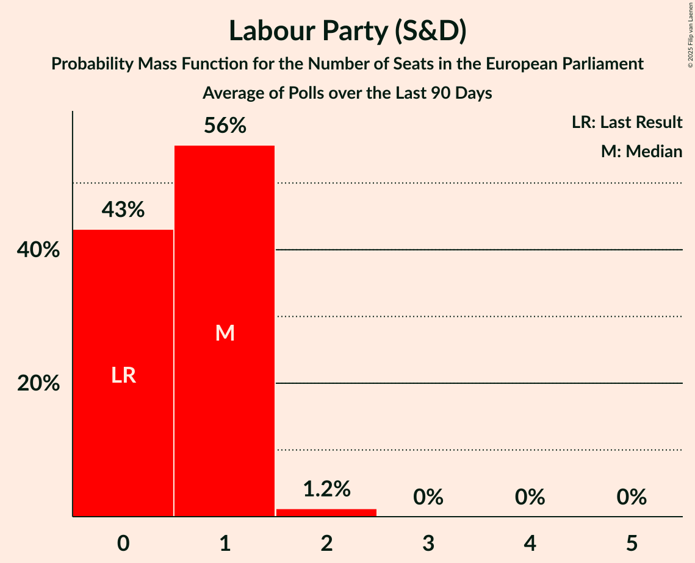

# Labour Party (S&D)

<a href="#voting-intentions">Voting Intentions</a> | <a href="#seats">Seats</a>

## Voting Intentions

Last result: **0.0%** (General Election of 7 June 2024)

### Confidence Intervals

| Period     | Polling firm/Commissioner(s) | Median | 80% Confidence Interval | 90% Confidence Interval | 95% Confidence Interval | 99% Confidence Interval |
|:----------:|:----------------:|:-----------:|:-----------------------:|:-----------------------:|:-----------------------:|:-----------------------:|
| N/A | [Poll Average](average.html) | 3.6% | 2.6–4.7% | 2.4–5.0% | 2.2–5.3% | 2.0–5.8% |
| [29–30 August 2024](2024-08-30-IrelandThinks.html) | Ireland Thinks   Sunday Independent | 4.0% | 3.3–5.0% | 3.1–5.3% | 3.0–5.5% | 2.6–6.0% |
| [2 August 2024](2024-08-02-IrelandThinks.html) | Ireland Thinks   Sunday Independent | 4.0% | 3.4–4.8% | 3.3–5.0% | 3.1–5.2% | 2.9–5.6% |
| [5 July 2024](2024-07-05-IrelandThinks.html) | Ireland Thinks   Sunday Independent | 3.0% | 2.5–3.7% | 2.4–3.9% | 2.2–4.0% | 2.0–4.4% |
| [26 June 2024](2024-06-26-RedC.html) | Red C   Business Post | 3.0% | 2.4–3.8% | 2.2–4.1% | 2.1–4.3% | 1.9–4.7% |

### Probability Mass Function

The following table shows the probability mass function per percentage block of voting intentions for the [poll average](average.html) for Labour Party (S&D).

| Voting Intentions | Probability | Accumulated | Special Marks |
|:-----------------:|:-----------:|:-----------:|:-------------:|
| 0.0–0.5% | 0% | 100% | Last Result |
| 0.5–1.5% | 0% | 100% |  |
| 1.5–2.5% | 8% | 100% |  |
| 2.5–3.5% | 42% | 92% |  |
| 3.5–4.5% | 38% | 50% | Median |
| 4.5–5.5% | 12% | 13% |  |
| 5.5–6.5% | 1.0% | 1.0% |  |
| 6.5–7.5% | 0% | 0% |  |

## Seats

Last result: **0** seats (General Election of 7 June 2024)

### Confidence Intervals

| Period     | Polling firm/Commissioner(s) | Median | 80% Confidence Interval | 90% Confidence Interval | 95% Confidence Interval | 99% Confidence Interval |
|:----------:|:----------------:|:------:|:-----------------------:|:-----------------------:|:-----------------------:|:-----------------------:|
| N/A | [Poll Average](average.html) | 0 | 0–1 | 0–1 | 0–1 | 0–1 |
| [29–30 August 2024](2024-08-30-IrelandThinks.html) | Ireland Thinks   Sunday Independent | 1 | 0–1 | 0–1 | 0–1 | 0–1 |
| [2 August 2024](2024-08-02-IrelandThinks.html) | Ireland Thinks   Sunday Independent | 1 | 0–1 | 0–1 | 0–1 | 0–1 |
| [5 July 2024](2024-07-05-IrelandThinks.html) | Ireland Thinks   Sunday Independent | 0 | 0 | 0 | 0 | 0–1 |
| [26 June 2024](2024-06-26-RedC.html) | Red C   Business Post | 0 | 0 | 0 | 0 | 0 |

### Probability Mass Function

The following table shows the probability mass function per seat for the [poll average](average.html) for Labour Party (S&D).

| Number of Seats | Probability | Accumulated | Special Marks |
|:---------------:|:-----------:|:-----------:|:-------------:|
| 0 | 56% | 100% | Last Result, Median |
| 1 | 44% | 44% |  |
| 2 | 0% | 0% |  |

