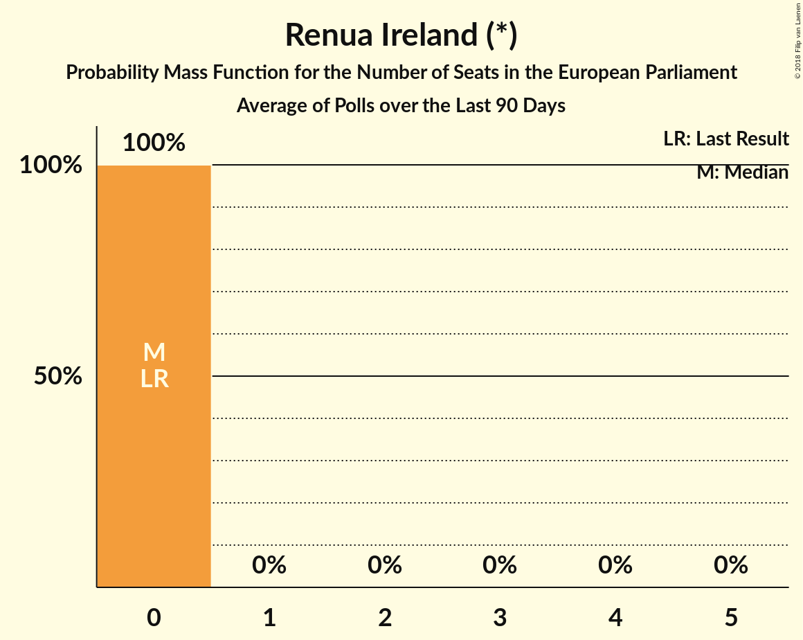

# Renua Ireland (*)

<a href="#voting-intentions">Voting Intentions</a> | <a href="#seats">Seats</a>

## Voting Intentions

Last result: **0.0%** (General Election of 23 May 2014)

### Confidence Intervals

| Period     | Polling firm/Commissioner(s) | Median | 80% Confidence Interval | 90% Confidence Interval | 95% Confidence Interval | 99% Confidence Interval |
|:----------:|:----------------:|:-----------:|:-----------------------:|:-----------------------:|:-----------------------:|:-----------------------:|
| N/A | [Poll Average](average.html) | 0.6% | 0.2–1.4% | 0.1–1.6% | 0.1–1.7% | 0.0–2.0% |
| [28 February–12 March 2019](2019-03-12-BehaviourandAttitudes.html) | Behaviour and Attitudes   The Sunday Times | 0.2% | 0.1–0.6% | 0.1–0.7% | 0.1–0.8% | 0.0–1.0% |
| [4–5 March 2019](2019-03-05-IpsosMRBI.html) | Ipsos MRBI   The Irish Times | 0.0% | N/A | N/A | N/A | N/A |
| [14–20 February 2019](2019-02-20-RedC.html) | Red C   The Sunday Business Post | 0.2% | 0.1–0.5% | 0.1–0.6% | 0.1–0.7% | 0.0–0.9% |
| [31 January–12 February 2019](2019-02-12-BehaviourandAttitudes.html) | Behaviour and Attitudes   The Sunday Times | 1.0% | 0.7–1.6% | 0.6–1.7% | 0.5–1.9% | 0.4–2.2% |
| [17–24 January 2019](2019-01-24-RedC.html) | Red C   The Sunday Business Post | 0.3% | 0.2–0.7% | 0.1–0.8% | 0.1–0.9% | 0.1–1.1% |
| [4–15 January 2019](2019-01-15-BehaviourandAttitudes.html) | Behaviour and Attitudes   The Sunday Times | 0.0% | N/A | N/A | N/A | N/A |
| [14–21 December 2018](2018-12-21-IrelandThinks.html) | Ireland Thinks   The Irish Daily Mail | 0.0% | N/A | N/A | N/A | N/A |
| [6–18 December 2018](2018-12-18-BehaviourandAttitudes.html) | Behaviour and Attitudes   The Sunday Times | 0.0% | N/A | N/A | N/A | N/A |
| [1–13 December 2018](2018-12-13-MillwardBrown.html) | Millward Brown   The Sunday Independent | 0.0% | N/A | N/A | N/A | N/A |
| [15–22 November 2018](2018-11-22-RedC.html) | Red C   The Sunday Business Post | 0.2% | 0.1–0.5% | 0.1–0.6% | 0.1–0.7% | 0.0–0.9% |
| [1–13 November 2018](2018-11-13-BehaviourandAttitudes.html) | Behaviour and Attitudes   The Sunday Times | 0.0% | N/A | N/A | N/A | N/A |
| [26 October 2018](2018-10-26-RedC.html) | Red C   RTÉ | 0.3% | 0.2–0.4% | 0.2–0.5% | 0.1–0.5% | 0.1–0.6% |
| [11–17 October 2018](2018-10-17-RedC.html) | Red C   The Sunday Business Post | 0.0% | N/A | N/A | N/A | N/A |
| [5–16 October 2018](2018-10-16-BehaviourandAttitudes.html) | Behaviour and Attitudes   The Sunday Times | 0.2% | 0.1–0.6% | 0.1–0.7% | 0.1–0.8% | 0.0–1.0% |
| [10–12 October 2018](2018-10-12-IpsosMRBI.html) | Ipsos MRBI   The Irish Times | 0.0% | N/A | N/A | N/A | N/A |
| [3–10 October 2018](2018-10-10-RedC.html) | Red C   Paddy Power | 0.2% | 0.1–0.5% | 0.1–0.6% | 0.1–0.7% | 0.0–0.9% |
| [6–18 September 2018](2018-09-18-BehaviourandAttitudes.html) | Behaviour and Attitudes   The Sunday Times | 0.2% | 0.1–0.6% | 0.1–0.7% | 0.1–0.8% | 0.0–1.0% |
| [6–13 September 2018](2018-09-13-RedC.html) | Red C   The Sunday Business Post | 1.0% | 0.7–1.5% | 0.6–1.7% | 0.5–1.8% | 0.4–2.1% |
| [15–24 August 2018](2018-08-24-IrelandThinks.html) | Ireland Thinks   The Irish Daily Mail | 0.0% | N/A | N/A | N/A | N/A |
| [5–17 July 2018](2018-07-17-BehaviourandAttitudes.html) | Behaviour and Attitudes   The Sunday Times | 0.2% | 0.1–0.6% | 0.1–0.7% | 0.1–0.8% | 0.0–1.0% |
| [12 June 2018](2018-06-12-BehaviourandAttitudes.html) | Behaviour and Attitudes   The Sunday Times | 0.2% | 0.1–0.6% | 0.1–0.7% | 0.1–0.8% | 0.0–1.0% |
| [10–16 May 2018](2018-05-16-RedC.html) | Red C   The Sunday Business Post | 0.2% | 0.1–0.5% | 0.1–0.6% | 0.1–0.7% | 0.0–0.9% |
| [3–15 May 2018](2018-05-15-BehaviourandAttitudes.html) | Behaviour and Attitudes   The Sunday Times | 0.0% | N/A | N/A | N/A | N/A |
| [19–30 April 2018](2018-04-30-MillwardBrown.html) | Millward Brown   The Sunday Independent | 0.0% | N/A | N/A | N/A | N/A |
| [26 April 2018](2018-04-26-RedC.html) | Red C   The Sunday Business Post | 1.0% | 0.7–1.5% | 0.6–1.7% | 0.5–1.8% | 0.4–2.1% |
| [16–17 April 2018](2018-04-17-IpsosMRBI.html) | Ipsos MRBI   The Irish Times | 0.0% | N/A | N/A | N/A | N/A |
| [5–17 April 2018](2018-04-17-BehaviourandAttitudes.html) | Behaviour and Attitudes   The Sunday Times | 1.0% | 0.7–1.5% | 0.6–1.7% | 0.5–1.8% | 0.4–2.1% |
| [15–22 March 2018](2018-03-22-RedC.html) | Red C   The Sunday Business Post | 2.0% | 1.5–2.7% | 1.4–2.9% | 1.3–3.1% | 1.1–3.4% |
| [6–13 March 2018](2018-03-13-BehaviourandAttitudes.html) | Behaviour and Attitudes   The Sunday Times | 0.0% | N/A | N/A | N/A | N/A |
| [15–22 February 2018](2018-02-22-RedC.html) | Red C   The Sunday Business Post | 1.0% | 0.7–1.5% | 0.6–1.7% | 0.5–1.8% | 0.4–2.1% |
| [6–14 February 2018](2018-02-14-MillwardBrown.html) | Millward Brown   The Sunday Independent | 0.0% | N/A | N/A | N/A | N/A |
| [1–13 February 2018](2018-02-13-BehaviourandAttitudes.html) | Behaviour and Attitudes   The Sunday Times | 0.0% | N/A | N/A | N/A | N/A |
| [15–25 January 2018](2018-01-25-RedC.html) | Red C   The Sunday Business Post | 0.3% | 0.2–0.7% | 0.1–0.8% | 0.1–0.9% | 0.1–1.1% |
| [22–23 January 2018](2018-01-23-IpsosMRBI.html) | Ipsos MRBI   The Irish Times | 0.0% | N/A | N/A | N/A | N/A |
| [4–16 January 2018](2018-01-16-BehaviourandAttitudes.html) | Behaviour and Attitudes   The Sunday Times | 0.0% | N/A | N/A | N/A | N/A |

### Probability Mass Function

The following table shows the probability mass function per percentage block of voting intentions for the [poll average](average.html) for Renua Ireland (*).

| Voting Intentions | Probability | Accumulated | Special Marks |
|:-----------------:|:-----------:|:-----------:|:-------------:|
| 0.0–0.5% | 47% | 100% | Last Result |
| 0.5–1.5% | 48% | 53% | Median |
| 1.5–2.5% | 5% | 5% |  |
| 2.5–3.5% | 0% | 0% |  |

## Seats

Last result: **0** seats (General Election of 23 May 2014)

### Confidence Intervals

| Period     | Polling firm/Commissioner(s) | Median | 80% Confidence Interval | 90% Confidence Interval | 95% Confidence Interval | 99% Confidence Interval |
|:----------:|:----------------:|:------:|:-----------------------:|:-----------------------:|:-----------------------:|:-----------------------:|
| N/A | [Poll Average](average.html) | 0 | 0 | 0 | 0 | 0 |
| [28 February–12 March 2019](2019-03-12-BehaviourandAttitudes.html) | Behaviour and Attitudes   The Sunday Times | 0 | 0 | 0 | 0 | 0 |
| [4–5 March 2019](2019-03-05-IpsosMRBI.html) | Ipsos MRBI   The Irish Times |  |  |  |  |  |
| [14–20 February 2019](2019-02-20-RedC.html) | Red C   The Sunday Business Post | 0 | 0 | 0 | 0 | 0 |
| [31 January–12 February 2019](2019-02-12-BehaviourandAttitudes.html) | Behaviour and Attitudes   The Sunday Times | 0 | 0 | 0 | 0 | 0 |
| [17–24 January 2019](2019-01-24-RedC.html) | Red C   The Sunday Business Post | 0 | 0 | 0 | 0 | 0 |
| [4–15 January 2019](2019-01-15-BehaviourandAttitudes.html) | Behaviour and Attitudes   The Sunday Times |  |  |  |  |  |
| [14–21 December 2018](2018-12-21-IrelandThinks.html) | Ireland Thinks   The Irish Daily Mail |  |  |  |  |  |
| [6–18 December 2018](2018-12-18-BehaviourandAttitudes.html) | Behaviour and Attitudes   The Sunday Times |  |  |  |  |  |
| [1–13 December 2018](2018-12-13-MillwardBrown.html) | Millward Brown   The Sunday Independent |  |  |  |  |  |
| [15–22 November 2018](2018-11-22-RedC.html) | Red C   The Sunday Business Post | 0 | 0 | 0 | 0 | 0 |
| [1–13 November 2018](2018-11-13-BehaviourandAttitudes.html) | Behaviour and Attitudes   The Sunday Times |  |  |  |  |  |
| [26 October 2018](2018-10-26-RedC.html) | Red C   RTÉ | 0 | 0 | 0 | 0 | 0 |
| [11–17 October 2018](2018-10-17-RedC.html) | Red C   The Sunday Business Post |  |  |  |  |  |
| [5–16 October 2018](2018-10-16-BehaviourandAttitudes.html) | Behaviour and Attitudes   The Sunday Times | 0 | 0 | 0 | 0 | 0 |
| [10–12 October 2018](2018-10-12-IpsosMRBI.html) | Ipsos MRBI   The Irish Times |  |  |  |  |  |
| [3–10 October 2018](2018-10-10-RedC.html) | Red C   Paddy Power | 0 | 0 | 0 | 0 | 0 |
| [6–18 September 2018](2018-09-18-BehaviourandAttitudes.html) | Behaviour and Attitudes   The Sunday Times | 0 | 0 | 0 | 0 | 0 |
| [6–13 September 2018](2018-09-13-RedC.html) | Red C   The Sunday Business Post | 0 | 0 | 0 | 0 | 0 |
| [15–24 August 2018](2018-08-24-IrelandThinks.html) | Ireland Thinks   The Irish Daily Mail |  |  |  |  |  |
| [5–17 July 2018](2018-07-17-BehaviourandAttitudes.html) | Behaviour and Attitudes   The Sunday Times | 0 | 0 | 0 | 0 | 0 |
| [12 June 2018](2018-06-12-BehaviourandAttitudes.html) | Behaviour and Attitudes   The Sunday Times | 0 | 0 | 0 | 0 | 0 |
| [10–16 May 2018](2018-05-16-RedC.html) | Red C   The Sunday Business Post | 0 | 0 | 0 | 0 | 0 |
| [3–15 May 2018](2018-05-15-BehaviourandAttitudes.html) | Behaviour and Attitudes   The Sunday Times |  |  |  |  |  |
| [19–30 April 2018](2018-04-30-MillwardBrown.html) | Millward Brown   The Sunday Independent |  |  |  |  |  |
| [26 April 2018](2018-04-26-RedC.html) | Red C   The Sunday Business Post | 0 | 0 | 0 | 0 | 0 |
| [16–17 April 2018](2018-04-17-IpsosMRBI.html) | Ipsos MRBI   The Irish Times |  |  |  |  |  |
| [5–17 April 2018](2018-04-17-BehaviourandAttitudes.html) | Behaviour and Attitudes   The Sunday Times | 0 | 0 | 0 | 0 | 0 |
| [15–22 March 2018](2018-03-22-RedC.html) | Red C   The Sunday Business Post | 0 | 0 | 0 | 0 | 0 |
| [6–13 March 2018](2018-03-13-BehaviourandAttitudes.html) | Behaviour and Attitudes   The Sunday Times |  |  |  |  |  |
| [15–22 February 2018](2018-02-22-RedC.html) | Red C   The Sunday Business Post | 0 | 0 | 0 | 0 | 0 |
| [6–14 February 2018](2018-02-14-MillwardBrown.html) | Millward Brown   The Sunday Independent |  |  |  |  |  |
| [1–13 February 2018](2018-02-13-BehaviourandAttitudes.html) | Behaviour and Attitudes   The Sunday Times |  |  |  |  |  |
| [15–25 January 2018](2018-01-25-RedC.html) | Red C   The Sunday Business Post | 0 | 0 | 0 | 0 | 0 |
| [22–23 January 2018](2018-01-23-IpsosMRBI.html) | Ipsos MRBI   The Irish Times |  |  |  |  |  |
| [4–16 January 2018](2018-01-16-BehaviourandAttitudes.html) | Behaviour and Attitudes   The Sunday Times |  |  |  |  |  |

### Probability Mass Function

The following table shows the probability mass function per seat for the [poll average](average.html) for Renua Ireland (*).

| Number of Seats | Probability | Accumulated | Special Marks |
|:---------------:|:-----------:|:-----------:|:-------------:|
| 0 | 100% | 100% | Last Result, Median |

