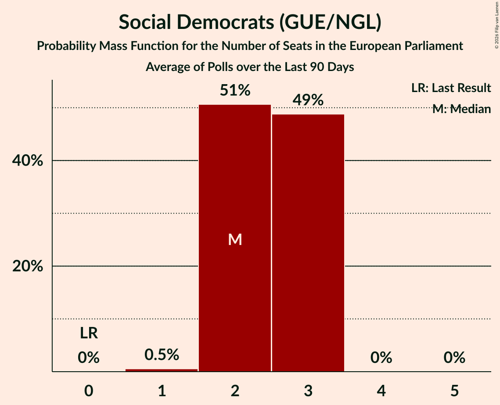

# Social Democrats (GUE/NGL)

<a href="#voting-intentions">Voting Intentions</a> | <a href="#seats">Seats</a>

## Voting Intentions

Last result: **0.0%** (General Election of 7 June 2024)

### Confidence Intervals

| Period     | Polling firm/Commissioner(s) | Median | 80% Confidence Interval | 90% Confidence Interval | 95% Confidence Interval | 99% Confidence Interval |
|:----------:|:----------------:|:-----------:|:-----------------------:|:-----------------------:|:-----------------------:|:-----------------------:|
| N/A | [Poll Average](average.html) | 12.0% | 10.8–13.3% | 10.5–13.7% | 10.2–14.0% | 9.7–14.7% |
| [3 July 2026](2026-07-03-IrelandThinks.html) | Ireland Thinks   Sunday Independent | 12.0% | 10.9–13.2% | 10.6–13.5% | 10.3–13.9% | 9.8–14.5% |
| [24 June 2026](2026-06-24-REDC.html) | RED C   Business Post | 12.0% | 10.8–13.4% | 10.4–13.8% | 10.1–14.1% | 9.6–14.8% |
| [5 June 2026](2026-06-05-IrelandThinks.html) | Ireland Thinks   Sunday Independent | 12.0% | 11.0–13.1% | 10.7–13.4% | 10.5–13.7% | 10.0–14.2% |
| [22–27 May 2026](2026-05-27-REDC.html) | RED C   Business Post | 10.0% | 8.9–11.3% | 8.6–11.7% | 8.3–12.0% | 7.8–12.7% |
| [1 May 2026](2026-05-01-IrelandThinks.html) | Ireland Thinks   Sunday Independent | 9.0% | 8.2–10.0% | 8.0–10.2% | 7.8–10.5% | 7.4–10.9% |
| [17–22 April 2026](2026-04-22-REDC.html) | RED C   Business Post | 8.0% | N/A | N/A | N/A | N/A |
| [2–3 April 2026](2026-04-03-IrelandThinks.html) | Ireland Thinks   Sunday Independent | 9.0% | N/A | N/A | N/A | N/A |
| [20–25 March 2026](2026-03-25-REDC.html) | RED C   Business Post | 8.0% | N/A | N/A | N/A | N/A |
| [27 February 2026](2026-02-27-IrelandThinks.html) | Ireland Thinks   Sunday Independent | 10.9% | N/A | N/A | N/A | N/A |
| [13–19 February 2026](2026-02-19-REDC.html) | RED C   Business Post | 9.0% | N/A | N/A | N/A | N/A |
| [3 February 2026](2026-02-03-IpsosBA.html) | Ipsos B&A   The Irish Times | 6.9% | N/A | N/A | N/A | N/A |
| [30 January 2026](2026-01-30-IrelandThinks.html) | Ireland Thinks   Sunday Independent | 10.0% | N/A | N/A | N/A | N/A |
| [16–21 January 2026](2026-01-21-REDC.html) | RED C   Business Post | 10.0% | N/A | N/A | N/A | N/A |
| [19 December 2025](2025-12-19-IrelandThinks.html) | Ireland Thinks   Sunday Independent | 10.0% | N/A | N/A | N/A | N/A |
| [4–5 December 2025](2025-12-05-IrelandThinks.html) | Ireland Thinks   Sunday Independent | 8.0% | N/A | N/A | N/A | N/A |
| [26 November 2025](2025-11-26-REDC.html) | RED C   Business Post | 8.0% | N/A | N/A | N/A | N/A |
| [31 October 2025](2025-10-31-IrelandThinks.html) | Ireland Thinks   Sunday Independent | 9.0% | N/A | N/A | N/A | N/A |
| [21 October 2025](2025-10-21-REDC.html) | RED C   Business Post | 9.0% | N/A | N/A | N/A | N/A |
| [13–15 October 2025](2025-10-15-IpsosBA.html) | Ipsos B&A   The Irish Times | 5.0% | N/A | N/A | N/A | N/A |
| [2–3 October 2025](2025-10-03-IrelandThinks.html) | Ireland Thinks   Sunday Independent | 8.0% | N/A | N/A | N/A | N/A |
| [4–9 September 2025](2025-09-09-REDC.html) | RED C   Business Post | 7.0% | N/A | N/A | N/A | N/A |
| [5 September 2025](2025-09-05-IrelandThinks.html) | Ireland Thinks   Sunday Independent | 7.0% | N/A | N/A | N/A | N/A |
| [1 August 2025](2025-08-01-IrelandThinks.html) | Ireland Thinks   Sunday Independent | 8.0% | N/A | N/A | N/A | N/A |
| [15 July 2025](2025-07-15-IpsosBA.html) | Ipsos B&A   The Irish Times | 6.0% | N/A | N/A | N/A | N/A |
| [4 July 2025](2025-07-04-IrelandThinks.html) | Ireland Thinks   Sunday Independent | 8.0% | N/A | N/A | N/A | N/A |
| [25 June 2025](2025-06-25-REDC.html) | RED C   Business Post | 7.0% | N/A | N/A | N/A | N/A |
| [30 May 2025](2025-05-30-IrelandThinks.html) | Ireland Thinks   Sunday Independent | 9.0% | N/A | N/A | N/A | N/A |
| [22 May 2025](2025-05-22-REDC.html) | RED C   Business Post | 7.0% | N/A | N/A | N/A | N/A |
| [1–2 May 2025](2025-05-02-IrelandThinks.html) | Ireland Thinks   Sunday Independent | 8.0% | N/A | N/A | N/A | N/A |
| [18–23 April 2025](2025-04-23-REDC.html) | RED C   Business Post | 7.0% | N/A | N/A | N/A | N/A |
| [17 April 2025](2025-04-17-IpsosBA.html) | Ipsos B&A   Irish Times | 7.0% | N/A | N/A | N/A | N/A |
| [3–4 April 2025](2025-04-04-IrelandThinks.html) | Ireland Thinks   Sunday Independent | 7.9% | N/A | N/A | N/A | N/A |
| [26 March 2025](2025-03-26-REDC.html) | RED C   Business Post | 7.0% | N/A | N/A | N/A | N/A |
| [28 February 2025](2025-02-28-IrelandThinks.html) | Ireland Thinks   Sunday Independent | 7.0% | N/A | N/A | N/A | N/A |
| [19 February 2025](2025-02-19-REDC.html) | RED C   Business Post | 7.0% | N/A | N/A | N/A | N/A |
| [31 January–1 February 2025](2025-02-01-IrelandThinks.html) | Ireland Thinks   Sunday Independent | 8.0% | N/A | N/A | N/A | N/A |
| [22 January 2025](2025-01-22-REDC.html) | RED C   Business Post | 7.0% | N/A | N/A | N/A | N/A |
| [10–11 January 2025](2025-01-11-IrelandThinks.html) | Ireland Thinks   Sunday Independent | 7.3% | N/A | N/A | N/A | N/A |
| [22–26 November 2024](2024-11-26-REDC.html) | RED C   Business Post | 6.0% | N/A | N/A | N/A | N/A |
| [20–23 November 2024](2024-11-23-IpsosBA.html) | Ipsos B&A   Irish Times | 6.0% | N/A | N/A | N/A | N/A |
| [21–22 November 2024](2024-11-22-IrelandThinks.html) | Ireland Thinks   Sunday Independent | 5.0% | N/A | N/A | N/A | N/A |
| [7–13 November 2024](2024-11-13-Opinions.html) | Opinions   The Sunday Times | 6.0% | N/A | N/A | N/A | N/A |
| [12–13 November 2024](2024-11-13-IpsosBA.html) | Ipsos B&A   Irish Times | 4.0% | N/A | N/A | N/A | N/A |
| [1–7 November 2024](2024-11-07-REDC.html) | RED C   Business Post | 6.0% | N/A | N/A | N/A | N/A |
| [1–2 November 2024](2024-11-02-IrelandThinks.html) | Ireland Thinks   Sunday Independent | 6.0% | N/A | N/A | N/A | N/A |
| [18–23 October 2024](2024-10-23-REDC.html) | RED C   Business Post | 5.0% | N/A | N/A | N/A | N/A |
| [16–22 October 2024](2024-10-22-REDC.html) | RED C   Business Post | 5.0% | N/A | N/A | N/A | N/A |
| [10–16 October 2024](2024-10-16-Opinions.html) | Opinions   The Sunday Times | 5.0% | N/A | N/A | N/A | N/A |
| [4 October 2024](2024-10-04-IrelandThinks.html) | Ireland Thinks   Sunday Independent | 5.9% | N/A | N/A | N/A | N/A |
| [13–19 September 2024](2024-09-19-Opinions.html) | Opinions   The Sunday Times | 5.0% | N/A | N/A | N/A | N/A |
| [14–17 September 2024](2024-09-17-IpsosBA.html) | Ipsos B&A   Irish Times | 4.0% | N/A | N/A | N/A | N/A |
| [5–10 September 2024](2024-09-10-REDC.html) | RED C   Business Post | 6.0% | N/A | N/A | N/A | N/A |
| [31 August 2024](2024-08-31-IrelandThinks.html) | Ireland Thinks   Sunday Independent | 4.0% | N/A | N/A | N/A | N/A |
| [29–30 August 2024](2024-08-30-IrelandThinks.html) | Ireland Thinks   Sunday Independent | 4.0% | N/A | N/A | N/A | N/A |
| [2 August 2024](2024-08-02-IrelandThinks.html) | Ireland Thinks   Sunday Independent | 5.0% | N/A | N/A | N/A | N/A |
| [5 July 2024](2024-07-05-IrelandThinks.html) | Ireland Thinks   Sunday Independent | 4.0% | N/A | N/A | N/A | N/A |
| [26 June 2024](2024-06-26-REDC.html) | RED C   Business Post | 5.0% | N/A | N/A | N/A | N/A |

### Probability Mass Function

The following table shows the probability mass function per percentage block of voting intentions for the [poll average](average.html) for Social Democrats (GUE/NGL).

| Voting Intentions | Probability | Accumulated | Special Marks |
|:-----------------:|:-----------:|:-----------:|:-------------:|
| 0.0–0.5% | 0% | 100% | Last Result |
| 0.5–1.5% | 0% | 100% |  |
| 1.5–2.5% | 0% | 100% |  |
| 2.5–3.5% | 0% | 100% |  |
| 3.5–4.5% | 0% | 100% |  |
| 4.5–5.5% | 0% | 100% |  |
| 5.5–6.5% | 0% | 100% |  |
| 6.5–7.5% | 0% | 100% |  |
| 7.5–8.5% | 0% | 100% |  |
| 8.5–9.5% | 0.3% | 100% |  |
| 9.5–10.5% | 5% | 99.7% |  |
| 10.5–11.5% | 26% | 94% |  |
| 11.5–12.5% | 39% | 69% | Median |
| 12.5–13.5% | 23% | 29% |  |
| 13.5–14.5% | 6% | 6% |  |
| 14.5–15.5% | 0.6% | 0.7% |  |
| 15.5–16.5% | 0% | 0% |  |

## Seats

Last result: **0** seats (General Election of 7 June 2024)

### Confidence Intervals

| Period     | Polling firm/Commissioner(s) | Median | 80% Confidence Interval | 90% Confidence Interval | 95% Confidence Interval | 99% Confidence Interval |
|:----------:|:----------------:|:------:|:-----------------------:|:-----------------------:|:-----------------------:|:-----------------------:|
| N/A | [Poll Average](average.html) | 3 | 2–3 | 2–3 | 2–3 | 2–3 |
| [3 July 2026](2026-07-03-IrelandThinks.html) | Ireland Thinks   Sunday Independent | 3 | 2–3 | 2–3 | 2–3 | 2–3 |
| [24 June 2026](2026-06-24-REDC.html) | RED C   Business Post | 3 | 3 | 3 | 2–3 | 2–3 |
| [5 June 2026](2026-06-05-IrelandThinks.html) | Ireland Thinks   Sunday Independent | 3 | 2–3 | 2–3 | 2–3 | 2–3 |
| [22–27 May 2026](2026-05-27-REDC.html) | RED C   Business Post | 2 | 2–3 | 2–3 | 2–3 | 1–3 |
| [1 May 2026](2026-05-01-IrelandThinks.html) | Ireland Thinks   Sunday Independent | 2 | 1–2 | 1–2 | 1–2 | 1–2 |
| [17–22 April 2026](2026-04-22-REDC.html) | RED C   Business Post |  |  |  |  |  |
| [2–3 April 2026](2026-04-03-IrelandThinks.html) | Ireland Thinks   Sunday Independent |  |  |  |  |  |
| [20–25 March 2026](2026-03-25-REDC.html) | RED C   Business Post |  |  |  |  |  |
| [27 February 2026](2026-02-27-IrelandThinks.html) | Ireland Thinks   Sunday Independent |  |  |  |  |  |
| [13–19 February 2026](2026-02-19-REDC.html) | RED C   Business Post |  |  |  |  |  |
| [3 February 2026](2026-02-03-IpsosBA.html) | Ipsos B&A   The Irish Times |  |  |  |  |  |
| [30 January 2026](2026-01-30-IrelandThinks.html) | Ireland Thinks   Sunday Independent |  |  |  |  |  |
| [16–21 January 2026](2026-01-21-REDC.html) | RED C   Business Post |  |  |  |  |  |
| [19 December 2025](2025-12-19-IrelandThinks.html) | Ireland Thinks   Sunday Independent |  |  |  |  |  |
| [4–5 December 2025](2025-12-05-IrelandThinks.html) | Ireland Thinks   Sunday Independent |  |  |  |  |  |
| [26 November 2025](2025-11-26-REDC.html) | RED C   Business Post |  |  |  |  |  |
| [31 October 2025](2025-10-31-IrelandThinks.html) | Ireland Thinks   Sunday Independent |  |  |  |  |  |
| [21 October 2025](2025-10-21-REDC.html) | RED C   Business Post |  |  |  |  |  |
| [13–15 October 2025](2025-10-15-IpsosBA.html) | Ipsos B&A   The Irish Times |  |  |  |  |  |
| [2–3 October 2025](2025-10-03-IrelandThinks.html) | Ireland Thinks   Sunday Independent |  |  |  |  |  |
| [4–9 September 2025](2025-09-09-REDC.html) | RED C   Business Post |  |  |  |  |  |
| [5 September 2025](2025-09-05-IrelandThinks.html) | Ireland Thinks   Sunday Independent |  |  |  |  |  |
| [1 August 2025](2025-08-01-IrelandThinks.html) | Ireland Thinks   Sunday Independent |  |  |  |  |  |
| [15 July 2025](2025-07-15-IpsosBA.html) | Ipsos B&A   The Irish Times |  |  |  |  |  |
| [4 July 2025](2025-07-04-IrelandThinks.html) | Ireland Thinks   Sunday Independent |  |  |  |  |  |
| [25 June 2025](2025-06-25-REDC.html) | RED C   Business Post |  |  |  |  |  |
| [30 May 2025](2025-05-30-IrelandThinks.html) | Ireland Thinks   Sunday Independent |  |  |  |  |  |
| [22 May 2025](2025-05-22-REDC.html) | RED C   Business Post |  |  |  |  |  |
| [1–2 May 2025](2025-05-02-IrelandThinks.html) | Ireland Thinks   Sunday Independent |  |  |  |  |  |
| [18–23 April 2025](2025-04-23-REDC.html) | RED C   Business Post |  |  |  |  |  |
| [17 April 2025](2025-04-17-IpsosBA.html) | Ipsos B&A   Irish Times |  |  |  |  |  |
| [3–4 April 2025](2025-04-04-IrelandThinks.html) | Ireland Thinks   Sunday Independent |  |  |  |  |  |
| [26 March 2025](2025-03-26-REDC.html) | RED C   Business Post |  |  |  |  |  |
| [28 February 2025](2025-02-28-IrelandThinks.html) | Ireland Thinks   Sunday Independent |  |  |  |  |  |
| [19 February 2025](2025-02-19-REDC.html) | RED C   Business Post |  |  |  |  |  |
| [31 January–1 February 2025](2025-02-01-IrelandThinks.html) | Ireland Thinks   Sunday Independent |  |  |  |  |  |
| [22 January 2025](2025-01-22-REDC.html) | RED C   Business Post |  |  |  |  |  |
| [10–11 January 2025](2025-01-11-IrelandThinks.html) | Ireland Thinks   Sunday Independent |  |  |  |  |  |
| [22–26 November 2024](2024-11-26-REDC.html) | RED C   Business Post |  |  |  |  |  |
| [20–23 November 2024](2024-11-23-IpsosBA.html) | Ipsos B&A   Irish Times |  |  |  |  |  |
| [21–22 November 2024](2024-11-22-IrelandThinks.html) | Ireland Thinks   Sunday Independent |  |  |  |  |  |
| [7–13 November 2024](2024-11-13-Opinions.html) | Opinions   The Sunday Times |  |  |  |  |  |
| [12–13 November 2024](2024-11-13-IpsosBA.html) | Ipsos B&A   Irish Times |  |  |  |  |  |
| [1–7 November 2024](2024-11-07-REDC.html) | RED C   Business Post |  |  |  |  |  |
| [1–2 November 2024](2024-11-02-IrelandThinks.html) | Ireland Thinks   Sunday Independent |  |  |  |  |  |
| [18–23 October 2024](2024-10-23-REDC.html) | RED C   Business Post |  |  |  |  |  |
| [16–22 October 2024](2024-10-22-REDC.html) | RED C   Business Post |  |  |  |  |  |
| [10–16 October 2024](2024-10-16-Opinions.html) | Opinions   The Sunday Times |  |  |  |  |  |
| [4 October 2024](2024-10-04-IrelandThinks.html) | Ireland Thinks   Sunday Independent |  |  |  |  |  |
| [13–19 September 2024](2024-09-19-Opinions.html) | Opinions   The Sunday Times |  |  |  |  |  |
| [14–17 September 2024](2024-09-17-IpsosBA.html) | Ipsos B&A   Irish Times |  |  |  |  |  |
| [5–10 September 2024](2024-09-10-REDC.html) | RED C   Business Post |  |  |  |  |  |
| [31 August 2024](2024-08-31-IrelandThinks.html) | Ireland Thinks   Sunday Independent |  |  |  |  |  |
| [29–30 August 2024](2024-08-30-IrelandThinks.html) | Ireland Thinks   Sunday Independent |  |  |  |  |  |
| [2 August 2024](2024-08-02-IrelandThinks.html) | Ireland Thinks   Sunday Independent |  |  |  |  |  |
| [5 July 2024](2024-07-05-IrelandThinks.html) | Ireland Thinks   Sunday Independent |  |  |  |  |  |
| [26 June 2024](2024-06-26-REDC.html) | RED C   Business Post |  |  |  |  |  |

### Probability Mass Function

The following table shows the probability mass function per seat for the [poll average](average.html) for Social Democrats (GUE/NGL).

| Number of Seats | Probability | Accumulated | Special Marks |
|:---------------:|:-----------:|:-----------:|:-------------:|
| 0 | 0% | 100% | Last Result |
| 1 | 0% | 100% |  |
| 2 | 13% | 100% |  |
| 3 | 87% | 87% | Median |
| 4 | 0% | 0% |  |

