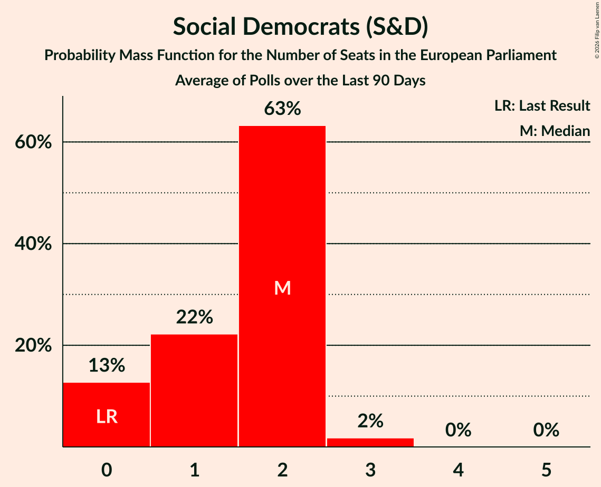

# Social Democrats (S&D)

<a href="#voting-intentions">Voting Intentions</a> | <a href="#seats">Seats</a>

## Voting Intentions

Last result: **0.0%** (General Election of 24 May 2019)

### Confidence Intervals

| Period     | Polling firm/Commissioner(s) | Median | 80% Confidence Interval | 90% Confidence Interval | 95% Confidence Interval | 99% Confidence Interval |
|:----------:|:----------------:|:-----------:|:-----------------------:|:-----------------------:|:-----------------------:|:-----------------------:|
| N/A | [Poll Average](average.html) | 4.0% | 0.9–5.5% | 0.7–5.8% | 0.6–6.1% | 0.5–6.7% |
| [7 May 2022](2022-05-07-IrelandThinks.html) | Ireland Thinks   Sunday Independent | 4.0% | 3.3–4.9% | 3.1–5.2% | 2.9–5.4% | 2.6–5.9% |
| [22–27 April 2022](2022-04-27-RedC.html) | Red C   Business Post | 5.0% | 4.3–6.0% | 4.0–6.3% | 3.8–6.6% | 3.5–7.1% |
| [1 April 2022](2022-04-01-IrelandThinks.html) | Ireland Thinks   Sunday Independent | 5.9% | 5.1–6.9% | 4.9–7.2% | 4.7–7.4% | 4.3–7.9% |
| [18–23 March 2022](2022-03-23-RedC.html) | Red C   Business Post | 5.0% | 4.2–6.0% | 4.0–6.3% | 3.8–6.5% | 3.5–7.0% |
| [24 February–8 March 2022](2022-03-08-BehaviourandAttitudes.html) | Behaviour and Attitudes   The Sunday Times | 1.0% | 0.7–1.5% | 0.6–1.7% | 0.5–1.8% | 0.4–2.1% |
| [4 March 2022](2022-03-04-IrelandThinks.html) | Ireland Thinks   Sunday Independent | 5.8% | 5.0–6.9% | 4.8–7.2% | 4.5–7.5% | 4.2–8.0% |
| [18–23 February 2022](2022-02-23-RedC.html) | Red C   Business Post | 4.0% | 3.3–4.9% | 3.1–5.2% | 2.9–5.4% | 2.6–5.9% |
| [27 January–8 February 2022](2022-02-08-BehaviourandAttitudes.html) | Behaviour and Attitudes   The Sunday Times | 2.0% | 1.5–2.7% | 1.3–2.9% | 1.2–3.1% | 1.0–3.5% |
| [5 February 2022](2022-02-05-IrelandThinks.html) | Ireland Thinks   Sunday Independent | 5.0% | 4.2–5.9% | 4.0–6.2% | 3.8–6.4% | 3.5–6.9% |
| [21–26 January 2022](2022-01-26-RedC.html) | Red C   Business Post | 5.0% | 4.2–6.0% | 4.0–6.3% | 3.8–6.5% | 3.5–7.0% |
| [6–18 January 2022](2022-01-18-BehaviourandAttitudes.html) | Behaviour and Attitudes   The Sunday Times | 1.0% | 0.7–1.6% | 0.6–1.7% | 0.5–1.9% | 0.4–2.2% |
| [8 January 2022](2022-01-08-IrelandThinks.html) | Ireland Thinks   Sunday Independent | 4.0% | 3.4–4.8% | 3.2–5.0% | 3.1–5.2% | 2.8–5.6% |
| [12 December 2021](2021-12-12-IrelandThinks.html) | Ireland Thinks   Irish Mail on Sunday | 3.0% | 2.4–3.8% | 2.2–4.1% | 2.1–4.3% | 1.8–4.7% |
| [5–8 December 2021](2021-12-08-IpsosMRBI.html) | Ipsos MRBI   Irish Times | 2.0% | 1.6–2.6% | 1.4–2.8% | 1.3–3.0% | 1.2–3.3% |
| [25 November–8 December 2021](2021-12-08-BehaviourandAttitudes.html) | Behaviour and Attitudes   The Sunday Times | 2.0% | 1.6–2.8% | 1.4–3.0% | 1.3–3.2% | 1.1–3.6% |
| [19–25 November 2021](2021-11-25-RedC.html) | Red C   Business Post | 5.1% | 4.3–6.1% | 4.1–6.4% | 3.9–6.6% | 3.6–7.2% |
| [14 November 2021](2021-11-14-IrelandThinks.html) | Ireland Thinks   Irish Mail on Sunday | 4.0% | 3.3–5.0% | 3.1–5.3% | 3.0–5.5% | 2.6–6.0% |
| [28 October–9 November 2021](2021-11-09-BehaviourandAttitudes.html) | Behaviour and Attitudes   The Sunday Times | 3.1% | 2.5–3.9% | 2.3–4.2% | 2.1–4.4% | 1.9–4.9% |
| [22 October 2021](2021-10-22-RedC.html) | Red C   Business Post | 6.0% | 5.1–7.1% | 4.9–7.4% | 4.7–7.7% | 4.3–8.2% |
| [16 October 2021](2021-10-16-IrelandThinks.html) | Ireland Thinks   Irish Mail on Sunday | 4.2% | N/A | N/A | N/A | N/A |
| [30 September–12 October 2021](2021-10-12-BehaviourandAttitudes.html) | Behaviour and Attitudes   The Sunday Times | 4.0% | N/A | N/A | N/A | N/A |
| [2–5 October 2021](2021-10-05-IpsosMRBI.html) | Ipsos MRBI   Irish Times | 3.0% | 2.5–3.7% | 2.3–3.9% | 2.2–4.1% | 1.9–4.5% |
| [18 September 2021](2021-09-18-IrelandThinks.html) | Ireland Thinks   Irish Mail on Sunday | 6.4% | N/A | N/A | N/A | N/A |
| [3–9 September 2021](2021-09-09-RedC.html) | Red C   Business Post | 5.0% | N/A | N/A | N/A | N/A |
| [26 August–8 September 2021](2021-09-08-BehaviourandAttitudes.html) | Behaviour and Attitudes   The Sunday Times | 2.1% | N/A | N/A | N/A | N/A |
| [21 August 2021](2021-08-21-IrelandThinks.html) | Ireland Thinks   Irish Mail on Sunday | 6.0% | N/A | N/A | N/A | N/A |
| [17 July 2021](2021-07-17-IrelandThinks.html) | Ireland Thinks   Irish Mail on Sunday | 5.0% | 4.2–6.0% | 4.0–6.3% | 3.8–6.5% | 3.5–7.0% |
| [1–13 July 2021](2021-07-13-BehaviourandAttitudes.html) | Behaviour and Attitudes   The Sunday Times | 1.0% | 0.7–1.5% | 0.6–1.7% | 0.5–1.8% | 0.4–2.1% |
| [26 June 2021](2021-06-26-RedC.html) | Red C   Business Post | 4.0% | 3.3–4.9% | 3.1–5.2% | 3.0–5.4% | 2.7–5.9% |
| [19 June 2021](2021-06-19-IrelandThinks.html) | Ireland Thinks   Irish Mail on Sunday | 4.9% | 4.2–5.8% | 4.0–6.1% | 3.9–6.3% | 3.6–6.7% |
| [14–15 June 2021](2021-06-15-IpsosMRBI.html) | Ipsos MRBI   Irish Times | 2.0% | 1.6–2.6% | 1.4–2.8% | 1.3–3.0% | 1.2–3.3% |
| [28 May–8 June 2021](2021-06-08-BehaviourandAttitudes.html) | Behaviour and Attitudes   The Sunday Times | 4.0% | 3.2–4.9% | 3.0–5.2% | 2.9–5.4% | 2.6–5.9% |
| [21–27 May 2021](2021-05-27-RedC.html) | Red C   Business Post | 5.0% | 4.3–6.0% | 4.0–6.3% | 3.9–6.5% | 3.5–7.0% |
| [4–18 May 2021](2021-05-18-BehaviourandAttitudes.html) | Behaviour and Attitudes   The Sunday Times | 2.0% | 1.5–2.7% | 1.4–2.9% | 1.2–3.1% | 1.1–3.5% |
| [15 May 2021](2021-05-15-IrelandThinks.html) | Ireland Thinks   Irish Mail on Sunday | 7.0% | 6.2–8.1% | 5.9–8.4% | 5.7–8.6% | 5.3–9.1% |
| [16–22 April 2021](2021-04-22-RedC.html) | Red C   Business Post | 5.1% | 4.3–6.1% | 4.1–6.4% | 3.9–6.6% | 3.5–7.1% |
| [14–15 April 2021](2021-04-15-IrelandThinks.html) | Ireland Thinks   Irish Mail on Sunday | 6.0% | 5.2–7.0% | 4.9–7.3% | 4.7–7.6% | 4.3–8.1% |
| [19–25 March 2021](2021-03-25-RedC.html) | Red C   Business Post | 5.1% | 4.3–6.1% | 4.1–6.4% | 3.9–6.6% | 3.6–7.2% |
| [20 March 2021](2021-03-20-IrelandThinks.html) | Ireland Thinks   Irish Mail on Sunday | 7.0% | 6.1–8.2% | 5.8–8.5% | 5.6–8.7% | 5.2–9.3% |
| [18–25 February 2021](2021-02-25-RedC.html) | Red C   Business Post | 6.0% | 5.1–7.1% | 4.9–7.4% | 4.7–7.7% | 4.3–8.2% |
| [22–23 February 2021](2021-02-23-IpsosMRBI.html) | Ipsos MRBI   Irish Times | 3.0% | 2.5–3.7% | 2.3–3.9% | 2.2–4.1% | 1.9–4.5% |
| [12 February 2021](2021-02-12-IrelandThinks.html) | Ireland Thinks   Irish Mail on Sunday | 6.2% | 5.3–7.2% | 5.1–7.5% | 4.9–7.8% | 4.5–8.3% |
| [21–28 January 2021](2021-01-28-RedC.html) | Red C   Business Post | 5.0% | 4.2–6.0% | 4.0–6.3% | 3.8–6.5% | 3.5–7.1% |
| [17 January 2021](2021-01-17-IrelandThinks.html) | Ireland Thinks   Irish Mail on Sunday | 5.1% | 4.3–5.9% | 4.1–6.2% | 4.0–6.4% | 3.6–6.9% |
| [3–15 December 2020](2020-12-15-BehaviourandAttitudes.html) | Behaviour and Attitudes   The Sunday Times | 1.0% | 0.7–1.6% | 0.6–1.7% | 0.5–1.9% | 0.4–2.2% |
| [29 November 2020](2020-11-29-IrelandThinks.html) | Ireland Thinks   Irish Mail on Sunday | 5.0% | 4.2–6.0% | 4.0–6.2% | 3.8–6.5% | 3.5–7.0% |
| [19–25 November 2020](2020-11-25-RedC.html) | Red C   Business Post | 4.0% | 3.3–4.9% | 3.1–5.2% | 2.9–5.4% | 2.7–5.9% |
| [24 October 2020](2020-10-24-RedC.html) | Red C   Business Post | 3.0% | 2.4–3.8% | 2.2–4.1% | 2.1–4.3% | 1.9–4.7% |
| [17 October 2020](2020-10-17-BehaviourandAttitudes.html) | Behaviour and Attitudes   The Sunday Times | 2.0% | 1.6–2.8% | 1.4–3.0% | 1.3–3.2% | 1.1–3.6% |
| [3–6 October 2020](2020-10-06-IpsosMRBI.html) | Ipsos MRBI   Irish Times | 2.0% | 1.6–2.6% | 1.4–2.8% | 1.3–3.0% | 1.2–3.3% |
| [26 September 2020](2020-09-26-IrelandThinks.html) | Ireland Thinks   Mail on Sunday | 5.0% | 4.3–5.9% | 4.1–6.2% | 3.9–6.4% | 3.6–6.9% |
| [4–15 September 2020](2020-09-15-BehaviourandAttitudes.html) | Behaviour and Attitudes   The Sunday Times | 1.0% | 0.7–1.6% | 0.6–1.7% | 0.5–1.9% | 0.4–2.2% |
| [9 September 2020](2020-09-09-RedC.html) | Red C   Business Post | 4.0% | 3.3–4.9% | 3.1–5.2% | 2.9–5.4% | 2.7–5.9% |
| [21–22 August 2020](2020-08-22-IrelandThinks.html) | Ireland Thinks   Mail on Sunday | 5.0% | 4.2–6.0% | 4.0–6.3% | 3.8–6.5% | 3.5–7.1% |
| [17–28 July 2020](2020-07-28-BehaviourandAttitudes.html) | Behaviour and Attitudes   The Sunday Times | 1.0% | 0.7–1.5% | 0.6–1.7% | 0.5–1.9% | 0.4–2.2% |
| [17–18 July 2020](2020-07-18-IrelandThinks.html) | Ireland Thinks   Mail on Sunday | 3.0% | 2.4–3.8% | 2.2–4.1% | 2.1–4.3% | 1.9–4.7% |
| [19–20 June 2020](2020-06-20-IrelandThinks.html) | Ireland Thinks   Mail on Sunday | 3.0% | 2.4–3.8% | 2.2–4.1% | 2.1–4.3% | 1.9–4.7% |
| [14 June 2020](2020-06-14-IpsosMRBI.html) | Ipsos MRBI   Irish Times | 0.0% | N/A | N/A | N/A | N/A |
| [21–27 May 2020](2020-05-27-RedC.html) | Red C   Business Post | 4.0% | 3.3–4.9% | 3.1–5.2% | 2.9–5.4% | 2.7–5.9% |
| [19–23 May 2020](2020-05-23-IrelandThinks.html) | Ireland Thinks   Mail on Sunday | 3.0% | 2.4–3.8% | 2.2–4.0% | 2.1–4.2% | 1.8–4.6% |
| [23–29 April 2020](2020-04-29-RedC.html) | Red C   Business Post | 3.0% | 2.5–3.9% | 2.3–4.1% | 2.1–4.3% | 1.9–4.7% |
| [20–25 March 2020](2020-03-25-RedC.html) | Red C   The Sunday Business Post | 3.0% | 2.4–3.8% | 2.3–4.0% | 2.1–4.2% | 1.9–4.6% |
| [27 February–10 March 2020](2020-03-10-BehaviourandAttitudes.html) | Behaviour and Attitudes   The Sunday Times | 1.0% | 0.7–1.6% | 0.6–1.7% | 0.5–1.9% | 0.4–2.2% |
| [17–25 February 2020](2020-02-25-BehaviourandAttitudes.html) | Behaviour and Attitudes   The Sunday Times | 2.0% | 1.5–2.7% | 1.4–2.9% | 1.2–3.1% | 1.1–3.5% |
| [16 February 2020](2020-02-16-AmárachResearch.html) | Amárach Research   Extra.ie | 5.0% | 4.2–6.0% | 4.0–6.3% | 3.8–6.5% | 3.5–7.0% |
| [27 January–2 February 2020](2020-02-02-Survation.html) | Survation   Sinn Féin | 3.0% | 2.4–3.8% | 2.2–4.0% | 2.1–4.2% | 1.9–4.6% |
| [30 January–1 February 2020](2020-02-01-IpsosMRBI.html) | Ipsos MRBI   The Irish Times | 2.0% | 1.6–2.6% | 1.4–2.8% | 1.3–3.0% | 1.2–3.3% |
| [25–30 January 2020](2020-01-30-RedC.html) | Red C   The Sunday Business Post | 3.1% | 2.5–3.9% | 2.3–4.2% | 2.2–4.4% | 1.9–4.8% |
| [24–30 January 2020](2020-01-30-Panelbase.html) | Panelbase   The Times | 5.6% | 4.8–6.6% | 4.5–7.0% | 4.3–7.2% | 4.0–7.7% |
| [1–25 January 2020](2020-01-25-IrelandThinks.html) | Ireland Thinks   The Irish Daily Mail | 3.3% | 2.7–4.2% | 2.5–4.4% | 2.3–4.6% | 2.1–5.1% |
| [16–23 January 2020](2020-01-23-RedC.html) | Red C   The Sunday Business Post | 3.0% | 2.4–3.8% | 2.2–4.1% | 2.1–4.3% | 1.9–4.7% |
| [16–18 January 2020](2020-01-18-IpsosMRBI.html) | Ipsos MRBI   The Irish Times | 2.0% | 1.6–2.6% | 1.4–2.8% | 1.3–3.0% | 1.2–3.3% |
| [4–14 January 2020](2020-01-14-BehaviourandAttitudes.html) | Behaviour and Attitudes   The Sunday Times | 1.1% | 0.7–1.7% | 0.7–1.8% | 0.6–2.0% | 0.5–2.3% |
| [24 December 2019](2019-12-24-IrelandThinks.html) | Ireland Thinks   The Irish Daily Mail | 3.5% | 2.9–4.1% | 2.8–4.3% | 2.7–4.5% | 2.4–4.8% |
| [5–17 December 2019](2019-12-17-BehaviourandAttitudes.html) | Behaviour and Attitudes   The Sunday Times | 1.1% | 0.7–1.6% | 0.7–1.8% | 0.6–2.0% | 0.5–2.3% |
| [14–21 November 2019](2019-11-21-RedC.html) | Red C   The Sunday Business Post | 2.0% | 1.5–2.7% | 1.4–2.9% | 1.3–3.1% | 1.1–3.4% |
| [1–12 November 2019](2019-11-12-BehaviourandAttitudes.html) | Behaviour and Attitudes   The Sunday Times | 2.3% | 1.8–3.0% | 1.6–3.3% | 1.5–3.5% | 1.3–3.9% |
| [17–24 October 2019](2019-10-24-RedC.html) | Red C   The Sunday Business Post | 2.0% | 1.5–2.7% | 1.4–2.9% | 1.3–3.1% | 1.1–3.4% |
| [3–15 October 2019](2019-10-15-BehaviourandAttitudes.html) | Behaviour and Attitudes   The Sunday Times | 1.1% | 0.8–1.7% | 0.7–1.9% | 0.6–2.0% | 0.5–2.4% |
| [11–13 October 2019](2019-10-13-IpsosMRBI.html) | Ipsos MRBI   The Irish Times | 1.0% | 0.7–1.5% | 0.6–1.6% | 0.6–1.8% | 0.5–2.0% |
| [5–17 September 2019](2019-09-17-BehaviourandAttitudes.html) | Behaviour and Attitudes   The Sunday Times | 1.1% | 0.8–1.7% | 0.7–1.9% | 0.6–2.0% | 0.5–2.4% |
| [5–12 September 2019](2019-09-12-RedC.html) | Red C   The Sunday Business Post | 1.1% | 0.8–1.7% | 0.7–1.8% | 0.6–2.0% | 0.5–2.3% |
| [4–16 July 2019](2019-07-16-BehaviourandAttitudes.html) | Behaviour and Attitudes   The Sunday Times | 1.0% | 0.7–1.6% | 0.6–1.7% | 0.5–1.9% | 0.4–2.2% |
| [31 May–11 June 2019](2019-06-11-BehaviourandAttitudes.html) | Behaviour and Attitudes   The Sunday Times | 1.0% | 0.7–1.6% | 0.6–1.7% | 0.5–1.9% | 0.4–2.2% |

### Probability Mass Function

The following table shows the probability mass function per percentage block of voting intentions for the [poll average](average.html) for Social Democrats (S&D).

| Voting Intentions | Probability | Accumulated | Special Marks |
|:-----------------:|:-----------:|:-----------:|:-------------:|
| 0.0–0.5% | 1.2% | 100% | Last Result |
| 0.5–1.5% | 29% | 98.8% |  |
| 1.5–2.5% | 3% | 70% |  |
| 2.5–3.5% | 7% | 67% |  |
| 3.5–4.5% | 26% | 60% | Median |
| 4.5–5.5% | 24% | 34% |  |
| 5.5–6.5% | 8% | 9% |  |
| 6.5–7.5% | 0.8% | 0.8% |  |
| 7.5–8.5% | 0% | 0% |  |

## Seats

Last result: **0** seats (General Election of 24 May 2019)

### Confidence Intervals

| Period     | Polling firm/Commissioner(s) | Median | 80% Confidence Interval | 90% Confidence Interval | 95% Confidence Interval | 99% Confidence Interval |
|:----------:|:----------------:|:------:|:-----------------------:|:-----------------------:|:-----------------------:|:-----------------------:|
| N/A | [Poll Average](average.html) | 1 | 0–1 | 0–1 | 0–1 | 0–2 |
| [7 May 2022](2022-05-07-IrelandThinks.html) | Ireland Thinks   Sunday Independent | 1 | 1 | 1 | 0–1 | 0–1 |
| [22–27 April 2022](2022-04-27-RedC.html) | Red C   Business Post | 1 | 1 | 1 | 1–2 | 1–2 |
| [1 April 2022](2022-04-01-IrelandThinks.html) | Ireland Thinks   Sunday Independent | 1 | 1–2 | 1–2 | 1–2 | 1–2 |
| [18–23 March 2022](2022-03-23-RedC.html) | Red C   Business Post | 1 | 1–2 | 1–2 | 1–2 | 1–2 |
| [24 February–8 March 2022](2022-03-08-BehaviourandAttitudes.html) | Behaviour and Attitudes   The Sunday Times | 0 | 0 | 0 | 0 | 0 |
| [4 March 2022](2022-03-04-IrelandThinks.html) | Ireland Thinks   Sunday Independent | 1 | 1–2 | 1–2 | 1–2 | 1–2 |
| [18–23 February 2022](2022-02-23-RedC.html) | Red C   Business Post | 1 | 1 | 0–1 | 0–1 | 0–1 |
| [27 January–8 February 2022](2022-02-08-BehaviourandAttitudes.html) | Behaviour and Attitudes   The Sunday Times | 0 | 0 | 0 | 0–1 | 0–1 |
| [5 February 2022](2022-02-05-IrelandThinks.html) | Ireland Thinks   Sunday Independent | 1 | 1 | 1 | 1 | 1–2 |
| [21–26 January 2022](2022-01-26-RedC.html) | Red C   Business Post | 1 | 1 | 1–2 | 1–2 | 1–2 |
| [6–18 January 2022](2022-01-18-BehaviourandAttitudes.html) | Behaviour and Attitudes   The Sunday Times | 0 | 0 | 0 | 0 | 0 |
| [8 January 2022](2022-01-08-IrelandThinks.html) | Ireland Thinks   Sunday Independent | 1 | 0–1 | 0–1 | 0–1 | 0–1 |
| [12 December 2021](2021-12-12-IrelandThinks.html) | Ireland Thinks   Irish Mail on Sunday | 0 | 0–1 | 0–1 | 0–1 | 0–1 |
| [5–8 December 2021](2021-12-08-IpsosMRBI.html) | Ipsos MRBI   Irish Times | 0 | 0 | 0 | 0–1 | 0–1 |
| [25 November–8 December 2021](2021-12-08-BehaviourandAttitudes.html) | Behaviour and Attitudes   The Sunday Times | 0 | 0 | 0–1 | 0–1 | 0–1 |
| [19–25 November 2021](2021-11-25-RedC.html) | Red C   Business Post | 1 | 1 | 1 | 1–2 | 1–2 |
| [14 November 2021](2021-11-14-IrelandThinks.html) | Ireland Thinks   Irish Mail on Sunday | 1 | 1 | 0–1 | 0–1 | 0–1 |
| [28 October–9 November 2021](2021-11-09-BehaviourandAttitudes.html) | Behaviour and Attitudes   The Sunday Times | 0 | 0–1 | 0–1 | 0–1 | 0–1 |
| [22 October 2021](2021-10-22-RedC.html) | Red C   Business Post | 1 | 1–2 | 1–2 | 1–2 | 1–2 |
| [16 October 2021](2021-10-16-IrelandThinks.html) | Ireland Thinks   Irish Mail on Sunday |  |  |  |  |  |
| [30 September–12 October 2021](2021-10-12-BehaviourandAttitudes.html) | Behaviour and Attitudes   The Sunday Times |  |  |  |  |  |
| [2–5 October 2021](2021-10-05-IpsosMRBI.html) | Ipsos MRBI   Irish Times | 1 | 0–1 | 0–1 | 0–1 | 0–1 |
| [18 September 2021](2021-09-18-IrelandThinks.html) | Ireland Thinks   Irish Mail on Sunday |  |  |  |  |  |
| [3–9 September 2021](2021-09-09-RedC.html) | Red C   Business Post |  |  |  |  |  |
| [26 August–8 September 2021](2021-09-08-BehaviourandAttitudes.html) | Behaviour and Attitudes   The Sunday Times |  |  |  |  |  |
| [21 August 2021](2021-08-21-IrelandThinks.html) | Ireland Thinks   Irish Mail on Sunday |  |  |  |  |  |
| [17 July 2021](2021-07-17-IrelandThinks.html) | Ireland Thinks   Irish Mail on Sunday | 1 | 1–2 | 1–2 | 1–2 | 1–2 |
| [1–13 July 2021](2021-07-13-BehaviourandAttitudes.html) | Behaviour and Attitudes   The Sunday Times | 0 | 0 | 0 | 0 | 0 |
| [26 June 2021](2021-06-26-RedC.html) | Red C   Business Post | 1 | 1 | 1 | 1 | 1–2 |
| [19 June 2021](2021-06-19-IrelandThinks.html) | Ireland Thinks   Irish Mail on Sunday | 1 | 1 | 1 | 1 | 1–2 |
| [14–15 June 2021](2021-06-15-IpsosMRBI.html) | Ipsos MRBI   Irish Times | 0 | 0 | 0 | 0 | 0–1 |
| [28 May–8 June 2021](2021-06-08-BehaviourandAttitudes.html) | Behaviour and Attitudes   The Sunday Times | 1 | 0–1 | 0–1 | 0–1 | 0–1 |
| [21–27 May 2021](2021-05-27-RedC.html) | Red C   Business Post | 1 | 1–2 | 1–2 | 1–2 | 1–2 |
| [4–18 May 2021](2021-05-18-BehaviourandAttitudes.html) | Behaviour and Attitudes   The Sunday Times | 0 | 0 | 0 | 0–1 | 0–1 |
| [15 May 2021](2021-05-15-IrelandThinks.html) | Ireland Thinks   Irish Mail on Sunday | 2 | 1–2 | 1–2 | 1–2 | 1–2 |
| [16–22 April 2021](2021-04-22-RedC.html) | Red C   Business Post | 1 | 1–2 | 1–2 | 1–2 | 1–2 |
| [14–15 April 2021](2021-04-15-IrelandThinks.html) | Ireland Thinks   Irish Mail on Sunday | 1 | 1–2 | 1–2 | 1–2 | 1–2 |
| [19–25 March 2021](2021-03-25-RedC.html) | Red C   Business Post | 1 | 1–2 | 1–2 | 1–2 | 1–2 |
| [20 March 2021](2021-03-20-IrelandThinks.html) | Ireland Thinks   Irish Mail on Sunday | 2 | 1–2 | 1–2 | 1–2 | 1–2 |
| [18–25 February 2021](2021-02-25-RedC.html) | Red C   Business Post | 2 | 1–2 | 1–2 | 1–2 | 1–2 |
| [22–23 February 2021](2021-02-23-IpsosMRBI.html) | Ipsos MRBI   Irish Times | 1 | 1 | 0–1 | 0–1 | 0–1 |
| [12 February 2021](2021-02-12-IrelandThinks.html) | Ireland Thinks   Irish Mail on Sunday | 2 | 1–2 | 1–2 | 1–2 | 1–2 |
| [21–28 January 2021](2021-01-28-RedC.html) | Red C   Business Post | 1 | 1 | 1–2 | 1–2 | 1–2 |
| [17 January 2021](2021-01-17-IrelandThinks.html) | Ireland Thinks   Irish Mail on Sunday | 1 | 1–2 | 1–2 | 1–2 | 1–2 |
| [3–15 December 2020](2020-12-15-BehaviourandAttitudes.html) | Behaviour and Attitudes   The Sunday Times | 0 | 0 | 0 | 0 | 0 |
| [29 November 2020](2020-11-29-IrelandThinks.html) | Ireland Thinks   Irish Mail on Sunday | 1 | 1–2 | 1–2 | 1–2 | 1–2 |
| [19–25 November 2020](2020-11-25-RedC.html) | Red C   Business Post | 1 | 1 | 1 | 1 | 0–2 |
| [24 October 2020](2020-10-24-RedC.html) | Red C   Business Post | 1 | 0–1 | 0–1 | 0–1 | 0–1 |
| [17 October 2020](2020-10-17-BehaviourandAttitudes.html) | Behaviour and Attitudes   The Sunday Times | 0 | 0 | 0 | 0–1 | 0–1 |
| [3–6 October 2020](2020-10-06-IpsosMRBI.html) | Ipsos MRBI   Irish Times | 0 | 0 | 0 | 0–1 | 0–1 |
| [26 September 2020](2020-09-26-IrelandThinks.html) | Ireland Thinks   Mail on Sunday | 1 | 1 | 1–2 | 1–2 | 1–2 |
| [4–15 September 2020](2020-09-15-BehaviourandAttitudes.html) | Behaviour and Attitudes   The Sunday Times | 0 | 0 | 0 | 0 | 0 |
| [9 September 2020](2020-09-09-RedC.html) | Red C   Business Post | 1 | 1 | 1 | 1 | 0–2 |
| [21–22 August 2020](2020-08-22-IrelandThinks.html) | Ireland Thinks   Mail on Sunday | 1 | 1 | 1–2 | 1–2 | 1–2 |
| [17–28 July 2020](2020-07-28-BehaviourandAttitudes.html) | Behaviour and Attitudes   The Sunday Times | 0 | 0 | 0 | 0 | 0 |
| [17–18 July 2020](2020-07-18-IrelandThinks.html) | Ireland Thinks   Mail on Sunday | 1 | 0–1 | 0–1 | 0–1 | 0–1 |
| [19–20 June 2020](2020-06-20-IrelandThinks.html) | Ireland Thinks   Mail on Sunday | 1 | 0–1 | 0–1 | 0–1 | 0–1 |
| [14 June 2020](2020-06-14-IpsosMRBI.html) | Ipsos MRBI   Irish Times |  |  |  |  |  |
| [21–27 May 2020](2020-05-27-RedC.html) | Red C   Business Post | 1 | 1 | 1 | 1 | 0–2 |
| [19–23 May 2020](2020-05-23-IrelandThinks.html) | Ireland Thinks   Mail on Sunday | 1 | 0–1 | 0–1 | 0–1 | 0–1 |
| [23–29 April 2020](2020-04-29-RedC.html) | Red C   Business Post | 1 | 0–1 | 0–1 | 0–1 | 0–1 |
| [20–25 March 2020](2020-03-25-RedC.html) | Red C   The Sunday Business Post | 0 | 0–1 | 0–1 | 0–1 | 0–1 |
| [27 February–10 March 2020](2020-03-10-BehaviourandAttitudes.html) | Behaviour and Attitudes   The Sunday Times | 0 | 0 | 0 | 0 | 0 |
| [17–25 February 2020](2020-02-25-BehaviourandAttitudes.html) | Behaviour and Attitudes   The Sunday Times | 0 | 0–1 | 0–1 | 0–1 | 0–1 |
| [16 February 2020](2020-02-16-AmárachResearch.html) | Amárach Research   Extra.ie | 1 | 1 | 1 | 1–2 | 1–2 |
| [27 January–2 February 2020](2020-02-02-Survation.html) | Survation   Sinn Féin | 1 | 0–1 | 0–1 | 0–1 | 0–1 |
| [30 January–1 February 2020](2020-02-01-IpsosMRBI.html) | Ipsos MRBI   The Irish Times | 0 | 0 | 0–1 | 0–1 | 0–1 |
| [25–30 January 2020](2020-01-30-RedC.html) | Red C   The Sunday Business Post | 1 | 0–1 | 0–1 | 0–1 | 0–1 |
| [24–30 January 2020](2020-01-30-Panelbase.html) | Panelbase   The Times | 1 | 1 | 1 | 1–2 | 1–2 |
| [1–25 January 2020](2020-01-25-IrelandThinks.html) | Ireland Thinks   The Irish Daily Mail | 0 | 0–1 | 0–1 | 0–1 | 0–1 |
| [16–23 January 2020](2020-01-23-RedC.html) | Red C   The Sunday Business Post | 1 | 0–1 | 0–1 | 0–1 | 0–1 |
| [16–18 January 2020](2020-01-18-IpsosMRBI.html) | Ipsos MRBI   The Irish Times | 0 | 0 | 0–1 | 0–1 | 0–1 |
| [4–14 January 2020](2020-01-14-BehaviourandAttitudes.html) | Behaviour and Attitudes   The Sunday Times | 0 | 0 | 0 | 0 | 0 |
| [24 December 2019](2019-12-24-IrelandThinks.html) | Ireland Thinks   The Irish Daily Mail | 1 | 1 | 0–1 | 0–1 | 0–1 |
| [5–17 December 2019](2019-12-17-BehaviourandAttitudes.html) | Behaviour and Attitudes   The Sunday Times | 0 | 0 | 0 | 0 | 0 |
| [14–21 November 2019](2019-11-21-RedC.html) | Red C   The Sunday Business Post | 0 | 0–1 | 0–1 | 0–1 | 0–1 |
| [1–12 November 2019](2019-11-12-BehaviourandAttitudes.html) | Behaviour and Attitudes   The Sunday Times | 0 | 0–1 | 0–1 | 0–1 | 0–1 |
| [17–24 October 2019](2019-10-24-RedC.html) | Red C   The Sunday Business Post | 0 | 0–1 | 0–1 | 0–1 | 0–1 |
| [3–15 October 2019](2019-10-15-BehaviourandAttitudes.html) | Behaviour and Attitudes   The Sunday Times | 0 | 0 | 0 | 0 | 0 |
| [11–13 October 2019](2019-10-13-IpsosMRBI.html) | Ipsos MRBI   The Irish Times | 0 | 0 | 0 | 0 | 0 |
| [5–17 September 2019](2019-09-17-BehaviourandAttitudes.html) | Behaviour and Attitudes   The Sunday Times | 0 | 0 | 0 | 0 | 0 |
| [5–12 September 2019](2019-09-12-RedC.html) | Red C   The Sunday Business Post | 0 | 0 | 0 | 0 | 0 |
| [4–16 July 2019](2019-07-16-BehaviourandAttitudes.html) | Behaviour and Attitudes   The Sunday Times | 0 | 0 | 0 | 0 | 0 |
| [31 May–11 June 2019](2019-06-11-BehaviourandAttitudes.html) | Behaviour and Attitudes   The Sunday Times | 0 | 0 | 0 | 0 | 0 |

### Probability Mass Function

The following table shows the probability mass function per seat for the [poll average](average.html) for Social Democrats (S&D).

| Number of Seats | Probability | Accumulated | Special Marks |
|:---------------:|:-----------:|:-----------:|:-------------:|
| 0 | 35% | 100% | Last Result |
| 1 | 64% | 65% | Median |
| 2 | 1.1% | 1.1% |  |
| 3 | 0% | 0% |  |

